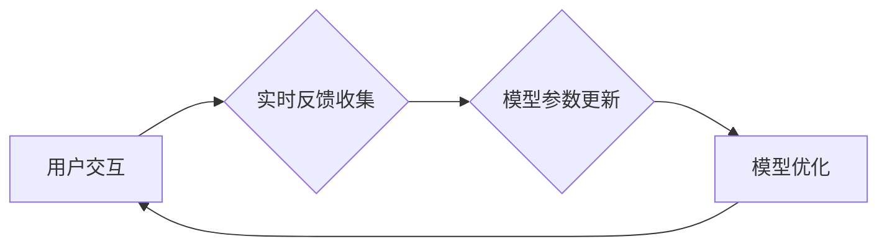

                 

## 搜索推荐的实时反馈学习：大模型的在线更新策略

> 关键词：搜索推荐、实时反馈学习、大模型、在线更新、模型训练、反馈机制、推荐算法

## 1. 背景介绍

在当今数据爆炸的时代，搜索引擎和推荐系统已经成为人们获取信息和发现内容的重要途径。传统的搜索推荐系统通常依赖于离线训练，将历史数据用于构建静态模型，但随着用户行为和内容的不断变化，这些模型的准确性和时效性会逐渐下降。为了应对这一挑战，实时反馈学习 (Real-Time Feedback Learning，RTFL) 应运而生，它利用用户实时反馈信息不断更新模型，从而实现更精准、更动态的推荐。

大模型 (Large Language Model，LLM) 作为近年来人工智能领域取得突破性进展的代表，其强大的语义理解和生成能力为搜索推荐带来了新的机遇。然而，由于大模型的规模庞大，传统的离线训练方法在效率和资源消耗方面存在瓶颈。因此，将实时反馈学习与大模型相结合，构建在线更新策略，成为提升搜索推荐系统性能的关键方向。

## 2. 核心概念与联系

### 2.1  实时反馈学习 (RTFL)

实时反馈学习是指利用用户在交互过程中产生的实时反馈信息，动态更新模型参数，从而实现模型的在线学习和优化。这种学习方式能够有效地应对数据分布漂移和用户偏好变化等问题，提高推荐系统的实时性和准确性。

### 2.2  大模型 (LLM)

大模型是指参数量达到数亿甚至数十亿的深度学习模型，其强大的学习能力和泛化能力使其能够在自然语言处理、图像识别、机器翻译等多个领域取得突破性进展。

### 2.3  在线更新策略

在线更新策略是指在模型训练过程中，利用实时反馈信息不断更新模型参数，实现模型的在线学习和优化。与传统的离线训练方法相比，在线更新策略能够更快速地适应数据变化，提高模型的实时性和适应性。

**核心概念与架构流程图**



## 3. 核心算法原理 & 具体操作步骤

### 3.1  算法原理概述

实时反馈学习与大模型结合的在线更新策略通常基于梯度下降算法，利用用户反馈信息计算模型参数的梯度，并根据梯度方向更新模型参数。

### 3.2  算法步骤详解

1. **数据收集:** 收集用户在搜索和推荐过程中产生的实时反馈信息，例如点击、评分、浏览时长等。
2. **反馈预处理:** 对收集到的反馈信息进行预处理，例如转化为数值表示、过滤噪声数据等。
3. **梯度计算:** 利用反馈信息计算模型参数的梯度，可以使用反向传播算法或其他梯度计算方法。
4. **参数更新:** 根据梯度方向和学习率更新模型参数，实现模型的在线学习。
5. **模型评估:** 定期评估模型的性能，例如准确率、召回率等，并根据评估结果调整学习率和模型结构等参数。

### 3.3  算法优缺点

**优点:**

* **实时性:** 可以实时更新模型，适应用户行为和内容变化。
* **准确性:** 利用实时反馈信息可以提高模型的准确性和个性化程度。
* **效率:** 在线更新策略可以减少模型训练时间和资源消耗。

**缺点:**

* **数据质量:** 模型的性能依赖于实时反馈信息的质量，噪声数据会影响模型训练效果。
* **稳定性:** 在线更新策略可能会导致模型参数震荡，需要采取措施保证模型的稳定性。
* **复杂性:** 实时反馈学习与大模型的结合需要复杂的算法和系统架构。

### 3.4  算法应用领域

实时反馈学习与大模型的结合在搜索推荐、个性化内容推荐、广告投放、用户行为分析等多个领域具有广泛的应用前景。

## 4. 数学模型和公式 & 详细讲解 & 举例说明

### 4.1  数学模型构建

假设我们有一个大模型 $f(x; \theta)$，其中 $x$ 是用户输入的查询或上下文信息，$\theta$ 是模型参数。我们的目标是利用实时反馈信息 $y$ 更新模型参数，使得模型的预测结果更准确。

我们可以使用以下数学模型来描述模型的学习过程:

$$
\theta_{t+1} = \theta_t - \alpha \nabla_{\theta} L(f(x; \theta), y)
$$

其中:

* $\theta_t$ 是模型参数在时间 $t$ 的值。
* $\theta_{t+1}$ 是模型参数在时间 $t+1$ 的值。
* $\alpha$ 是学习率，控制参数更新的步长。
* $\nabla_{\theta} L(f(x; \theta), y)$ 是模型预测结果 $f(x; \theta)$ 与真实反馈 $y$ 之间的损失函数 $L$ 对模型参数 $\theta$ 的梯度。

### 4.2  公式推导过程

损失函数 $L$ 通常是预测结果与真实反馈之间的差异度量，例如均方误差 (MSE) 或交叉熵损失 (Cross-Entropy Loss)。梯度 $\nabla_{\theta} L(f(x; \theta), y)$ 可以通过反向传播算法计算得到。

反向传播算法的核心思想是利用链式法则，将损失函数对模型参数的梯度分解成各个神经网络层的梯度，并逐层反向传播。

### 4.3  案例分析与讲解

假设我们有一个搜索推荐系统，用户输入查询 $x$，模型预测推荐结果 $f(x; \theta)$，用户点击了推荐结果 $y$。我们可以使用点击率 (Click-Through Rate，CTR) 作为损失函数，并利用梯度下降算法更新模型参数。

$$
L(f(x; \theta), y) = -\log(f(x; \theta)) \text{ if } y = 1;
$$
$$
L(f(x; \theta), y) = -\log(1-f(x; \theta)) \text{ if } y = 0;
$$

通过计算梯度 $\nabla_{\theta} L(f(x; \theta), y)$，并根据公式 (1) 更新模型参数 $\theta$，可以使模型预测点击率更准确。

## 5. 项目实践：代码实例和详细解释说明

### 5.1  开发环境搭建

* **操作系统:** Linux (Ubuntu 20.04)
* **编程语言:** Python 3.8
* **深度学习框架:** TensorFlow 2.x
* **其他依赖:** numpy, pandas, matplotlib

### 5.2  源代码详细实现

```python
import tensorflow as tf

# 定义模型
class SearchRecommender(tf.keras.Model):
    def __init__(self, embedding_dim, num_classes):
        super(SearchRecommender, self).__init__()
        self.embedding = tf.keras.layers.Embedding(input_dim=vocab_size, output_dim=embedding_dim)
        self.dense = tf.keras.layers.Dense(units=num_classes, activation='sigmoid')

    def call(self, inputs):
        x = self.embedding(inputs)
        x = tf.reduce_mean(x, axis=1)
        outputs = self.dense(x)
        return outputs

# 定义损失函数和优化器
loss_fn = tf.keras.losses.BinaryCrossentropy()
optimizer = tf.keras.optimizers.Adam(learning_rate=0.001)

# 实例化模型
model = SearchRecommender(embedding_dim=128, num_classes=1)

# 定义训练步骤
@tf.function
def train_step(inputs, labels):
    with tf.GradientTape() as tape:
        predictions = model(inputs)
        loss = loss_fn(labels, predictions)
    gradients = tape.gradient(loss, model.trainable_variables)
    optimizer.apply_gradients(zip(gradients, model.trainable_variables))
    return loss

# 训练模型
for epoch in range(num_epochs):
    for batch in dataset:
        loss = train_step(batch[0], batch[1])
        print(f'Epoch: {epoch}, Loss: {loss.numpy()}')

```

### 5.3  代码解读与分析

* **模型定义:** 代码定义了一个简单的搜索推荐模型，包含嵌入层和全连接层。
* **损失函数和优化器:** 使用二元交叉熵损失函数和Adam优化器。
* **训练步骤:** 定义了一个训练步骤函数，用于计算损失和更新模型参数。
* **模型训练:** 使用训练数据集进行模型训练，并打印每轮训练的损失值。

### 5.4  运行结果展示

训练完成后，可以将模型应用于新的数据进行预测，并评估模型的性能。

## 6. 实际应用场景

### 6.1  搜索引擎推荐

实时反馈学习可以用于搜索引擎的推荐系统，根据用户的搜索历史、点击行为等实时反馈信息，个性化推荐相关结果，提高用户体验。

### 6.2  电商平台推荐

电商平台可以利用用户浏览、购买、评价等实时反馈信息，动态更新商品推荐模型，推荐更符合用户需求的商品。

### 6.3  内容平台推荐

内容平台可以根据用户的阅读、点赞、评论等实时反馈信息，推荐更感兴趣的内容，提高用户粘性和活跃度。

### 6.4  未来应用展望

随着大模型技术的发展和实时反馈机制的完善，实时反馈学习与大模型的结合将应用于更多领域，例如个性化教育、医疗诊断、金融风险控制等，为人们的生活带来更多便利和价值。

## 7. 工具和资源推荐

### 7.1  学习资源推荐

* **书籍:**
    * Deep Learning by Ian Goodfellow, Yoshua Bengio, and Aaron Courville
    * Hands-On Machine Learning with Scikit-Learn, Keras & TensorFlow by Aurélien Géron
* **在线课程:**
    * TensorFlow Developer Certificate
    * Deep Learning Specialization by Andrew Ng

### 7.2  开发工具推荐

* **深度学习框架:** TensorFlow, PyTorch, JAX
* **数据处理工具:** Pandas, NumPy
* **可视化工具:** Matplotlib, Seaborn

### 7.3  相关论文推荐

* **BERT: Pre-training of Deep Bidirectional Transformers for Language Understanding**
* **GPT-3: Language Models are Few-Shot Learners**
* **Real-Time Feedback Learning for Recommender Systems**

## 8. 总结：未来发展趋势与挑战

### 8.1  研究成果总结

实时反馈学习与大模型的结合为搜索推荐带来了新的机遇，能够实现更精准、更动态的推荐，提升用户体验。

### 8.2  未来发展趋势

* **模型架构创新:** 探索更适合实时反馈学习的大模型架构，例如轻量化模型、自适应模型等。
* **反馈机制优化:** 研究更有效的实时反馈收集和预处理方法，提高反馈信息的质量和利用率。
* **安全性和隐私保护:** 确保实时反馈学习的安全性，保护用户隐私信息。

### 8.3  面临的挑战

* **数据质量:** 实时反馈信息的质量直接影响模型性能，需要有效解决数据噪声和偏差问题。
* **模型稳定性:** 在线更新策略可能会导致模型参数震荡，需要采取措施保证模型的稳定性。
* **计算资源:** 大模型的训练和部署需要大量的计算资源，需要探索更有效的计算资源利用方法。

### 8.4  研究展望

未来，实时反馈学习与大模型将继续深入发展，为搜索推荐和人工智能领域带来更多突破性进展。


## 9. 附录：常见问题与解答

**Q1: 实时反馈学习与离线训练相比有什么优势？**

**A1:** 实时反馈学习能够根据用户行为和内容变化动态更新模型，提高模型的实时性和准确性，而离线训练的模型则需要定期重新训练才能适应数据变化。

**Q2: 如何保证实时反馈学习的模型稳定性？**

**A2:** 可以通过设置学习率衰减、使用正则化技术、采用滑动平均等方法来保证模型的稳定性。

**Q3: 实时反馈学习需要哪些数据？**

**A3:** 实时反馈学习需要用户在交互过程中产生的实时反馈信息，例如点击、评分、浏览时长等。

**作者：禅与计算机程序设计艺术 / Zen and the Art of Computer Programming**<end_of_turn>

