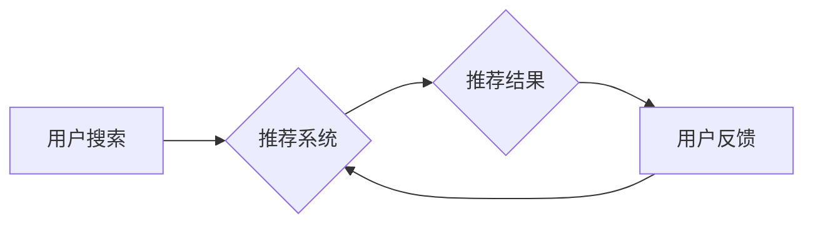

                 

## 搜索推荐系统的公平性评估：大模型的多维度分析

> 关键词：搜索推荐系统、公平性评估、大模型、偏见、歧视、算法解释、可解释性、伦理

## 1. 背景介绍

搜索推荐系统作为信息获取和内容消费的重要入口，在人们日常生活和决策中扮演着越来越重要的角色。然而，随着大模型技术的快速发展，搜索推荐系统也面临着新的挑战，其中公平性问题尤为突出。

大模型的训练数据往往来自互联网，而互联网本身就存在着各种各样的偏见和歧视。这些偏见可能会被大模型学习并放大，最终导致搜索推荐结果不公平，对特定群体造成负面影响。例如，一个基于用户历史搜索行为的推荐系统，如果训练数据中存在性别偏见，可能会推荐更多男性用户感兴趣的内容给男性用户，而推荐给女性用户的则更多偏向于传统女性角色。

公平性问题不仅会损害用户的体验，还会加剧社会分化，甚至引发法律和伦理争议。因此，对搜索推荐系统的公平性进行评估和改进，对于构建一个更加公正、包容的数字社会至关重要。

## 2. 核心概念与联系

**2.1  公平性概念**

公平性是一个复杂的社会伦理概念，在搜索推荐系统中，通常指推荐结果对所有用户都是平等、公正的，不会因为用户的性别、种族、宗教、政治观点等敏感属性而产生不公平的差别。

**2.2  偏见与歧视**

偏见是指对特定群体或个体抱有先入为主的成见或不公正的看法，而歧视则是基于偏见而对特定群体或个体进行不公平的对待。在搜索推荐系统中，偏见和歧视可能表现为推荐结果的偏差，例如，对特定性别或种族用户推荐不相关的或不公平的内容。

**2.3  算法解释与可解释性**

算法解释是指理解和解释机器学习模型的决策过程，而可解释性则是指模型决策过程的透明度和可理解性。对于搜索推荐系统来说，提高算法解释性和可解释性可以帮助我们识别和理解模型中的潜在偏见，从而更好地进行公平性评估和改进。

**2.4  伦理问题**

搜索推荐系统的公平性问题也涉及到伦理问题，例如，算法是否应该考虑用户的敏感属性？如何平衡算法的公平性与用户的个性化需求？这些问题需要社会各界共同探讨和解决。

**2.5  Mermaid 流程图**



## 3. 核心算法原理 & 具体操作步骤

**3.1  算法原理概述**

搜索推荐系统的公平性评估通常涉及到以下几个方面：

* **识别偏见:** 使用统计方法和机器学习算法识别模型中潜在的偏见，例如，对特定群体用户的推荐结果偏差。
* **量化偏见:** 使用度量指标量化模型中的偏见程度，例如，公平性指标、不平等度量等。
* **解释偏见:** 使用算法解释技术解释模型中偏见产生的原因，例如，哪些特征导致了特定群体的推荐结果偏差。
* **缓解偏见:** 使用算法调整和优化，减轻模型中的偏见，例如，使用公平性约束、对抗训练等技术。

**3.2  算法步骤详解**

1. **数据收集和预处理:** 收集搜索推荐系统的训练数据和测试数据，并进行预处理，例如，清洗数据、特征工程等。
2. **模型训练:** 使用机器学习算法训练推荐模型，例如，协同过滤、深度学习等。
3. **公平性评估:** 使用公平性指标和度量方法评估模型的公平性，例如，计算不同群体用户的推荐结果偏差、不平等度等。
4. **偏见解释:** 使用算法解释技术解释模型中偏见产生的原因，例如，使用特征重要性分析、局部解释方法等。
5. **偏见缓解:** 使用公平性约束、对抗训练等技术调整和优化模型，减轻模型中的偏见。
6. **模型评估和迭代:** 对缓解偏见后的模型进行重新评估，并根据评估结果进行迭代优化。

**3.3  算法优缺点**

* **优点:** 可以识别和量化模型中的偏见，并提供解释和缓解方法。
* **缺点:** 

公平性评估是一个复杂的任务，需要考虑多种因素，例如，数据质量、模型复杂度、评估指标等。

**3.4  算法应用领域**

* 搜索引擎推荐
* 内容平台推荐
* 人才招聘推荐
* 医疗诊断推荐

## 4. 数学模型和公式 & 详细讲解 & 举例说明

**4.1  数学模型构建**

假设我们有一个搜索推荐系统，它将用户 $u$ 和物品 $i$ 映射到一个评分 $r_{ui}$。我们希望评估这个系统的公平性，可以构建一个公平性指标 $F$，它衡量不同群体用户之间的评分差异。

**4.2  公式推导过程**

一个常见的公平性指标是 **均方差 (MSE)**，它计算不同群体用户评分的平均平方差。

$$F = \frac{1}{N} \sum_{g \in G} \sum_{u \in U_g} (r_{ui} - \bar{r}_g)^2$$

其中：

* $N$ 是所有用户总数
* $G$ 是所有群体集合
* $U_g$ 是群体 $g$ 中的所有用户集合
* $r_{ui}$ 是用户 $u$ 对物品 $i$ 的评分
* $\bar{r}_g$ 是群体 $g$ 中所有用户的平均评分

**4.3  案例分析与讲解**

假设我们有一个搜索推荐系统，它推荐电影给用户。我们想评估这个系统的性别公平性，可以将用户分为男性和女性两组，计算每组用户对电影评分的均方差。如果男性和女性用户的评分均方差较大，则表明这个系统存在性别偏见。

## 5. 项目实践：代码实例和详细解释说明

**5.1  开发环境搭建**

* Python 3.7+
* TensorFlow 2.0+
* Scikit-learn 0.23+
* Jupyter Notebook

**5.2  源代码详细实现**

```python
import tensorflow as tf
from sklearn.metrics import mean_squared_error

# 定义推荐模型
class RecommenderModel(tf.keras.Model):
    def __init__(self):
        super(RecommenderModel, self).__init__()
        # ... 模型结构定义 ...

    def call(self, inputs):
        # ... 模型前向传播过程 ...

# 训练推荐模型
model = RecommenderModel()
model.compile(optimizer='adam', loss='mse')
model.fit(train_data, train_labels, epochs=10)

# 评估模型公平性
test_labels = model.predict(test_data)
mse_male = mean_squared_error(test_labels_male, test_labels_male_pred)
mse_female = mean_squared_error(test_labels_female, test_labels_female_pred)
fairness_score = abs(mse_male - mse_female)

print(f"Male MSE: {mse_male}")
print(f"Female MSE: {mse_female}")
print(f"Fairness Score: {fairness_score}")
```

**5.3  代码解读与分析**

* 代码首先定义了一个推荐模型，并使用 TensorFlow 进行训练。
* 训练完成后，使用 Scikit-learn 的 `mean_squared_error` 函数计算不同群体用户的评分均方差，并计算公平性得分。

**5.4  运行结果展示**

运行结果会显示男性和女性用户的评分均方差以及公平性得分。如果公平性得分较高，则表明模型存在性别偏见。

## 6. 实际应用场景

**6.1  搜索引擎推荐**

搜索引擎推荐系统需要考虑用户搜索历史、兴趣偏好等因素，并推荐相关结果。如果训练数据存在性别偏见，可能会导致搜索结果对不同性别用户不公平。例如，搜索“科技公司”时，男性用户可能会看到更多男性CEO的推荐结果，而女性用户则可能看到更多女性家政公司的推荐结果。

**6.2  内容平台推荐**

内容平台推荐系统需要根据用户的兴趣爱好推荐相关内容。如果训练数据存在种族偏见，可能会导致推荐结果对不同种族用户不公平。例如，一个音乐平台的推荐系统，如果训练数据中存在对黑人音乐的偏见，可能会导致黑人用户看到更多黑人音乐的推荐结果，而其他种族用户则可能看到更多主流音乐的推荐结果。

**6.3  人才招聘推荐**

人才招聘推荐系统需要根据用户的技能和经验推荐相关职位。如果训练数据存在性别或种族偏见，可能会导致推荐结果对不同群体用户不公平。例如，一个招聘平台的推荐系统，如果训练数据中存在对女性的偏见，可能会导致女性用户看到更多家政或护理类职位的推荐结果，而男性用户则可能看到更多技术或管理类职位的推荐结果。

**6.4  未来应用展望**

随着大模型技术的不断发展，搜索推荐系统的公平性评估将变得越来越重要。未来，我们可以期待以下方面的进展：

* 开发更加准确和有效的公平性评估指标和方法。
* 构建更加公平和可解释的推荐模型。
* 建立更加完善的公平性监管机制。

## 7. 工具和资源推荐

**7.1  学习资源推荐**

* **书籍:**

* "Fairness and Machine Learning" by  Sarah M. Bender, Timnit Gebru, Angelina McMillan-Major, and  Emily M. Bender
* "Algorithmic Fairness" by  Virginia Eubanks

* **论文:**

* "On the Dangers of Stochastic Parrots: Can Language Models Be Too Big?" by  Timnit Gebru, et al.
* "Fairness Metrics for Recommender Systems" by  Michael A. Osborne, et al.

**7.2  开发工具推荐**

* **TensorFlow:**  https://www.tensorflow.org/
* **Scikit-learn:** https://scikit-learn.org/stable/
* **PyTorch:** https://pytorch.org/

**7.3  相关论文推荐**

* "Mitigating Bias in Recommender Systems" by  Michael A. Osborne, et al.
* "Fairness in Recommender Systems: A Survey" by  Yuchen Zhang, et al.

## 8. 总结：未来发展趋势与挑战

**8.1  研究成果总结**

近年来，在搜索推荐系统的公平性评估方面取得了一些进展，例如，开发了一些新的公平性指标和方法，并提出了缓解模型偏见的算法。

**8.2  未来发展趋势**

未来，搜索推荐系统的公平性评估将朝着以下几个方向发展：

* **更加精准的公平性评估指标:** 开发更加精准、全面地衡量模型公平性的指标。
* **更加可解释的推荐模型:** 构建更加透明、可解释的推荐模型，以便更好地理解模型中的偏见。
* **更加有效的偏见缓解方法:** 研究更加有效的算法和技术，有效缓解模型中的偏见。
* **公平性监管机制:** 建立更加完善的公平性监管机制，确保推荐系统的公平性。

**8.3  面临的挑战**

搜索推荐系统的公平性评估仍然面临着一些挑战：

* **数据偏差:** 训练数据本身可能存在偏见，导致模型学习到偏见。
* **定义公平性:** 公平性是一个复杂的社会伦理概念，如何定义和量化公平性仍然是一个开放问题。
* **算法解释性:** 许多推荐模型过于复杂，难以解释其决策过程。
* **公平性与个性化需求的平衡:** 如何平衡公平性与用户的个性化需求是一个需要权衡的难题。

**8.4  研究展望**

未来，我们需要继续深入研究搜索推荐系统的公平性问题，开发更加精准、有效的评估方法和缓解技术，并建立更加完善的公平性监管机制，构建一个更加公正、包容的数字社会。

## 9. 附录：常见问题与解答

**9.1  常见问题**

* 如何识别搜索推荐系统的偏见？
* 如何量化搜索推荐系统的公平性？
* 如何缓解搜索推荐系统的偏见？

**9.2  解答**

* 可以使用统计方法和机器学习算法识别模型中的潜在偏见，例如，计算不同群体用户评分的均方差。
* 可以使用公平性指标和度量方法评估模型的公平性，例如，使用均方差、不平等度等指标。
* 可以使用公平性约束、对抗训练等技术调整和优化模型，减轻模型中的偏见。


作者：禅与计算机程序设计艺术 / Zen and the Art of Computer Programming 
<end_of_turn>

