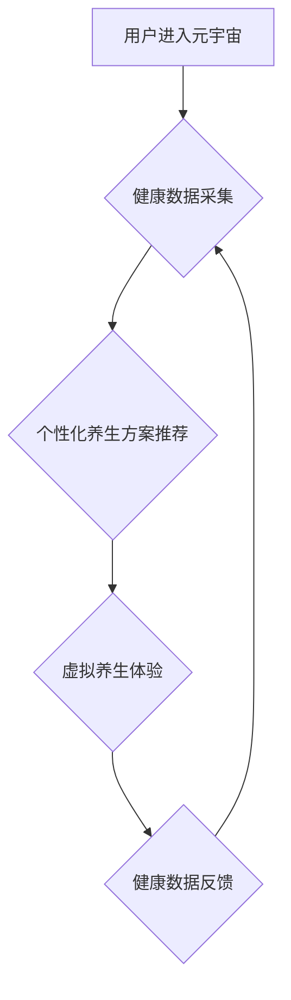

                 

## 数字化养生:元宇宙中的身心健康

> 关键词：元宇宙、数字化养生、身心健康、虚拟现实、人工智能、生物反馈、健康监测、个性化定制

## 1. 背景介绍

随着科技的飞速发展，元宇宙概念逐渐从科幻小说走向现实。元宇宙，一个融合虚拟现实、增强现实、区块链等技术的沉浸式虚拟世界，正在为我们提供全新的生活方式和体验。在这个虚拟世界中，人们可以自由地创造、互动、学习和娱乐。

然而，元宇宙的出现也引发了人们对身心健康的新思考。长时间沉浸在虚拟世界中，可能会对人们的心理健康和生理健康造成影响。因此，如何利用元宇宙技术促进身心健康，成为一个重要的课题。

数字化养生，即利用数字化技术手段，帮助人们改善身心健康状态，正逐渐成为一种趋势。元宇宙作为一种新型的数字化平台，为数字化养生提供了广阔的应用空间。

## 2. 核心概念与联系

**2.1 元宇宙与数字化养生**

元宇宙是一个虚拟世界，它可以模拟现实世界，甚至超越现实世界。在这个虚拟世界中，人们可以体验各种各样的活动，例如运动、社交、学习、娱乐等等。数字化养生则利用数字化技术手段，帮助人们改善身心健康状态。

两者结合，可以实现以下几点：

* **沉浸式体验:** 元宇宙可以提供沉浸式的体验，让人们更容易投入到养生活动中。
* **个性化定制:** 元宇宙可以根据用户的个人情况，定制个性化的养生方案。
* **数据驱动:** 元宇宙可以收集用户的健康数据，并根据数据进行分析和反馈，帮助用户更好地了解自己的身体状况。

**2.2 元宇宙架构与数字化养生**

元宇宙的架构通常包含以下几个关键部分：

* **虚拟世界:**  虚拟世界是元宇宙的核心，它可以模拟现实世界，甚至超越现实世界。
* **用户身份:** 用户身份是元宇宙中用户的唯一标识，它可以代表用户的虚拟形象和属性。
* **交互机制:** 交互机制是用户与虚拟世界以及其他用户进行交互的方式。
* **经济系统:** 经济系统是元宇宙中的虚拟货币和交易机制。

数字化养生可以融入到元宇宙的各个部分，例如：

* **虚拟世界:**  在虚拟世界中，可以创建各种各样的养生场景，例如虚拟公园、虚拟瑜伽馆、虚拟健身房等等。
* **用户身份:** 用户身份可以包含用户的健康数据，例如心率、血压、睡眠质量等等。
* **交互机制:** 用户可以通过虚拟现实设备或其他交互方式，参与到养生活动中。
* **经济系统:** 元宇宙中的虚拟货币可以用于购买养生产品和服务。

**2.3 元宇宙与数字化养生的流程图**



## 3. 核心算法原理 & 具体操作步骤

**3.1 算法原理概述**

数字化养生在元宇宙中需要利用多种算法来实现个性化定制、健康数据分析和虚拟体验优化。

* **机器学习算法:** 用于分析用户的健康数据，识别潜在的健康风险，并推荐个性化的养生方案。
* **自然语言处理算法:** 用于理解用户的需求，提供更精准的养生建议。
* **虚拟现实渲染算法:** 用于构建逼真的虚拟养生场景，提升用户的沉浸体验。

**3.2 算法步骤详解**

1. **数据采集:** 收集用户的健康数据，例如心率、血压、睡眠质量、运动量、饮食习惯等等。
2. **数据预处理:** 对收集到的数据进行清洗、转换和标准化，以便于后续的分析。
3. **模型训练:** 利用机器学习算法，训练一个能够预测用户健康状况和推荐养生方案的模型。
4. **个性化方案推荐:** 根据用户的健康数据和模型的预测结果，推荐个性化的养生方案。
5. **虚拟体验构建:** 利用虚拟现实渲染算法，构建逼真的虚拟养生场景，例如虚拟公园、虚拟瑜伽馆、虚拟健身房等等。
6. **交互反馈:** 用户在虚拟场景中进行养生活动，系统会实时收集用户的反馈数据，并根据反馈数据调整养生方案。

**3.3 算法优缺点**

* **优点:**

    * 个性化定制: 能够根据用户的个人情况，定制个性化的养生方案。
    * 数据驱动: 能够利用数据进行分析和反馈，帮助用户更好地了解自己的身体状况。
    * 沉浸式体验: 能够提供沉浸式的体验，让人们更容易投入到养生活动中。

* **缺点:**

    * 数据隐私: 需要收集用户的健康数据，需要保证数据的安全和隐私。
    * 模型准确性: 模型的准确性取决于训练数据的质量，如果训练数据不足或不准确，模型的预测结果可能不准确。
    * 技术门槛: 需要一定的技术门槛来开发和维护数字化养生系统。

**3.4 算法应用领域**

* **医疗保健:** 用于辅助医生诊断疾病、制定治疗方案、监测患者病情。
* **健康管理:** 用于帮助用户了解自己的健康状况、制定健康计划、养成健康的生活习惯。
* **健身娱乐:** 用于提供虚拟的健身和娱乐体验，例如虚拟瑜伽、虚拟跑步、虚拟舞蹈等等。

## 4. 数学模型和公式 & 详细讲解 & 举例说明

**4.1 数学模型构建**

数字化养生的核心是利用数学模型来分析用户的健康数据，预测用户的健康状况，并推荐个性化的养生方案。常用的数学模型包括：

* **线性回归模型:** 用于预测连续变量，例如用户的体重、血压、血糖等等。
* **逻辑回归模型:** 用于预测分类变量，例如用户的健康状况是否良好、是否患有某种疾病等等。
* **决策树模型:** 用于根据用户的特征，构建决策树，预测用户的健康状况。
* **支持向量机模型:** 用于分类和回归问题，能够处理高维数据。

**4.2 公式推导过程**

例如，线性回归模型的公式如下：

$$y = \beta_0 + \beta_1x_1 + \beta_2x_2 + ... + \beta_nx_n + \epsilon$$

其中：

* $y$ 是预测变量，例如用户的体重。
* $x_1, x_2, ..., x_n$ 是自变量，例如用户的年龄、身高、饮食习惯等等。
* $\beta_0, \beta_1, \beta_2, ..., \beta_n$ 是模型参数，需要通过训练数据进行估计。
* $\epsilon$ 是误差项。

**4.3 案例分析与讲解**

假设我们想要预测用户的体重，我们可以收集用户的年龄、身高、饮食习惯等数据，并利用线性回归模型进行训练。训练完成后，我们可以使用模型预测新用户的体重。

例如，如果用户的年龄为30岁，身高为170厘米，饮食习惯为健康饮食，那么我们可以使用模型预测用户的体重为65公斤。

## 5. 项目实践：代码实例和详细解释说明

**5.1 开发环境搭建**

* **操作系统:** Windows/macOS/Linux
* **编程语言:** Python
* **深度学习框架:** TensorFlow/PyTorch
* **虚拟现实库:** OpenVR/Unity/Unreal Engine

**5.2 源代码详细实现**

```python
# 导入必要的库
import tensorflow as tf

# 定义模型结构
model = tf.keras.models.Sequential([
    tf.keras.layers.Dense(64, activation='relu', input_shape=(4,)),
    tf.keras.layers.Dense(32, activation='relu'),
    tf.keras.layers.Dense(1)
])

# 编译模型
model.compile(optimizer='adam', loss='mse')

# 训练模型
model.fit(X_train, y_train, epochs=10)

# 预测体重
prediction = model.predict(X_new)
```

**5.3 代码解读与分析**

* 首先，我们导入必要的库，例如 TensorFlow 库。
* 然后，我们定义模型结构，例如一个包含两层全连接层的模型。
* 接着，我们编译模型，选择优化器、损失函数等等。
* 接下来，我们训练模型，使用训练数据进行训练。
* 最后，我们使用训练好的模型预测新用户的体重。

**5.4 运行结果展示**

训练完成后，我们可以使用模型预测新用户的体重。例如，如果用户的年龄为30岁，身高为170厘米，饮食习惯为健康饮食，那么我们可以使用模型预测用户的体重为65公斤。

## 6. 实际应用场景

**6.1 元宇宙健身**

在元宇宙中，用户可以体验虚拟的健身场景，例如虚拟健身房、虚拟瑜伽馆、虚拟跑步机等等。这些虚拟场景可以提供逼真的体验，帮助用户更好地投入到健身活动中。

**6.2 元宇宙冥想**

元宇宙可以提供沉浸式的冥想体验，例如虚拟的森林、虚拟的海滩等等。这些虚拟场景可以帮助用户放松身心，减轻压力。

**6.3 元宇宙健康监测**

元宇宙可以收集用户的健康数据，例如心率、血压、睡眠质量等等。这些数据可以帮助用户更好地了解自己的身体状况，并及时采取措施改善健康状况。

**6.4 未来应用展望**

随着元宇宙技术的不断发展，数字化养生在元宇宙中的应用场景将会更加丰富。例如：

* **虚拟医生:** 元宇宙可以提供虚拟医生的服务，帮助用户远程咨询医生，进行健康检查等等。
* **个性化养生方案:** 元宇宙可以根据用户的个人情况，定制个性化的养生方案，例如虚拟营养师、虚拟健身教练等等。
* **虚拟健康社区:** 元宇宙可以构建虚拟的健康社区，让用户与其他用户交流健康知识、分享养生经验等等。

## 7. 工具和资源推荐

**7.1 学习资源推荐**

* **书籍:**

    * 《元宇宙：未来世界的构建》
    * 《数字孪生：从概念到实践》
    * 《人工智能：一种现代方法》

* **在线课程:**

    * Coursera: 元宇宙与虚拟现实
    * edX: 人工智能与机器学习
    * Udemy: 数字孪生与仿真

**7.2 开发工具推荐**

* **虚拟现实开发平台:** Unity/Unreal Engine
* **人工智能开发框架:** TensorFlow/PyTorch
* **元宇宙平台:** Decentraland/Sandbox

**7.3 相关论文推荐**

* 《元宇宙：概念、技术和应用》
* 《数字孪生在医疗保健中的应用》
* 《人工智能在数字化养生中的应用》

## 8. 总结：未来发展趋势与挑战

**8.1 研究成果总结**

数字化养生在元宇宙中的应用是一个新兴领域，已经取得了一些初步成果。例如，一些公司已经开发了虚拟健身、虚拟冥想、虚拟健康监测等应用。

**8.2 未来发展趋势**

* **更逼真的虚拟体验:** 未来，元宇宙技术的进步将带来更逼真的虚拟体验，例如更真实的虚拟场景、更自然的虚拟交互等等。
* **更个性化的养生方案:** 未来，人工智能技术的进步将使数字化养生能够提供更个性化的养生方案，例如根据用户的基因、生活习惯、健康状况等因素定制养生方案。
* **更广泛的应用场景:** 未来，数字化养生将在元宇宙中得到更广泛的应用，例如虚拟医疗、虚拟健康教育、虚拟健康社区等等。

**8.3 面临的挑战**

* **技术挑战:** 元宇宙技术的开发和应用仍然面临着一些技术挑战，例如虚拟现实技术的成熟度、人工智能技术的安全性等等。
* **伦理挑战:** 数字化养生在元宇宙中的应用也面临着一些伦理挑战，例如用户数据隐私、虚拟现实成瘾等等。
* **社会挑战:** 数字化养生在元宇宙中的应用也需要考虑社会影响，例如虚拟现实对现实生活的影响、数字鸿沟等等。

**8.4 研究展望**

未来，数字化养生在元宇宙中的应用将是一个充满机遇和挑战的领域。我们需要不断探索新的技术、新的应用场景，并解决相关的伦理和社会问题，才能让数字化养生真正惠及人类健康。

## 9. 附录：常见问题与解答

**9.1  元宇宙数字化养生安全吗？**

元宇宙数字化养生的安全性是一个重要的问题。我们需要采取措施保护用户的个人数据隐私，并确保虚拟环境的安全可靠。

**9.2  元宇宙数字化养生真的有效吗？**

元宇宙数字化养生的有效性还需要进一步研究和验证。目前，一些研究表明，元宇宙数字化养生可以帮助用户改善身心健康状态，但还需要更多的证据来支持。

**9.3  元宇宙数字化养生会取代现实生活吗？**

元宇宙数字化养生不会取代现实生活，而是可以作为一种补充，帮助人们更好地管理自己的健康。

**9.4  如何参与元宇宙数字化养生？**

您可以通过以下方式参与元宇宙数字化养生：

* 使用元宇宙平台提供的数字化养生应用。
* 关注相关领域的科技公司和研究机构。
* 学习相关知识，例如虚拟现实技术、人工智能技术等等。


作者：禅与计算机程序设计艺术 / Zen and the Art of Computer Programming 
<end_of_turn>

