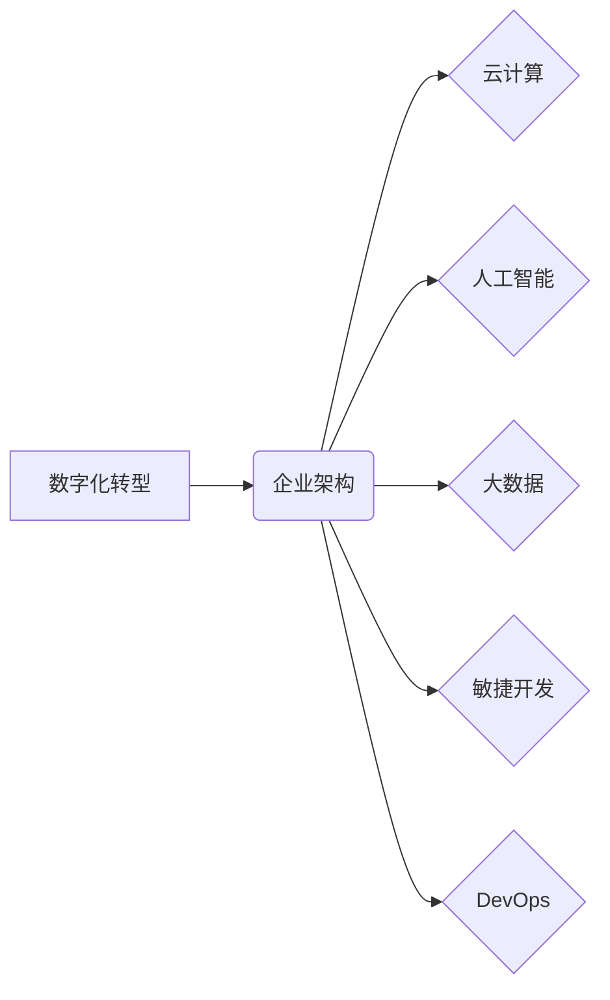

                 

## 数字化创业：打造未来企业的蓝图

> 关键词：数字化转型、企业架构、云计算、人工智能、大数据、敏捷开发、DevOps

### 1. 背景介绍

当今世界，科技发展日新月异，数字化浪潮席卷全球。传统企业面临着前所未有的挑战，如何拥抱数字化，才能在激烈的市场竞争中立于不败之地？数字化创业应运而生，它不仅指利用数字化技术创办新企业，更强调企业在数字化时代进行全面的转型升级，构建全新的业务模式、运营模式和组织架构。

数字化创业的核心在于将数字化技术与企业战略紧密结合，通过数据驱动、智能化、平台化等手段，提升企业运营效率、创新能力和客户体验。

### 2. 核心概念与联系

**2.1 数字化转型**

数字化转型是指企业利用数字化技术和理念，对自身业务流程、组织结构、管理模式等进行全面革新，实现业务模式创新、运营效率提升、客户体验优化和价值创造。

**2.2 企业架构**

企业架构是指企业内部资源、流程、信息系统和组织结构的整体设计和规划，它为企业战略目标的实现提供支撑。

**2.3 云计算**

云计算是一种按需提供的计算资源、存储资源和网络资源的服务模式，它可以帮助企业降低IT成本、提高资源利用率和灵活性。

**2.4 人工智能**

人工智能是指模拟人类智能的计算机系统，它可以学习、推理、决策和解决问题。

**2.5 大数据**

大数据是指海量、高速、多样化的数据，它蕴含着丰富的商业价值，可以通过分析挖掘获得洞察和决策支持。

**2.6 敏捷开发**

敏捷开发是一种软件开发方法，它强调快速迭代、客户反馈和团队协作，可以帮助企业快速响应市场需求和降低开发风险。

**2.7 DevOps**

DevOps是一种将开发和运维紧密结合的文化和实践，它可以帮助企业缩短软件交付周期、提高软件质量和稳定性。

**核心概念关系图**



### 3. 核心算法原理 & 具体操作步骤

**3.1 算法原理概述**

在数字化创业中，各种算法扮演着至关重要的角色，例如机器学习算法、深度学习算法、推荐算法等。这些算法可以帮助企业进行数据分析、预测趋势、个性化推荐和智能决策。

**3.2 算法步骤详解**

以机器学习算法为例，其基本步骤包括：

1. **数据收集和预处理:** 收集相关数据，并进行清洗、转换和特征工程等预处理工作。
2. **模型选择:** 根据具体任务选择合适的机器学习算法模型，例如线性回归、逻辑回归、决策树、支持向量机等。
3. **模型训练:** 使用训练数据对模型进行训练，调整模型参数，使其能够学习数据中的规律。
4. **模型评估:** 使用测试数据对模型进行评估，衡量模型的准确率、召回率、F1-score等指标。
5. **模型部署:** 将训练好的模型部署到生产环境中，用于进行预测和决策。

**3.3 算法优缺点**

不同的机器学习算法具有不同的优缺点，需要根据具体任务选择合适的算法。例如，线性回归算法简单易实现，但对数据线性关系要求较高；决策树算法可以处理非线性关系，但容易过拟合；支持向量机算法可以处理高维数据，但训练时间较长。

**3.4 算法应用领域**

机器学习算法在数字化创业中应用广泛，例如：

* **客户关系管理:** 通过分析客户数据，预测客户行为，提供个性化服务。
* **精准营销:** 根据客户画像，精准投放广告，提高营销效果。
* **产品推荐:** 根据用户行为和偏好，推荐相关产品，提升用户体验。
* **风险控制:** 通过分析数据，识别潜在风险，降低企业风险。

### 4. 数学模型和公式 & 详细讲解 & 举例说明

**4.1 数学模型构建**

在数字化创业中，数学模型可以用来描述企业业务流程、客户行为、市场趋势等复杂现象。例如，可以使用回归模型来预测销售额，可以使用分类模型来识别潜在客户，可以使用网络模型来分析社交关系。

**4.2 公式推导过程**

例如，线性回归模型的公式如下：

$$y = mx + c$$

其中，y是预测值，x是输入特征，m是斜率，c是截距。

**4.3 案例分析与讲解**

假设一家电商平台想要预测用户的购买行为，可以使用线性回归模型，将用户的浏览历史、购买记录、年龄、性别等特征作为输入，预测用户的购买概率。

### 5. 项目实践：代码实例和详细解释说明

**5.1 开发环境搭建**

数字化创业项目通常需要使用云计算平台、大数据平台、人工智能平台等工具和技术。例如，可以使用AWS、Azure、GCP等云计算平台提供计算资源、存储资源和网络资源；可以使用Hadoop、Spark等大数据平台进行数据处理和分析；可以使用TensorFlow、PyTorch等人工智能平台进行模型训练和部署。

**5.2 源代码详细实现**

以下是一个使用Python语言实现的简单机器学习模型的代码示例：

```python
from sklearn.linear_model import LinearRegression
from sklearn.model_selection import train_test_split
from sklearn.metrics import mean_squared_error

# 加载数据
data = ...

# 将数据分为训练集和测试集
X_train, X_test, y_train, y_test = train_test_split(data[:, :-1], data[:, -1], test_size=0.2)

# 创建线性回归模型
model = LinearRegression()

# 训练模型
model.fit(X_train, y_train)

# 预测测试集数据
y_pred = model.predict(X_test)

# 计算模型误差
mse = mean_squared_error(y_test, y_pred)

# 打印模型误差
print(f"模型误差: {mse}")
```

**5.3 代码解读与分析**

这段代码首先加载数据，然后将数据分为训练集和测试集。接着，创建线性回归模型，并使用训练集训练模型。最后，使用测试集数据进行预测，并计算模型误差。

**5.4 运行结果展示**

运行结果会显示模型的误差值，可以用来评估模型的性能。

### 6. 实际应用场景

数字化创业的应用场景非常广泛，例如：

* **电商平台:** 利用数据分析和人工智能技术，实现精准营销、个性化推荐、智能客服等功能。
* **金融科技:** 利用大数据和机器学习技术，进行风险控制、信用评估、智能理财等服务。
* **医疗健康:** 利用人工智能技术，辅助诊断、预测疾病、个性化治疗等。
* **教育培训:** 利用大数据和人工智能技术，提供个性化学习方案、智能辅导等服务。

**6.4 未来应用展望**

随着数字化技术的不断发展，数字化创业的应用场景将更加广泛，例如：

* **虚拟现实和增强现实:** 利用虚拟现实和增强现实技术，打造沉浸式体验，提升用户互动。
* **区块链技术:** 利用区块链技术，实现数据安全、透明和可追溯，构建信任机制。
* **物联网技术:** 利用物联网技术，收集和分析海量设备数据，实现智能化管理和控制。

### 7. 工具和资源推荐

**7.1 学习资源推荐**

* **书籍:** 《数字化转型》、《人工智能》、《云计算》
* **在线课程:** Coursera、edX、Udacity等平台提供丰富的数字化创业相关课程。
* **技术博客:**  TechCrunch、VentureBeat、The Verge等科技博客网站提供最新的数字化创业资讯和技术趋势。

**7.2 开发工具推荐**

* **云计算平台:** AWS、Azure、GCP
* **大数据平台:** Hadoop、Spark
* **人工智能平台:** TensorFlow、PyTorch
* **敏捷开发工具:** Jira、Trello、GitHub

**7.3 相关论文推荐**

* **数字化转型:** 《The Digital Transformation Playbook》
* **人工智能:** 《Deep Learning》
* **云计算:** 《Cloud Computing: Concepts, Technology & Architecture》

### 8. 总结：未来发展趋势与挑战

**8.1 研究成果总结**

数字化创业已经成为未来企业发展的必然趋势，它为企业带来了巨大的机遇和挑战。

**8.2 未来发展趋势**

未来数字化创业将更加注重以下几个方面：

* **数据驱动:** 企业将更加依赖数据分析和人工智能技术，进行决策和运营。
* **平台化:** 企业将更加注重构建开放平台，与合作伙伴和用户进行协同创新。
* **智能化:** 企业将更加注重利用人工智能技术，实现自动化和智能化。

**8.3 面临的挑战**

数字化创业也面临着一些挑战，例如：

* **技术复杂性:** 数字化转型需要掌握多种新技术，企业需要不断学习和提升技术能力。
* **人才短缺:** 数字化创业需要大量具备数字化技能的人才，企业需要加强人才培养和引进。
* **数据安全:** 企业需要加强数据安全保护，防止数据泄露和滥用。

**8.4 研究展望**

未来，数字化创业的研究将更加深入，例如：

* **探索新的数字化转型模式:** 针对不同行业和企业规模，探索更加适合的数字化转型模式。
* **研究人工智能技术的应用场景:** 探索人工智能技术在数字化创业中的更多应用场景。
* **构建更加安全的数字化生态系统:** 研究如何构建更加安全的数字化生态系统，保障数据安全和用户隐私。

### 9. 附录：常见问题与解答

**9.1 如何进行数字化转型？**

数字化转型是一个复杂的过程，需要企业进行全面的规划和实施。

**9.2 如何选择合适的数字化技术？**

选择合适的数字化技术需要根据企业的具体业务需求和资源情况进行评估。

**9.3 如何培养数字化人才？**

企业可以通过内部培训、外部课程、招聘等方式培养数字化人才。


作者：禅与计算机程序设计艺术 / Zen and the Art of Computer Programming 
<end_of_turn>

