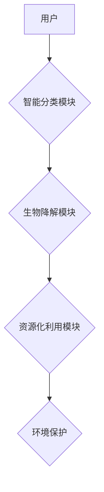

                 

## 智能厨余处理创业：家庭环保的新方案

> 关键词：厨余处理、人工智能、机器学习、生物降解、可持续发展、家庭环保

## 1. 背景介绍

随着全球人口的增长和生活水平的提高，厨余垃圾的产生量呈指数级增长，给环境造成严重污染。传统厨余处理方式，如填埋和焚烧，不仅浪费资源，还排放大量有害气体，加剧环境问题。因此，开发高效、环保的厨余处理技术迫在眉睫。

智能厨余处理技术，利用人工智能、机器学习等先进技术，实现厨余垃圾的智能分类、高效处理和资源化利用，为家庭环保提供了一种全新的解决方案。

## 2. 核心概念与联系

### 2.1 核心概念

* **智能分类:** 利用计算机视觉、图像识别等技术，识别不同类型的厨余垃圾，例如果皮、菜叶、骨头等，实现精准分类。
* **生物降解:** 利用微生物分解厨余垃圾，将其转化为有机肥或沼气等可利用资源。
* **资源化利用:** 将处理后的厨余垃圾转化为有机肥、沼气、生物燃料等，实现资源的循环利用。

### 2.2 架构图



## 3. 核心算法原理 & 具体操作步骤

### 3.1 算法原理概述

智能厨余处理的核心算法主要包括：

* **图像识别算法:** 用于识别不同类型的厨余垃圾。常用的算法包括卷积神经网络（CNN）、支持向量机（SVM）等。
* **生物降解算法:** 用于控制微生物的生长和分解厨余垃圾。常用的算法包括微生物群落分析、生物反应器控制等。

### 3.2 算法步骤详解

1. **图像采集:** 使用摄像头采集厨余垃圾的图像。
2. **图像预处理:** 对图像进行灰度化、去噪、边缘检测等预处理，提高识别精度。
3. **特征提取:** 从预处理后的图像中提取特征，例如颜色、纹理、形状等。
4. **分类识别:** 利用训练好的分类模型，对提取的特征进行分类识别，判断厨余垃圾的类型。
5. **生物降解控制:** 根据识别结果，控制生物降解模块的温度、湿度、pH值等参数，优化微生物的生长和分解效率。
6. **资源化利用:** 将处理后的厨余垃圾转化为有机肥、沼气等资源。

### 3.3 算法优缺点

**优点:**

* **高效准确:** 利用人工智能算法，实现厨余垃圾的智能分类和高效处理。
* **环保可持续:** 将厨余垃圾转化为资源，减少环境污染，实现资源的循环利用。
* **便携易用:** 智能厨余处理设备可以小型化，方便家庭使用。

**缺点:**

* **技术复杂:** 需要专业的技术人员进行开发和维护。
* **成本较高:** 智能厨余处理设备的成本相对较高。
* **数据依赖:** 需要大量的厨余垃圾图像数据进行训练，才能保证算法的准确性。

### 3.4 算法应用领域

* **家庭厨余处理:** 为家庭提供便捷、环保的厨余处理解决方案。
* **社区厨余处理:** 集中处理社区产生的厨余垃圾，提高处理效率。
* **餐饮业厨余处理:** 为餐饮企业提供高效、环保的厨余处理方案。

## 4. 数学模型和公式 & 详细讲解 & 举例说明

### 4.1 数学模型构建

智能厨余处理过程可以抽象为一个数学模型，其中涉及到以下几个关键变量：

* **$x_i$**:  第 $i$ 种厨余垃圾的质量
* **$y_i$**:  第 $i$ 种厨余垃圾的降解率
* **$t$**:  降解时间
* **$z$**:  最终产生的有机肥质量

我们可以建立一个线性模型来描述厨余垃圾的降解过程：

$$z = \sum_{i=1}^{n} x_i \cdot y_i \cdot t$$

其中，$n$ 是厨余垃圾的种类数。

### 4.2 公式推导过程

该模型的推导过程如下：

1. 每个厨余垃圾种类在降解过程中都会产生一定量的有机肥。
2. 每种厨余垃圾的降解量取决于其质量、降解率和降解时间。
3. 所有厨余垃圾的降解量之和就是最终产生的有机肥质量。

### 4.3 案例分析与讲解

假设我们有三种厨余垃圾：果皮、菜叶和骨头，其质量分别为 1 kg、2 kg 和 1 kg，降解率分别为 0.8、0.9 和 0.7，降解时间为 30 天。

根据公式，我们可以计算出最终产生的有机肥质量：

$$z = 1 \cdot 0.8 \cdot 30 + 2 \cdot 0.9 \cdot 30 + 1 \cdot 0.7 \cdot 30 = 24 + 54 + 21 = 99 kg$$

因此，经过 30 天的降解，最终可以产生 99 kg 的有机肥。

## 5. 项目实践：代码实例和详细解释说明

### 5.1 开发环境搭建

* **操作系统:** Ubuntu 20.04 LTS
* **编程语言:** Python 3.8
* **深度学习框架:** TensorFlow 2.0
* **计算机视觉库:** OpenCV

### 5.2 源代码详细实现

```python
# 导入必要的库
import tensorflow as tf
from tensorflow.keras.models import Sequential
from tensorflow.keras.layers import Conv2D, MaxPooling2D, Flatten, Dense

# 定义图像分类模型
model = Sequential()
model.add(Conv2D(32, (3, 3), activation='relu', input_shape=(224, 224, 3)))
model.add(MaxPooling2D((2, 2)))
model.add(Conv2D(64, (3, 3), activation='relu'))
model.add(MaxPooling2D((2, 2)))
model.add(Flatten())
model.add(Dense(10, activation='softmax'))

# 编译模型
model.compile(optimizer='adam',
              loss='categorical_crossentropy',
              metrics=['accuracy'])

# 训练模型
model.fit(train_images, train_labels, epochs=10)

# 评估模型
loss, accuracy = model.evaluate(test_images, test_labels)
print('Loss:', loss)
print('Accuracy:', accuracy)

# 使用模型进行预测
predictions = model.predict(new_image)
```

### 5.3 代码解读与分析

* 该代码定义了一个简单的卷积神经网络模型，用于识别不同类型的厨余垃圾。
* 模型的输入是 224x224 像素的彩色图像，输出是 10 个类别的概率分布。
* 模型使用 Adam 优化器，交叉熵损失函数和准确率作为评估指标。
* 训练模型需要大量的厨余垃圾图像数据。

### 5.4 运行结果展示

训练完成后，模型可以对新的厨余垃圾图像进行分类，并输出其所属类别。

## 6. 实际应用场景

### 6.1 家庭厨余处理

智能厨余处理设备可以安装在家庭厨房，自动识别和处理厨余垃圾，将厨余垃圾转化为有机肥或沼气，为家庭提供环保、便捷的厨余处理解决方案。

### 6.2 社区厨余处理

社区可以部署智能厨余处理系统，集中处理社区产生的厨余垃圾，提高处理效率，减少环境污染。

### 6.3 餐饮业厨余处理

餐饮企业可以利用智能厨余处理设备，高效处理大量的厨余垃圾，减少垃圾处理成本，同时还可以将处理后的厨余垃圾转化为资源，实现可持续发展。

### 6.4 未来应用展望

随着人工智能、生物技术等领域的不断发展，智能厨余处理技术将更加成熟和完善，应用场景也将更加广泛。未来，智能厨余处理技术可能应用于以下领域：

* **农业生产:** 将处理后的厨余垃圾转化为有机肥，用于农业生产，提高土壤肥力。
* **能源生产:** 将处理后的厨余垃圾转化为沼气，用于发电或供热。
* **生物材料生产:** 利用厨余垃圾中的生物质，生产生物塑料、生物燃料等新型材料。

## 7. 工具和资源推荐

### 7.1 学习资源推荐

* **书籍:**
    * 深度学习
    * 人工智能：一种现代方法
* **在线课程:**
    * Coursera: 深度学习
    * edX: 人工智能
* **开源项目:**
    * TensorFlow
    * PyTorch

### 7.2 开发工具推荐

* **编程语言:** Python
* **深度学习框架:** TensorFlow, PyTorch
* **计算机视觉库:** OpenCV

### 7.3 相关论文推荐

* **深度学习在图像分类中的应用**
* **基于人工智能的厨余垃圾分类方法**
* **生物降解技术在厨余垃圾处理中的应用**

## 8. 总结：未来发展趋势与挑战

### 8.1 研究成果总结

智能厨余处理技术是解决厨余垃圾污染问题的重要途径，它利用人工智能、生物技术等先进技术，实现厨余垃圾的智能分类、高效处理和资源化利用，为家庭环保提供了一种全新的解决方案。

### 8.2 未来发展趋势

* **算法精度提升:** 随着人工智能技术的不断发展，智能厨余处理算法的精度将进一步提升，能够识别更加细致的厨余垃圾类型。
* **处理效率提高:** 采用更加高效的生物降解技术，提高厨余垃圾的处理效率，缩短处理时间。
* **资源化利用范围扩大:** 将处理后的厨余垃圾转化为更多种类的资源，例如生物塑料、生物燃料等，实现资源的更加充分利用。

### 8.3 面临的挑战

* **技术复杂性:** 智能厨余处理技术涉及多个领域，需要多学科交叉融合，技术难度较大。
* **成本问题:** 智能厨余处理设备的成本相对较高，需要进一步降低成本，使其更加普及。
* **数据依赖:** 智能厨余处理算法需要大量的厨余垃圾图像数据进行训练，数据获取和标注工作较为繁琐。

### 8.4 研究展望

未来，智能厨余处理技术将朝着更加智能化、高效化、可持续化的方向发展，为构建绿色、环保的社会贡献力量。


## 9. 附录：常见问题与解答

* **Q1: 智能厨余处理设备的成本如何？**

A1: 智能厨余处理设备的成本取决于其功能、规模等因素，目前市场上价格从几百元到几千元不等。

* **Q2: 智能厨余处理设备的使用方法是什么？**

A2: 使用智能厨余处理设备非常简单，只需将厨余垃圾放入设备的指定区域，设备会自动识别、处理和转化厨余垃圾。

* **Q3: 智能厨余处理设备的维护方法是什么？**

A3: 智能厨余处理设备的维护相对简单，主要需要定期清洁设备内部，更换滤网等。

* **Q4: 智能厨余处理设备的安全性如何？**

A4: 智能厨余处理设备采用安全可靠的材料和技术，并经过严格的测试，确保其安全可靠。


作者：禅与计算机程序设计艺术 / Zen and the Art of Computer Programming 
<end_of_turn>

