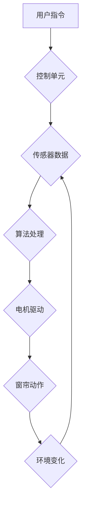

                 

## 智能窗帘创业：自动化家居的又一革新

> 关键词：智能窗帘、自动化家居、物联网、机器学习、传感器、语音控制、隐私保护、用户体验

## 1. 背景介绍

近年来，随着物联网技术的快速发展和智能家居概念的普及，人们对家居生活的便捷性和智能化程度提出了更高的要求。智能窗帘作为自动化家居的重要组成部分，凭借其能够自动调节光线、温度和隐私等功能，逐渐成为家居智能化升级的热门选择。

智能窗帘市场潜力巨大，预计未来几年将迎来爆发式增长。这主要得益于以下几个因素：

* **智能家居市场规模不断扩大:**  全球智能家居市场规模持续增长，预计到2025年将超过 2,000 亿美元。
* **消费者对智能化生活的追求:**  消费者越来越追求便捷、舒适和智能化的家居生活体验。
* **技术进步推动智能窗帘发展:**  物联网、人工智能、传感器等技术的进步为智能窗帘的研发和应用提供了强有力的技术支撑。

## 2. 核心概念与联系

智能窗帘的核心概念是将传统窗帘与智能化技术相结合，实现窗帘的自动控制和智能化功能。

**2.1 智能窗帘架构**

智能窗帘系统通常由以下几个核心组件组成：

* **电机驱动:**  驱动窗帘的开闭动作。
* **控制单元:**  接收指令并控制电机驱动，实现窗帘的自动化控制。
* **传感器:**  感知环境光线、温度、湿度等信息，并反馈给控制单元。
* **网络连接:**  实现智能窗帘与其他智能家居设备和云平台的连接。
* **用户界面:**  提供用户操作和控制窗帘的界面，例如手机APP、语音助手等。

**2.2 智能窗帘工作流程**



## 3. 核心算法原理 & 具体操作步骤

**3.1 算法原理概述**

智能窗帘的自动化控制主要依赖于算法的实现。常见的算法包括：

* **时间控制算法:**  根据预设的时间表自动控制窗帘的开闭动作。
* **光线控制算法:**  根据环境光线强度自动调节窗帘的遮光程度。
* **温度控制算法:**  根据室内温度自动调节窗帘的开闭状态，以控制室内温度。
* **场景控制算法:**  根据用户预设的场景，自动控制窗帘和其他智能家居设备的运行状态。

**3.2 算法步骤详解**

以光线控制算法为例，其具体操作步骤如下：

1. **数据采集:**  传感器采集环境光线强度数据。
2. **数据预处理:**  对采集到的光线强度数据进行滤波、平滑等处理，去除噪声和干扰。
3. **阈值设定:**  根据用户需求设定光线强度阈值，例如当光线强度低于阈值时，自动关闭窗帘。
4. **决策判断:**  将预处理后的光线强度数据与设定阈值进行比较，判断是否需要控制窗帘的开闭动作。
5. **控制执行:**  根据决策结果，控制电机驱动，实现窗帘的开闭动作。

**3.3 算法优缺点**

* **优点:**  能够根据环境光线自动调节窗帘，提高用户体验，节省能源。
* **缺点:**  算法精度受传感器精度和环境因素影响，可能存在误判的情况。

**3.4 算法应用领域**

光线控制算法广泛应用于智能窗帘、智能照明、智能植物生长灯等领域。

## 4. 数学模型和公式 & 详细讲解 & 举例说明

**4.1 数学模型构建**

智能窗帘的光线控制算法可以采用以下数学模型：

```latex
L = f(I, T)
```

其中：

* $L$：窗帘遮光程度（0-100%）
* $I$：环境光线强度（Lux）
* $T$：用户设定阈值（Lux）

**4.2 公式推导过程**

根据用户需求和环境光线强度，可以采用不同的函数关系来描述窗帘遮光程度与光线强度的关系。例如，可以使用线性函数、二次函数或其他非线性函数。

**4.3 案例分析与讲解**

假设用户设定阈值为 500 Lux，并且采用线性函数来描述窗帘遮光程度与光线强度的关系，则公式可以表示为：

```latex
L = 2 * I - 1000
```

当环境光线强度为 300 Lux 时，窗帘遮光程度为：

```latex
L = 2 * 300 - 1000 = -400
```

由于遮光程度不能为负值，因此在该情况下，窗帘将完全打开。

## 5. 项目实践：代码实例和详细解释说明

**5.1 开发环境搭建**

智能窗帘项目可以使用 Python 语言进行开发，并结合 Raspberry Pi 等单片机进行硬件控制。

**5.2 源代码详细实现**

```python
import RPi.GPIO as GPIO
import time

# 设置 GPIO 引脚
motor_pin = 18

# 初始化 GPIO
GPIO.setmode(GPIO.BCM)
GPIO.setup(motor_pin, GPIO.OUT)

# 定义控制电机函数
def move_motor(direction):
    if direction == "up":
        GPIO.output(motor_pin, GPIO.HIGH)
    elif direction == "down":
        GPIO.output(motor_pin, GPIO.LOW)

# 主程序
try:
    while True:
        # 获取环境光线强度
        light_intensity = get_light_intensity()

        # 根据光线强度控制窗帘
        if light_intensity < threshold:
            move_motor("up")
        else:
            move_motor("down")

        time.sleep(1)

except KeyboardInterrupt:
    GPIO.cleanup()
```

**5.3 代码解读与分析**

该代码首先设置 GPIO 引脚，并初始化 GPIO 模块。然后定义一个 `move_motor` 函数，用于控制电机的方向。主程序循环获取环境光线强度，并根据光线强度控制窗帘的开闭动作。

**5.4 运行结果展示**

当环境光线强度低于设定阈值时，窗帘将自动关闭；当环境光线强度高于设定阈值时，窗帘将自动打开。

## 6. 实际应用场景

智能窗帘的应用场景非常广泛，例如：

* **家庭住宅:**  自动调节光线和温度，提高居住舒适度。
* **办公楼:**  根据工作时间自动控制窗帘，节约能源。
* **酒店:**  提供个性化服务，提升入住体验。
* **医疗机构:**  控制光线和温度，营造舒适的治疗环境。

**6.4 未来应用展望**

未来，智能窗帘将更加智能化和个性化，例如：

* **语音控制:**  通过语音助手控制窗帘的开闭动作。
* **人脸识别:**  根据用户的身份自动调节窗帘。
* **场景联动:**  与其他智能家居设备联动，实现更智能化的家居控制。

## 7. 工具和资源推荐

**7.1 学习资源推荐**

* **书籍:**  《物联网编程》
* **网站:**  Raspberry Pi 官方网站、Arduino 官方网站

**7.2 开发工具推荐**

* **编程语言:**  Python
* **单片机:**  Raspberry Pi、Arduino

**7.3 相关论文推荐**

* **智能窗帘控制算法研究**
* **基于物联网技术的智能窗帘系统设计**

## 8. 总结：未来发展趋势与挑战

**8.1 研究成果总结**

智能窗帘技术已经取得了显著的进展，并逐渐成为自动化家居的重要组成部分。

**8.2 未来发展趋势**

未来，智能窗帘将更加智能化、个性化和集成化，并与其他智能家居设备和云平台深度融合。

**8.3 面临的挑战**

智能窗帘技术还面临着一些挑战，例如：

* **隐私保护:**  智能窗帘需要收集和处理用户的个人信息，因此需要加强隐私保护措施。
* **安全性:**  智能窗帘系统需要保证其安全性，防止被恶意攻击。
* **成本控制:**  智能窗帘的成本相对较高，需要进一步降低成本，使其更普及。

**8.4 研究展望**

未来，研究人员将继续致力于智能窗帘技术的研发和应用，使其更加智能、便捷和安全，为用户提供更舒适和便捷的家居生活体验。

## 9. 附录：常见问题与解答

**9.1 如何安装智能窗帘？**

智能窗帘的安装方法根据不同的型号和品牌有所不同，请参考产品说明书进行安装。

**9.2 如何连接智能窗帘到 Wi-Fi 网络？**

智能窗帘通常可以通过手机APP或语音助手连接到 Wi-Fi 网络。

**9.3 如何设置智能窗帘的定时控制？**

可以通过手机APP或语音助手设置智能窗帘的定时控制功能。

**9.4 如何解决智能窗帘无法正常工作的故障？**

如果智能窗帘无法正常工作，请检查电源、网络连接和传感器是否正常。


作者：禅与计算机程序设计艺术 / Zen and the Art of Computer Programming 
<end_of_turn>

