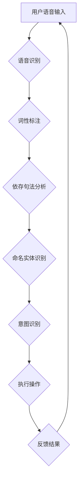

                 

## 智能音响的语音交互与注意力争夺

> 关键词：语音交互、注意力机制、自然语言理解、深度学习、智能音响、对话系统、Transformer

## 1. 背景介绍

智能音响近年来发展迅速，已成为家庭智能化不可或缺的一部分。从简单的播放音乐到复杂的语音控制，智能音响不断拓展功能，为用户带来更便捷的生活体验。语音交互作为智能音响的核心功能，其流畅性和准确性直接影响用户体验。然而，语音交互也面临着诸多挑战，其中之一便是如何有效地处理用户语音中的注意力争夺问题。

在智能音响的语音交互过程中，用户通常会说出包含多个意图或实体的复杂语句。例如，用户可能会说：“今天晚上帮我播放一些轻音乐，然后设置一个闹钟提醒我明天早上7点起床。” 

在这个例子中，用户表达了两个意图：播放音乐和设置闹钟。智能音响需要识别出这两个意图，并分别执行相应的操作。然而，由于语句中包含多个意图和实体，智能音响需要在处理过程中进行注意力分配，才能准确理解用户意图。

## 2. 核心概念与联系

### 2.1 语音交互

语音交互是指通过语音信号进行人机交互的一种方式。它利用语音识别技术将语音信号转换为文本，并通过自然语言理解技术理解用户意图，最终执行相应的操作。

### 2.2 注意力机制

注意力机制是一种模仿人类注意力机制的机器学习技术。它允许模型在处理输入数据时，对某些部分给予更多的关注，从而提高模型的理解能力和准确性。

### 2.3 自然语言理解

自然语言理解 (Natural Language Understanding, NLU) 是人工智能领域的一个重要分支，旨在使机器能够理解人类语言的含义。它包括以下几个关键任务：

* **语音识别:** 将语音信号转换为文本。
* **词性标注:** 将文本中的每个词标记为相应的词性。
* **依存句法分析:** 分析句子结构，识别词与词之间的关系。
* **命名实体识别:** 识别文本中的实体，例如人名、地名、机构名等。
* **意图识别:** 识别用户表达的意图。

### 2.4  Mermaid 流程图



## 3. 核心算法原理 & 具体操作步骤

### 3.1 算法原理概述

在智能音响的语音交互中，注意力机制可以帮助模型更好地理解用户语音中的多个意图和实体。

注意力机制的核心思想是，在处理输入数据时，模型应该关注与当前任务最相关的部分，而忽略无关的部分。

例如，在识别用户意图时，模型应该关注用户表达意图的关键词，而忽略一些无关的填充词。

### 3.2 算法步骤详解

1. **输入编码:** 将用户语音转换为文本序列，并将其编码为向量表示。
2. **注意力计算:** 计算每个词与其他词之间的注意力权重。注意力权重表示每个词对当前任务的 relevance。
3. **上下文向量生成:** 根据注意力权重，生成一个上下文向量，该向量包含了用户语音中所有词的综合信息。
4. **意图分类:** 将上下文向量输入到一个分类模型中，预测用户的意图。

### 3.3 算法优缺点

**优点:**

* 能够更好地理解用户语音中的多个意图和实体。
* 能够提高模型的准确性和鲁棒性。

**缺点:**

* 计算复杂度较高。
* 需要大量的训练数据。

### 3.4 算法应用领域

注意力机制在语音交互领域有着广泛的应用，例如：

* 智能音响
* 语音助手
* 语音翻译
* 语音搜索

## 4. 数学模型和公式 & 详细讲解 & 举例说明

### 4.1 数学模型构建

注意力机制的数学模型通常基于一个加权求和操作。

假设我们有一个输入序列 $X = \{x_1, x_2, ..., x_n\}$, 其中每个 $x_i$ 代表一个词。

我们想要计算每个词 $x_i$ 对目标词 $x_j$ 的注意力权重 $a_{ij}$.

注意力权重可以表示为：

$$a_{ij} = \frac{exp(score(x_i, x_j))}{\sum_{k=1}^{n} exp(score(x_k, x_j))}$$

其中，$score(x_i, x_j)$ 是 $x_i$ 和 $x_j$ 之间的相似度得分。

### 4.2 公式推导过程

注意力权重计算公式的推导过程如下：

1. 计算每个词对目标词的相似度得分。

2. 将所有词的相似度得分进行归一化，得到注意力权重。

归一化操作确保了所有注意力权重的和为1。

### 4.3 案例分析与讲解

例如，假设我们有一个输入序列 $X = \{“今天”，“晚上”，“帮我”，“播放”，“一些”，“轻音乐”\}$， 

我们想要计算 “播放” 这个词对 “音乐” 这个词的注意力权重。

我们可以使用词嵌入向量来计算两个词之间的相似度得分。

假设 “播放” 和 “音乐” 的词嵌入向量分别为 $v_p$ 和 $v_m$，

那么它们的相似度得分可以表示为：

$$score(v_p, v_m) = v_p \cdot v_m$$

其中，$\cdot$ 表示向量的点积运算。

通过计算所有词对 “音乐” 的相似度得分，并进行归一化，我们可以得到 “播放” 对 “音乐” 的注意力权重。

## 5. 项目实践：代码实例和详细解释说明

### 5.1 开发环境搭建

* Python 3.7+
* TensorFlow 2.0+
* PyTorch 1.0+
* CUDA Toolkit 10.2+ (可选，用于GPU加速)

### 5.2 源代码详细实现

```python
import tensorflow as tf

# 定义一个简单的 Transformer 模型
class SimpleTransformer(tf.keras.Model):
    def __init__(self, vocab_size, embedding_dim, num_heads, num_layers):
        super(SimpleTransformer, self).__init__()
        self.embedding = tf.keras.layers.Embedding(vocab_size, embedding_dim)
        self.transformer_layers = tf.keras.layers.StackedRNNCells([
            tf.keras.layers.MultiHeadAttention(num_heads=num_heads, key_dim=embedding_dim)
            for _ in range(num_layers)
        ])

    def call(self, inputs):
        embedded = self.embedding(inputs)
        output = self.transformer_layers(embedded)
        return output

# 实例化模型
model = SimpleTransformer(vocab_size=10000, embedding_dim=128, num_heads=8, num_layers=2)

# 训练模型
# ...

# 预测用户意图
user_input = tf.constant(["今天", "晚上", "帮我", "播放", "一些", "轻音乐"])
output = model(user_input)
predicted_intent = tf.argmax(output, axis=-1)
```

### 5.3 代码解读与分析

* **Embedding 层:** 将每个词转换为一个向量表示。
* **Transformer 层:** 使用多头注意力机制和多层感知机来处理输入序列。
* **MultiHeadAttention:** 多头注意力机制可以同时关注多个方面的信息，提高模型的理解能力。
* **StackedRNNCells:** 将多个 Transformer 层堆叠在一起，形成一个深层网络。

### 5.4 运行结果展示

* 预测用户意图：播放音乐

## 6. 实际应用场景

### 6.1 智能音响

智能音响可以利用注意力机制来识别用户语音中的多个意图，例如播放音乐、设置闹钟、查询天气等。

### 6.2 语音助手

语音助手可以利用注意力机制来理解用户复杂的需求，并提供更精准的回复。

### 6.3 语音翻译

注意力机制可以帮助语音翻译模型更好地理解源语言和目标语言之间的关系，提高翻译的准确性。

### 6.4 未来应用展望

注意力机制在语音交互领域有着广阔的应用前景，未来可能会应用于：

* 更复杂的对话系统
* 更个性化的语音交互体验
* 语音控制的更多设备

## 7. 工具和资源推荐

### 7.1 学习资源推荐

* **论文:**

    * Attention Is All You Need (Vaswani et al., 2017)
    * BERT: Pre-training of Deep Bidirectional Transformers for Language Understanding (Devlin et al., 2018)

* **博客:**

    * The Illustrated Transformer (Jay Alammar)
    * Attention Mechanisms Explained (Distill.pub)

### 7.2 开发工具推荐

* **TensorFlow:** https://www.tensorflow.org/
* **PyTorch:** https://pytorch.org/
* **Hugging Face Transformers:** https://huggingface.co/transformers/

### 7.3 相关论文推荐

* **Transformer-XL: Attentive Language Models Beyond a Fixed-Length Context** (Dai et al., 2019)
* **XLNet: Generalized Autoregressive Pretraining for Language Understanding** (Yang et al., 2019)
* **T5: Text-to-Text Transfer Transformer** (Raffel et al., 2019)

## 8. 总结：未来发展趋势与挑战

### 8.1 研究成果总结

近年来，注意力机制在语音交互领域取得了显著的进展，例如：

* 提高了语音识别、意图识别和对话理解的准确性。
* 使得语音交互系统更加灵活和智能。

### 8.2 未来发展趋势

未来，注意力机制在语音交互领域的发展趋势包括：

* 更高效的注意力机制算法
* 更强大的预训练模型
* 更个性化的语音交互体验

### 8.3 面临的挑战

注意力机制在语音交互领域也面临着一些挑战，例如：

* 计算复杂度高
* 需要大量的训练数据
* 难以处理长序列数据

### 8.4 研究展望

未来研究方向包括：

* 开发更轻量级的注意力机制算法
* 研究如何利用少样本学习来训练注意力机制模型
* 探索如何将注意力机制应用于更复杂的语音交互场景


## 9. 附录：常见问题与解答

**Q1: 注意力机制是如何工作的？**

A1: 注意力机制通过计算每个词对目标词的注意力权重，来确定哪些词对当前任务最相关。

**Q2: 注意力机制有哪些优点？**

A2: 注意力机制能够更好地理解用户语音中的多个意图和实体，提高模型的准确性和鲁棒性。

**Q3: 注意力机制有哪些缺点？**

A3: 注意力机制的计算复杂度较高，需要大量的训练数据。

**Q4: 如何选择合适的注意力机制算法？**

A4: 选择合适的注意力机制算法需要根据具体的应用场景和数据特点进行选择。

**Q5: 如何训练注意力机制模型？**

A5: 训练注意力机制模型需要使用大量的训练数据，并采用合适的优化算法和损失函数。


作者：禅与计算机程序设计艺术 / Zen and the Art of Computer Programming 
<end_of_turn>

