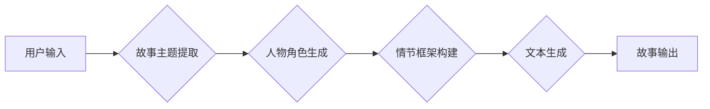

                 

## 构建Storyteller AI大语言模型：从基础到应用的全面指南

> 关键词：大语言模型、Storyteller AI、自然语言处理、Transformer、文本生成、深度学习、AI应用

### 1. 背景介绍

近年来，人工智能领域取得了令人瞩目的进展，其中大语言模型（Large Language Model，LLM）的出现尤为引人注目。这些模型能够理解和生成人类语言，展现出强大的文本处理能力，在文本生成、机器翻译、问答系统等领域展现出巨大的应用潜力。

Storyteller AI，作为一种专门用于生成故事的大语言模型，旨在突破传统文本生成模型的局限性，赋予 AI 更强的叙事能力和创造力。它能够根据用户提供的提示或场景，自动生成富有创意、逻辑完整、情感丰富的故事情节和人物对话，为用户提供沉浸式的阅读体验。

### 2. 核心概念与联系

Storyteller AI 的构建基于深度学习和自然语言处理（NLP）技术，其核心概念包括：

* **Transformer 架构:** Transformer 是一种新型的神经网络架构，能够有效地处理序列数据，例如文本。它通过自注意力机制（Self-Attention）学习文本中的长距离依赖关系，从而提升了文本生成模型的质量和流畅度。
* **预训练与微调:** Storyteller AI 通常采用预训练与微调的策略。首先，在海量文本数据上预训练模型，使其掌握语言的语法规则和语义理解能力。然后，根据特定任务，对预训练模型进行微调，使其能够生成符合特定风格和主题的故事。
* **文本生成算法:** Storyteller AI 使用各种文本生成算法，例如基于概率的生成模型（如RNN、LSTM）或基于变分自编码器的生成模型（如VAE），来生成文本序列。

**Mermaid 流程图:**



### 3. 核心算法原理 & 具体操作步骤

#### 3.1  算法原理概述

Storyteller AI 的核心算法通常基于 Transformer 架构，并结合了文本生成算法和预训练与微调策略。

Transformer 架构的核心是自注意力机制，它能够学习文本中不同词语之间的关系，从而理解上下文信息。通过多层 Transformer 结构，模型能够捕捉长距离依赖关系，生成更流畅、更自然的文本。

#### 3.2  算法步骤详解

1. **数据预处理:** 收集和清洗故事数据，将其转换为模型可识别的格式。
2. **模型预训练:** 在海量文本数据上预训练 Transformer 模型，使其掌握语言的语法规则和语义理解能力。
3. **任务特定微调:** 根据故事生成任务，对预训练模型进行微调，使其能够生成符合特定风格和主题的故事。
4. **故事主题提取:** 根据用户输入的提示或场景，提取故事的主题和关键信息。
5. **人物角色生成:** 根据故事主题，生成故事中的主要人物角色，并赋予他们相应的性格和背景。
6. **情节框架构建:** 根据故事主题和人物角色，构建故事的情节框架，包括故事的起承转合。
7. **文本生成:** 利用 Transformer 模型，根据情节框架和人物角色，生成故事的文本内容。
8. **故事输出:** 将生成的文本内容输出给用户，提供沉浸式的阅读体验。

#### 3.3  算法优缺点

**优点:**

* **生成高质量故事:** Transformer 架构和预训练与微调策略能够生成富有创意、逻辑完整、情感丰富的故事情节和人物对话。
* **适应性强:** 可以根据用户提供的不同提示或场景，生成不同风格和主题的故事。
* **可扩展性高:** 可以通过增加训练数据和模型参数，进一步提升故事生成质量。

**缺点:**

* **训练成本高:** 预训练 Transformer 模型需要大量的计算资源和时间。
* **数据依赖性强:** 模型的生成质量取决于训练数据的质量和数量。
* **缺乏真实世界知识:** 模型生成的文本可能缺乏真实世界知识和常识。

#### 3.4  算法应用领域

Storyteller AI 的应用领域非常广泛，包括：

* **娱乐:** 生成小说、剧本、诗歌、游戏故事等。
* **教育:** 生成互动式学习故事、辅助教学材料等。
* **营销:** 生成个性化故事广告、品牌故事等。
* **创意写作:** 帮助作家克服创作瓶颈，激发灵感。

### 4. 数学模型和公式 & 详细讲解 & 举例说明

#### 4.1  数学模型构建

Storyteller AI 的数学模型通常基于 Transformer 架构，其核心是自注意力机制。

**自注意力机制:**

自注意力机制能够学习文本中不同词语之间的关系，从而理解上下文信息。其计算公式如下：

$$
Attention(Q, K, V) = softmax(\frac{QK^T}{\sqrt{d_k}})V
$$

其中：

* $Q$：查询矩阵
* $K$：键矩阵
* $V$：值矩阵
* $d_k$：键向量的维度
* $softmax$：softmax 函数

#### 4.2  公式推导过程

自注意力机制的计算过程可以分为以下步骤：

1. 将输入序列转换为查询矩阵 $Q$、键矩阵 $K$ 和值矩阵 $V$。
2. 计算 $Q$ 和 $K$ 的点积，并进行归一化处理。
3. 应用 softmax 函数，得到每个词语对其他词语的注意力权重。
4. 将注意力权重与值矩阵 $V$ 进行加权求和，得到最终的输出。

#### 4.3  案例分析与讲解

假设我们有一个句子 "The cat sat on the mat"，其词语分别为 "The"、"cat"、"sat"、"on"、"the"、"mat"。

在自注意力机制中，每个词语都会与其他词语进行计算，得到其注意力权重。例如，"cat" 的注意力权重会对 "sat"、"on"、"mat" 较高，因为它们在语义上与 "cat" 相关。

最终的输出将是一个新的向量表示，包含了每个词语与其他词语的关系信息。

### 5. 项目实践：代码实例和详细解释说明

#### 5.1  开发环境搭建

Storyteller AI 的开发环境通常需要以下软件：

* Python 3.x
* PyTorch 或 TensorFlow 深度学习框架
* CUDA 和 cuDNN GPU 加速库

#### 5.2  源代码详细实现

由于篇幅限制，这里只提供代码框架示例，具体实现需要根据实际需求进行调整。

```python
import torch
import torch.nn as nn

class StorytellerModel(nn.Module):
    def __init__(self, vocab_size, embedding_dim, hidden_dim, num_layers):
        super(StorytellerModel, self).__init__()
        # ... 模型结构定义 ...

    def forward(self, input_ids):
        # ... 前向传播过程 ...
        return output_logits

# ... 模型训练和评估代码 ...
```

#### 5.3  代码解读与分析

* **模型结构:** StorytellerModel 类定义了模型的结构，包括嵌入层、Transformer encoder、解码器等。
* **前向传播:** forward() 方法定义了模型的计算过程，将输入的文本序列转换为输出的文本序列。
* **训练和评估:** 模型训练和评估代码使用 PyTorch 的训练和评估 API，可以根据实际需求进行调整。

#### 5.4  运行结果展示

Storyteller AI 的运行结果通常是生成的故事文本。可以通过评估指标，例如 perplexity 和 BLEU 分数，来衡量故事生成的质量。

### 6. 实际应用场景

Storyteller AI 在多个实际应用场景中展现出巨大的潜力：

#### 6.1  教育领域

* **个性化学习故事:** 根据学生的学习进度和兴趣，生成个性化的学习故事，提高学习兴趣和效果。
* **辅助教学材料:** 生成互动式学习故事、角色扮演场景等，辅助教师进行教学。

#### 6.2  娱乐领域

* **小说、剧本、诗歌生成:** 帮助作家克服创作瓶颈，生成创意丰富的文本内容。
* **游戏故事设计:** 为游戏设计富有创意和沉浸感的故事情节。

#### 6.3  营销领域

* **个性化故事广告:** 根据用户的兴趣和行为，生成个性化的故事广告，提高广告点击率和转化率。
* **品牌故事构建:** 为品牌构建富有情感和感染力的故事，提升品牌形象和用户粘性。

#### 6.4  未来应用展望

随着人工智能技术的不断发展，Storyteller AI 的应用场景将更加广泛，例如：

* **虚拟助手:** 生成更加自然和富有情感的对话，提升虚拟助手的交互体验。
* **医疗保健:** 生成个性化的医疗故事，帮助患者理解病情和治疗方案。
* **艺术创作:** 与艺术家合作，生成新的艺术作品，例如音乐、绘画、舞蹈等。

### 7. 工具和资源推荐

#### 7.1  学习资源推荐

* **书籍:**
    * 《深度学习》 by Ian Goodfellow, Yoshua Bengio, Aaron Courville
    * 《自然语言处理》 by Dan Jurafsky, James H. Martin
* **在线课程:**
    * Coursera: Natural Language Processing Specialization
    * Udacity: Deep Learning Nanodegree

#### 7.2  开发工具推荐

* **PyTorch:** https://pytorch.org/
* **TensorFlow:** https://www.tensorflow.org/
* **Hugging Face Transformers:** https://huggingface.co/transformers/

#### 7.3  相关论文推荐

* **Attention Is All You Need:** https://arxiv.org/abs/1706.03762
* **BERT: Pre-training of Deep Bidirectional Transformers for Language Understanding:** https://arxiv.org/abs/1810.04805

### 8. 总结：未来发展趋势与挑战

#### 8.1  研究成果总结

Storyteller AI 的研究取得了显著进展，能够生成高质量、富有创意的故事文本。Transformer 架构和预训练与微调策略是其核心技术，为故事生成提供了强大的能力。

#### 8.2  未来发展趋势

* **更强大的模型:** 随着计算资源的提升，Storyteller AI 模型将更加强大，能够生成更加复杂和富有情感的故事情节。
* **更丰富的应用场景:** Storyteller AI 将应用于更多领域，例如教育、医疗、艺术等，为人类生活带来更多便利和乐趣。
* **更注重伦理和安全:** 随着 Storyteller AI 的应用越来越广泛，需要更加重视其伦理和安全问题，例如避免生成有害或偏见的内容。

#### 8.3  面临的挑战

* **数据质量:** Storyteller AI 的生成质量取决于训练数据的质量和数量，需要不断收集和清洗高质量的故事数据。
* **可解释性:** Transformer 模型的内部机制较为复杂，难以解释其生成文本的逻辑，需要进一步研究模型的可解释性。
* **公平性和偏见:** Storyteller AI 可能会继承训练数据中的偏见，需要采取措施避免生成不公平或有害的内容。

#### 8.4  研究展望

未来 Storyteller AI 研究将继续探索以下方向:

* **多模态故事生成:** 将文本、图像、音频等多种模态信息融合，生成更加丰富的和沉浸式的故事情节。
* **个性化故事生成:** 根据用户的喜好和需求，生成更加个性化的故事内容。
* **交互式故事生成:** 与用户进行交互，根据用户的反馈动态生成故事内容。


### 9. 附录：常见问题与解答

**Q1: 如何训练 Storyteller AI 模型？**

A1: 训练 Storyteller AI 模型需要大量的计算资源和时间，通常需要使用 GPU 加速。可以使用 PyTorch 或 TensorFlow 等深度学习框架，并根据实际需求调整模型结构和训练参数。

**Q2: 如何评估 Storyteller AI 的生成质量？**

A2: 可以使用 perplexity 和 BLEU 分数等指标来评估 Storyteller AI 的生成质量。 perplexity 越低，表示模型生成的文本越流畅自然。 BLEU 分数越高，表示模型生成的文本与参考文本越相似。

**Q3: Storyteller AI 会生成虚假信息吗？**

A3: Storyteller AI 的生成文本基于其训练数据，如果训练数据中包含虚假信息，模型也可能生成虚假信息。因此，需要谨慎使用 Storyteller AI 生成的文本，并进行必要的验证。


作者：禅与计算机程序设计艺术 / Zen and the Art of Computer Programming<end_of_turn>

