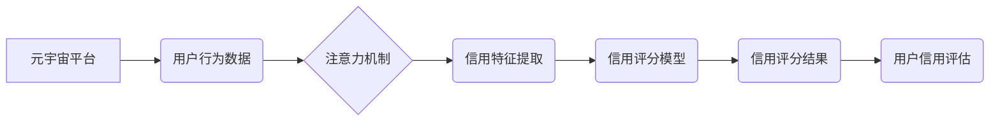

                 

## 注意力信用评分:元宇宙中的个人信用新维度

> 关键词：元宇宙、信用评分、注意力机制、数据分析、个人信用、区块链、去中心化

## 1. 背景介绍

元宇宙概念的兴起，为人类社会带来了前所未有的虚拟交互体验，同时也为个人信用体系的构建提供了新的机遇和挑战。传统信用评分体系主要基于现实世界的数据，如财务记录、消费行为等，难以有效评估元宇宙中用户行为的信用风险。

随着元宇宙的蓬勃发展，用户在虚拟世界中进行的各种活动，例如虚拟资产交易、虚拟身份交互、虚拟社区参与等，都产生了大量的行为数据。这些数据蕴含着丰富的信用信息，可以为构建元宇宙中的个人信用体系提供新的依据。

然而，元宇宙环境的复杂性和用户行为的多样性，使得传统的信用评分模型难以直接应用。我们需要探索新的方法，利用元宇宙中丰富的行为数据，构建更加精准、动态、可信的个人信用评分体系。

## 2. 核心概念与联系

**2.1  元宇宙与信用评分**

元宇宙是一个由虚拟现实、增强现实和互联网技术融合而成的沉浸式虚拟世界，用户可以在其中创建虚拟身份、进行虚拟交互、参与虚拟经济活动等。

信用评分是评估个人或组织信用风险的指标，通常基于历史数据和行为模式进行计算。在元宇宙中，用户行为数据更加丰富多样，包括虚拟资产交易记录、虚拟身份交互记录、虚拟社区参与记录等，这些数据可以为构建元宇宙中的个人信用评分提供新的依据。

**2.2  注意力机制与信用评分**

注意力机制是一种模仿人类注意力机制的机器学习技术，可以帮助模型聚焦于输入数据中最重要的部分。

在信用评分领域，注意力机制可以帮助模型识别用户行为数据中与信用风险相关的关键信息，例如频繁的虚拟资产交易、与不良用户交互等，从而提高信用评分的准确性。

**2.3  架构图**



## 3. 核心算法原理 & 具体操作步骤

**3.1  算法原理概述**

注意力信用评分算法基于深度学习和注意力机制，通过对元宇宙用户行为数据进行分析，提取与信用风险相关的特征，并利用注意力机制赋予不同特征不同的权重，最终生成用户的信用评分。

**3.2  算法步骤详解**

1. **数据收集与预处理:** 从元宇宙平台收集用户行为数据，包括虚拟资产交易记录、虚拟身份交互记录、虚拟社区参与记录等，并进行清洗、转换、编码等预处理操作。

2. **特征提取:** 利用自然语言处理、机器学习等技术，从用户行为数据中提取与信用风险相关的特征，例如交易频率、交易金额、交互对象、社区活跃度等。

3. **注意力机制应用:** 利用注意力机制对提取的特征进行加权，赋予与信用风险相关的特征更高的权重，从而突出其重要性。

4. **信用评分模型训练:** 利用训练数据训练信用评分模型，例如深度神经网络、支持向量机等，并根据模型的性能进行调优。

5. **信用评分生成:** 将新用户的行为数据输入到训练好的信用评分模型中，根据模型的输出结果生成用户的信用评分。

**3.3  算法优缺点**

**优点:**

* 能够利用元宇宙中丰富的行为数据，构建更加精准的信用评分体系。
* 注意力机制能够突出与信用风险相关的关键信息，提高信用评分的准确性。
* 能够动态地评估用户的信用风险，随着用户的行为变化而调整信用评分。

**缺点:**

* 需要大量的训练数据，才能训练出准确的信用评分模型。
* 注意力机制的训练过程较为复杂，需要专业的技术人员进行操作。
* 元宇宙环境的不断变化，可能会导致信用评分模型的失效，需要定期更新模型。

**3.4  算法应用领域**

* **虚拟资产交易:** 为虚拟资产交易平台提供用户信用评估服务，降低交易风险。
* **虚拟身份认证:** 为元宇宙平台提供用户身份认证服务，防止虚假身份和欺诈行为。
* **虚拟社区管理:** 为虚拟社区提供用户信用管理服务，维护社区秩序和安全。
* **元宇宙金融服务:** 为元宇宙平台提供金融服务，例如虚拟贷款、虚拟保险等。

## 4. 数学模型和公式 & 详细讲解 & 举例说明

**4.1  数学模型构建**

注意力信用评分模型可以构建为一个多层神经网络，其中包含注意力机制层。

**4.2  公式推导过程**

注意力机制的计算公式如下：

$$
\alpha_{i} = \frac{exp(e_{i})}{\sum_{j=1}^{n} exp(e_{j})}
$$

其中：

* $\alpha_{i}$ 是第 i 个特征的注意力权重。
* $e_{i}$ 是第 i 个特征的得分，可以通过一个神经网络计算得到。
* $n$ 是特征的总数。

**4.3  案例分析与讲解**

假设我们有一个元宇宙用户，其行为数据包括以下特征：

* 虚拟资产交易次数：10 次
* 虚拟资产交易金额：100 元
* 虚拟身份交互次数：50 次
* 虚拟社区参与次数：20 次

我们可以使用注意力机制计算每个特征的注意力权重，例如：

* 虚拟资产交易次数的注意力权重：0.3
* 虚拟资产交易金额的注意力权重：0.2
* 虚拟身份交互次数的注意力权重：0.4
* 虚拟社区参与次数的注意力权重：0.1

通过赋予不同特征不同的权重，注意力机制可以突出与信用风险相关的关键信息，例如虚拟资产交易次数和金额。

## 5. 项目实践：代码实例和详细解释说明

**5.1  开发环境搭建**

* Python 3.7+
* TensorFlow 2.0+
* PyTorch 1.0+
* Jupyter Notebook

**5.2  源代码详细实现**

```python
import tensorflow as tf

# 定义注意力机制层
class AttentionLayer(tf.keras.layers.Layer):
    def __init__(self, units):
        super(AttentionLayer, self).__init__()
        self.W1 = tf.keras.layers.Dense(units)
        self.W2 = tf.keras.layers.Dense(units)
        self.v = tf.keras.layers.Dense(1)

    def call(self, inputs):
        # 计算特征得分
        scores = self.v(tf.nn.tanh(self.W2(inputs)))
        # 计算注意力权重
        attention_weights = tf.nn.softmax(scores, axis=-1)
        # 计算加权平均值
        context_vector = tf.matmul(attention_weights, inputs)
        return context_vector

# 定义信用评分模型
model = tf.keras.Sequential([
    tf.keras.layers.Embedding(input_dim=10000, output_dim=128),
    tf.keras.layers.LSTM(units=64),
    AttentionLayer(units=32),
    tf.keras.layers.Dense(units=1, activation='sigmoid')
])

# 编译模型
model.compile(optimizer='adam', loss='binary_crossentropy', metrics=['accuracy'])

# 训练模型
model.fit(x_train, y_train, epochs=10)

# 预测信用评分
predictions = model.predict(x_test)
```

**5.3  代码解读与分析**

* 代码首先定义了一个注意力机制层，该层计算特征得分、注意力权重和加权平均值。
* 然后定义了一个信用评分模型，该模型包含嵌入层、LSTM层、注意力机制层和输出层。
* 模型使用Adam优化器、二分类交叉熵损失函数和准确率作为评估指标进行训练。
* 训练完成后，可以使用模型预测新用户的信用评分。

**5.4  运行结果展示**

训练完成后，可以根据模型的性能指标，例如准确率、召回率、F1-score等，评估模型的有效性。

## 6. 实际应用场景

**6.1  虚拟资产交易平台**

注意力信用评分可以用于评估虚拟资产交易平台用户的信用风险，例如判断用户是否会进行洗钱、诈骗等违规行为。

**6.2  虚拟身份认证系统**

注意力信用评分可以用于验证用户身份的真实性，防止虚假身份和欺诈行为。

**6.3  虚拟社区管理平台**

注意力信用评分可以用于评估用户在虚拟社区中的行为，例如判断用户是否遵守社区规则、是否积极参与社区活动等。

**6.4  未来应用展望**

随着元宇宙的不断发展，注意力信用评分算法将有更广泛的应用场景，例如：

* 元宇宙金融服务：为元宇宙平台提供虚拟贷款、虚拟保险等金融服务。
* 元宇宙游戏：为元宇宙游戏提供玩家信用评估服务，防止作弊行为。
* 元宇宙教育：为元宇宙教育平台提供学生信用评估服务，促进学习和成长。

## 7. 工具和资源推荐

**7.1  学习资源推荐**

* **书籍:**

    * 深度学习
    * 自然语言处理

* **在线课程:**

    * Coursera: 深度学习
    * edX: 自然语言处理

**7.2  开发工具推荐**

* **Python:** 

    * TensorFlow
    * PyTorch

* **IDE:**

    * Jupyter Notebook
    * VS Code

**7.3  相关论文推荐**

* Attention Is All You Need
* BERT: Pre-training of Deep Bidirectional Transformers for Language Understanding

## 8. 总结：未来发展趋势与挑战

**8.1  研究成果总结**

注意力信用评分算法为元宇宙中的个人信用体系构建提供了新的思路和方法，能够利用元宇宙中丰富的行为数据，构建更加精准、动态、可信的信用评分体系。

**8.2  未来发展趋势**

* **模型的复杂度和精度:** 未来可以探索更复杂的深度学习模型，例如Transformer、Graph Neural Network等，提高信用评分的精度。
* **多模态数据的融合:** 元宇宙中包含多种数据类型，例如文本、图像、音频等，未来可以探索融合多模态数据的信用评分模型，提高模型的鲁棒性和泛化能力。
* **去中心化信用评分:** 未来可以探索基于区块链技术的去中心化信用评分体系，提高信用评分的透明度和安全性。

**8.3  面临的挑战**

* **数据隐私保护:** 元宇宙中用户行为数据非常丰富，需要采取有效的措施保护用户隐私。
* **算法的公平性:** 信用评分算法需要避免歧视和偏见，确保公平公正。
* **监管和标准化:** 元宇宙信用评分体系需要制定相应的监管和标准化规范，确保其合法合规。

**8.4  研究展望**

未来，注意力信用评分算法将继续发展和完善，为元宇宙的健康发展提供重要的技术支撑。


## 9. 附录：常见问题与解答

**9.1  注意力机制是如何工作的？**

注意力机制是一种模仿人类注意力机制的技术，它可以帮助模型聚焦于输入数据中最重要的部分。

**9.2  注意力信用评分算法的优势是什么？**

注意力信用评分算法能够利用元宇宙中丰富的行为数据，构建更加精准、动态、可信的信用评分体系。

**9.3  注意力信用评分算法有哪些应用场景？**

注意力信用评分算法可以应用于虚拟资产交易平台、虚拟身份认证系统、虚拟社区管理平台等场景。


作者：禅与计算机程序设计艺术 / Zen and the Art of Computer Programming 
<end_of_turn>

