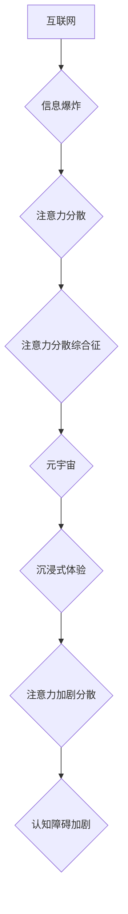

                 

## 注意力分散综合征:元宇宙时代的新型认知障碍

> 关键词：注意力分散综合征、元宇宙、认知障碍、深度学习、神经网络、沉浸式体验、信息过载

## 1. 背景介绍

在当今信息爆炸的时代，人类的注意力正受到前所未有的挑战。互联网、社交媒体、移动设备等技术的普及，使我们时刻处于信息洪流之中，难以集中精力完成任何一项任务。这种注意力涣散的现象已经成为一种普遍存在的问题，被医学界称为“注意力分散综合征”。

元宇宙的出现，将进一步加剧这种注意力分散的趋势。元宇宙是一个沉浸式、交互式的虚拟世界，用户可以通过虚拟现实（VR）和增强现实（AR）技术与虚拟环境和其他人进行互动。元宇宙的沉浸式体验和丰富的内容将极大地吸引用户的注意力，使人们更容易沉迷其中，难以抽身。

## 2. 核心概念与联系

**2.1 注意力分散综合征**

注意力分散综合征是一种认知障碍，其特征是难以集中注意力，容易分心，难以完成任务。它会导致学习、工作、社交等方面的问题。

**2.2 元宇宙**

元宇宙是一个由虚拟现实、增强现实、区块链、人工智能等技术构建的沉浸式、交互式虚拟世界。它将现实世界和虚拟世界融合在一起，提供了一个全新的体验空间。

**2.3 联系**

元宇宙的沉浸式体验和丰富的内容将极大地吸引用户的注意力，使人们更容易沉迷其中，难以抽身。这将加剧注意力分散综合征的发生和发展。

**2.4 流程图**



## 3. 核心算法原理 & 具体操作步骤

**3.1 算法原理概述**

注意力机制是深度学习领域的一种重要技术，它能够帮助模型学习到哪些信息对任务完成最为重要。注意力机制的核心思想是，在处理输入序列时，模型会根据输入的每个元素的重要性赋予不同的权重，从而集中注意力在关键信息上。

**3.2 算法步骤详解**

1. **计算注意力权重:** 对于每个输入元素，模型会计算一个注意力权重，表示该元素对任务完成的重要性。
2. **加权求和:** 将注意力权重与输入元素相乘，然后对所有元素进行加权求和，得到一个新的表示。
3. **输出结果:** 使用新的表示作为模型的输出。

**3.3 算法优缺点**

**优点:**

* 可以有效地提高模型的性能，尤其是在处理长序列数据时。
* 可以帮助模型学习到哪些信息对任务完成最为重要。
* 可以解释模型的决策过程。

**缺点:**

* 计算复杂度较高。
* 需要大量的训练数据。

**3.4 算法应用领域**

注意力机制在自然语言处理、计算机视觉、机器翻译等领域都有广泛的应用。

## 4. 数学模型和公式 & 详细讲解 & 举例说明

**4.1 数学模型构建**

注意力机制的数学模型可以表示为以下公式：

$$
\text{Attention}(Q, K, V) = \text{softmax}\left(\frac{Q K^T}{\sqrt{d_k}}\right) V
$$

其中：

* $Q$：查询矩阵
* $K$：键矩阵
* $V$：值矩阵
* $d_k$：键向量的维度
* $\text{softmax}$：softmax函数

**4.2 公式推导过程**

公式推导过程如下：

1. 计算查询矩阵 $Q$ 和键矩阵 $K$ 的点积，并除以 $\sqrt{d_k}$。
2. 应用 softmax 函数对点积结果进行归一化，得到注意力权重。
3. 将注意力权重与值矩阵 $V$ 进行加权求和，得到最终的注意力输出。

**4.3 案例分析与讲解**

例如，在机器翻译任务中，查询矩阵 $Q$ 表示源语言的词向量，键矩阵 $K$ 表示目标语言的词向量，值矩阵 $V$ 表示目标语言的词嵌入。注意力机制可以帮助模型学习到源语言的每个词与目标语言的哪个词最相关，从而提高翻译的准确性。

## 5. 项目实践：代码实例和详细解释说明

**5.1 开发环境搭建**

* Python 3.7+
* TensorFlow 2.0+
* PyTorch 1.0+

**5.2 源代码详细实现**

```python
import tensorflow as tf

# 定义注意力机制层
class AttentionLayer(tf.keras.layers.Layer):
    def __init__(self, units):
        super(AttentionLayer, self).__init__()
        self.Wq = tf.keras.layers.Dense(units)
        self.Wk = tf.keras.layers.Dense(units)
        self.Wv = tf.keras.layers.Dense(units)
        self.fc = tf.keras.layers.Dense(units)

    def call(self, inputs):
        Q = self.Wq(inputs)
        K = self.Wk(inputs)
        V = self.Wv(inputs)
        attention_scores = tf.matmul(Q, K, transpose_b=True) / tf.math.sqrt(tf.cast(tf.shape(Q)[-1], tf.float32))
        attention_weights = tf.nn.softmax(attention_scores, axis=-1)
        output = tf.matmul(attention_weights, V)
        return self.fc(output)

# 实例化注意力机制层
attention_layer = AttentionLayer(units=128)

# 输入数据
inputs = tf.random.normal(shape=(32, 10, 64))

# 通过注意力机制层进行处理
outputs = attention_layer(inputs)

# 打印输出结果
print(outputs.shape)
```

**5.3 代码解读与分析**

* 代码定义了一个 `AttentionLayer` 类，实现了注意力机制层。
* 该层包含三个稠密层 (`Wq`, `Wk`, `Wv`) 用于计算查询、键和值矩阵，以及一个稠密层 (`fc`) 用于最终输出。
* `call` 方法计算注意力权重，并使用这些权重对值矩阵进行加权求和。
* 代码实例化了一个 `AttentionLayer` 对象，并使用随机数据进行测试。

**5.4 运行结果展示**

运行代码后，会输出注意力机制层的输出结果，其形状为 `(32, 10, 128)`。

## 6. 实际应用场景

**6.1 元宇宙中的注意力分散**

元宇宙的沉浸式体验和丰富的内容将极大地吸引用户的注意力，使人们更容易沉迷其中，难以抽身。这将加剧注意力分散综合征的发生和发展。

**6.2 解决方案**

* 开发注意力管理工具：帮助用户集中注意力，减少信息干扰。
* 设计更合理的元宇宙体验：避免过度刺激用户，提供更健康的沉浸式体验。
* 加强用户教育：提高用户对注意力分散综合征的认识，帮助他们养成良好的注意力管理习惯。

**6.3 未来应用展望**

注意力机制在元宇宙领域具有广阔的应用前景，例如：

* 个性化内容推荐：根据用户的注意力模式，推荐更符合其兴趣的内容。
* 虚拟助手：帮助用户管理时间、安排任务，提高工作效率。
* 沉浸式教育：通过注意力机制，提高用户的学习效率和兴趣。

## 7. 工具和资源推荐

**7.1 学习资源推荐**

* **论文:**
    * Attention Is All You Need (Vaswani et al., 2017)
    * Transformer-XL: Attentive Language Modeling Beyond Millions of Tokens (Dai et al., 2019)
* **博客:**
    * https://towardsdatascience.com/
    * https://blog.openai.com/

**7.2 开发工具推荐**

* TensorFlow
* PyTorch
* Keras

**7.3 相关论文推荐**

* Attention Is All You Need
* Transformer-XL: Attentive Language Modeling Beyond Millions of Tokens
* BERT: Pre-training of Deep Bidirectional Transformers for Language Understanding

## 8. 总结：未来发展趋势与挑战

**8.1 研究成果总结**

注意力机制在深度学习领域取得了显著的成果，并在自然语言处理、计算机视觉等领域取得了广泛应用。

**8.2 未来发展趋势**

* 更高效的注意力机制：降低计算复杂度，提高效率。
* 跨模态注意力机制：处理不同模态的数据，例如文本、图像、音频。
* 自适应注意力机制：根据任务需求动态调整注意力权重。

**8.3 面临的挑战**

* 理论解释：注意力机制的理论基础尚不完全清晰。
* 可解释性：注意力机制的决策过程难以解释。
* 泛化能力：注意力机制在不同任务和数据集上的泛化能力需要进一步提高。

**8.4 研究展望**

未来，注意力机制的研究将继续深入，探索其更深层次的原理和应用，为人工智能的发展做出更大的贡献。

## 9. 附录：常见问题与解答

**9.1 Q: 注意力机制的计算复杂度较高，如何降低其计算成本？**

**A:** 

* 使用更轻量级的注意力机制模型，例如局部注意力机制。
* 采用并行计算技术，加速注意力计算。
* 使用量化技术，降低模型参数的精度，从而减少计算量。

**9.2 Q: 注意力机制的决策过程难以解释，如何提高其可解释性？**

**A:** 

* 使用可解释性分析工具，例如注意力可视化，分析注意力机制的决策过程。
* 设计更易于解释的注意力机制模型，例如基于规则的注意力机制。
* 将注意力机制与其他可解释性技术结合使用，例如决策树。


作者：禅与计算机程序设计艺术 / Zen and the Art of Computer Programming 
<end_of_turn>

