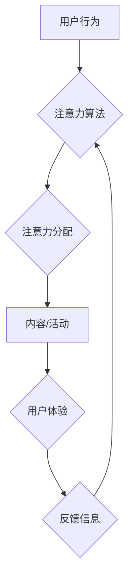

                 

## 注意力市场：元宇宙时代下的 信息交易

> 关键词：元宇宙、注意力、信息交易、算法、数据经济、隐私保护

## 1. 背景介绍

元宇宙概念的兴起，标志着人类进入一个全新的数字世界。在这个虚拟世界中，人们可以以数字化身份进行交互、体验、创造和交易。元宇宙的构建离不开海量数据和计算能力，而数据的核心价值在于蕴含的“注意力”。注意力，作为人类认知的核心资源，在元宇宙中将成为一种稀缺的、可交易的资产。

传统互联网时代，注意力被视为广告商争夺的对象，通过各种手段吸引用户的眼球，获取流量和收益。然而，元宇宙的沉浸式体验和交互性，将使注意力交易更加复杂和多元化。

## 2. 核心概念与联系

### 2.1 注意力经济

注意力经济是指在信息爆炸的时代，人们对信息的筛选和选择能力成为一种稀缺资源，而注意力本身则成为一种可交易的商品。

### 2.2 元宇宙注意力市场

元宇宙注意力市场是指在元宇宙环境中，用户注意力作为一种虚拟资产进行交易的市场。在这个市场中，用户可以将自己的注意力出售给内容创作者、游戏开发者、品牌商等，获取相应的虚拟货币或其他奖励。

### 2.3 注意力算法

注意力算法是指用于识别、衡量和分配用户注意力的算法。这些算法可以根据用户的行为、偏好和上下文信息，预测用户的注意力焦点，并将其分配给不同的内容或活动。

**Mermaid 流程图**



## 3. 核心算法原理 & 具体操作步骤

### 3.1 算法原理概述

元宇宙注意力算法通常基于深度学习技术，例如Transformer模型，能够有效地捕捉用户行为和上下文信息中的注意力模式。

这些算法通常包括以下几个步骤：

1. **数据采集:** 收集用户在元宇宙中的行为数据，例如浏览记录、交互行为、眼动轨迹等。
2. **特征提取:** 从用户行为数据中提取特征，例如用户偏好、兴趣、情绪等。
3. **注意力模型训练:** 使用深度学习模型训练注意力算法，学习用户注意力分配的模式。
4. **注意力预测:** 将新用户的行为数据输入到训练好的注意力模型中，预测用户的注意力焦点。
5. **注意力分配:** 根据注意力预测结果，将用户的注意力分配给不同的内容或活动。

### 3.2 算法步骤详解

1. **数据采集:** 元宇宙平台可以利用各种传感器和技术收集用户行为数据，例如：
    * **眼动追踪:** 记录用户的视线停留时间和移动轨迹，了解用户对不同内容的关注程度。
    * **手势识别:** 分析用户的肢体动作和手势，判断用户的兴趣和意图。
    * **语音识别:** 收集用户的语音输入和对话内容，了解用户的需求和想法。
    * **行为日志:** 记录用户的虚拟操作行为，例如点击、滑动、购买等。

2. **特征提取:** 从收集到的用户行为数据中提取特征，例如：
    * **用户偏好:** 通过分析用户的浏览记录、交互行为和购买历史，识别用户的兴趣爱好和偏好。
    * **兴趣主题:** 根据用户的关注内容和互动行为，识别用户的兴趣主题和知识领域。
    * **情绪状态:** 通过分析用户的语音语调、表情和肢体语言，识别用户的当前情绪状态。
    * **上下文信息:** 记录用户的虚拟环境、时间、地点等上下文信息，帮助算法理解用户的行为意图。

3. **注意力模型训练:** 使用深度学习模型训练注意力算法，例如Transformer模型，学习用户注意力分配的模式。训练数据包括用户行为数据和对应的注意力标签，例如用户对特定内容的关注程度。

4. **注意力预测:** 将新用户的行为数据输入到训练好的注意力模型中，预测用户的注意力焦点。模型会根据用户的行为特征、上下文信息和历史数据，预测用户最有可能关注的内容或活动。

5. **注意力分配:** 根据注意力预测结果，将用户的注意力分配给不同的内容或活动。例如，可以将用户的注意力分配给与用户兴趣相关的广告、推荐内容或游戏活动。

### 3.3 算法优缺点

**优点:**

* **精准度高:** 深度学习模型能够有效地捕捉用户行为和上下文信息中的注意力模式，提高注意力预测的精准度。
* **可扩展性强:** 注意力算法可以根据用户的行为数据不断学习和优化，并适应不同的元宇宙场景和应用需求。
* **个性化推荐:** 注意力算法可以根据用户的个人偏好和兴趣，提供个性化的内容推荐和体验。

**缺点:**

* **数据依赖性强:** 注意力算法需要大量的用户行为数据进行训练，否则难以准确预测用户的注意力焦点。
* **隐私安全问题:** 收集和使用用户行为数据可能会引发隐私安全问题，需要采取相应的措施保护用户隐私。
* **算法可解释性低:** 深度学习模型的决策过程较为复杂，难以解释算法是如何预测用户注意力的，这可能会导致用户对算法结果的信任度降低。

### 3.4 算法应用领域

注意力算法在元宇宙中具有广泛的应用场景，例如：

* **内容推荐:** 根据用户的注意力模式，推荐与用户兴趣相关的视频、文章、游戏等内容。
* **广告投放:** 将广告精准地投放到用户最有可能关注的场景和内容中，提高广告效果。
* **虚拟体验设计:** 根据用户的注意力分布，优化虚拟环境的布局和交互设计，提升用户体验。
* **教育培训:** 根据用户的注意力模式，个性化定制学习内容和教学方法，提高学习效率。

## 4. 数学模型和公式 & 详细讲解 & 举例说明

### 4.1 数学模型构建

注意力机制的核心是计算每个输入元素对输出的影响权重。常用的数学模型是基于softmax函数的注意力机制，其公式如下：

$$
\text{Attention}(Q, K, V) = \text{softmax}\left(\frac{Q K^T}{\sqrt{d_k}}\right) V
$$

其中：

* $Q$：查询矩阵，表示需要关注的输入元素。
* $K$：键矩阵，表示所有输入元素的特征表示。
* $V$：值矩阵，表示所有输入元素的实际内容。
* $d_k$：键向量的维度。

### 4.2 公式推导过程

1. **计算查询向量与键向量的点积:** $QK^T$ 计算每个查询向量与所有键向量的点积，得到一个得分矩阵。

2. **缩放得分矩阵:** 将得分矩阵除以 $\sqrt{d_k}$，可以防止梯度爆炸。

3. **应用softmax函数:** 对得分矩阵应用softmax函数，得到每个输入元素对输出的影响权重。

4. **加权求和:** 将权重与值矩阵相乘，并求和，得到最终的输出。

### 4.3 案例分析与讲解

假设我们有一个句子“我爱吃苹果”，需要计算每个单词对句子的整体语义的影响。

* $Q$：查询向量表示句子“我爱吃”的语义。
* $K$：键向量表示每个单词的语义特征。
* $V$：值向量表示每个单词的实际内容。

通过计算 $QK^T$，我们可以得到每个单词对“我爱吃”语义的影响得分。然后应用softmax函数，得到每个单词的权重。最后，将权重与值向量相乘，并求和，得到最终的句子语义表示。

## 5. 项目实践：代码实例和详细解释说明

### 5.1 开发环境搭建

* Python 3.7+
* TensorFlow/PyTorch
* Jupyter Notebook

### 5.2 源代码详细实现

```python
import tensorflow as tf

# 定义注意力机制
def attention_mechanism(query, keys, values, mask=None):
    # 计算查询向量与键向量的点积
    scores = tf.matmul(query, keys, transpose_b=True)
    # 缩放得分矩阵
    scores /= tf.math.sqrt(tf.cast(keys.shape[-1], tf.float32))
    # 应用softmax函数
    attention_weights = tf.nn.softmax(scores, axis=-1)
    # 加权求和
    context_vector = tf.matmul(attention_weights, values)
    return context_vector, attention_weights

# 示例代码
query = tf.constant([[1, 2, 3], [4, 5, 6]])
keys = tf.constant([[7, 8, 9], [10, 11, 12], [13, 14, 15]])
values = tf.constant([[16, 17, 18], [19, 20, 21], [22, 23, 24]])

context_vector, attention_weights = attention_mechanism(query, keys, values)
print(context_vector)
print(attention_weights)
```

### 5.3 代码解读与分析

* `attention_mechanism()` 函数实现了一个基本的注意力机制，接受查询向量、键向量和值向量作为输入。
* 函数首先计算查询向量与键向量的点积，然后缩放得分矩阵，并应用softmax函数得到注意力权重。
* 最后，将注意力权重与值向量相乘，并求和，得到最终的上下文向量。
* 示例代码演示了如何使用 `attention_mechanism()` 函数计算注意力权重和上下文向量。

### 5.4 运行结果展示

运行代码后，会输出上下文向量和注意力权重矩阵。上下文向量表示了查询向量对所有键向量的加权平均，注意力权重矩阵则表示每个键向量对查询向量的影响程度。

## 6. 实际应用场景

### 6.1 元宇宙游戏

注意力算法可以用于个性化游戏体验，例如：

* **NPC对话:** 根据玩家的对话历史和行为模式，NPC可以根据玩家的兴趣和偏好进行个性化对话，提高玩家的沉浸感。
* **任务分配:** 根据玩家的技能和喜好，游戏可以分配更适合的的任务，提高玩家的参与度和成就感。
* **游戏广告:** 将游戏广告精准地投放到玩家最有可能关注的场景和时间段，提高广告效果。

### 6.2 元宇宙社交

注意力算法可以用于提升元宇宙社交体验，例如：

* **好友推荐:** 根据用户的社交行为和兴趣爱好，推荐与用户兴趣相符的好友，拓展用户的社交圈。
* **个性化内容推荐:** 根据用户的社交关系和兴趣偏好，推荐与用户相关的新闻、视频、图片等内容，提高用户的社交互动。
* **虚拟社区建设:** 根据用户的兴趣和行为模式，将用户分组到不同的虚拟社区，促进用户之间的交流和互动。

### 6.3 元宇宙教育

注意力算法可以用于个性化教育体验，例如：

* **个性化学习路径:** 根据学生的学习进度和兴趣爱好，定制个性化的学习路径，提高学生的学习效率。
* **智能辅导:** 根据学生的学习情况，提供智能化的辅导和答疑服务，帮助学生克服学习困难。
* **沉浸式学习体验:** 利用虚拟现实技术和注意力算法，创造沉浸式的学习环境，提高学生的学习兴趣和参与度。

### 6.4 未来应用展望

随着元宇宙的发展，注意力算法将有更广泛的应用场景，例如：

* **元宇宙医疗:** 利用注意力算法，帮助医生更精准地诊断疾病，并提供个性化的治疗方案。
* **元宇宙金融:** 利用注意力算法，帮助用户更有效地管理自己的财务，并进行更智能的投资决策。
* **元宇宙艺术:** 利用注意力算法，创造更具互动性和沉浸感的艺术体验。

## 7. 工具和资源推荐

### 7.1 学习资源推荐

* **书籍:**
    * 《深度学习》 by Ian Goodfellow, Yoshua Bengio, Aaron Courville
    * 《Attention Is All You Need》 by Vaswani et al.
* **在线课程:**
    * Coursera: Deep Learning Specialization
    * Udacity: Deep Learning Nanodegree
* **博客和网站:**
    * TensorFlow Blog: https://blog.tensorflow.org/
    * PyTorch Blog: https://pytorch.org/blog/

### 7.2 开发工具推荐

* **TensorFlow:** https://www.tensorflow.org/
* **PyTorch:** https://pytorch.org/
* **Jupyter Notebook:** https://jupyter.org/

### 7.3 相关论文推荐

* **Attention Is All You Need:** https://arxiv.org/abs/1706.03762
* **BERT: Pre-training of Deep Bidirectional Transformers for Language Understanding:** https://arxiv.org/abs/1810.04805
* **Transformer-XL: Attentive Language Models Beyond a Fixed-Length Context:** https://arxiv.org/abs/1901.08316

## 8. 总结：未来发展趋势与挑战

### 8.1 研究成果总结

注意力机制在自然语言处理、计算机视觉等领域取得了显著成果，并逐渐应用于元宇宙领域，为用户提供更个性化、更沉浸式的体验。

### 8.2 未来发展趋势

* **更强大的注意力模型:** 研究更强大的注意力模型，例如长短期记忆网络 (LSTM) 和循环神经网络 (RNN) 与注意力机制的结合，能够更好地捕捉长序列数据的依赖关系。
* **跨模态注意力:** 研究跨模态注意力机制，能够处理不同类型数据的注意力分配，例如文本、图像、音频等。
* **联邦学习注意力:** 研究联邦学习注意力机制，能够在保护用户隐私的前提下，训练更强大的注意力模型。

### 8.3 面临的挑战

* **数据隐私保护:** 元宇宙注意力算法需要大量用户行为数据，如何保护用户隐私安全是一个重要的挑战。
* **算法可解释性:** 深度学习模型的决策过程较为复杂，难以解释算法是如何预测用户注意力的，这可能会导致用户对算法结果的信任度降低。
* **公平性与偏见:** 注意力算法可能会受到训练数据的偏见影响，导致算法结果存在公平性问题。

### 8.4 研究展望

未来，注意力算法将继续在元宇宙领域发挥重要作用，为用户提供更智能、更个性化的体验。研究者需要不断探索新的注意力模型，并解决数据隐私、算法可解释性和公平性等挑战，推动注意力算法的健康发展。

## 9. 附录：常见问题与解答

### 9.1 如何保护用户隐私？

元宇宙注意力算法需要收集用户行为数据，因此保护用户隐私至关重要。一些可能的解决方案包括：

* **数据匿名化:** 将用户数据进行匿名化处理，去除任何可以识别用户的个人信息。
* **联邦学习:** 使用联邦学习技术，在不将用户数据集中存储的情况下，训练注意力模型。
* **隐私增强技术:** 使用隐私增强技术，例如差分隐私和同态加密，保护用户数据隐私。

### 9.2 如何提高算法可解释性？

深度学习模型的决策过程较为复杂，难以解释算法是如何预测用户注意力的。一些可能的解决方案包括：

* **使用可解释性模型:** 研究更可解释的注意力模型，例如线性模型和规则模型。
* **注意力权重可视化:** 可视化注意力权重，帮助用户理解算法是如何分配注意力的。
* **模型解释技术:** 使用模型解释技术，例如LIME和SHAP，解释算法的决策过程。

### 9.3 如何解决算法公平性问题？

注意力算法可能会受到训练数据的偏见影响，导致算法结果存在公平性问题。一些可能的解决方案包括：

* **数据去偏见:** 在训练数据中去除偏见，例如使用多样化的训练数据和数据清洗技术。
* **公平性约束:** 在训练过程中加入公平性约束，例如限制算法对不同群体的影响差异。
* **算法评估:** 使用公平性指标评估算法的公平性，并进行调整。


作者：禅与计算机程序设计艺术 / Zen and the Art of Computer Programming<end_of_turn>

