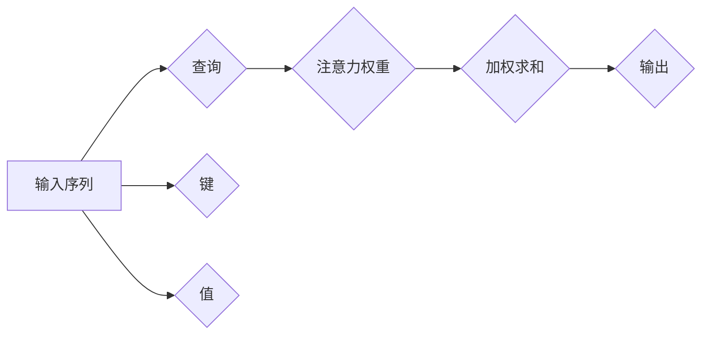

                 

## 注意力的深度学习：AI优化的专注力

> 关键词：深度学习、注意力机制、Transformer、自然语言处理、计算机视觉、强化学习、AI优化

## 1. 背景介绍

在深度学习领域，模型的性能提升一直是研究的焦点。随着模型规模的不断扩大，训练和推理的效率也面临着挑战。为了解决这些问题，注意力机制应运而生，它赋予了模型“专注力”，能够在处理大量信息时，重点关注关键部分，从而提高效率和准确性。

注意力机制的出现，标志着深度学习迈向更智能、更高效的阶段。它不仅在自然语言处理领域取得了突破性进展，也逐渐应用于计算机视觉、语音识别等其他领域，推动了人工智能的整体发展。

## 2. 核心概念与联系

### 2.1 注意力机制的本质

注意力机制的核心思想是模拟人类的注意力机制，让模型能够在处理信息时，根据其重要性分配不同的关注度。

想象一下，当你阅读一篇文章时，你不会把每个单词都平等地对待，而是会根据上下文和语义，将重点放在关键信息上。注意力机制正是通过类似的方式，让模型能够识别和关注输入序列中最重要的部分。

### 2.2 注意力机制的架构

注意力机制通常由三个主要部分组成：

* **查询 (Query):** 用于表示模型想要关注的信息。
* **键 (Key):** 用于表示输入序列中每个元素的信息。
* **值 (Value):** 用于表示输入序列中每个元素的实际内容。

通过计算查询与键之间的相似度，模型可以确定哪些键更与查询相关，从而分配不同的注意力权重。

**Mermaid 流程图**



### 2.3 注意力机制的应用场景

注意力机制在深度学习领域有着广泛的应用场景，包括：

* **自然语言处理 (NLP):** 机器翻译、文本摘要、问答系统、情感分析等。
* **计算机视觉 (CV):** 图像分类、目标检测、图像 Captioning 等。
* **语音识别:** 语音转文本、语音合成等。
* **强化学习:** 策略优化、环境建模等。

## 3. 核心算法原理 & 具体操作步骤

### 3.1 算法原理概述

注意力机制的核心算法是计算查询与键之间的相似度，并根据相似度分配注意力权重。常用的相似度计算方法包括点积、余弦相似度等。

注意力权重可以看作是模型对每个键的关注程度，权重越高，模型对该键的关注程度就越强。

### 3.2 算法步骤详解

1. **输入序列:** 将输入序列表示为一系列向量。
2. **查询、键、值计算:** 对输入序列中的每个元素计算查询、键和值向量。
3. **相似度计算:** 计算查询向量与每个键向量的相似度。
4. **注意力权重计算:** 根据相似度计算注意力权重，权重通常通过softmax函数归一化。
5. **加权求和:** 将值向量与注意力权重进行加权求和，得到最终的输出。

### 3.3 算法优缺点

**优点:**

* **提高模型性能:** 注意力机制能够帮助模型关注关键信息，从而提高模型的准确性和效率。
* **解释性强:** 注意力权重可以直观地反映模型对输入的关注程度，有助于理解模型的决策过程。
* **可扩展性强:** 注意力机制可以应用于各种类型的深度学习模型，并可以与其他技术结合使用。

**缺点:**

* **计算复杂度高:** 计算注意力权重需要进行大量的矩阵运算，计算复杂度较高。
* **参数量大:** 注意力机制需要学习大量的参数，模型规模较大。
* **训练难度高:** 注意力机制的训练需要特殊的优化算法和技巧。

### 3.4 算法应用领域

注意力机制在深度学习领域有着广泛的应用场景，包括：

* **自然语言处理 (NLP):** 机器翻译、文本摘要、问答系统、情感分析等。
* **计算机视觉 (CV):** 图像分类、目标检测、图像 Captioning 等。
* **语音识别:** 语音转文本、语音合成等。
* **强化学习:** 策略优化、环境建模等。

## 4. 数学模型和公式 & 详细讲解 & 举例说明

### 4.1 数学模型构建

注意力机制的数学模型可以概括为以下公式：

$$
\text{Attention}(Q, K, V) = \text{softmax}\left(\frac{Q K^T}{\sqrt{d_k}}\right) V
$$

其中：

* $Q$：查询向量
* $K$：键向量
* $V$：值向量
* $d_k$：键向量的维度
* $\text{softmax}$：softmax函数，用于将相似度转换为概率分布

### 4.2 公式推导过程

1. **计算查询与键之间的相似度:**

$$
\text{Similarity}(Q, K) = \frac{Q K^T}{\sqrt{d_k}}
$$

该公式计算查询向量与每个键向量的点积，并除以键向量的维度开根号，以归一化相似度。

2. **应用softmax函数:**

$$
\text{Attention Weights} = \text{softmax}(\text{Similarity}(Q, K))
$$

softmax函数将相似度转换为概率分布，每个键的权重代表模型对该键的关注程度。

3. **加权求和:**

$$
\text{Output} = \text{Attention Weights} \cdot V
$$

将值向量与注意力权重进行加权求和，得到最终的输出。

### 4.3 案例分析与讲解

假设我们有一个句子“我爱学习编程”，我们想要使用注意力机制来理解每个单词的重要性。

* **查询向量:** 可以表示为“理解编程”的含义。
* **键向量:** 可以表示每个单词的语义信息。
* **值向量:** 可以表示每个单词的词向量表示。

通过计算查询向量与每个键向量的相似度，我们可以得到每个单词的注意力权重。例如，“学习”和“编程”的权重可能较高，因为它们与“理解编程”的含义更相关。

## 5. 项目实践：代码实例和详细解释说明

### 5.1 开发环境搭建

* Python 3.6+
* TensorFlow 或 PyTorch

### 5.2 源代码详细实现

```python
import tensorflow as tf

# 定义注意力机制层
class AttentionLayer(tf.keras.layers.Layer):
    def __init__(self, units):
        super(AttentionLayer, self).__init__()
        self.Wq = tf.keras.layers.Dense(units)
        self.Wk = tf.keras.layers.Dense(units)
        self.Wv = tf.keras.layers.Dense(units)
        self.softmax = tf.keras.layers.Softmax()

    def call(self, inputs):
        Q = self.Wq(inputs)
        K = self.Wk(inputs)
        V = self.Wv(inputs)
        attention_weights = self.softmax(tf.matmul(Q, K, transpose_b=True) / tf.math.sqrt(tf.cast(units, tf.float32)))
        output = tf.matmul(attention_weights, V)
        return output

# 使用注意力机制层
model = tf.keras.Sequential([
    tf.keras.layers.Embedding(input_dim=10000, output_dim=128),
    AttentionLayer(units=64),
    tf.keras.layers.Dense(units=10, activation='softmax')
])

# 训练模型
model.compile(optimizer='adam', loss='sparse_categorical_crossentropy', metrics=['accuracy'])
model.fit(x_train, y_train, epochs=10)
```

### 5.3 代码解读与分析

* **AttentionLayer类:** 定义了一个注意力机制层，包含三个稠密层用于计算查询、键和值向量，以及一个softmax层用于计算注意力权重。
* **call方法:** 该方法定义了注意力机制层的计算过程，包括计算相似度、应用softmax函数和加权求和。
* **模型构建:** 使用注意力机制层构建了一个简单的文本分类模型。
* **模型训练:** 使用Adam优化器和交叉熵损失函数训练模型。

### 5.4 运行结果展示

训练完成后，可以评估模型的性能，例如准确率等。

## 6. 实际应用场景

### 6.1 自然语言处理

* **机器翻译:** 注意力机制可以帮助模型更好地理解源语言和目标语言之间的语义关系，从而提高翻译质量。
* **文本摘要:** 注意力机制可以帮助模型识别文本中最关键的信息，并生成简洁的摘要。
* **问答系统:** 注意力机制可以帮助模型理解问题和上下文，并找到最相关的答案。

### 6.2 计算机视觉

* **图像分类:** 注意力机制可以帮助模型关注图像中最关键的区域，从而提高分类准确率。
* **目标检测:** 注意力机制可以帮助模型定位图像中的目标，并识别目标类别。
* **图像 Captioning:** 注意力机制可以帮助模型生成图像的描述性文本。

### 6.3 语音识别

* **语音转文本:** 注意力机制可以帮助模型识别语音中的关键音素，从而提高转文本的准确率。
* **语音合成:** 注意力机制可以帮助模型生成更自然流畅的语音。

### 6.4 未来应用展望

注意力机制的应用场景还在不断扩展，未来可能会应用于更多领域，例如：

* **医疗诊断:** 注意力机制可以帮助模型识别医学图像中的异常区域，辅助医生进行诊断。
* **金融风险管理:** 注意力机制可以帮助模型识别金融数据中的风险信号，降低金融风险。
* **自动驾驶:** 注意力机制可以帮助模型关注道路上的关键信息，提高自动驾驶的安全性。

## 7. 工具和资源推荐

### 7.1 学习资源推荐

* **书籍:**
    * 《深度学习》 - Ian Goodfellow, Yoshua Bengio, Aaron Courville
    * 《Attention Is All You Need》 - Vaswani et al.
* **在线课程:**
    * Coursera: Deep Learning Specialization
    * Udacity: Deep Learning Nanodegree
* **博客:**
    * Jay Alammar's Blog: https://jalammar.github.io/
    * Distill.pub: https://distill.pub/

### 7.2 开发工具推荐

* **TensorFlow:** https://www.tensorflow.org/
* **PyTorch:** https://pytorch.org/
* **Keras:** https://keras.io/

### 7.3 相关论文推荐

* **Attention Is All You Need:** https://arxiv.org/abs/1706.03762
* **BERT: Pre-training of Deep Bidirectional Transformers for Language Understanding:** https://arxiv.org/abs/1810.04805
* **GPT-3: Language Models are Few-Shot Learners:** https://arxiv.org/abs/2005.14165

## 8. 总结：未来发展趋势与挑战

### 8.1 研究成果总结

注意力机制的出现，标志着深度学习迈向更智能、更高效的阶段。它不仅在自然语言处理领域取得了突破性进展，也逐渐应用于计算机视觉、语音识别等其他领域，推动了人工智能的整体发展。

### 8.2 未来发展趋势

* **更强大的注意力机制:** 研究人员将继续探索更强大的注意力机制，例如长距离依赖的注意力机制、自注意力机制等。
* **注意力机制的融合:** 将注意力机制与其他深度学习技术融合，例如生成对抗网络 (GAN)、强化学习等，以提高模型的性能。
* **注意力机制的解释性:** 研究如何更好地解释注意力机制的决策过程，提高模型的可解释性。

### 8.3 面临的挑战

* **计算复杂度:** 计算注意力权重需要大量的矩阵运算，计算复杂度较高，需要更高效的算法和硬件支持。
* **参数量:** 注意力机制需要学习大量的参数，模型规模较大，需要更大的数据集和更强大的计算资源进行训练。
* **训练难度:** 注意力机制的训练需要特殊的优化算法和技巧，训练过程较为复杂。

### 8.4 研究展望

未来，注意力机制将继续在深度学习领域发挥重要作用，并推动人工智能技术的进一步发展。


## 9. 附录：常见问题与解答

### 9.1 什么是自注意力机制？

自注意力机制是一种特殊的注意力机制，它允许模型关注输入序列中的任意两个元素之间的关系，而不是仅仅关注查询与键之间的关系。

### 9.2 注意力机制与RNN的区别？

RNN (循环神经网络) 是一种序列数据处理的传统方法，它通过隐藏状态来记忆过去的输入信息。而注意力机制则通过计算查询与键之间的相似度，动态地分配关注度，从而更好地处理长序列数据。

### 9.3 注意力机制的应用场景有哪些？

注意力机制的应用场景非常广泛，包括自然语言处理、计算机视觉、语音识别、强化学习等。

### 9.4 如何选择合适的注意力机制？

选择合适的注意力机制取决于具体的应用场景和数据特点。常见的注意力机制包括点积注意力、多头注意力、自注意力等。

### 9.5 如何理解注意力权重？

注意力权重代表模型对每个输入元素的关注程度。权重越高，模型对该元素的关注程度就越强。


作者：禅与计算机程序设计艺术 / Zen and the Art of Computer Programming 
<end_of_turn>

