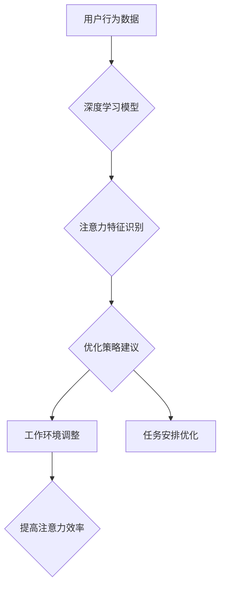

                 

## 注意力的生物节律：AI优化的认知周期

> 关键词：注意力、认知周期、生物节律、AI优化、深度学习、时间管理、效率提升

## 1. 背景介绍

在当今信息爆炸的时代，人类的注意力面临着前所未有的挑战。我们被来自各个方向的信息轰炸，难以集中精力完成任务，效率不断下降。同时，人工智能技术飞速发展，深度学习模型在各个领域取得了突破性进展。如何将人工智能技术应用于提升人类注意力，优化认知周期，成为一个重要的研究方向。

生物学研究表明，人类的注意力并非持续稳定的状态，而是呈现出周期性的波动，与我们的生物节律密切相关。我们的大脑在一天中会经历不同的清醒和疲劳阶段，注意力水平也会随之起伏。了解这些生物节律规律，并结合人工智能技术，可以帮助我们更好地管理时间，提高工作效率。

## 2. 核心概念与联系

### 2.1 注意力与认知周期

注意力是认知的核心功能之一，它指我们对特定信息或任务的集中和选择性关注。认知周期是指我们完成一个任务所需的时间段，包括注意力集中、信息处理、决策和行动等阶段。

### 2.2 生物节律与注意力

生物节律是指生物体在一定周期内呈现出的周期性变化，例如睡眠-觉醒周期、体温变化等。我们的注意力水平也受到生物节律的影响，在某些时间段注意力更集中，在某些时间段则更容易分心。

### 2.3 人工智能与注意力优化

人工智能技术可以帮助我们更好地理解和预测注意力水平的波动，并提供相应的优化策略。例如，深度学习模型可以分析用户的行为数据，识别出注意力集中和分心的特征，并根据这些特征调整工作环境、任务安排等，帮助用户提高注意力效率。

**Mermaid 流程图**



## 3. 核心算法原理 & 具体操作步骤

### 3.1 算法原理概述

注意力优化算法的核心是利用深度学习模型分析用户的行为数据，识别出注意力集中和分心的特征，并根据这些特征提供相应的优化策略建议。常用的算法包括：

* **循环神经网络 (RNN)**：RNN能够处理序列数据，例如用户的行为轨迹，并学习出注意力水平随时间的变化规律。
* **长短期记忆网络 (LSTM)**：LSTM是一种改进的RNN，能够更好地处理长序列数据，更准确地预测注意力水平的波动。
* **注意力机制**：注意力机制可以帮助模型关注输入数据中与当前任务最相关的部分，提高注意力效率。

### 3.2 算法步骤详解

1. **数据收集**: 收集用户的行为数据，例如浏览记录、鼠标移动轨迹、键盘输入等。
2. **数据预处理**: 对收集到的数据进行清洗、转换和特征提取，例如将浏览记录转化为时间序列数据，提取鼠标移动轨迹的特征等。
3. **模型训练**: 使用深度学习模型训练，例如RNN、LSTM或注意力机制，将预处理后的数据作为输入，学习出注意力水平随时间的变化规律。
4. **模型评估**: 使用测试数据评估模型的性能，例如预测注意力水平的准确率、优化策略的有效性等。
5. **策略建议**: 根据训练好的模型，对用户的行为数据进行分析，识别出注意力集中和分心的特征，并提供相应的优化策略建议，例如调整工作环境、提醒用户休息、调整任务安排等。

### 3.3 算法优缺点

**优点**:

* 能够准确预测注意力水平的波动。
* 提供个性化的优化策略建议。
* 提升工作效率和注意力集中度。

**缺点**:

* 需要大量用户行为数据进行训练。
* 模型训练复杂，需要专业的技术人员。
* 存在隐私安全问题，需要妥善处理用户数据。

### 3.4 算法应用领域

* **教育**: 帮助学生更好地集中注意力，提高学习效率。
* **办公**: 帮助员工更好地管理时间，提高工作效率。
* **游戏**: 帮助玩家更好地沉浸在游戏世界中，提高游戏体验。
* **医疗**: 帮助患者更好地集中注意力，进行康复训练。

## 4. 数学模型和公式 & 详细讲解 & 举例说明

### 4.1 数学模型构建

注意力优化算法可以构建一个数学模型来描述注意力水平随时间的变化规律。例如，可以使用以下公式来表示注意力水平 $A(t)$ 在时间 $t$ 的值：

$$A(t) = f(B(t), C(t))$$

其中：

* $B(t)$ 是用户在时间 $t$ 的行为数据。
* $C(t)$ 是用户在时间 $t$ 的环境因素。
* $f$ 是一个非线性函数，用于描述注意力水平随行为数据和环境因素的变化规律。

### 4.2 公式推导过程

为了推导 $f$ 函数，可以使用深度学习模型进行训练。模型的输入是用户行为数据和环境因素，输出是注意力水平。通过训练模型，可以学习出 $f$ 函数的具体形式。

例如，可以使用循环神经网络 (RNN) 来构建注意力模型。RNN 可以学习出用户行为数据序列中注意力水平的动态变化规律。

### 4.3 案例分析与讲解

假设我们有一个用户，他的行为数据包括浏览记录、鼠标移动轨迹、键盘输入等。我们可以将这些数据作为 RNN 的输入，训练一个注意力模型。

训练完成后，我们可以使用模型预测该用户的注意力水平随时间的变化规律。例如，模型可能会预测在上午 10 点到下午 2 点之间，该用户的注意力水平较高，而在下午 4 点到晚上 8 点之间，该用户的注意力水平较低。

## 5. 项目实践：代码实例和详细解释说明

### 5.1 开发环境搭建

* Python 3.x
* TensorFlow 或 PyTorch 深度学习框架
* Jupyter Notebook 或 VS Code 代码编辑器

### 5.2 源代码详细实现

```python
# 使用 TensorFlow 构建注意力模型

import tensorflow as tf

# 定义模型结构
model = tf.keras.Sequential([
    tf.keras.layers.LSTM(128, return_sequences=True),
    tf.keras.layers.LSTM(64),
    tf.keras.layers.Dense(1)
])

# 编译模型
model.compile(optimizer='adam', loss='mse')

# 训练模型
model.fit(X_train, y_train, epochs=10)

# 预测注意力水平
predictions = model.predict(X_test)
```

### 5.3 代码解读与分析

* 首先，我们使用 TensorFlow 构建了一个循环神经网络 (RNN) 模型。
* 模型包含两个 LSTM 层和一个 Dense 层。
* LSTM 层用于处理用户行为数据序列，学习出注意力水平的动态变化规律。
* Dense 层用于输出注意力水平的预测值。
* 我们使用 Adam 优化器和均方误差 (MSE) 损失函数来训练模型。
* 训练完成后，我们可以使用模型预测用户的注意力水平。

### 5.4 运行结果展示

训练好的模型可以用于预测用户的注意力水平，并根据预测结果提供相应的优化策略建议。例如，如果模型预测用户的注意力水平较低，可以建议用户休息一下，或者调整工作环境。

## 6. 实际应用场景

### 6.1 教育领域

* **个性化学习**: 根据学生的注意力水平波动，调整学习内容和节奏，提高学习效率。
* **在线考试**: 识别学生注意力不集中时，提供提醒或调整考试难度，确保考试公平公正。

### 6.2 办公领域

* **时间管理**: 根据员工注意力水平波动，安排工作任务，提高工作效率。
* **会议效率**: 识别会议中注意力不集中的人员，提供提醒或调整会议内容，提高会议效率。

### 6.3 游戏领域

* **游戏体验**: 根据玩家注意力水平波动，调整游戏难度和节奏，提高游戏体验。
* **沉浸式游戏**: 利用注意力机制，增强玩家对游戏世界的沉浸感。

### 6.4 未来应用展望

随着人工智能技术的不断发展，注意力优化算法将有更广泛的应用场景。例如，可以应用于医疗领域，帮助患者更好地集中注意力进行康复训练；可以应用于交通领域，帮助驾驶员保持注意力，提高交通安全。

## 7. 工具和资源推荐

### 7.1 学习资源推荐

* **书籍**:
    * 《深度学习》 by Ian Goodfellow, Yoshua Bengio, Aaron Courville
    * 《自然语言处理入门》 by Jacob Eisenstein
* **在线课程**:
    * Coursera: 深度学习 Specialization
    * Udacity: 自然语言处理 Nanodegree

### 7.2 开发工具推荐

* **Python**: 
    * TensorFlow
    * PyTorch
* **IDE**:
    * Jupyter Notebook
    * VS Code

### 7.3 相关论文推荐

* **Attention Is All You Need**: https://arxiv.org/abs/1706.03762
* **BERT: Pre-training of Deep Bidirectional Transformers for Language Understanding**: https://arxiv.org/abs/1810.04805

## 8. 总结：未来发展趋势与挑战

### 8.1 研究成果总结

注意力优化算法在提升人类注意力和认知效率方面取得了显著成果。通过深度学习模型分析用户行为数据，可以准确预测注意力水平的波动，并提供个性化的优化策略建议。

### 8.2 未来发展趋势

* **更精准的注意力预测**: 利用更先进的深度学习算法和生物学知识，提高注意力水平预测的准确率。
* **更个性化的优化策略**: 根据用户的不同需求和习惯，提供更个性化的优化策略建议。
* **跨模态注意力优化**: 将注意力机制应用于多模态数据，例如文本、图像、音频等，实现更全面的注意力优化。

### 8.3 面临的挑战

* **数据隐私安全**: 用户行为数据涉及个人隐私，需要妥善处理和保护。
* **模型解释性**: 深度学习模型的决策过程往往难以解释，需要提高模型的透明度和可解释性。
* **技术可普及性**: 

注意力优化算法的应用需要一定的技术门槛，需要降低技术门槛，使其更易于普及。

### 8.4 研究展望

未来，注意力优化算法将继续朝着更精准、更个性化、更跨模态的方向发展。随着人工智能技术的不断进步，注意力优化算法将为人类提供更有效的认知工具，帮助我们更好地应对信息爆炸时代带来的挑战。

## 9. 附录：常见问题与解答

**Q1: 注意力优化算法是否会让人变得过度依赖技术？**

**A1:** 注意力优化算法应该被视为一种辅助工具，而不是替代人类思考和决策的工具。使用注意力优化算法时，需要保持理性判断，避免过度依赖技术。

**Q2: 注意力优化算法是否适用于所有人？**

**A2:** 注意力优化算法的适用人群取决于个人的需求和习惯。对于注意力不集中的人群，注意力优化算法可以提供帮助，但对于注意力集中的人群，可能没有明显效果。

**Q3: 注意力优化算法的安全性如何保证？**

**A3:** 注意力优化算法的安全性需要从多个方面考虑，例如数据隐私保护、模型安全性和算法伦理等。需要制定相应的安全措施和规范，确保算法的安全性。


作者：禅与计算机程序设计艺术 / Zen and the Art of Computer Programming 
<end_of_turn>

