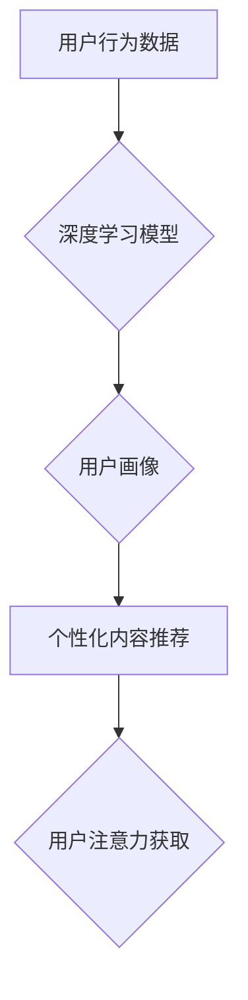

                 

##  注意力经济与个性化营销策略：为受众创建定制、有针对性的信息

> 关键词：注意力经济、个性化营销、深度学习、推荐系统、用户画像、A/B测试、数据分析、机器学习

### 1. 背景介绍

在当今信息爆炸的时代，人们每天面临着海量的信息涌入。如何有效地获取和处理这些信息成为了一个巨大的挑战。同时，企业也面临着如何突破信息噪音，精准触达目标受众的难题。在这种背景下，“注意力经济”应运而生。

注意力经济的核心概念是，注意力是稀缺的资源，而获取和保持用户的注意力是企业竞争的关键。用户对信息的接受和选择能力有限，企业需要通过提供更有价值、更个性化的内容来吸引和留住用户的注意力。

个性化营销正是基于注意力经济的理念，通过对用户的行为、偏好和需求进行深入分析，为每个用户提供定制化的信息和服务，从而提高用户体验和营销效果。

### 2. 核心概念与联系

#### 2.1 注意力经济

注意力经济是指在信息过载的时代，人们对信息的获取和处理能力有限，而注意力是稀缺的资源。企业需要通过提供更有价值、更个性化的内容来吸引和留住用户的注意力。

#### 2.2 个性化营销

个性化营销是指根据用户的行为、偏好和需求，为每个用户提供定制化的信息和服务，从而提高用户体验和营销效果。

#### 2.3 连接关系

注意力经济为个性化营销提供了理论基础。个性化营销通过深度学习、推荐系统等技术，分析用户的行为数据，构建用户画像，从而为用户提供更精准、更个性化的信息，最终吸引和留住用户的注意力。

**Mermaid 流程图**



### 3. 核心算法原理 & 具体操作步骤

#### 3.1 算法原理概述

个性化营销的核心算法原理主要包括：

* **用户画像构建:** 通过对用户的行为数据进行分析，例如浏览历史、购买记录、评论反馈等，构建用户的兴趣、偏好、需求等特征，形成用户画像。
* **推荐算法:** 基于用户画像，利用协同过滤、内容过滤、基于知识的推荐等算法，推荐用户可能感兴趣的内容或产品。
* **A/B测试:** 对不同的个性化策略进行测试，通过数据分析，选择效果最佳的策略。

#### 3.2 算法步骤详解

1. **数据收集:** 收集用户的行为数据，例如浏览记录、购买记录、评论反馈、社交行为等。
2. **数据预处理:** 对收集到的数据进行清洗、转换、格式化等处理，使其适合算法模型的训练。
3. **用户画像构建:** 利用机器学习算法，例如聚类算法、深度学习算法等，对用户数据进行分析，构建用户的兴趣、偏好、需求等特征，形成用户画像。
4. **推荐算法训练:** 利用训练数据，训练推荐算法模型，例如协同过滤模型、内容过滤模型、深度学习推荐模型等。
5. **个性化内容推荐:** 根据用户的画像特征，利用训练好的推荐算法模型，为用户推荐个性化的内容或产品。
6. **A/B测试:** 对不同的个性化策略进行测试，例如推荐算法、内容形式、推送时间等，通过数据分析，选择效果最佳的策略。
7. **效果评估:** 定期评估个性化营销策略的效果，例如点击率、转化率、用户满意度等，并根据评估结果进行策略调整。

#### 3.3 算法优缺点

**优点:**

* **精准触达:** 通过用户画像，精准定位目标受众，提高营销效果。
* **提升用户体验:** 为用户提供个性化的内容和服务，提升用户体验。
* **数据驱动:** 基于数据分析，不断优化营销策略，提高营销效率。

**缺点:**

* **数据依赖:** 个性化营销需要大量用户数据，数据质量直接影响营销效果。
* **算法复杂:** 个性化推荐算法较为复杂，需要专业的技术人员进行开发和维护。
* **隐私安全:** 用户数据收集和使用需要考虑隐私安全问题。

#### 3.4 算法应用领域

个性化营销算法广泛应用于以下领域:

* **电商:** 商品推荐、个性化促销、用户画像分析
* **社交媒体:** 内容推荐、广告投放、用户关系分析
* **新闻媒体:** 内容推荐、个性化新闻订阅、用户兴趣分析
* **教育:** 个性化学习推荐、学生行为分析、教学内容优化

### 4. 数学模型和公式 & 详细讲解 & 举例说明

#### 4.1 数学模型构建

个性化推荐系统通常采用基于用户的协同过滤算法，其核心思想是：

* 如果用户A和用户B对相似的物品都给予了高评分，那么用户A可能也喜欢用户B评分高的物品。

**用户-物品评分矩阵:**

用户-物品评分矩阵是一个二维矩阵，其中每一行代表一个用户，每一列代表一个物品，矩阵元素表示用户对物品的评分。

**举例说明:**

假设有3个用户(U1, U2, U3)和3个物品(I1, I2, I3)，用户-物品评分矩阵如下:

| 用户 | I1 | I2 | I3 |
|---|---|---|---|
| U1 | 5 | 3 | 4 |
| U2 | 4 | 5 | 2 |
| U3 | 3 | 4 | 5 |

#### 4.2 公式推导过程

协同过滤算法的核心是计算用户之间的相似度，常用的相似度度量方法包括余弦相似度、皮尔逊相关系数等。

**余弦相似度:**

$$
\text{相似度}(u_i, u_j) = \frac{u_i \cdot u_j}{||u_i|| ||u_j||}
$$

其中:

* $u_i$ 和 $u_j$ 是两个用户的评分向量。
* $u_i \cdot u_j$ 是两个用户评分向量的点积。
* $||u_i||$ 和 $||u_j||$ 是两个用户评分向量的模长。

#### 4.3 案例分析与讲解

假设用户U1想要推荐物品I4，我们可以计算用户U1与其他用户的相似度，然后根据相似度排序，选择与U1相似度最高的用户的评分信息，来预测用户U1对物品I4的评分。

### 5. 项目实践：代码实例和详细解释说明

#### 5.1 开发环境搭建

* Python 3.x
* Jupyter Notebook
* scikit-learn
* pandas
* numpy

#### 5.2 源代码详细实现

```python
import pandas as pd
from sklearn.metrics.pairwise import cosine_similarity

# 加载用户-物品评分数据
ratings_data = pd.read_csv('ratings.csv')

# 计算用户之间的余弦相似度
user_similarity = cosine_similarity(ratings_data.T)

# 获取用户U1与其他用户的相似度排序
similar_users = user_similarity[0].argsort()[::-1]

# 选择与U1相似度最高的K个用户
K = 5
top_k_users = similar_users[:K]

# 获取与U1相似用户对物品I4的评分
similar_users_ratings = ratings_data.iloc[top_k_users, ratings_data.columns.get_loc('I4')]

# 计算用户U1对物品I4的预测评分
predicted_rating = similar_users_ratings.mean()

print(f'用户U1对物品I4的预测评分: {predicted_rating}')
```

#### 5.3 代码解读与分析

* 代码首先加载用户-物品评分数据。
* 然后使用scikit-learn库中的cosine_similarity函数计算用户之间的余弦相似度。
* 通过对相似度进行排序，选择与目标用户U1相似度最高的K个用户。
* 最后，根据相似用户的评分信息，预测目标用户U1对物品I4的评分。

#### 5.4 运行结果展示

运行代码后，会输出用户U1对物品I4的预测评分。

### 6. 实际应用场景

#### 6.1 电商平台

* **商品推荐:** 根据用户的浏览历史、购买记录等数据，推荐用户可能感兴趣的商品。
* **个性化促销:** 为不同用户群体提供个性化的促销活动，提高转化率。
* **用户画像分析:** 分析用户的行为数据，构建用户画像，了解用户的兴趣、偏好和需求。

#### 6.2 社交媒体平台

* **内容推荐:** 根据用户的兴趣爱好、社交关系等数据，推荐用户可能感兴趣的内容。
* **广告投放:** 为不同用户群体投放个性化的广告，提高广告效果。
* **用户关系分析:** 分析用户的社交关系，挖掘潜在的合作机会。

#### 6.3 新闻媒体平台

* **内容推荐:** 根据用户的阅读习惯、新闻偏好等数据，推荐用户可能感兴趣的新闻。
* **个性化新闻订阅:** 为用户提供个性化的新闻订阅服务，满足用户的个性化需求。
* **用户兴趣分析:** 分析用户的阅读行为，了解用户的兴趣爱好和新闻偏好。

#### 6.4 未来应用展望

随着人工智能技术的不断发展，个性化营销将更加智能化、精准化。未来，个性化营销将应用于更多领域，例如医疗、教育、金融等，为用户提供更加个性化、定制化的服务。

### 7. 工具和资源推荐

#### 7.1 学习资源推荐

* **书籍:**
    * 《推荐系统实践》
    * 《深度学习》
    * 《机器学习》
* **在线课程:**
    * Coursera: 机器学习
    * edX: 深度学习
    * Udacity: 数据科学

#### 7.2 开发工具推荐

* **Python:** 
    * scikit-learn
    * pandas
    * numpy
    * TensorFlow
    * PyTorch
* **数据库:**
    * MySQL
    * PostgreSQL
    * MongoDB

#### 7.3 相关论文推荐

* **协同过滤:**
    * "Collaborative Filtering for Implicit Feedback Datasets"
    * "Matrix Factorization Techniques for Recommender Systems"
* **深度学习推荐:**
    * "Deep Learning Recommendations for Personalization"
    * "Neural Collaborative Filtering"

### 8. 总结：未来发展趋势与挑战

#### 8.1 研究成果总结

个性化营销技术在近年来取得了显著的进展，深度学习、推荐系统等技术为个性化营销提供了强大的工具。通过对用户数据的分析和挖掘，个性化营销能够精准触达目标受众，提升用户体验和营销效果。

#### 8.2 未来发展趋势

* **更精准的个性化:** 利用更先进的机器学习算法和数据分析技术，实现更精准的个性化推荐和营销。
* **多模态数据融合:** 将文本、图像、视频等多模态数据融合到个性化营销系统中，提供更丰富的用户体验。
* **隐私保护:** 在个性化营销过程中，更加注重用户隐私保护，确保用户数据安全。

#### 8.3 面临的挑战

* **数据质量:** 个性化营销依赖于高质量的用户数据，数据质量直接影响营销效果。
* **算法复杂度:** 个性化推荐算法较为复杂，需要专业的技术人员进行开发和维护。
* **用户隐私:** 用户数据收集和使用需要考虑隐私安全问题，需要制定相应的隐私保护机制。

#### 8.4 研究展望

未来，个性化营销将朝着更智能化、更精准化、更安全的方向发展。研究者将继续探索新的算法和技术，以更好地满足用户的个性化需求，同时也要关注用户隐私保护问题，确保个性化营销的健康发展。

### 9. 附录：常见问题与解答

#### 9.1 如何构建用户画像？

用户画像的构建需要收集用户的行为数据，例如浏览历史、购买记录、评论反馈等，然后利用机器学习算法进行分析，提取用户的兴趣、偏好、需求等特征。

#### 9.2 如何选择合适的推荐算法？

推荐算法的选择需要根据实际应用场景和数据特点进行选择。常用的推荐算法包括协同过滤、内容过滤、基于知识的推荐等。

#### 9.3 如何评估个性化营销效果？

个性化营销效果的评估可以从以下几个方面进行：

* 点击率
* 转化率
* 用户满意度
* 收入增长

#### 9.4 如何保护用户隐私？

在个性化营销过程中，需要采取以下措施保护用户隐私：

*  anonymize 用户数据
* 获得用户同意
* 限制数据使用范围
* 加强数据安全防护


作者：禅与计算机程序设计艺术 / Zen and the Art of Computer Programming 
<end_of_turn>

