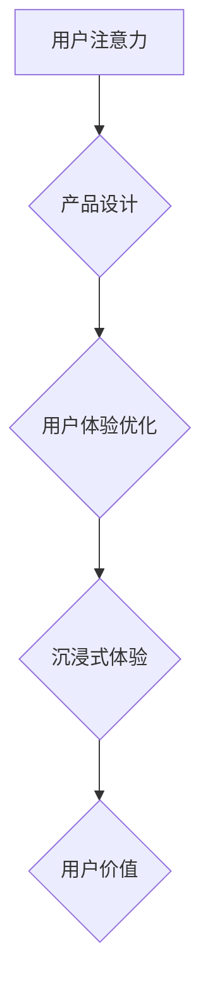

                 

## 1. 背景介绍

在当今信息爆炸的时代，用户面临着来自各个方向的纷繁信息，注意力已成为稀缺的资源。如何有效地抓住用户的注意力，并将其转化为持续的参与和价值，成为产品设计和开发的关键挑战。

注意力经济的概念源于心理学家和经济学家对人类认知和行为的研究。它指出，人类的注意力是有限的，并且在面对大量信息时，会倾向于选择最吸引人的内容进行处理。因此，产品需要通过设计精巧的用户体验，有效地吸引和引导用户的注意力，才能在竞争激烈的市场中脱颖而出。

## 2. 核心概念与联系

### 2.1 注意力经济

注意力经济的核心概念是将用户的注意力视为一种经济资源，并通过设计和策略来获取、管理和利用这种资源。

* **注意力资源有限:** 人类大脑的注意力资源有限，无法同时处理大量信息。
* **注意力成本:** 获取和保持用户的注意力需要付出成本，包括时间、精力和心理负担。
* **注意力价值:** 用户的注意力具有价值，因为它可以转化为消费、参与和忠诚度。

### 2.2 用户体验优化

用户体验优化 (UX Optimization) 是通过设计和改进产品，以提升用户使用产品的满意度、效率和愉悦感。

* **用户研究:** 深入了解用户的需求、行为和痛点。
* **信息架构:**  合理组织和结构化产品信息，方便用户查找和理解。
* **交互设计:** 设计直观、易用、符合用户习惯的交互方式。
* **视觉设计:**  打造美观、简洁、易于阅读的视觉风格。

### 2.3 沉浸式体验

沉浸式体验 (Immersive Experience) 指的是用户能够完全沉浸在产品中，并与产品产生强烈的互动和情感共鸣。

* **感官刺激:** 通过视觉、听觉、触觉等多种感官刺激，增强用户的沉浸感。
* **互动性:**  设计丰富的互动元素，让用户能够主动参与和影响产品体验。
* **故事性:**  通过叙事和角色扮演，构建一个引人入胜的故事，吸引用户的注意力和情感。

**Mermaid 流程图**



## 3. 核心算法原理 & 具体操作步骤

### 3.1 算法原理概述

注意力机制 (Attention Mechanism) 是一种模仿人类注意力机制的机器学习算法，它能够学习到输入数据中哪些部分对目标任务更重要，并将其重点关注。

注意力机制的核心思想是通过一个加权机制，将输入数据中的不同部分赋予不同的权重，从而突出重要信息，抑制无关信息。

### 3.2 算法步骤详解

1. **计算注意力权重:**  使用一个注意力函数，计算输入数据中每个元素对目标任务的注意力权重。
2. **加权求和:**  将注意力权重与输入数据相乘，并求和，得到一个加权后的输出向量。
3. **输出结果:**  使用加权后的输出向量作为后续任务的输入，例如文本分类、机器翻译等。

### 3.3 算法优缺点

**优点:**

* **提高模型性能:**  注意力机制能够有效地学习到输入数据中重要信息，从而提高模型的准确性和效率。
* **解释性强:**  注意力权重可以直观地反映模型对输入数据的关注程度，从而帮助我们理解模型的决策过程。
* **适用于长序列数据:**  注意力机制能够有效地处理长序列数据，例如文本和音频。

**缺点:**

* **计算复杂度高:**  注意力机制的计算复杂度较高，尤其是在处理长序列数据时。
* **参数量大:**  注意力机制需要学习大量的参数，这可能会导致模型过拟合。

### 3.4 算法应用领域

注意力机制在机器学习领域有着广泛的应用，例如：

* **自然语言处理:** 文本分类、机器翻译、文本摘要、问答系统等。
* **计算机视觉:** 图像识别、目标检测、图像分割等。
* **语音识别:** 语音转文本、语音合成等。

## 4. 数学模型和公式 & 详细讲解 & 举例说明

### 4.1 数学模型构建

注意力机制的数学模型通常由以下几个部分组成:

* **查询 (Query):**  表示模型想要关注的信息。
* **键 (Key):**  表示输入数据中每个元素的信息。
* **值 (Value):**  表示输入数据中每个元素的具体内容。
* **注意力函数:**  计算查询与键之间的相似度，并生成注意力权重。

### 4.2 公式推导过程

假设输入数据为一个序列 $x = (x_1, x_2, ..., x_n)$，其中 $x_i$ 表示序列中的第 $i$ 个元素。

**注意力权重计算公式:**

$$
a_{ij} = \frac{exp(score(q_i, k_j))}{\sum_{k=1}^{n} exp(score(q_i, k_k))}
$$

其中:

* $q_i$ 表示查询向量。
* $k_j$ 表示键向量。
* $score(q_i, k_j)$ 表示查询向量 $q_i$ 与键向量 $k_j$ 之间的相似度，通常使用点积或其他相似度度量函数计算。

**加权求和公式:**

$$
c_i = \sum_{j=1}^{n} a_{ij} v_j
$$

其中:

* $c_i$ 表示加权后的输出向量。
* $v_j$ 表示值向量。

### 4.3 案例分析与讲解

**文本摘要:**

在文本摘要任务中，注意力机制可以帮助模型学习到文本中最重要的句子，并将其作为摘要的内容。

**机器翻译:**

在机器翻译任务中，注意力机制可以帮助模型关注源语言句子中与目标语言句子相对应的词语，从而提高翻译的准确性。

## 5. 项目实践：代码实例和详细解释说明

### 5.1 开发环境搭建

* Python 3.x
* TensorFlow 或 PyTorch

### 5.2 源代码详细实现

```python
import tensorflow as tf

# 定义注意力机制
def attention_layer(inputs, attention_weights):
  context_vector = tf.matmul(attention_weights, inputs)
  return context_vector

# 定义模型
class AttentionModel(tf.keras.Model):
  def __init__(self, vocab_size, embedding_dim, hidden_dim):
    super(AttentionModel, self).__init__()
    self.embedding = tf.keras.layers.Embedding(vocab_size, embedding_dim)
    self.lstm = tf.keras.layers.LSTM(hidden_dim)
    self.attention = attention_layer

  def call(self, inputs):
    embedded = self.embedding(inputs)
    lstm_output = self.lstm(embedded)
    attention_weights = self.attention(lstm_output, lstm_output)
    context_vector = tf.reduce_sum(attention_weights * lstm_output, axis=1)
    return context_vector

# 实例化模型
model = AttentionModel(vocab_size=10000, embedding_dim=128, hidden_dim=256)

# 训练模型
model.compile(optimizer='adam', loss='mse')
model.fit(x_train, y_train, epochs=10)
```

### 5.3 代码解读与分析

* **注意力层:**  `attention_layer` 函数计算注意力权重并生成加权后的输出向量。
* **模型类:**  `AttentionModel` 类定义了注意力机制的模型结构，包括嵌入层、LSTM层和注意力层。
* **模型训练:**  使用 Adam 优化器和均方误差损失函数训练模型。

### 5.4 运行结果展示

训练完成后，可以使用模型对新的输入数据进行预测。

## 6. 实际应用场景

### 6.1  新闻推荐系统

注意力机制可以帮助新闻推荐系统学习到用户对不同新闻类型的偏好，并推荐更符合用户兴趣的新闻。

### 6.2  个性化广告

注意力机制可以帮助个性化广告系统学习到用户的兴趣和行为模式，并展示更相关的广告。

### 6.3  智能客服

注意力机制可以帮助智能客服系统理解用户的自然语言问题，并提供更准确和有效的回复。

### 6.4  未来应用展望

注意力机制在未来将有更广泛的应用，例如：

* **医疗诊断:**  帮助医生分析患者的病历和检查结果，提高诊断的准确性。
* **金融风险管理:**  帮助金融机构识别潜在的风险，并采取相应的措施。
* **自动驾驶:**  帮助自动驾驶系统理解周围环境，并做出更安全的决策。

## 7. 工具和资源推荐

### 7.1 学习资源推荐

* **书籍:**
    * "深度学习" by Ian Goodfellow, Yoshua Bengio, and Aaron Courville
    * "Attention Is All You Need" by Vaswani et al.
* **在线课程:**
    * Coursera: "Deep Learning Specialization" by Andrew Ng
    * Udacity: "Deep Learning Nanodegree"

### 7.2 开发工具推荐

* **TensorFlow:**  开源机器学习框架。
* **PyTorch:**  开源机器学习框架。
* **Keras:**  高层机器学习 API，可以用于 TensorFlow 和 Theano。

### 7.3 相关论文推荐

* "Attention Is All You Need" by Vaswani et al.
* "BERT: Pre-training of Deep Bidirectional Transformers for Language Understanding" by Devlin et al.
* "Transformer-XL: Attentive Language Models Beyond a Fixed-Length Context" by Dai et al.

## 8. 总结：未来发展趋势与挑战

### 8.1 研究成果总结

注意力机制在机器学习领域取得了显著的成果，显著提高了模型的性能，并为理解和模拟人类注意力机制提供了新的思路。

### 8.2 未来发展趋势

* **更有效的注意力机制:**  研究更有效的注意力机制，例如自注意力机制、多头注意力机制等，提高模型的效率和性能。
* **注意力机制的应用扩展:**  将注意力机制应用到更多领域，例如计算机视觉、语音识别、自然语言理解等。
* **注意力机制的解释性:**  提高注意力机制的解释性，帮助我们更好地理解模型的决策过程。

### 8.3 面临的挑战

* **计算复杂度:**  注意力机制的计算复杂度较高，尤其是在处理长序列数据时。
* **参数量:**  注意力机制需要学习大量的参数，这可能会导致模型过拟合。
* **数据依赖性:**  注意力机制的性能依赖于训练数据的质量。

### 8.4 研究展望

未来，注意力机制的研究将继续深入，探索更有效的算法、更广泛的应用场景和更强的解释性。


## 9. 附录：常见问题与解答

* **什么是注意力机制？**

注意力机制是一种模仿人类注意力机制的机器学习算法，它能够学习到输入数据中哪些部分对目标任务更重要，并将其重点关注。

* **注意力机制的应用场景有哪些？**

注意力机制在机器学习领域有着广泛的应用，例如文本分类、机器翻译、文本摘要、问答系统、图像识别、目标检测、图像分割等。

* **注意力机制的优缺点是什么？**

注意力机制的优点是能够提高模型性能、解释性强、适用于长序列数据。缺点是计算复杂度高、参数量大。

* **如何实现注意力机制？**

注意力机制的实现通常包括以下几个步骤:

1. 计算注意力权重。
2. 加权求和。
3. 输出结果。

作者：禅与计算机程序设计艺术 / Zen and the Art of Computer Programming 


<end_of_turn>

