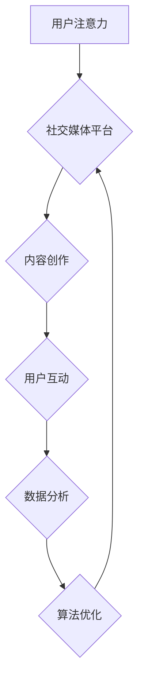

                 

##  注意力经济与社交媒体营销最佳实践：在不牺牲用户体验的情况下吸引受众

> 关键词：注意力经济、社交媒体营销、用户体验、内容策略、算法优化、数据分析、个性化推荐、互动式内容、品牌建设

### 1. 背景介绍

在当今数字时代，信息爆炸和竞争日益激烈，人们的注意力成为最宝贵的资源。这便是“注意力经济”的核心概念。社交媒体平台作为信息传播的中心，在“注意力经济”中扮演着至关重要的角色。用户每天在社交媒体上花费大量时间，平台也因此成为了品牌吸引受众、传播信息和实现营销目标的重要阵地。然而，用户对信息过载的抗拒情绪日益增强，单纯依靠广告投放和内容轰炸已经难以有效吸引和留住用户注意力。因此，如何在不牺牲用户体验的情况下，利用社交媒体平台的特性，有效地吸引和留住用户注意力，成为了社交媒体营销的重大挑战。

### 2. 核心概念与联系

#### 2.1 注意力经济

注意力经济是指在信息过载的时代，人们的注意力成为最稀缺的资源，而能够有效获取和利用用户注意力的平台和内容能够获得巨大的价值。

#### 2.2 社交媒体营销

社交媒体营销是指利用社交媒体平台，通过内容创作、互动交流、广告投放等方式，与目标用户建立联系，提升品牌知名度，促进产品销售的一种营销策略。

#### 2.3 用户体验

用户体验是指用户使用产品或服务时所感受到的整体感受，包括易用性、可用性、美观度、效率等方面。良好的用户体验能够提升用户满意度，增强用户粘性，最终促进品牌发展。

**Mermaid 流程图**



### 3. 核心算法原理 & 具体操作步骤

#### 3.1 算法原理概述

社交媒体平台利用各种算法来推荐内容，引导用户注意力，并实现个性化服务。这些算法通常基于以下几个核心原理：

* **协同过滤:** 根据用户的历史行为和相似用户喜好，推荐相关内容。
* **内容基准:** 基于内容的主题、标签、关键词等特征，推荐相关内容。
* **深度学习:** 利用神经网络模型，分析用户行为和内容特征，进行更精准的推荐。

#### 3.2 算法步骤详解

1. **数据收集:** 收集用户行为数据，包括浏览记录、点赞、评论、分享等，以及内容特征数据，如主题、标签、关键词等。
2. **数据预处理:** 对收集到的数据进行清洗、转换和特征提取，以便算法模型的训练和使用。
3. **模型训练:** 利用机器学习算法，训练推荐模型，学习用户行为和内容特征之间的关系。
4. **内容推荐:** 根据用户的历史行为和当前上下文信息，利用训练好的模型，推荐相关内容。
5. **反馈机制:** 收集用户对推荐内容的反馈，如点击、观看、点赞等，并将其反馈到模型训练中，不断优化推荐效果。

#### 3.3 算法优缺点

**优点:**

* **个性化推荐:** 能够根据用户的兴趣和偏好，推荐更精准的内容。
* **提升用户粘性:** 通过推荐用户感兴趣的内容，能够提高用户在平台上的停留时间和互动频率。
* **提高广告效果:** 通过精准的广告投放，能够提高广告的点击率和转化率。

**缺点:**

* **信息茧房效应:** 算法可能会将用户困在自己的兴趣圈内，导致信息单一化和认知偏差。
* **数据隐私问题:** 算法需要收集大量的用户数据，可能会引发数据隐私和安全问题。
* **算法偏差:** 算法模型可能会存在偏差，导致推荐结果不公平或不准确。

#### 3.4 算法应用领域

* **社交媒体平台:** 推荐内容、好友、群组等。
* **电商平台:** 推荐商品、优惠券、促销活动等。
* **音乐平台:** 推荐歌曲、专辑、艺术家等。
* **视频平台:** 推荐视频、频道、用户等。

### 4. 数学模型和公式 & 详细讲解 & 举例说明

#### 4.1 数学模型构建

**协同过滤算法**

协同过滤算法的核心是基于用户的行为相似性进行推荐。一个简单的协同过滤模型可以表示为：

$$
r_{ui} = \alpha \cdot \overline{r_u} + (1-\alpha) \cdot \overline{r_i} + \epsilon_{ui}
$$

其中：

* $r_{ui}$ 表示用户 $u$ 对物品 $i$ 的评分。
* $\overline{r_u}$ 表示用户 $u$ 的平均评分。
* $\overline{r_i}$ 表示物品 $i$ 的平均评分。
* $\alpha$ 是一个权重参数，控制用户平均评分和物品平均评分的贡献度。
* $\epsilon_{ui}$ 是一个随机误差项。

#### 4.2 公式推导过程

该公式基于以下假设：

* 用户对物品的评分与用户的平均评分相关。
* 用户对物品的评分与物品的平均评分相关。

通过最小化误差项 $\epsilon_{ui}$ 的平方和，可以得到模型参数 $\alpha$ 的最佳值。

#### 4.3 案例分析与讲解

假设用户 $A$ 对电影 $X$ 和 $Y$ 的评分分别为 4 和 5，用户 $B$ 对电影 $X$ 和 $Z$ 的评分分别为 3 和 4。根据上述公式，我们可以计算出用户 $A$ 对电影 $Z$ 的评分预测值。

### 5. 项目实践：代码实例和详细解释说明

#### 5.1 开发环境搭建

* Python 3.x
* TensorFlow 或 PyTorch
* Jupyter Notebook

#### 5.2 源代码详细实现

```python
import tensorflow as tf

# 定义模型
model = tf.keras.Sequential([
    tf.keras.layers.Dense(64, activation='relu', input_shape=(n_features,)),
    tf.keras.layers.Dense(1)
])

# 编译模型
model.compile(optimizer='adam', loss='mse')

# 训练模型
model.fit(X_train, y_train, epochs=10)

# 预测
predictions = model.predict(X_test)
```

#### 5.3 代码解读与分析

* 首先，我们定义了一个简单的深度学习模型，包含两个全连接层。
* 然后，我们使用 Adam 优化器和均方误差损失函数对模型进行编译。
* 接着，我们使用训练数据对模型进行训练，训练 epochs 次。
* 最后，我们使用测试数据对模型进行预测。

#### 5.4 运行结果展示

* 训练完成后，我们可以查看模型的训练损失和验证损失曲线，评估模型的性能。
* 我们可以将模型的预测结果与真实值进行比较，评估模型的准确性。

### 6. 实际应用场景

#### 6.1 内容推荐

社交媒体平台利用算法推荐用户感兴趣的内容，例如新闻、视频、文章等，提高用户粘性和参与度。

#### 6.2 个性化广告

根据用户的兴趣和行为，精准投放广告，提高广告点击率和转化率。

#### 6.3 社交关系推荐

根据用户的兴趣和社交关系，推荐潜在的朋友或群组，扩展用户社交圈。

#### 6.4 未来应用展望

* **更精准的个性化推荐:** 利用更先进的机器学习算法和深度学习模型，实现更精准的个性化推荐。
* **增强用户互动:** 利用人工智能技术，开发更智能的聊天机器人和虚拟助手，增强用户互动体验。
* **内容创作辅助:** 利用人工智能技术，辅助用户创作更优质的内容，例如生成文本、图片、视频等。

### 7. 工具和资源推荐

#### 7.1 学习资源推荐

* **书籍:**
    * 《深度学习》
    * 《机器学习实战》
    * 《Python机器学习》
* **在线课程:**
    * Coursera
    * edX
    * Udacity

#### 7.2 开发工具推荐

* **Python:** 
    * TensorFlow
    * PyTorch
    * Scikit-learn
* **数据分析工具:**
    * Pandas
    * NumPy
    * Matplotlib

#### 7.3 相关论文推荐

* **Attention Is All You Need**
* **BERT: Pre-training of Deep Bidirectional Transformers for Language Understanding**
* **Recurrent Neural Networks for Sequence Learning**

### 8. 总结：未来发展趋势与挑战

#### 8.1 研究成果总结

注意力经济与社交媒体营销的结合，推动了人工智能技术在内容推荐、个性化广告、社交关系推荐等领域的快速发展。

#### 8.2 未来发展趋势

* **更精准的个性化推荐:** 利用更先进的机器学习算法和深度学习模型，实现更精准的个性化推荐。
* **增强用户互动:** 利用人工智能技术，开发更智能的聊天机器人和虚拟助手，增强用户互动体验。
* **内容创作辅助:** 利用人工智能技术，辅助用户创作更优质的内容，例如生成文本、图片、视频等。

#### 8.3 面临的挑战

* **信息茧房效应:** 算法可能会将用户困在自己的兴趣圈内，导致信息单一化和认知偏差。
* **数据隐私问题:** 算法需要收集大量的用户数据，可能会引发数据隐私和安全问题。
* **算法偏差:** 算法模型可能会存在偏差，导致推荐结果不公平或不准确。

#### 8.4 研究展望

未来，需要更加注重算法的公平性、透明性和可解释性，并探索新的算法模型和技术，以更好地解决注意力经济与社交媒体营销带来的挑战，实现用户体验和商业价值的双赢。

### 9. 附录：常见问题与解答

* **Q1: 如何避免信息茧房效应？**

* **A1:** 可以通过多样化推荐内容，鼓励用户探索新的兴趣领域，以及提供用户对算法推荐结果的反馈机制，帮助算法模型更精准地理解用户的需求。

* **Q2: 如何保护用户数据隐私？**

* **A2:** 可以采用数据加密、匿名化等技术保护用户数据隐私，并制定严格的数据使用政策，确保用户数据安全。

* **Q3: 如何解决算法偏差问题？**

* **A3:** 可以通过收集更全面、更代表性的数据，以及设计更公平、更合理的算法模型，来减少算法偏差。


作者：禅与计算机程序设计艺术 / Zen and the Art of Computer Programming 
<end_of_turn>

