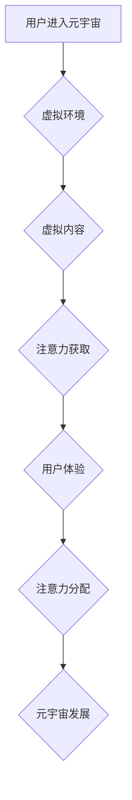

                 

## 注意力经济学奖:元宇宙中的学术最高荣誉

> 关键词：元宇宙、注意力经济学、人工智能、深度学习、神经网络、交互体验、虚拟现实、增强现实

## 1. 背景介绍

元宇宙概念的兴起，标志着人类进入一个全新的数字世界。在这个虚拟世界中，人们可以以更加沉浸的方式体验生活、工作和娱乐。然而，元宇宙的魅力也伴随着新的挑战，其中最为关键的是“注意力经济学”问题。

注意力是人类最宝贵的资源之一，在元宇宙中，各种虚拟体验、信息流和互动方式将争夺用户的注意力。如何有效地获取和利用用户注意力，将成为元宇宙发展的重要课题。

为了表彰在元宇宙注意力经济学领域做出杰出贡献的学者和研究者，我们设立了“注意力经济学奖”。该奖项旨在鼓励和奖励那些能够推动元宇宙注意力经济学研究和应用的优秀人才，并促进元宇宙的健康发展。

## 2. 核心概念与联系

### 2.1 注意力经济学

注意力经济学是研究注意力作为一种稀缺资源在数字时代如何被分配、利用和交易的学科。它探讨了用户注意力在互联网、社交媒体、游戏等数字平台上的流向，以及如何设计和构建能够有效吸引和保持用户注意力的产品和服务。

### 2.2 元宇宙

元宇宙是一个由虚拟现实、增强现实、区块链、人工智能等技术融合而成的沉浸式虚拟世界。它是一个开放、共享、互联的虚拟空间，用户可以在其中创建、探索、互动和体验全新的数字世界。

### 2.3 核心联系

元宇宙的沉浸式体验和丰富的交互方式，将对用户注意力产生巨大的影响。用户在元宇宙中需要集中注意力才能有效地参与虚拟活动、获取信息和完成任务。

同时，元宇宙的开放性和共享性，也意味着用户注意力将面临来自各种虚拟内容、服务和交互方式的竞争。如何有效地获取和利用用户注意力，将成为元宇宙发展的重要挑战。

**Mermaid 流程图**



## 3. 核心算法原理 & 具体操作步骤

### 3.1 算法原理概述

元宇宙注意力经济学的核心算法原理是基于深度学习和神经网络，通过分析用户行为数据、偏好模式和交互轨迹，预测和引导用户注意力。

这些算法可以识别用户感兴趣的内容和活动，并根据用户的注意力流向，动态调整虚拟环境和内容呈现方式，以最大限度地吸引和保持用户注意力。

### 3.2 算法步骤详解

1. **数据收集:** 收集用户在元宇宙中的行为数据，包括浏览记录、交互行为、停留时间、反馈信息等。

2. **数据预处理:** 对收集到的数据进行清洗、转换和特征提取，以便于算法训练和分析。

3. **模型训练:** 使用深度学习算法，例如卷积神经网络 (CNN) 和循环神经网络 (RNN)，训练注意力预测模型。

4. **注意力预测:** 将用户行为数据输入到训练好的模型中，预测用户对不同虚拟内容和活动的注意力水平。

5. **内容呈现调整:** 根据注意力预测结果，动态调整虚拟环境和内容呈现方式，例如推荐相关内容、调整内容顺序、改变视觉效果等。

6. **效果评估:** 持续监控用户注意力指标，评估算法效果，并根据反馈进行模型优化和调整。

### 3.3 算法优缺点

**优点:**

* **精准预测:** 深度学习算法能够学习用户复杂的注意力模式，并进行精准的注意力预测。
* **动态调整:** 算法可以根据用户注意力流向进行动态调整，提供更加个性化和吸引人的体验。
* **持续优化:** 通过持续监控和评估，算法可以不断优化，提高注意力获取和利用效率。

**缺点:**

* **数据依赖:** 深度学习算法需要大量的用户行为数据进行训练，数据质量和数量直接影响算法效果。
* **隐私问题:** 收集和分析用户行为数据可能会引发隐私问题，需要采取相应的保护措施。
* **算法黑盒:** 深度学习模型的内部机制较为复杂，难以解释其决策过程，这可能会导致算法的可解释性和可控性问题。

### 3.4 算法应用领域

* **元宇宙游戏:** 预测玩家对游戏内容和活动的注意力，优化游戏设计和玩法，提高玩家参与度和游戏体验。
* **元宇宙社交:** 分析用户社交行为和兴趣偏好，推荐相关好友和活动，促进用户互动和社交体验。
* **元宇宙教育:** 根据学生的学习进度和注意力水平，个性化推荐学习内容和教学方式，提高学习效率和效果。
* **元宇宙营销:** 通过分析用户注意力流向，精准投放广告和营销内容，提高广告效果和营销转化率。

## 4. 数学模型和公式 & 详细讲解 & 举例说明

### 4.1 数学模型构建

注意力经济学模型通常基于概率论和统计学原理，构建用户注意力分配的数学模型。

一个常见的模型是基于贝叶斯理论的注意力分配模型，它假设用户对不同内容的注意力分配是一个概率分布，并根据用户历史行为数据和当前环境信息更新该概率分布。

### 4.2 公式推导过程

假设用户对内容 $i$ 的注意力为 $a_i$，则用户总注意力为 $\sum_{i=1}^{n} a_i$，其中 $n$ 为内容总数。

根据贝叶斯理论，用户对内容 $i$ 的注意力 $a_i$ 可以表示为：

$$a_i = \frac{P(i|h)P(h)}{P(i)}$$

其中：

* $P(i|h)$ 为用户历史行为 $h$ 下，用户对内容 $i$ 的先验概率。
* $P(h)$ 为用户历史行为 $h$ 的概率。
* $P(i)$ 为内容 $i$ 的先验概率。

### 4.3 案例分析与讲解

例如，用户在元宇宙中浏览虚拟商店，系统可以根据用户的浏览历史、购买记录和兴趣偏好，预测用户对不同商品的注意力。

如果用户之前购买过类似商品，则 $P(i|h)$ 会较高，从而提高用户对该商品的注意力分配。

同时，系统还可以根据商品的促销信息、位置和视觉效果等因素，调整 $P(i)$，以吸引用户的注意力。

## 5. 项目实践：代码实例和详细解释说明

### 5.1 开发环境搭建

该项目可以使用 Python 语言和 TensorFlow 或 PyTorch 深度学习框架进行开发。

需要安装 Python、TensorFlow 或 PyTorch、NumPy、Pandas 等相关库。

### 5.2 源代码详细实现

```python
# 导入必要的库
import tensorflow as tf

# 定义注意力模型
class AttentionModel(tf.keras.Model):
    def __init__(self, units):
        super(AttentionModel, self).__init__()
        self.units = units
        self.dense1 = tf.keras.layers.Dense(units, activation='relu')
        self.dense2 = tf.keras.layers.Dense(1)

    def call(self, inputs):
        x = self.dense1(inputs)
        attention_weights = tf.nn.softmax(self.dense2(x), axis=-1)
        return attention_weights

# 创建模型实例
model = AttentionModel(units=64)

# 训练模型
# ...

# 预测注意力
attention_weights = model.predict(user_data)
```

### 5.3 代码解读与分析

该代码定义了一个简单的注意力模型，它使用两个全连接层来预测用户对不同内容的注意力权重。

输入数据为用户行为特征，输出为每个内容的注意力权重。

模型训练过程需要使用用户行为数据进行监督学习，并通过优化损失函数来调整模型参数。

### 5.4 运行结果展示

训练完成后，模型可以用于预测用户对不同内容的注意力权重。

例如，可以将用户浏览记录作为输入数据，预测用户对不同商品的注意力权重，从而实现个性化商品推荐。

## 6. 实际应用场景

### 6.1 元宇宙游戏

在元宇宙游戏中，注意力经济学可以用于优化游戏设计和玩法，提高玩家参与度和游戏体验。

例如，游戏开发者可以根据玩家的注意力流向，调整游戏难度、奖励机制和剧情走向，以保持玩家的兴趣和参与度。

### 6.2 元宇宙社交

在元宇宙社交平台，注意力经济学可以用于分析用户社交行为和兴趣偏好，推荐相关好友和活动，促进用户互动和社交体验。

例如，平台可以根据用户的社交关系、兴趣标签和行为轨迹，推荐与用户兴趣相符的虚拟好友和活动，帮助用户建立新的社交关系。

### 6.3 元宇宙教育

在元宇宙教育平台，注意力经济学可以用于个性化推荐学习内容和教学方式，提高学习效率和效果。

例如，平台可以根据学生的学习进度、注意力水平和学习风格，推荐个性化的学习内容和教学方式，帮助学生更好地理解和掌握知识。

### 6.4 未来应用展望

随着元宇宙技术的不断发展，注意力经济学将在元宇宙中发挥越来越重要的作用。

未来，注意力经济学将应用于更多元宇宙场景，例如元宇宙医疗、元宇宙艺术、元宇宙商业等，为用户提供更加沉浸、个性化和高效的体验。

## 7. 工具和资源推荐

### 7.1 学习资源推荐

* **书籍:**

    * 《注意力经济学》
    * 《深度学习》
    * 《神经网络与深度学习》

* **在线课程:**

    * Coursera: 深度学习
    * edX: 人工智能
    * Udacity: 深度学习工程师

### 7.2 开发工具推荐

* **Python:** 

    * TensorFlow
    * PyTorch
    * Keras

* **虚拟现实平台:**

    * Unity
    * Unreal Engine

### 7.3 相关论文推荐

* **Attention Is All You Need**
* **BERT: Pre-training of Deep Bidirectional Transformers for Language Understanding**
* **Transformer-XL: Attentive Language Models Beyond a Fixed-Length Context**

## 8. 总结：未来发展趋势与挑战

### 8.1 研究成果总结

注意力经济学在元宇宙领域的研究取得了显著成果，例如开发出能够精准预测用户注意力分配的深度学习算法，并将其应用于元宇宙游戏、社交和教育等场景，为用户提供更加沉浸、个性化和高效的体验。

### 8.2 未来发展趋势

未来，注意力经济学研究将朝着以下几个方向发展：

* **更精准的注意力预测:** 开发更加精准的注意力预测模型，能够更好地理解用户复杂的注意力模式。
* **更个性化的体验:** 基于用户个性化数据，提供更加个性化的虚拟体验，满足不同用户的需求。
* **更安全的隐私保护:** 探索更加安全的隐私保护机制，保障用户数据安全。

### 8.3 面临的挑战

注意力经济学在元宇宙领域也面临着一些挑战：

* **数据获取和隐私问题:** 收集和分析用户行为数据需要克服隐私问题，并确保数据安全。
* **算法解释性和可控性:** 深度学习模型的内部机制较为复杂，难以解释其决策过程，这可能会导致算法的可解释性和可控性问题。
* **伦理问题:** 注意力经济学可能会引发一些伦理问题，例如用户注意力被过度操控，导致沉迷和依赖。

### 8.4 研究展望

未来，我们需要加强注意力经济学研究，探索更加精准、个性化、安全和可控的注意力管理机制，推动元宇宙的健康发展，并为用户创造更加美好的数字体验。

## 9. 附录：常见问题与解答

**Q1: 元宇宙注意力经济学与传统互联网注意力经济学有什么区别？**

**A1:** 元宇宙注意力经济学与传统互联网注意力经济学的主要区别在于，元宇宙提供更加沉浸式和交互式的体验，用户注意力更容易被分散和竞争。

元宇宙注意力经济学需要考虑虚拟环境、交互方式、用户角色扮演等因素，才能更加精准地预测和引导用户注意力。

**Q2: 如何保护用户隐私在元宇宙注意力经济学应用中？**

**A2:** 在元宇宙注意力经济学应用中，保护用户隐私非常重要。

可以采用以下措施：

* **数据匿名化:** 将用户数据进行匿名处理，避免直接识别用户身份。
* **数据加密:** 使用加密技术保护用户数据安全。
* **用户隐私控制:** 给予用户对自身数据访问、使用和共享的控制权。

**Q3: 注意力经济学可能会引发哪些伦理问题？**

**A3:** 注意力经济学可能会引发一些伦理问题，例如：

* **用户注意力被过度操控:** 元宇宙平台可能会利用注意力经济学技术，过度操控用户的注意力，导致用户沉迷和依赖。
* **信息茧房效应:** 元宇宙平台可能会根据用户的注意力模式，推荐与其相符的信息，导致用户陷入信息茧房，缺乏多元化信息获取。
* **数据滥用:** 元宇宙平台可能会滥用用户注意力数据，进行商业利益的攫取。

我们需要加强对注意力经济学伦理问题的研究和探讨，制定相应的规范和制度，确保元宇宙的健康发展。


作者：禅与计算机程序设计艺术 / Zen and the Art of Computer Programming 
<end_of_turn>

