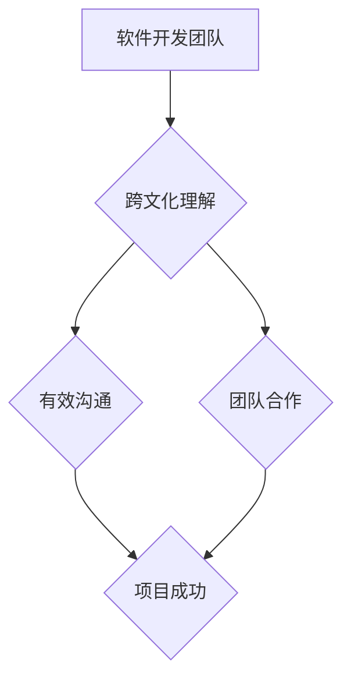

                 

## 理解的多元化：跨文化视角的重要性

> 关键词：跨文化理解、多元化、人工智能、软件开发、团队合作、沟通、包容性、全球化

## 1. 背景介绍

在当今全球化时代，科技领域正经历着前所未有的变革和发展。人工智能、大数据、云计算等新兴技术蓬勃发展，推动着软件开发、产品设计、商业模式等各个领域发生深刻变革。然而，随着科技的进步，我们也面临着新的挑战，其中之一就是跨文化理解的重要性日益凸显。

传统的软件开发模式往往集中在单一文化背景下，忽视了不同文化之间差异带来的影响。然而，随着全球化进程的加速，软件开发团队成员来自世界各地，他们拥有不同的文化背景、价值观、沟通方式和工作习惯。如果缺乏跨文化理解，就会导致沟通障碍、团队冲突、产品设计失误等问题，最终影响项目成功率。

## 2. 核心概念与联系

跨文化理解是指理解和尊重不同文化背景的人的行为、价值观、信仰和习俗的能力。在软件开发领域，跨文化理解是指开发团队成员能够理解和尊重彼此不同的文化背景，有效地沟通协作，共同完成项目目标。

**跨文化理解与软件开发的关系**



跨文化理解是软件开发团队成功的重要基石。它能够促进团队成员之间的有效沟通，增强团队合作，最终提高项目成功率。

## 3. 核心算法原理 & 具体操作步骤

虽然跨文化理解不是一个传统的算法，但我们可以将其视为一个复杂系统，并通过一些方法和步骤来提高跨文化理解能力。

### 3.1  算法原理概述

跨文化理解的算法原理主要基于以下几个方面：

* **文化敏感性:** 了解不同文化背景下的人的行为规范、价值观和沟通方式。
* **同理心:** 站在对方的角度思考问题，理解他们的感受和想法。
* **包容性:** 尊重不同文化背景的人，接纳他们的差异。
* **沟通技巧:** 掌握有效的沟通技巧，能够清晰、准确地表达自己的想法，并理解他人的意思。

### 3.2  算法步骤详解

1. **自我认知:** 首先要了解自己的文化背景、价值观和沟通方式，并意识到自己的文化偏见。
2. **文化学习:** 学习不同文化背景下的人的行为规范、价值观和沟通方式。可以阅读相关书籍、参加文化交流活动、与不同文化背景的人交流互动。
3. **同理心训练:** 练习站在对方的角度思考问题，理解他们的感受和想法。可以尝试进行角色扮演、倾听他人的故事、观察他人的行为。
4. **沟通技巧提升:** 掌握有效的沟通技巧，能够清晰、准确地表达自己的想法，并理解他人的意思。可以参加沟通技巧培训、练习非语言沟通、学习不同文化背景下常用的表达方式。

### 3.3  算法优缺点

**优点:**

* 能够提高团队成员之间的沟通和理解。
* 能够增强团队合作，提高项目成功率。
* 能够促进文化交流，增进彼此了解。

**缺点:**

* 需要投入时间和精力进行学习和训练。
* 跨文化理解是一个复杂的过程，需要不断地学习和实践。
* 即使掌握了跨文化理解的技巧，也可能遇到沟通障碍。

### 3.4  算法应用领域

跨文化理解的算法可以应用于各种软件开发领域，例如：

* **国际化软件开发:** 开发面向全球用户的软件产品。
* **跨国团队合作:** 构建跨国团队，共同完成项目目标。
* **文化敏感型软件设计:** 设计能够尊重不同文化背景的用户体验。

## 4. 数学模型和公式 & 详细讲解 & 举例说明

虽然跨文化理解不是一个纯粹的数学问题，但我们可以使用一些数学模型来量化和分析跨文化差异。例如，我们可以使用信息论来度量不同文化之间信息传递的效率。

**信息熵:**

$$H(X) = - \sum_{i=1}^{n} p(x_i) \log_2 p(x_i)$$

其中，$X$ 是一个随机变量，$x_i$ 是 $X$ 的取值，$p(x_i)$ 是 $x_i$ 的概率。信息熵可以用来度量一个随机变量的不确定性。

**跨文化信息熵:**

我们可以定义跨文化信息熵来度量不同文化之间信息传递的效率。假设有两个文化 $A$ 和 $B$，我们可以使用信息熵来度量每个文化内部的信息熵，以及两个文化之间信息传递的效率。

**举例说明:**

假设有两个文化 $A$ 和 $B$，$A$ 文化的信息熵为 $H(A)$，$B$ 文化的信息熵为 $H(B)$，两个文化之间信息传递的效率为 $E$。那么，我们可以使用以下公式来计算跨文化信息熵：

$$H_{AB} = H(A) + H(B) - 2E$$

**解释:**

* 当 $E$ 越大时，跨文化信息熵越小，表示两个文化之间信息传递的效率越高。
* 当 $E$ 越小时，跨文化信息熵越大，表示两个文化之间信息传递的效率越低。

## 5. 项目实践：代码实例和详细解释说明

跨文化理解是一个需要长期实践和积累的过程，没有一个完美的代码实例可以解决所有问题。但是，我们可以通过一些代码实践来提高跨文化理解能力。例如，我们可以开发一个跨文化沟通工具，帮助不同文化背景的人进行更有效的沟通。

### 5.1  开发环境搭建

* 选择一个适合开发跨文化沟通工具的编程语言，例如 Python 或 Java。
* 安装必要的开发工具，例如 IDE、版本控制系统等。
* 设置开发环境，例如创建项目目录、配置环境变量等。

### 5.2  源代码详细实现

由于跨文化沟通工具的实现方式多种多样，这里只提供一个简单的例子，展示如何使用代码实现跨文化翻译功能。

```python
# 简单的跨文化翻译工具

def translate(text, target_language):
  """
  翻译文本到目标语言。

  Args:
    text: 需要翻译的文本。
    target_language: 目标语言代码，例如 "en" (英语), "es" (西班牙语) 等。

  Returns:
    翻译后的文本。
  """
  # 使用翻译 API 或其他方法进行翻译
  # ...
  return translated_text

# 示例用法
text = "你好，世界！"
target_language = "en"
translated_text = translate(text, target_language)
print(f"翻译后的文本: {translated_text}")
```

### 5.3  代码解读与分析

* `translate()` 函数接受文本和目标语言代码作为参数，并使用翻译 API 或其他方法进行翻译。
* 示例用法演示了如何使用 `translate()` 函数翻译文本到英语。

### 5.4  运行结果展示

运行代码后，会输出翻译后的文本，例如：

```
翻译后的文本: Hello, world!
```

## 6. 实际应用场景

跨文化理解在软件开发领域有着广泛的应用场景，例如：

### 6.1  国际化软件开发

开发面向全球用户的软件产品需要考虑不同文化背景下用户的需求和习惯。例如，日期格式、时间显示、货币单位等都需要根据不同的文化进行调整。

### 6.2  跨国团队合作

跨国团队合作需要团队成员能够理解和尊重彼此不同的文化背景，有效地沟通协作。例如，需要了解不同文化背景下的人的沟通方式、工作习惯、决策机制等。

### 6.3  文化敏感型软件设计

软件设计需要考虑不同文化背景下用户的文化敏感度，避免设计出可能冒犯或引起误解的界面或功能。例如，需要避免使用带有文化特定符号或图像的界面元素。

### 6.4  未来应用展望

随着全球化进程的加速，跨文化理解在软件开发领域将变得越来越重要。未来，我们可以期待看到更多基于跨文化理解的软件开发工具和技术出现，帮助开发人员更好地理解和服务全球用户。

## 7. 工具和资源推荐

### 7.1  学习资源推荐

* **书籍:**
    * 《跨文化沟通》
    * 《文化差异与管理》
    * 《全球化时代的人际沟通》
* **网站:**
    * 文化差异网 (https://www.culturecrossing.net/)
    * 跨文化沟通研究所 (https://www.crossculturalcommunication.org/)

### 7.2  开发工具推荐

* **翻译 API:**
    * Google Translate API
    * Microsoft Translator API
    * DeepL API
* **跨文化沟通工具:**
    * Skype
    * Zoom
    * Slack

### 7.3  相关论文推荐

* Hofstede, G. (2001). Culture's consequences: Comparing values, behaviors, institutions and organizations across nations. Thousand Oaks, CA: Sage Publications.
* Bennett, M. J. (2004). Towards ethnorelativism: A developmental model of intercultural sensitivity. In M. J. Bennett (Ed.), Towards ethnorelativism: A developmental model of intercultural sensitivity (pp. 1-21). Yarmouth, ME: Intercultural Press.

## 8. 总结：未来发展趋势与挑战

跨文化理解在软件开发领域越来越重要，它能够促进团队合作，提高项目成功率，并帮助开发人员更好地理解和服务全球用户。

### 8.1  研究成果总结

近年来，跨文化理解的研究取得了显著进展，出现了许多新的理论和方法。例如，Hofstede 的文化维度理论、Bennett 的跨文化敏感度模型等，为我们理解和应对跨文化差异提供了重要的理论基础。

### 8.2  未来发展趋势

未来，跨文化理解的研究将更加注重以下几个方面：

* **人工智能技术的应用:** 利用人工智能技术，开发更加智能化的跨文化理解工具，例如自动翻译、跨文化沟通助手等。
* **个性化跨文化理解:** 针对不同个体和情境的跨文化差异，开发更加个性化的跨文化理解解决方案。
* **跨文化协作平台:** 建立跨文化协作平台，促进不同文化背景的人员之间的交流和合作。

### 8.3  面临的挑战

跨文化理解仍然面临着一些挑战，例如：

* **文化差异的复杂性:** 文化差异非常复杂，难以用简单的模型或算法完全解释。
* **数据获取的困难:** 跨文化理解的研究需要大量的跨文化数据，但获取这些数据非常困难。
* **伦理问题:** 利用人工智能技术进行跨文化理解，需要考虑伦理问题，例如数据隐私、算法偏见等。

### 8.4  研究展望

尽管面临着挑战，但跨文化理解的研究前景依然光明。随着科技的进步和社会的发展，跨文化理解将成为越来越重要的议题，并对我们的生活和工作产生深远的影响。

## 9. 附录：常见问题与解答

**常见问题:**

* 如何提高跨文化理解能力？
* 如何在软件开发中应用跨文化理解？
* 跨文化理解有哪些挑战？

**解答:**

* 提高跨文化理解能力可以通过学习不同文化背景的知识、与不同文化背景的人交流互动、练习同理心等方式实现。
* 在软件开发中，可以应用跨文化理解来设计国际化软件、构建跨国团队、开发文化敏感型软件等。
* 跨文化理解面临着文化差异的复杂性、数据获取的困难、伦理问题等挑战。


作者：禅与计算机程序设计艺术 / Zen and the Art of Computer Programming 
<end_of_turn>

