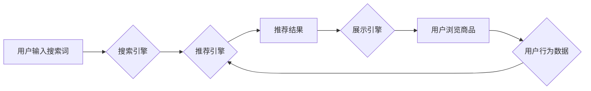

                 

##  电商平台的AI 大模型实践：搜索推荐系统是核心，数据质量控制与处理能力

> 关键词：电商平台、AI大模型、搜索推荐系统、数据质量控制、数据处理能力、深度学习、自然语言处理、推荐算法、机器学习

## 1. 背景介绍

在当今数据爆炸的时代，电商平台面临着巨大的挑战和机遇。用户数量的激增、商品种类繁多、消费行为复杂化，使得传统的搜索和推荐系统难以满足用户个性化需求。因此，电商平台迫切需要借助人工智能（AI）大模型的力量，提升用户体验，提高转化率。

AI大模型，特别是基于深度学习和自然语言处理（NLP）技术的模型，在理解用户需求、挖掘商品关联性、个性化推荐等方面展现出强大的潜力。搜索推荐系统作为电商平台的核心功能之一，是AI大模型应用的理想场景。

## 2. 核心概念与联系

### 2.1 搜索推荐系统

搜索推荐系统旨在帮助用户快速找到所需商品，并根据用户的兴趣和偏好，推荐相关商品。它通常由以下几个模块组成：

* **搜索引擎:** 处理用户搜索词，并返回相关商品列表。
* **推荐引擎:** 基于用户行为、商品属性等数据，推荐个性化商品列表。
* **展示引擎:** 将搜索结果和推荐结果以用户友好的方式展示。

### 2.2 AI大模型

AI大模型是指在海量数据上训练的深度学习模型，具有强大的泛化能力和学习能力。常见的AI大模型包括：

* **Transformer模型:** 用于自然语言处理任务，例如文本分类、机器翻译、问答系统等。
* **生成式对抗网络（GAN）：** 用于生成图像、文本、音频等数据。
* **图神经网络（GNN）：** 用于处理图结构数据，例如社交网络、知识图谱等。

### 2.3 核心概念关系

电商平台的搜索推荐系统可以借助AI大模型来提升其性能。例如，可以使用Transformer模型分析用户搜索词，理解其意图，并返回更精准的搜索结果。可以使用GNN模型构建商品关联图，挖掘商品之间的隐性关系，并推荐更相关的商品。

**Mermaid 流程图**



## 3. 核心算法原理 & 具体操作步骤

### 3.1 算法原理概述

搜索推荐系统常用的算法包括：

* **基于内容的推荐:** 根据商品的属性和用户过去的购买记录，推荐相似的商品。
* **基于协同过滤的推荐:** 根据用户的行为相似度，推荐其他用户喜欢的商品。
* **基于深度学习的推荐:** 使用深度学习模型，例如神经网络，学习用户和商品之间的复杂关系，并进行个性化推荐。

### 3.2 算法步骤详解

**基于内容的推荐算法步骤:**

1. **提取商品特征:** 将商品的属性信息，例如类别、品牌、价格、描述等，转换为数值特征。
2. **构建用户兴趣向量:** 根据用户的购买记录，构建用户的兴趣向量，表示用户对不同商品类型的偏好。
3. **计算商品与用户兴趣向量的相似度:** 使用余弦相似度等方法，计算商品特征向量与用户兴趣向量的相似度。
4. **推荐相似度高的商品:** 推荐相似度高的商品，作为用户可能感兴趣的商品。

**基于协同过滤的推荐算法步骤:**

1. **构建用户-商品交互矩阵:** 将用户和商品的交互行为，例如购买、浏览、评分等，存储在用户-商品交互矩阵中。
2. **计算用户相似度:** 使用余弦相似度等方法，计算用户之间的相似度。
3. **推荐相似用户喜欢的商品:** 对于用户u，推荐与用户u相似度高的用户喜欢的商品。

**基于深度学习的推荐算法步骤:**

1. **构建用户-商品交互网络:** 将用户和商品之间的交互行为，构建成用户-商品交互网络。
2. **训练深度学习模型:** 使用深度学习模型，例如神经网络，学习用户-商品交互网络中的关系，并进行个性化推荐。

### 3.3 算法优缺点

| 算法类型 | 优点 | 缺点 |
|---|---|---|
| 基于内容的推荐 | 能够推荐与用户兴趣相符的商品 | 需要大量的商品特征数据，难以捕捉用户隐性需求 |
| 基于协同过滤的推荐 | 能够发现用户之间的隐性关系，推荐用户可能感兴趣的商品 | 需要大量的用户交互数据，容易出现冷启动问题 |
| 基于深度学习的推荐 | 能够学习用户和商品之间的复杂关系，推荐更个性化的商品 | 需要大量的训练数据，模型训练复杂度高 |

### 3.4 算法应用领域

搜索推荐系统算法广泛应用于电商平台、社交媒体、音乐流媒体等领域。

## 4. 数学模型和公式 & 详细讲解 & 举例说明

### 4.1 数学模型构建

基于协同过滤的推荐算法可以使用矩阵分解模型来构建数学模型。假设用户-商品交互矩阵为R，其中R(u,i)表示用户u对商品i的评分。

目标是将R分解成两个低维矩阵，U和V，分别表示用户特征和商品特征。

U(u,:)表示用户u的特征向量，V(i,:)表示商品i的特征向量。

则R(u,i)可以近似表示为：

$$R(u,i) \approx U(u,:) \cdot V(i,:)$$

### 4.2 公式推导过程

可以使用最小二乘法来优化U和V的解。

最小化损失函数：

$$L = \sum_{u,i} (R(u,i) - U(u,:) \cdot V(i,:))^2$$

通过梯度下降法迭代更新U和V，直到损失函数最小化。

### 4.3 案例分析与讲解

假设有一个用户-商品交互矩阵R，其中R(1,2) = 5表示用户1对商品2的评分为5。

可以使用矩阵分解模型将R分解成两个低维矩阵U和V。

例如，U(1,:) = [0.8, 0.2]，V(2,:) = [0.6, 0.4]。

则R(1,2)可以近似表示为：

$$R(1,2) \approx 0.8 \cdot 0.6 + 0.2 \cdot 0.4 = 0.56$$

## 5. 项目实践：代码实例和详细解释说明

### 5.1 开发环境搭建

* Python 3.x
* TensorFlow/PyTorch
* Pandas
* Scikit-learn

### 5.2 源代码详细实现

```python
import pandas as pd
from sklearn.model_selection import train_test_split
from sklearn.metrics import mean_squared_error

# 加载用户-商品交互数据
data = pd.read_csv('user_item_interactions.csv')

# 构建用户-商品交互矩阵
ratings_matrix = data.pivot_table(index='user_id', columns='item_id', values='rating')

# 将数据分为训练集和测试集
train_data, test_data = train_test_split(ratings_matrix, test_size=0.2)

# 使用矩阵分解模型进行训练
from surprise import SVD
algo = SVD()
algo.fit(train_data)

# 对测试数据进行预测
predictions = algo.test(test_data)

# 计算预测结果的均方误差
rmse = mean_squared_error(test_data, predictions, squared=False)
print(f'RMSE: {rmse}')
```

### 5.3 代码解读与分析

* 首先，加载用户-商品交互数据，并构建用户-商品交互矩阵。
* 然后，将数据分为训练集和测试集。
* 使用Surprise库中的SVD算法进行训练，SVD算法是一种常用的矩阵分解模型。
* 训练完成后，使用训练好的模型对测试数据进行预测。
* 最后，计算预测结果的均方误差，评估模型的性能。

### 5.4 运行结果展示

运行结果会显示出模型的RMSE值，RMSE值越小，模型的性能越好。

## 6. 实际应用场景

### 6.1 电商平台商品推荐

电商平台可以利用搜索推荐系统，根据用户的浏览历史、购买记录、收藏列表等数据，推荐用户可能感兴趣的商品。

### 6.2 搜索引擎结果排序

搜索引擎可以利用搜索推荐系统，根据用户的搜索词、历史搜索记录、地理位置等数据，排序搜索结果，提高用户体验。

### 6.3 个性化内容推荐

社交媒体、音乐流媒体等平台可以利用搜索推荐系统，根据用户的兴趣爱好、行为偏好等数据，推荐个性化的内容。

### 6.4 未来应用展望

随着AI技术的不断发展，搜索推荐系统将更加智能化、个性化。未来，搜索推荐系统可能能够：

* 更准确地理解用户的意图，推荐更精准的商品。
* 预测用户的未来需求，提前推荐相关商品。
* 与其他AI技术结合，例如语音识别、图像识别等，提供更丰富的用户体验。

## 7. 工具和资源推荐

### 7.1 学习资源推荐

* **书籍:**
    * 《推荐系统实践》
    * 《深度学习》
* **在线课程:**
    * Coursera上的《机器学习》
    * Udacity上的《深度学习工程师》

### 7.2 开发工具推荐

* **Python:** 
    * TensorFlow
    * PyTorch
    * Scikit-learn
* **Spark:** 
    * 用于大规模数据处理

### 7.3 相关论文推荐

* **Collaborative Filtering for Implicit Feedback Datasets**
* **Neural Collaborative Filtering**
* **Deep Learning for Recommender Systems**

## 8. 总结：未来发展趋势与挑战

### 8.1 研究成果总结

电商平台的搜索推荐系统已经取得了显著的成果，能够有效地提升用户体验和转化率。AI大模型的应用，使得搜索推荐系统更加智能化、个性化。

### 8.2 未来发展趋势

未来，搜索推荐系统将朝着以下几个方向发展：

* **更精准的推荐:** 利用更先进的AI算法，更准确地理解用户的需求，推荐更精准的商品。
* **更个性化的推荐:** 结合用户的多方面数据，例如兴趣爱好、行为偏好、地理位置等，提供更个性化的推荐。
* **更丰富的交互方式:** 支持语音、图像、视频等多种交互方式，提供更丰富的用户体验。

### 8.3 面临的挑战

搜索推荐系统也面临着一些挑战：

* **数据质量问题:** 数据不完整、不准确、不一致等问题，会影响推荐系统的性能。
* **冷启动问题:** 新用户、新商品难以获得推荐，需要新的算法和策略来解决。
* **公平性问题:** 推荐算法可能存在偏见，导致某些用户或商品获得不公平的推荐。

### 8.4 研究展望

未来，需要进一步研究以下问题：

* 如何提高数据质量，解决数据质量问题。
* 如何解决冷启动问题，让新用户和新商品也能获得推荐。
* 如何保证推荐算法的公平性，避免推荐偏见。


## 9. 附录：常见问题与解答

**Q1: 如何评估搜索推荐系统的性能？**

**A1:** 常见的评估指标包括：

* **准确率:** 推荐结果中正确预测的比例。
* **召回率:** 推荐结果中包含所有目标物品的比例。
* **F1-score:** 准确率和召回率的调和平均值。
* **点击率 (CTR):** 用户点击推荐结果的比例。
* **转化率 (CVR):** 用户点击推荐结果后完成购买的比例。

**Q2: 如何解决冷启动问题？**

**A2:** 

* **利用用户画像:** 根据用户的基本信息，例如年龄、性别、职业等，进行推荐。
* **利用商品属性:** 根据商品的类别、品牌、价格等属性，进行推荐。
* **利用协同过滤的扩展方法:** 例如基于物品的协同过滤、基于内容的协同过滤等。

**Q3: 如何保证推荐算法的公平性？**

**A3:** 

* **使用公平性评估指标:** 例如公平性度量、不平等度等。
* **进行算法调优:** 调整算法参数，减少推荐偏见。
* **进行人工审核:** 对推荐结果进行人工审核，确保公平性。


作者：禅与计算机程序设计艺术 / Zen and the Art of Computer Programming 
<end_of_turn>

