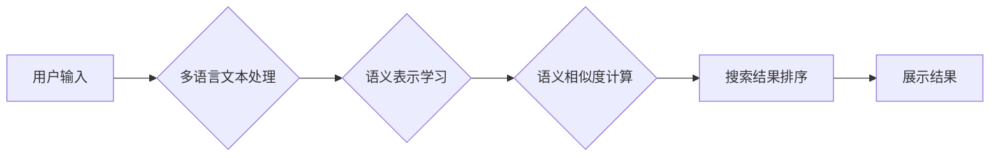

                 

## 电商搜索中的多语言商品语义匹配技术

> 关键词：电商搜索、多语言、语义匹配、自然语言处理、机器学习、深度学习、跨语言信息检索

## 1. 背景介绍

随着全球化进程的加速，跨境电商的蓬勃发展，电商平台面临着日益增长的多语言商品搜索需求。传统的基于关键词匹配的搜索方式难以准确理解用户意图，尤其是在多语言环境下，语义歧义和跨语言理解的挑战更加突出。因此，开发高效、准确的多语言商品语义匹配技术，对于提升用户搜索体验、促进跨境电商发展至关重要。

## 2. 核心概念与联系

**2.1  语义匹配**

语义匹配是指对两个文本进行比较，判断其所表达的含义是否一致。它不仅关注文本的表面词义，更注重理解文本背后的深层语义关系。

**2.2  多语言问题**

多语言问题是指涉及多种语言的文本处理任务。在电商搜索场景中，用户可能使用不同的语言进行商品搜索，而商品信息也可能以多种语言呈现。

**2.3  核心概念联系**

多语言商品语义匹配技术旨在解决多语言环境下，用户搜索意图与商品信息之间的语义匹配问题。它需要结合自然语言处理（NLP）、机器学习（ML）和深度学习（DL）等技术，实现跨语言文本理解和语义比较。

**2.4  架构图**



## 3. 核心算法原理 & 具体操作步骤

**3.1  算法原理概述**

多语言商品语义匹配技术通常采用以下核心算法：

* **词嵌入技术:** 将单词映射到低维向量空间，捕捉单词之间的语义关系。
* **语义相似度计算:** 使用向量空间中的距离度量，计算两个文本的语义相似度。
* **机器学习模型:** 利用训练数据，训练机器学习模型，对文本进行分类或排序，提高匹配精度。

**3.2  算法步骤详解**

1. **预处理:** 对用户输入和商品信息进行预处理，包括分词、去停用词、词形还原等。
2. **词嵌入:** 使用词嵌入模型（如Word2Vec、GloVe、FastText）将预处理后的文本转换为词向量。
3. **语义表示:** 对文本进行语义表示，例如使用TF-IDF、SentenceBERT等方法，将文本转换为句子向量。
4. **语义相似度计算:** 使用余弦相似度、欧氏距离等方法，计算用户输入和商品信息的语义相似度。
5. **排序和筛选:** 根据语义相似度，对商品信息进行排序和筛选，返回与用户搜索意图最匹配的商品。

**3.3  算法优缺点**

* **优点:** 能够更好地理解文本的语义含义，提高匹配精度。
* **缺点:** 需要大量的训练数据，训练过程复杂，计算资源消耗较大。

**3.4  算法应用领域**

* **电商搜索:** 提高商品搜索的准确性和效率。
* **信息检索:** 找到与用户查询最相关的文档。
* **机器翻译:** 翻译文本，保留文本的语义信息。
* **问答系统:** 理解用户问题，并给出准确的答案。

## 4. 数学模型和公式 & 详细讲解 & 举例说明

**4.1  数学模型构建**

假设我们有两个文本 $x$ 和 $y$，我们需要计算它们的语义相似度。我们可以使用向量空间模型，将文本 $x$ 和 $y$ 映射到低维向量空间中，然后使用距离度量计算它们的相似度。

**4.2  公式推导过程**

* **词嵌入:** 使用词嵌入模型将文本中的每个单词映射到一个向量 $v_i$。
* **句子向量:** 使用平均池化或其他方法，将单词向量聚合为句子向量 $x$ 和 $y$。
* **语义相似度:** 使用余弦相似度计算句子向量 $x$ 和 $y$ 的相似度：

$$
\text{similarity}(x, y) = \frac{x \cdot y}{||x|| ||y||}
$$

其中，$x \cdot y$ 是向量 $x$ 和 $y$ 的点积，$||x||$ 和 $||y||$ 分别是向量 $x$ 和 $y$ 的模长。

**4.3  案例分析与讲解**

例如，我们有两个文本：

* $x$ = "苹果手机"
* $y$ = "iPhone"

使用词嵌入模型，我们可以将这两个文本中的单词映射到向量空间中。假设苹果手机的词向量为 $[0.2, 0.3, 0.1]$, iPhone 的词向量为 $[0.1, 0.4, 0.2]$. 

使用余弦相似度计算它们的相似度：

$$
\text{similarity}(x, y) = \frac{[0.2, 0.3, 0.1] \cdot [0.1, 0.4, 0.2]}{||[0.2, 0.3, 0.1]|| ||[0.1, 0.4, 0.2]||}
$$

计算结果表明，这两个文本的语义相似度较高。

## 5. 项目实践：代码实例和详细解释说明

**5.1  开发环境搭建**

* Python 3.6+
* TensorFlow 或 PyTorch
* NLTK、SpaCy 等 NLP 库
* Gensim 或 fastText 词嵌入模型

**5.2  源代码详细实现**

```python
import nltk
from gensim.models import Word2Vec

# 下载停用词列表
nltk.download('stopwords')

# 预处理文本
def preprocess_text(text):
    # 分词
    tokens = nltk.word_tokenize(text)
    # 去停用词
    stop_words = nltk.corpus.stopwords.words('english')
    tokens = [token for token in tokens if token not in stop_words]
    # 词形还原
    # ...
    return tokens

# 训练词嵌入模型
sentences = [
    ["苹果", "手机"],
    ["iPhone", "手机"],
    # ...
]
model = Word2Vec(sentences, min_count=5)

# 获取词向量
apple_vector = model.wv['苹果']
iphone_vector = model.wv['iPhone']

# 计算语义相似度
similarity = cosine_similarity(apple_vector, iphone_vector)
print(similarity)
```

**5.3  代码解读与分析**

* 代码首先使用 NLTK 库对文本进行预处理，包括分词、去停用词等操作。
* 然后，使用 Gensim 库训练 Word2Vec 词嵌入模型，将单词映射到向量空间中。
* 最后，使用余弦相似度计算两个词向量的相似度。

**5.4  运行结果展示**

运行代码后，会输出两个词向量的语义相似度。

## 6. 实际应用场景

**6.1  跨语言电商搜索**

* 用户可以使用多种语言搜索商品，平台可以根据用户语言自动匹配相应的商品信息。
* 跨语言商品描述和标题匹配，提高商品搜索的准确性。

**6.2  个性化商品推荐**

* 基于用户搜索历史和浏览记录，推荐与用户兴趣相关的商品。
* 跨语言用户数据分析，提供更精准的个性化推荐。

**6.3  智能客服系统**

* 理解用户的多语言问题，并提供准确的回复。
* 自动翻译用户问题，提高客服系统的效率。

**6.4  未来应用展望**

* 多语言商品语义匹配技术将进一步融入电商平台的各个环节，例如商品分类、商品推荐、用户画像等。
* 随着人工智能技术的不断发展，多语言商品语义匹配技术将更加智能化、个性化和精准化。

## 7. 工具和资源推荐

**7.1  学习资源推荐**

* **书籍:**
    * 《自然语言处理》 by Jurafsky & Martin
    * 《深度学习》 by Goodfellow, Bengio & Courville
* **在线课程:**
    * Coursera: Natural Language Processing Specialization
    * edX: Deep Learning

**7.2  开发工具推荐**

* **Python:** 
    * TensorFlow
    * PyTorch
    * NLTK
    * SpaCy
* **词嵌入模型:**
    * Gensim
    * fastText

**7.3  相关论文推荐**

* **BERT:** Devlin et al. (2018)
* **SentenceBERT:** Reimers & Gurevych (2019)
* **Multilingual BERT:** Conneau et al. (2019)

## 8. 总结：未来发展趋势与挑战

**8.1  研究成果总结**

多语言商品语义匹配技术取得了显著进展，能够有效解决跨语言文本理解和语义比较问题。

**8.2  未来发展趋势**

* **更强大的模型:** 开发更强大的深度学习模型，提高语义匹配的精度和效率。
* **跨语言知识图谱:** 利用跨语言知识图谱，丰富语义理解，提高匹配的准确性。
* **个性化语义匹配:** 基于用户行为和偏好，提供更个性化的语义匹配服务。

**8.3  面临的挑战**

* **数据稀缺:** 多语言数据资源相对稀缺，难以训练高质量的模型。
* **语义歧义:** 不同语言的语义表达存在差异，难以准确理解用户意图。
* **计算资源:** 训练大型深度学习模型需要大量的计算资源。

**8.4  研究展望**

未来，多语言商品语义匹配技术将继续朝着更智能化、个性化和精准化的方向发展，为跨境电商和全球化信息交流提供更强大的技术支持。

## 9. 附录：常见问题与解答

* **Q1: 多语言商品语义匹配技术与关键词匹配技术相比有什么优势？**

* **A1:** 多语言商品语义匹配技术能够更好地理解文本的深层语义关系，而关键词匹配技术只关注文本表面的词义，因此在语义歧义和跨语言理解方面具有明显优势。

* **Q2: 如何解决多语言数据资源稀缺的问题？**

* **A2:** 可以利用跨语言数据转换技术，将一种语言的数据转换为另一种语言的数据，扩大训练数据规模。

* **Q3: 如何提高多语言语义匹配的精度？**

* **A3:** 可以使用更强大的深度学习模型，例如BERT、SentenceBERT等，并结合跨语言知识图谱和用户行为数据进行训练。


作者：禅与计算机程序设计艺术 / Zen and the Art of Computer Programming 
<end_of_turn>

