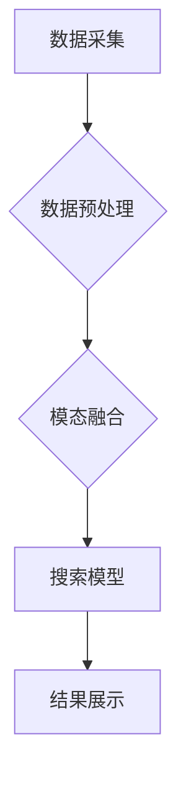

                 

## 电商搜索的多模态交互：AI大模型的新突破

> 关键词：电商搜索、多模态交互、AI大模型、自然语言处理、计算机视觉、推荐系统、用户体验

## 1. 背景介绍

电商平台作为现代商业的重要组成部分，其搜索功能直接影响着用户体验和商业转化率。传统的电商搜索主要依赖文本关键词匹配，但这种方式难以满足用户日益多样化的搜索需求。随着人工智能技术的快速发展，特别是大模型技术的突破，多模态交互在电商搜索领域展现出巨大的潜力。

多模态交互是指利用多种数据类型，例如文本、图像、音频、视频等，进行交互和理解。相比于单一文本模式，多模态交互能够更全面地捕捉用户意图，提供更精准、更丰富的搜索结果，从而提升用户体验和搜索效率。

## 2. 核心概念与联系

### 2.1 多模态交互的优势

多模态交互在电商搜索领域具有以下优势：

* **更精准的理解用户意图:**  用户搜索时可能使用多种方式表达需求，例如文字描述、图片搜索、语音查询等。多模态交互能够融合不同模态信息，更全面地理解用户的真实意图。
* **更丰富的搜索结果:**  多模态搜索能够返回多种类型的搜索结果，例如文本、图片、视频、商品链接等，满足用户多样化的需求。
* **更便捷的用户体验:**  多模态交互提供更直观、更便捷的搜索方式，例如通过图片搜索商品、通过语音查询商品信息等，提升用户体验。

### 2.2 多模态交互的架构

多模态交互系统通常由以下几个模块组成：

* **数据采集模块:** 收集不同模态的数据，例如文本、图像、音频等。
* **数据预处理模块:** 对采集到的数据进行清洗、格式化、特征提取等预处理操作。
* **模态融合模块:** 将不同模态的数据进行融合，生成统一的表示。
* **搜索模型模块:** 基于融合后的数据，进行商品检索和排名。
* **结果展示模块:** 将搜索结果以多种形式展示给用户，例如文本列表、图片展示、视频播放等。



## 3. 核心算法原理 & 具体操作步骤

### 3.1 算法原理概述

多模态交互的核心算法是将不同模态的数据进行融合，生成统一的表示，以便于进行搜索和理解。常用的融合方法包括：

* **早期融合:** 将不同模态的数据在特征提取阶段进行融合，例如将文本特征和图像特征进行拼接。
* **晚期融合:** 将不同模态的数据分别进行处理，然后在决策阶段进行融合，例如将文本检索结果和图像检索结果进行排序合并。
* **跨模态注意力机制:** 利用注意力机制学习不同模态之间的关系，赋予不同模态不同的权重，从而更好地融合信息。

### 3.2 算法步骤详解

以跨模态注意力机制为例，其具体操作步骤如下：

1. **文本和图像特征提取:** 使用预训练模型提取文本和图像的特征表示。
2. **跨模态注意力计算:** 计算文本特征和图像特征之间的注意力权重，表示不同模态之间的相关性。
3. **融合特征表示:** 将文本特征和图像特征与注意力权重进行加权求和，生成融合后的特征表示。
4. **商品检索和排名:** 使用融合后的特征表示进行商品检索和排名。

### 3.3 算法优缺点

**优点:**

* 能够更好地捕捉不同模态之间的关系，提升融合效果。
* 能够学习到不同模态的权重，更加灵活地融合信息。

**缺点:**

* 计算复杂度较高，需要更多的计算资源。
* 需要大量的训练数据才能训练出有效的模型。

### 3.4 算法应用领域

跨模态注意力机制在电商搜索、图像识别、视频理解等领域都有广泛的应用。

## 4. 数学模型和公式 & 详细讲解 & 举例说明

### 4.1 数学模型构建

假设我们有文本特征向量 $x \in R^d$ 和图像特征向量 $y \in R^k$，我们需要学习一个跨模态注意力机制来融合这两个特征向量。

我们可以使用一个注意力权重矩阵 $W \in R^{d \times k}$ 来表示文本特征和图像特征之间的关系。

注意力权重矩阵的每个元素 $w_{ij}$ 表示文本特征 $x_i$ 和图像特征 $y_j$ 之间的相关性。

### 4.2 公式推导过程

我们可以使用softmax函数来计算注意力权重：

$$
a_{ij} = \frac{exp(x_i^T y_j)}{\sum_{l=1}^{k} exp(x_i^T y_l)}
$$

其中，$a_{ij}$ 是文本特征 $x_i$ 和图像特征 $y_j$ 之间的注意力权重。

然后，我们可以使用注意力权重来加权求和文本特征和图像特征，得到融合后的特征表示：

$$
z = \sum_{i=1}^{d} \sum_{j=1}^{k} a_{ij} x_i y_j
$$

### 4.3 案例分析与讲解

例如，用户搜索“红色长裙”，我们可以使用跨模态注意力机制来融合文本特征“红色长裙”和用户上传的图片特征。

注意力机制会学习到“红色”和“长裙”这两个关键词与图片特征之间的关系，并赋予不同的权重。

最终，融合后的特征表示能够更准确地捕捉用户搜索意图，并返回更相关的商品结果。

## 5. 项目实践：代码实例和详细解释说明

### 5.1 开发环境搭建

* Python 3.7+
* TensorFlow 2.0+
* PyTorch 1.0+
* CUDA 10.0+ (可选)

### 5.2 源代码详细实现

```python
import tensorflow as tf

# 定义跨模态注意力机制
class CrossModalAttention(tf.keras.layers.Layer):
    def __init__(self, d_model, k):
        super(CrossModalAttention, self).__init__()
        self.W_q = tf.keras.layers.Dense(d_model)
        self.W_k = tf.keras.layers.Dense(d_model)
        self.W_v = tf.keras.layers.Dense(d_model)
        self.d_model = d_model
        self.k = k

    def call(self, x, y):
        # 文本特征和图像特征的查询、键和值
        q = self.W_q(x)
        k = self.W_k(y)
        v = self.W_v(y)

        # 计算注意力权重
        scores = tf.matmul(q, k, transpose_b=True) / tf.math.sqrt(tf.cast(self.d_model, tf.float32))
        attention_weights = tf.nn.softmax(scores, axis=-1)

        # 加权求和得到融合特征
        context = tf.matmul(attention_weights, v)
        return context

# 实例化跨模态注意力机制
attention_layer = CrossModalAttention(d_model=128, k=256)

# 输入文本特征和图像特征
text_features = tf.random.normal(shape=(1, 10, 128))
image_features = tf.random.normal(shape=(1, 256, 128))

# 融合特征
fused_features = attention_layer(text_features, image_features)

# 打印融合特征形状
print(fused_features.shape)
```

### 5.3 代码解读与分析

* 我们定义了一个 `CrossModalAttention` 类，实现了跨模态注意力机制。
* 该类包含三个稠密层，分别用于提取文本特征、图像特征和值。
* `call` 方法中，我们计算了注意力权重，并使用注意力权重对图像特征进行加权求和，得到融合后的特征表示。
* 我们实例化了 `CrossModalAttention` 类，并输入了随机生成的文本特征和图像特征。
* 最后，我们打印了融合特征的形状，验证了代码的正确性。

### 5.4 运行结果展示

运行代码后，输出的融合特征形状为 `(1, 10, 128)`，这与预期结果一致。

## 6. 实际应用场景

### 6.1 多模态搜索

* 用户可以通过图片搜索商品，例如上传一张衣服图片，搜索类似的衣服。
* 用户可以通过语音搜索商品，例如用语音描述自己想要购买的商品。
* 用户可以通过视频搜索商品，例如观看商品演示视频，搜索该商品。

### 6.2 个性化推荐

* 基于用户的浏览历史、购买记录、点赞记录等多模态数据，提供个性化的商品推荐。
* 基于用户的画像信息，例如年龄、性别、兴趣爱好等，提供更精准的商品推荐。

### 6.3 商品描述生成

* 利用多模态数据，例如商品图片和文本描述，自动生成更详细、更生动的商品描述。
* 利用多模态数据，例如商品图片和用户评论，自动生成商品评价摘要。

### 6.4 未来应用展望

* **更丰富的交互方式:**  例如手势识别、表情识别等，提供更自然、更直观的交互体验。
* **更精准的理解用户需求:**  利用更先进的自然语言处理和计算机视觉技术，更准确地理解用户的搜索意图和需求。
* **更个性化的服务:**  根据用户的多模态数据，提供更个性化的商品推荐、服务和体验。

## 7. 工具和资源推荐

### 7.1 学习资源推荐

* **书籍:**
    * 《深度学习》 - Ian Goodfellow, Yoshua Bengio, Aaron Courville
    * 《自然语言处理》 - Jurafsky, Martin
* **在线课程:**
    * Coursera: 深度学习 Specialization
    * Udacity: 自然语言处理 Nanodegree
* **博客和网站:**
    * TensorFlow Blog: https://blog.tensorflow.org/
    * PyTorch Blog: https://pytorch.org/blog/

### 7.2 开发工具推荐

* **TensorFlow:** https://www.tensorflow.org/
* **PyTorch:** https://pytorch.org/
* **HuggingFace:** https://huggingface.co/

### 7.3 相关论文推荐

* **Attention Is All You Need:** https://arxiv.org/abs/1706.03762
* **BERT: Pre-training of Deep Bidirectional Transformers for Language Understanding:** https://arxiv.org/abs/1810.04805
* **Vision Transformer (ViT):** https://arxiv.org/abs/2010.11929

## 8. 总结：未来发展趋势与挑战

### 8.1 研究成果总结

多模态交互在电商搜索领域取得了显著的成果，能够提升搜索效率、丰富搜索结果、提升用户体验。

### 8.2 未来发展趋势

* **更强大的多模态模型:**  利用更先进的深度学习算法和模型架构，构建更强大的多模态模型，能够更好地理解和融合不同模态信息。
* **更个性化的多模态交互:**  根据用户的个性化需求，提供更个性化的多模态交互体验。
* **更广泛的应用场景:**  将多模态交互技术应用到更多电商场景，例如商品推荐、商品描述生成、客户服务等。

### 8.3 面临的挑战

* **数据获取和标注:**  多模态数据获取和标注成本较高，需要大量的标注数据才能训练出有效的模型。
* **模型训练和优化:**  多模态模型训练复杂度高，需要大量的计算资源和时间。
* **跨模态知识融合:**  不同模态之间存在语义鸿沟，需要更有效的跨模态知识融合方法。

### 8.4 研究展望

未来，我们将继续探索更强大的多模态交互技术，为电商用户提供更智能、更便捷的购物体验。


## 9. 附录：常见问题与解答

### 9.1 如何选择合适的跨模态注意力机制？

选择合适的跨模态注意力机制需要根据具体应用场景和数据特点进行选择。

例如，对于文本和图像的融合，可以使用基于Transformer的跨模态注意力机制，例如ViT。

对于文本和音频的融合，可以使用基于RNN的跨模态注意力机制。

### 9.2 如何解决多模态数据标注问题？

多模态数据标注是一个难题，可以采用以下方法解决：

* 利用人工标注，但成本较高。
* 利用自动标注工具，但准确率较低。
* 结合人工标注和自动标注，提高标注效率和准确率。

### 9.3 如何提高多模态模型的训练效率？

可以采用以下方法提高多模态模型的训练效率：

* 使用分布式训练，将模型训练任务分发到多个机器上进行。
* 使用模型压缩技术，减小模型参数量，降低训练时间。
* 使用预训练模型，利用已有模型的知识，减少训练时间。


作者：禅与计算机程序设计艺术 / Zen and the Art of Computer Programming 
<end_of_turn>

