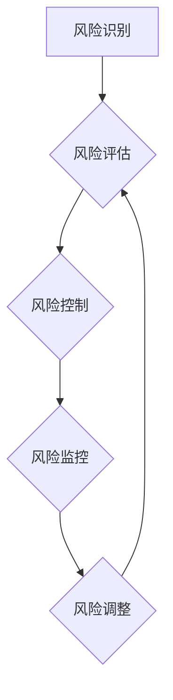

                 

## 知识付费创业中的风险管理

> 关键词：知识付费、风险管理、创业、在线教育、内容创作、商业模式、用户运营、法律合规

## 1. 背景介绍

知识付费行业近年来发展迅速，成为互联网经济的新热点。随着互联网技术的普及和人们对知识的需求不断增长，越来越多的人选择通过线上平台获取知识和技能。知识付费创业模式也随之涌现，涵盖了在线课程、直播讲座、付费咨询等多种形式。

然而，知识付费创业也面临着诸多风险，例如内容质量问题、用户流失、市场竞争激烈、法律合规等。这些风险可能会导致创业项目失败，甚至带来法律纠纷和声誉损害。因此，对于知识付费创业者来说，做好风险管理至关重要。

## 2. 核心概念与联系

**2.1 知识付费创业风险类型**

知识付费创业风险主要可以分为以下几类：

* **内容风险:** 内容质量低、缺乏原创性、无法满足用户需求等。
* **用户风险:** 用户流失率高、付费意愿低、用户体验差等。
* **市场风险:** 市场竞争激烈、用户群体细分程度高、市场需求变化快等。
* **运营风险:** 平台运营成本高、团队管理不善、营销推广效果不佳等。
* **法律风险:** 知识产权问题、合同纠纷、数据安全问题等。

**2.2 风险管理架构**

知识付费创业风险管理应建立一个全面的架构，涵盖风险识别、评估、控制和监控等环节。



**2.3 风险管理流程**

1. **风险识别:** 通过分析行业趋势、市场环境、自身业务模式等，识别可能存在的风险。
2. **风险评估:** 对已识别的风险进行评估，确定其发生的可能性和潜在影响。
3. **风险控制:** 根据风险评估结果，制定相应的控制措施，降低风险发生的可能性和影响。
4. **风险监控:** 定期监测风险状况，及时发现和应对新的风险。
5. **风险调整:** 根据风险监控结果，对风险控制措施进行调整，确保其有效性。

## 3. 核心算法原理 & 具体操作步骤

**3.1 算法原理概述**

知识付费创业风险管理的核心算法原理是基于数据分析和机器学习。通过收集和分析用户行为数据、市场数据、内容数据等，可以识别潜在的风险因素，并预测风险发生的可能性。

**3.2 算法步骤详解**

1. **数据收集:** 收集用户行为数据、市场数据、内容数据等。
2. **数据清洗:** 对收集到的数据进行清洗，去除无效数据和重复数据。
3. **特征提取:** 从数据中提取特征，例如用户活跃度、付费意愿、内容受欢迎程度等。
4. **模型训练:** 使用机器学习算法对特征进行训练，建立风险预测模型。
5. **风险预测:** 将新的数据输入到模型中，预测其发生的风险概率。
6. **风险控制:** 根据风险预测结果，采取相应的控制措施，例如推送个性化推荐、优化内容质量、加强用户运营等。

**3.3 算法优缺点**

* **优点:** 能够识别潜在的风险因素，提高风险预警能力，并根据数据分析结果制定精准的风险控制措施。
* **缺点:** 需要大量的数据支持，模型训练需要专业技术，算法本身也存在一定的局限性。

**3.4 算法应用领域**

* **用户风险识别:** 识别潜在的恶意用户、高风险用户等。
* **内容风险预警:** 预警内容质量问题、抄袭问题等。
* **市场风险分析:** 分析市场竞争情况、用户需求变化等。
* **运营风险控制:** 优化平台运营策略、提高用户留存率等。

## 4. 数学模型和公式 & 详细讲解 & 举例说明

**4.1 数学模型构建**

知识付费创业风险管理可以构建一个基于贝叶斯定理的数学模型，用于预测用户流失风险。

**4.2 公式推导过程**

设：

* $P(A)$ 为事件A发生的概率。
* $P(B|A)$ 为事件B在事件A发生条件下的概率。

根据贝叶斯定理，有：

$$P(A|B) = \frac{P(B|A)P(A)}{P(B)}$$

其中：

* $P(A|B)$ 为事件A在事件B发生条件下的概率。

**4.3 案例分析与讲解**

假设我们想要预测用户在未来一个月内流失的风险。我们可以根据用户的历史行为数据，例如用户活跃度、付费记录、评论行为等，构建一个贝叶斯模型。

* $A$ 为用户在未来一个月内流失的事件。
* $B$ 为用户在过去一个月内表现出某些流失风险的事件，例如用户活跃度下降、付费频率降低等。

我们可以根据历史数据，估计 $P(A)$、$P(B|A)$ 和 $P(B)$ 的值。然后，利用贝叶斯公式，计算出 $P(A|B)$，即用户在表现出流失风险的情况下，未来一个月内流失的概率。

## 5. 项目实践：代码实例和详细解释说明

**5.1 开发环境搭建**

* Python 3.x
* Jupyter Notebook
* scikit-learn

**5.2 源代码详细实现**

```python
from sklearn.linear_model import LogisticRegression

# 加载数据
data = pd.read_csv('user_data.csv')

# 划分训练集和测试集
X_train, X_test, y_train, y_test = train_test_split(data.drop('churn', axis=1), data['churn'], test_size=0.2)

# 训练模型
model = LogisticRegression()
model.fit(X_train, y_train)

# 预测测试集结果
y_pred = model.predict(X_test)

# 评估模型性能
accuracy = accuracy_score(y_test, y_pred)
print('模型准确率:', accuracy)
```

**5.3 代码解读与分析**

* 该代码示例使用 scikit-learn 库中的 LogisticRegression 模型进行用户流失风险预测。
* 首先，加载用户数据，并将其划分成训练集和测试集。
* 然后，使用训练集训练 LogisticRegression 模型。
* 最后，使用测试集评估模型性能，并输出模型准确率。

**5.4 运行结果展示**

运行结果会显示模型的准确率，例如 0.85，表示模型在预测用户流失风险方面准确率为 85%。

## 6. 实际应用场景

**6.1 用户画像分析**

根据用户行为数据，构建用户画像，识别不同类型的用户，例如高价值用户、潜在流失用户等。

**6.2 个性化推荐**

根据用户的兴趣爱好和学习需求，提供个性化的课程推荐，提高用户学习体验和付费意愿。

**6.3 内容质量控制**

利用机器学习算法，对内容进行自动审核，识别低质量内容，确保内容质量。

**6.4 营销推广优化**

分析用户行为数据，优化营销推广策略，提高广告投放效果和用户转化率。

**6.5 风险预警系统**

建立风险预警系统，实时监测用户行为和市场变化，及时发现和应对潜在风险。

**6.6 未来应用展望**

随着人工智能技术的不断发展，知识付费创业风险管理将更加智能化和自动化。未来，我们可以期待看到更多基于大数据和机器学习的风险管理工具和解决方案，帮助知识付费创业者更好地应对风险挑战。

## 7. 工具和资源推荐

**7.1 学习资源推荐**

* **书籍:** 《数据科学实战》、《机器学习实战》
* **在线课程:** Coursera、edX、Udacity

**7.2 开发工具推荐**

* **Python:** scikit-learn、TensorFlow、PyTorch
* **数据分析工具:** Jupyter Notebook、Pandas、NumPy

**7.3 相关论文推荐**

* **用户流失预测:** 《基于机器学习的用户流失预测模型》
* **内容质量评估:** 《基于深度学习的内容质量评估方法》

## 8. 总结：未来发展趋势与挑战

**8.1 研究成果总结**

知识付费创业风险管理是一个重要的研究领域，已经取得了一定的成果。基于数据分析和机器学习的风险管理方法，能够有效识别和控制风险，提高知识付费创业项目的成功率。

**8.2 未来发展趋势**

* **更精准的风险预测:** 利用更先进的机器学习算法和更丰富的用户数据，实现更精准的风险预测。
* **更智能化的风险控制:** 开发更智能化的风险控制系统，能够自动识别和应对风险，并提供个性化的解决方案。
* **更全面的风险管理体系:** 建立更全面的风险管理体系，涵盖法律合规、数据安全、用户隐私等方面。

**8.3 面临的挑战**

* **数据质量问题:** 知识付费创业数据往往存在质量问题，例如缺失值、错误数据等，需要进行有效的数据清洗和处理。
* **算法模型的局限性:** 现有的机器学习算法仍然存在一定的局限性，需要不断改进和完善。
* **法律法规的规范:** 知识付费创业领域法律法规尚不完善，需要政府和行业共同努力，制定更加完善的规范。

**8.4 研究展望**

未来，知识付费创业风险管理的研究将更加注重以下几个方面:

* **多模态数据融合:** 利用文本、图像、音频等多模态数据，构建更全面的用户画像和风险模型。
* **解释性机器学习:** 研究更可解释的机器学习算法，提高风险预测结果的可信度和可理解性。
* **伦理风险管理:** 关注知识付费创业风险管理的伦理问题，确保算法公平、透明、可控。

## 9. 附录：常见问题与解答

**9.1 如何识别潜在的风险因素？**

可以通过分析用户行为数据、市场数据、内容数据等，识别潜在的风险因素。例如，用户活跃度下降、付费频率降低、内容质量下降等，都可能预示着潜在的风险。

**9.2 如何降低知识付费创业的风险？**

可以通过以下措施降低风险：

* **内容质量控制:** 确保内容质量高、原创性强、能够满足用户需求。
* **用户运营优化:** 提高用户留存率、增强用户粘性。
* **市场营销推广:** 针对目标用户群体进行精准营销推广。
* **法律合规:** 遵守相关法律法规，避免法律纠纷。

**9.3 如何评估风险管理的有效性？**

可以通过监控风险指标、分析风险事件的发生率和影响程度等方式，评估风险管理的有效性。


作者：禅与计算机程序设计艺术 / Zen and the Art of Computer Programming 
<end_of_turn>

