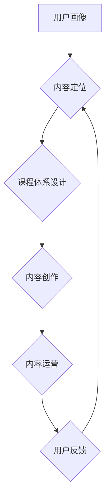

                 

## 知识付费创业的内容体系构建方法

> 关键词：知识付费、内容体系、课程体系、用户画像、内容运营、知识产权

### 1. 背景介绍

知识付费行业近年来发展迅速，成为互联网经济的新增长点。随着人们对知识的需求不断增长，以及互联网技术的发展，知识付费模式也更加多元化，从线上课程、直播带货到付费咨询等，呈现出蓬勃发展的态势。

然而，知识付费创业并非易事。想要在激烈的市场竞争中脱颖而出，需要构建一个完善的内容体系，才能吸引用户，建立忠诚度，实现可持续发展。

### 2. 核心概念与联系

**2.1 知识付费的核心概念**

知识付费是指通过付费的方式获取知识、技能和服务的商业模式。它本质上是一种价值交换，知识提供者通过分享其专业知识和经验，获得相应的经济回报，而用户则通过付费获得提升自身价值的知识和服务。

**2.2 内容体系的核心概念**

内容体系是指知识付费平台或个人在知识付费领域中，根据目标用户需求和市场趋势，精心策划、设计、生产和发布的一系列知识内容的整体架构和组织结构。

**2.3 知识付费内容体系的联系**

知识付费内容体系是知识付费创业的核心竞争力。一个完善的内容体系能够：

* **吸引目标用户：** 通过精准定位用户需求，提供符合用户兴趣和痛点的知识内容，吸引目标用户关注和付费。
* **建立用户粘性：** 通过持续更新优质内容，构建用户社区，提供互动交流平台，增强用户粘性，提高用户复购率。
* **提升品牌价值：** 通过打造专业、权威、有价值的内容品牌，提升平台或个人品牌价值，增强市场竞争力。

**2.4 内容体系构建流程图**



### 3. 核心算法原理 & 具体操作步骤

**3.1 算法原理概述**

知识付费内容体系的构建并非简单的知识堆砌，而是需要运用一定的算法原理，进行数据分析、用户画像、内容推荐等环节。

* **用户画像算法：** 通过分析用户行为数据、兴趣偏好、学习习惯等，构建用户画像，精准定位目标用户群体。
* **内容推荐算法：** 基于用户画像和内容标签，推荐用户感兴趣的内容，提高用户参与度和学习效率。
* **内容分级算法：** 根据内容难度、知识点深度等因素，对内容进行分级，满足不同用户需求。

**3.2 算法步骤详解**

1. **数据收集：** 收集用户行为数据、学习记录、反馈意见等，构建用户数据池。
2. **数据清洗：** 对收集到的数据进行清洗、去重、格式化等处理，确保数据质量。
3. **用户画像构建：** 利用机器学习算法，对用户数据进行分析，构建用户画像，包括用户年龄、性别、职业、兴趣爱好、学习习惯等。
4. **内容标签化：** 对知识内容进行标签化，例如主题、难度、知识点等，方便内容检索和推荐。
5. **内容推荐算法：** 基于用户画像和内容标签，采用协同过滤、内容过滤等算法，推荐用户感兴趣的内容。
6. **内容分级算法：** 根据内容难度、知识点深度等因素，对内容进行分级，例如初级、中级、高级等。

**3.3 算法优缺点**

* **优点：** 能够精准定位目标用户，推荐个性化内容，提高用户学习效率和参与度。
* **缺点：** 需要大量数据支持，算法模型需要不断优化，才能保证推荐效果。

**3.4 算法应用领域**

* **在线教育平台：** 推荐个性化课程、学习资源，提高用户学习体验。
* **知识付费平台：** 推荐相关知识付费产品，提升用户转化率。
* **内容创作平台：** 推荐用户感兴趣的内容，提高内容曝光率和用户互动。

### 4. 数学模型和公式 & 详细讲解 & 举例说明

**4.1 数学模型构建**

知识付费内容体系的构建可以抽象为一个数学模型，其中用户需求、内容质量、平台运营等因素都可量化，并通过公式进行计算和分析。

**4.2 公式推导过程**

例如，我们可以用以下公式来衡量用户对知识内容的满意度：

$$
满意度 = \frac{内容价值 * 用户体验}{内容价格}
$$

其中：

* 内容价值：指知识内容的实用性、原创性、深度等因素综合评估。
* 用户体验：指用户在学习过程中获得的感受，包括学习效率、互动性、平台服务等。
* 内容价格：指用户支付的知识内容费用。

**4.3 案例分析与讲解**

假设一个在线课程平台，其课程内容价值为 80 分，用户体验为 70 分，课程价格为 100 元。

根据公式计算，用户满意度为：

$$
满意度 = \frac{80 * 70}{100} = 56
$$

该数值表明用户对该课程的满意度较高。

### 5. 项目实践：代码实例和详细解释说明

**5.1 开发环境搭建**

* 操作系统：Windows/macOS/Linux
* 编程语言：Python
* 开发工具：VS Code/PyCharm
* 库依赖：pandas、numpy、scikit-learn

**5.2 源代码详细实现**

```python
import pandas as pd
from sklearn.cluster import KMeans

# 加载用户数据
user_data = pd.read_csv('user_data.csv')

# 数据预处理
# ...

# 构建用户画像
kmeans = KMeans(n_clusters=3)
user_clusters = kmeans.fit_predict(user_data)

# 将用户分配到不同的用户画像
user_data['user_cluster'] = user_clusters

# 保存用户画像数据
user_data.to_csv('user_clusters.csv', index=False)
```

**5.3 代码解读与分析**

* 该代码示例展示了如何利用机器学习算法构建用户画像。
* 首先，加载用户数据，并进行数据预处理。
* 然后，使用 KMeans 聚类算法将用户分成不同的用户群组。
* 最后，将用户分配到不同的用户画像，并保存用户画像数据。

**5.4 运行结果展示**

运行该代码后，将生成一个包含用户画像信息的 CSV 文件。

### 6. 实际应用场景

**6.1 在线教育平台**

* 根据用户画像，推荐个性化课程和学习资源。
* 为不同用户群组定制不同的学习方案和服务。
* 针对不同用户需求，开发不同类型的课程和学习工具。

**6.2 知识付费平台**

* 根据用户画像，推荐相关知识付费产品。
* 为不同用户群组提供不同的付费方案和优惠活动。
* 根据用户学习进度和反馈，调整知识付费产品的内容和价格。

**6.3 内容创作平台**

* 根据用户画像，推荐用户感兴趣的内容。
* 为不同用户群组创作不同类型的文章、视频、音频等内容。
* 根据用户反馈，优化内容创作方向和风格。

**6.4 未来应用展望**

随着人工智能技术的不断发展，知识付费内容体系的构建将更加智能化、个性化。

* **更精准的用户画像：** 利用大数据分析和深度学习算法，构建更加精准的用户画像，满足用户个性化需求。
* **更智能的内容推荐：** 基于用户行为数据和内容特征，采用更智能的推荐算法，推荐更符合用户兴趣的内容。
* **更个性化的学习体验：** 利用人工智能技术，为用户提供更个性化的学习体验，例如智能答疑、个性化学习路径等。

### 7. 工具和资源推荐

**7.1 学习资源推荐**

* **书籍：** 《数据挖掘：概念与技术》、《机器学习实战》
* **在线课程：** Coursera、edX、Udemy
* **博客和论坛：** CSDN、知乎、Stack Overflow

**7.2 开发工具推荐**

* **数据分析工具：** pandas、numpy、scikit-learn
* **机器学习平台：** TensorFlow、PyTorch
* **云计算平台：** AWS、Azure、GCP

**7.3 相关论文推荐**

* **用户画像构建：** 《基于深度学习的用户画像构建》
* **内容推荐算法：** 《基于协同过滤的个性化内容推荐算法》
* **知识付费平台：** 《知识付费平台发展趋势及挑战》

### 8. 总结：未来发展趋势与挑战

**8.1 研究成果总结**

知识付费内容体系的构建是一个复杂的系统工程，需要结合用户画像、内容推荐、算法模型等多方面因素进行设计和优化。

**8.2 未来发展趋势**

未来，知识付费内容体系将更加智能化、个性化、多元化。

* **智能化：** 利用人工智能技术，实现内容自动生成、个性化推荐、智能答疑等功能。
* **个性化：** 根据用户画像，提供更加个性化的学习方案和服务。
* **多元化：** 除了线上课程、直播带货等传统模式，还将出现更多新的知识付费形式，例如虚拟现实、增强现实等。

**8.3 面临的挑战**

知识付费内容体系的构建也面临着一些挑战。

* **数据质量：** 需要高质量的用户数据和内容数据作为基础。
* **算法模型：** 需要不断优化算法模型，提高推荐效果和用户体验。
* **知识产权：** 需要加强知识产权保护，防止知识盗版和侵权。

**8.4 研究展望**

未来，我们将继续深入研究知识付费内容体系的构建方法，探索更智能、更个性化、更有效的知识付费模式，为用户提供更优质的学习体验。

### 9. 附录：常见问题与解答

**9.1 如何构建用户画像？**

用户画像的构建需要收集用户数据，并利用机器学习算法进行分析。

**9.2 如何推荐个性化内容？**

根据用户画像和内容标签，采用协同过滤、内容过滤等算法进行个性化推荐。

**9.3 如何保护知识产权？**

可以通过技术手段、法律手段等方式保护知识产权。


作者：禅与计算机程序设计艺术 / Zen and the Art of Computer Programming 
<end_of_turn>

