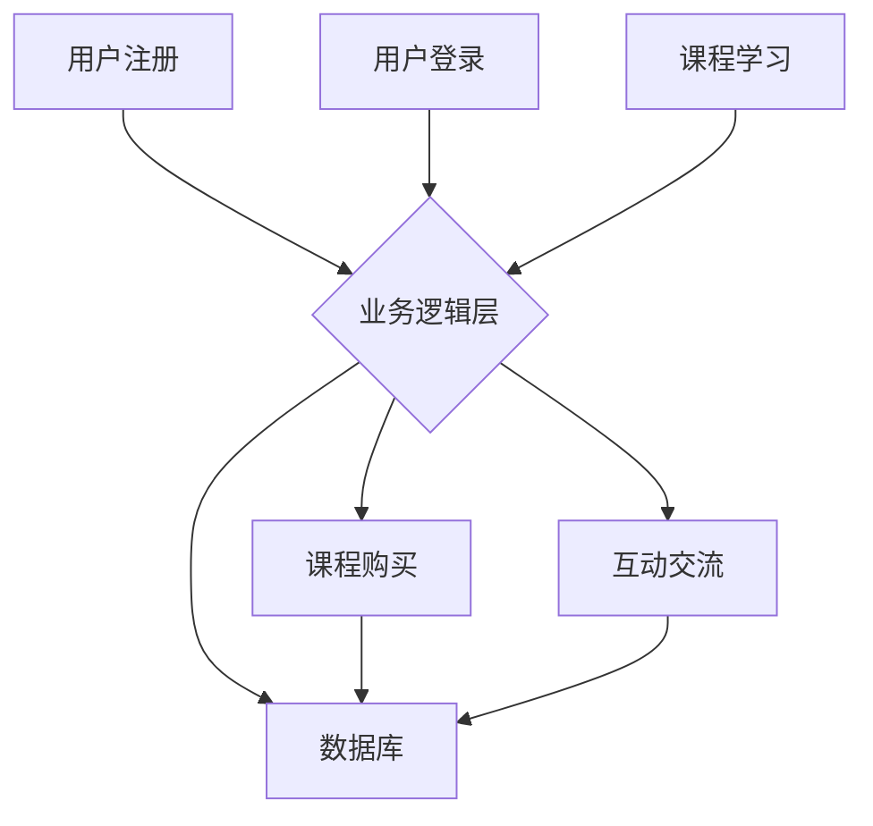

                 

## 知识付费平台搭建指南：技术篇

> 关键词：知识付费、平台搭建、技术架构、微服务、数据库、云计算、安全

### 1. 背景介绍

知识付费已成为新兴的经济模式，其核心是将知识和技能转化为有价值的商品，通过线上平台进行交易。随着互联网的普及和人们对知识的需求不断增长，知识付费平台的市场规模持续扩大。搭建一个成功的知识付费平台需要考虑多个方面，其中技术架构是至关重要的。

本指南将从技术角度出发，详细介绍知识付费平台搭建的流程、关键技术和最佳实践，帮助开发者和创业者更好地理解知识付费平台的技术建设。

### 2. 核心概念与联系

知识付费平台的核心功能包括内容发布、用户管理、支付处理、课程学习、互动交流等。这些功能之间相互关联，构成一个完整的业务流程。

**2.1 平台架构**

知识付费平台通常采用分层架构，主要包括以下几层：

* **前端层:** 用户界面，负责用户交互和内容展示。
* **业务逻辑层:** 处理用户注册、登录、课程购买、学习记录等业务逻辑。
* **数据访问层:** 与数据库交互，负责数据存储和查询。
* **基础设施层:** 提供平台运行所需的硬件、软件和网络资源。

**2.2 技术栈**

知识付费平台的技术栈通常包含以下组件：

* **前端技术:** HTML、CSS、JavaScript、React、Vue.js 等。
* **后端技术:** Python、Java、Node.js 等。
* **数据库:** MySQL、MongoDB、Redis 等。
* **消息队列:** Kafka、RabbitMQ 等。
* **云服务:** AWS、Azure、Aliyun 等。

**2.3 流程图**



### 3. 核心算法原理 & 具体操作步骤

知识付费平台中，一些核心算法对用户体验和平台运营至关重要。

**3.1 算法原理概述**

* **推荐算法:** 基于用户行为、内容特征等数据，推荐用户可能感兴趣的课程或内容。常见的推荐算法包括协同过滤、内容过滤、混合推荐等。
* **搜索算法:** 帮助用户快速找到目标课程或内容。常用的搜索算法包括关键词匹配、TF-IDF、BM25 等。
* **内容分发算法:** 根据用户偏好、课程热度等因素，决定将哪些课程推荐给哪些用户。

**3.2 算法步骤详解**

* **推荐算法:**
    1. 收集用户行为数据，例如浏览记录、购买记录、评论记录等。
    2. 分析内容特征，例如课程标题、描述、标签等。
    3. 使用推荐算法模型，根据用户行为和内容特征进行预测，推荐相关课程。
* **搜索算法:**
    1. 收集课程信息，包括标题、描述、标签等。
    2. 使用关键词匹配算法，将用户搜索关键词与课程信息进行匹配。
    3. 使用TF-IDF或BM25等算法，计算关键词在课程信息中的重要性，排序匹配结果。
* **内容分发算法:**
    1. 收集用户偏好数据，例如浏览记录、购买记录、点赞记录等。
    2. 收集课程热度数据，例如课程浏览量、购买量、评论量等。
    3. 使用内容分发算法模型，根据用户偏好和课程热度进行排序，决定将哪些课程推荐给哪些用户。

**3.3 算法优缺点**

* **推荐算法:**
    * 优点: 可以根据用户兴趣推荐个性化内容，提高用户粘性。
    * 缺点: 需要大量数据进行训练，算法效果受数据质量影响。
* **搜索算法:**
    * 优点: 可以快速找到目标内容，提高用户搜索效率。
    * 缺点: 难以捕捉用户隐含需求，搜索结果可能不精准。
* **内容分发算法:**
    * 优点: 可以根据用户偏好和课程热度，推荐更优质的内容。
    * 缺点: 需要平衡用户个性化需求和平台整体运营目标。

**3.4 算法应用领域**

* **推荐系统:** 电子商务平台、视频网站、音乐平台等。
* **搜索引擎:** Google、百度、Bing 等。
* **内容分发平台:** 新闻网站、社交媒体平台等。

### 4. 数学模型和公式 & 详细讲解 & 举例说明

**4.1 数学模型构建**

推荐算法通常使用矩阵分解模型，将用户和课程表示为低维向量，通过计算向量之间的相似度进行推荐。

**4.2 公式推导过程**

假设用户集合为U，课程集合为C，用户-课程交互矩阵为R，其中R(u,c)表示用户u对课程c的评分。

目标是学习用户向量u和课程向量c，使得预测评分与实际评分尽可能接近。

常用的损失函数为均方误差 (MSE)：

$$
MSE = \frac{1}{N} \sum_{u \in U, c \in C} (R(u,c) - \hat{R}(u,c))^2
$$

其中，$\hat{R}(u,c)$为预测评分。

**4.3 案例分析与讲解**

假设用户A对课程1评分为5，对课程2评分为3，用户B对课程1评分为4，对课程2评分为2。

可以使用矩阵分解模型学习用户向量和课程向量，并预测用户A对课程2的评分。

**4.4 举例说明**

假设学习到的用户向量为：

$$
u_A = [0.8, 0.2]
$$

$$
u_B = [-0.2, 0.8]
$$

课程向量为：

$$
c_1 = [0.6, 0.4]
$$

$$
c_2 = [0.4, 0.6]
$$

则预测评分为：

$$
\hat{R}(A,2) = u_A \cdot c_2 = 0.8 \cdot 0.4 + 0.2 \cdot 0.6 = 0.4
$$

### 5. 项目实践：代码实例和详细解释说明

**5.1 开发环境搭建**

* 操作系统: Ubuntu 20.04
* 编程语言: Python 3.8
* 框架: Django 3.2
* 数据库: PostgreSQL 13

**5.2 源代码详细实现**

```python
# models.py
from django.db import models

class Course(models.Model):
    title = models.CharField(max_length=255)
    description = models.TextField()
    price = models.DecimalField(max_digits=10, decimal_places=2)

class User(models.Model):
    username = models.CharField(max_length=255)
    password = models.CharField(max_length=255)

# views.py
from django.shortcuts import render
from .models import Course

def course_list(request):
    courses = Course.objects.all()
    return render(request, 'course_list.html', {'courses': courses})
```

**5.3 代码解读与分析**

* models.py 文件定义了课程和用户两个模型，分别对应数据库中的课程和用户表。
* views.py 文件定义了课程列表页面的视图函数，从数据库中获取所有课程数据，并将其传递给模板文件course_list.html进行渲染。

**5.4 运行结果展示**

运行上述代码，访问localhost:8000/course_list，即可看到课程列表页面。

### 6. 实际应用场景

知识付费平台可以应用于各种领域，例如：

* **教育培训:** 在线课程、职业技能培训、语言学习等。
* **专业技能:** 软件开发、设计、营销等。
* **兴趣爱好:** 摄影、绘画、音乐等。

**6.4 未来应用展望**

* **人工智能驱动的个性化推荐:** 利用人工智能技术，更加精准地推荐用户感兴趣的内容。
* **虚拟现实和增强现实:** 利用VR/AR技术，打造沉浸式的学习体验。
* **元宇宙:** 在元宇宙中构建虚拟学习空间，提供更丰富的互动体验。

### 7. 工具和资源推荐

**7.1 学习资源推荐**

* **书籍:**
    * 《Python 编程：从入门到实践》
    * 《Django 实战教程》
    * 《机器学习》
* **在线课程:**
    * Coursera
    * Udemy
    * edX

**7.2 开发工具推荐**

* **代码编辑器:** VS Code、Sublime Text
* **数据库管理工具:** pgAdmin、DataGrip
* **版本控制系统:** Git

**7.3 相关论文推荐**

* **推荐系统:**
    * "Collaborative Filtering for Implicit Feedback Datasets"
    * "Matrix Factorization Techniques for Recommender Systems"
* **机器学习:**
    * "The Elements of Statistical Learning"
    * "Deep Learning"

### 8. 总结：未来发展趋势与挑战

**8.1 研究成果总结**

知识付费平台技术不断发展，推荐算法、搜索算法、内容分发算法等核心技术取得了显著进步。

**8.2 未来发展趋势**

* **人工智能驱动:** 人工智能技术将更加深入地应用于知识付费平台，实现更精准的个性化推荐、更智能的课程内容创作和更有效的用户运营。
* **沉浸式体验:** VR/AR技术将为用户提供更沉浸式的学习体验，打破传统学习模式的局限。
* **元宇宙融合:** 元宇宙将为知识付费平台提供新的发展空间，构建虚拟学习空间，实现更丰富的互动和社交体验。

**8.3 面临的挑战**

* **数据安全和隐私保护:** 知识付费平台需要妥善处理用户数据，保障数据安全和隐私。
* **内容质量控制:** 知识付费平台需要建立有效的机制，确保平台内容的质量和可靠性。
* **商业模式创新:** 知识付费平台需要不断探索新的商业模式，实现可持续发展。

**8.4 研究展望**

未来，知识付费平台技术将继续朝着更智能、更个性化、更沉浸式的方向发展，为用户提供更优质的学习体验。


### 9. 附录：常见问题与解答

**9.1 如何选择合适的知识付费平台搭建方案？**

选择合适的知识付费平台搭建方案需要考虑以下因素：

* 平台功能需求
* 预算
* 技术团队能力
* 未来发展规划

**9.2 如何保障知识付费平台的数据安全和隐私保护？**

* 使用安全的数据库和服务器
* 加密用户数据
* 遵守相关数据安全和隐私保护法规

**9.3 如何提高知识付费平台的用户粘性？**

* 提供高质量的课程内容
* 建立良好的用户社区
* 提供个性化的学习体验

**9.4 如何进行知识付费平台的推广和营销？**

* 利用社交媒体平台进行推广
* 与相关机构合作
* 参加行业展会

作者：禅与计算机程序设计艺术 / Zen and the Art of Computer Programming 


<end_of_turn>

