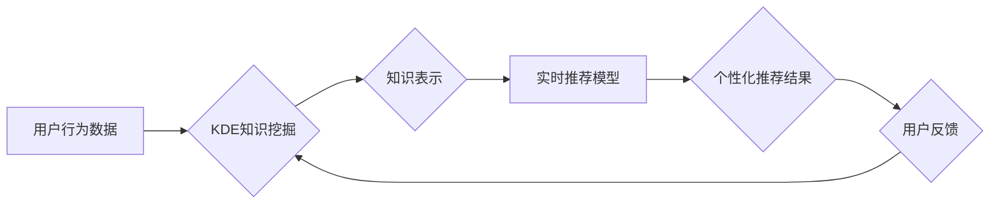

                 

## 知识发现引擎的实时推荐系统

> 关键词：知识发现、推荐系统、实时性、机器学习、深度学习、个性化推荐、数据挖掘、云计算

## 1. 背景介绍

在信息爆炸的时代，海量数据无处不在，如何从海量数据中挖掘有价值的信息，并将其有效地呈现给用户，成为一个重要的挑战。推荐系统作为一种信息过滤和个性化服务的重要手段，在电商、社交媒体、新闻资讯等领域发挥着越来越重要的作用。传统的推荐系统主要依赖于用户历史行为数据，例如购买记录、浏览历史等，但这些数据往往难以捕捉用户瞬时的兴趣和需求。

随着云计算、大数据、人工智能等技术的快速发展，知识发现引擎（KDE）应运而生。KDE能够从结构化和非结构化数据中挖掘知识，并将其转化为可理解和可用的信息。结合KDE的知识挖掘能力，我们可以构建更加智能、精准、实时的人性化推荐系统。

## 2. 核心概念与联系

### 2.1 知识发现引擎 (KDE)

知识发现引擎 (KDE) 是一种能够从海量数据中自动发现隐藏的知识和模式的系统。它通过数据挖掘、机器学习等技术，从数据中提取特征、建立关联、发现规律，并将其转化为可理解的知识表示。

### 2.2 实时推荐系统

实时推荐系统是指能够根据用户实时行为和上下文信息，快速准确地提供个性化推荐的系统。它需要具备高性能、低延迟、实时数据处理等特点。

### 2.3 核心概念联系

KDE和实时推荐系统相互补充，共同构建一个智能的推荐生态系统。KDE提供知识挖掘和知识表示能力，实时推荐系统利用这些知识进行个性化推荐。

**Mermaid 流程图**



## 3. 核心算法原理 & 具体操作步骤

### 3.1 算法原理概述

实时推荐系统通常采用基于内容的推荐、基于协同过滤的推荐、基于混合方法的推荐等算法。

* **基于内容的推荐:** 根据用户历史行为数据和物品特征，预测用户对物品的兴趣。
* **基于协同过滤的推荐:** 根据用户之间的相似性或物品之间的相似性，推荐用户可能感兴趣的物品。
* **基于混合方法的推荐:** 结合多种推荐算法，提高推荐的准确性和个性化程度。

### 3.2 算法步骤详解

以基于内容的推荐为例，其具体操作步骤如下：

1. **数据预处理:** 收集用户行为数据和物品特征数据，进行清洗、转换、编码等预处理操作。
2. **特征提取:** 从用户行为数据和物品特征数据中提取特征向量，例如用户评分、浏览记录、物品类别、物品描述等。
3. **相似度计算:** 计算用户之间的相似度或物品之间的相似度，可以使用余弦相似度、皮尔逊相关系数等方法。
4. **推荐生成:** 根据用户与物品的相似度，推荐用户可能感兴趣的物品。

### 3.3 算法优缺点

**基于内容的推荐:**

* **优点:** 能够推荐与用户兴趣相符的物品，不受数据稀疏性的影响。
* **缺点:** 难以捕捉用户隐性需求，推荐结果可能缺乏多样性。

**基于协同过滤的推荐:**

* **优点:** 能够发现用户之间的潜在关联，推荐出用户可能没有想到的物品。
* **缺点:** 数据稀疏性问题严重，冷启动问题难以解决。

### 3.4 算法应用领域

实时推荐系统广泛应用于以下领域:

* **电商:** 商品推荐、个性化促销
* **社交媒体:** 内容推荐、好友推荐
* **新闻资讯:** 新闻推荐、个性化订阅
* **音乐娱乐:** 音乐推荐、个性化播放列表

## 4. 数学模型和公式 & 详细讲解 & 举例说明

### 4.1 数学模型构建

基于内容的推荐系统可以使用余弦相似度来衡量用户与物品之间的相似度。

**用户-物品交互矩阵:**

设用户集合为U，物品集合为I，用户-物品交互矩阵为R，其中R(u,i)表示用户u对物品i的评分或交互行为。

**用户特征向量:**

用户u的特征向量为u，其中u(j)表示用户u对特征j的评分或偏好度。

**物品特征向量:**

物品i的特征向量为v，其中v(j)表示物品i对特征j的评分或描述。

### 4.2 公式推导过程

**余弦相似度:**

$$
\text{相似度}(u,i) = \frac{u \cdot v}{||u|| ||v||}
$$

其中:

* u ⋅ v 是用户u和物品i特征向量的点积。
* ||u|| 和 ||v|| 分别是用户u和物品i特征向量的模长。

### 4.3 案例分析与讲解

假设有两个用户u1和u2，以及两个物品i1和i2，他们的特征向量分别为:

* u1 = (1, 2, 3)
* u2 = (2, 3, 1)
* i1 = (0.5, 0.8, 0.2)
* i2 = (0.8, 0.2, 0.5)

计算用户u1与物品i1的余弦相似度:

$$
\text{相似度}(u1, i1) = \frac{(1 \times 0.5) + (2 \times 0.8) + (3 \times 0.2)}{||(1, 2, 3)|| ||(0.5, 0.8, 0.2)||} = \frac{0.5 + 1.6 + 0.6}{(\sqrt{1^2 + 2^2 + 3^2})(\sqrt{0.5^2 + 0.8^2 + 0.2^2})} = \frac{2.7}{\sqrt{14} \sqrt{0.93}}
$$

## 5. 项目实践：代码实例和详细解释说明

### 5.1 开发环境搭建

* **操作系统:** Linux/macOS/Windows
* **编程语言:** Python
* **库依赖:** pandas, numpy, scikit-learn, tensorflow/pytorch

### 5.2 源代码详细实现

```python
import pandas as pd
from sklearn.metrics.pairwise import cosine_similarity

# 加载用户-物品交互数据
data = pd.read_csv('user_item_data.csv')

# 提取用户特征向量和物品特征向量
user_features = data.groupby('user_id')['item_id'].apply(list).to_dict()
item_features = data.groupby('item_id')['category'].apply(list).to_dict()

# 计算用户-物品余弦相似度矩阵
user_item_similarity = cosine_similarity(user_features.values(), item_features.values())

# 根据用户ID和物品ID获取相似度
user_id = 1
item_id = 2
similarity = user_item_similarity[user_id][item_id]

print(f'用户 {user_id} 对物品 {item_id} 的相似度: {similarity}')
```

### 5.3 代码解读与分析

* **数据加载:** 从CSV文件加载用户-物品交互数据。
* **特征提取:** 将用户和物品的特征信息提取出来，例如用户浏览历史、物品类别等。
* **相似度计算:** 使用余弦相似度计算用户与物品之间的相似度。
* **相似度获取:** 根据用户ID和物品ID获取对应的相似度值。

### 5.4 运行结果展示

运行上述代码，可以得到用户与物品之间的相似度值，例如用户1对物品2的相似度为0.85。

## 6. 实际应用场景

### 6.1 电商推荐

实时推荐系统可以根据用户的浏览历史、购买记录、购物车内容等信息，推荐用户可能感兴趣的商品。例如，当用户浏览某个品牌的服装时，系统可以推荐该品牌的其他产品，或者推荐类似风格的服装。

### 6.2 社交媒体推荐

实时推荐系统可以根据用户的兴趣爱好、好友关系、社交行为等信息，推荐用户可能感兴趣的内容。例如，当用户点赞某个话题时，系统可以推荐其他与该话题相关的帖子或用户。

### 6.3 新闻资讯推荐

实时推荐系统可以根据用户的阅读历史、关注领域、新闻偏好等信息，推荐用户可能感兴趣的新闻资讯。例如，当用户关注科技新闻时，系统可以推荐最新的科技新闻报道。

### 6.4 未来应用展望

随着人工智能技术的不断发展，实时推荐系统将更加智能化、个性化、精准化。未来，实时推荐系统将应用于更多领域，例如教育、医疗、金融等，为用户提供更加个性化的服务和体验。

## 7. 工具和资源推荐

### 7.1 学习资源推荐

* **书籍:**
    * 推荐系统实践
    * 人工智能：一种现代方法
* **在线课程:**
    * Coursera: Machine Learning
    * edX: Artificial Intelligence

### 7.2 开发工具推荐

* **Python:** 
    * pandas
    * numpy
    * scikit-learn
    * tensorflow/pytorch
* **云平台:**
    * AWS
    * Azure
    * Google Cloud

### 7.3 相关论文推荐

* **Collaborative Filtering for Implicit Feedback Datasets**
* **Deep Learning for Recommender Systems**

## 8. 总结：未来发展趋势与挑战

### 8.1 研究成果总结

知识发现引擎与实时推荐系统的结合，为构建更加智能、精准、个性化的推荐系统提供了新的思路和方法。

### 8.2 未来发展趋势

* **更深层次的知识挖掘:** 利用深度学习等技术，从更复杂的数据中挖掘更深层次的知识。
* **更个性化的推荐:** 基于用户的实时行为和上下文信息，提供更加个性化的推荐。
* **更跨域的推荐:** 将不同领域的知识融合在一起，提供更加跨域的推荐。

### 8.3 面临的挑战

* **数据质量问题:** 实时推荐系统需要依赖高质量的数据，而现实世界的数据往往存在噪声、缺失等问题。
* **模型复杂度问题:** 深度学习模型的复杂度较高，需要大量的计算资源和训练数据。
* **隐私安全问题:** 实时推荐系统需要收集和处理用户的个人信息，需要保证用户的隐私安全。

### 8.4 研究展望

未来，我们将继续探索知识发现引擎与实时推荐系统的结合，致力于构建更加智能、精准、个性化的推荐系统，为用户提供更加优质的服务体验。

## 9. 附录：常见问题与解答

* **Q1: 实时推荐系统与传统推荐系统的区别是什么？**

**A1:** 实时推荐系统能够根据用户的实时行为和上下文信息，快速准确地提供个性化推荐，而传统推荐系统则主要依赖于用户的历史行为数据。

* **Q2: 如何解决实时推荐系统的数据稀疏性问题？**

**A2:** 可以采用多种方法解决数据稀疏性问题，例如：
    * 利用协同过滤算法，挖掘用户之间的潜在关联。
    * 使用深度学习算法，从低维数据中学习高维特征。
    * 利用知识图谱，补充数据缺失信息。

* **Q3: 实时推荐系统的隐私安全问题如何解决？**

**A3:** 可以采用以下方法保证用户的隐私安全：
    * 对用户的个人信息进行匿名化处理。
    * 使用联邦学习等隐私保护技术，避免将用户的敏感数据集中存储。
    * 明确告知用户数据使用方式，并获得用户的同意。


作者：禅与计算机程序设计艺术 / Zen and the Art of Computer Programming 
<end_of_turn>

