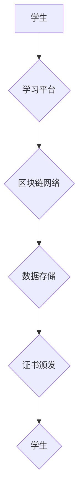

                 

## 关键词：区块链，分布式存储，教育技术，数字证书，知识产权，数据安全，去中心化

## 1. 背景介绍

教育领域一直致力于提升学习体验、保障知识获取的公平性和有效性。然而，传统的教育模式面临着诸多挑战，例如信息孤岛、知识产权保护不足、数据安全隐患等。随着区块链技术的快速发展，其去中心化、透明、不可篡改等特性为教育领域带来了新的机遇。

区块链技术是一种分布式账本技术，它将数据存储在多个节点上，并通过加密算法和共识机制保证数据的安全性和完整性。这种去中心化的架构能够有效解决传统教育模式中的痛点，为教育领域带来革命性的变革。

## 2. 核心概念与联系

### 2.1 区块链技术概述

区块链技术的核心概念包括：

* **区块：** 存储数据的基本单元，包含交易记录、时间戳和哈希值等信息。
* **链：** 多个区块通过哈希值链接形成的链条结构，保证数据的完整性和不可篡改性。
* **节点：** 网络中的参与者，负责存储区块链数据并验证交易。
* **共识机制：** 节点之间达成一致的算法，确保区块链数据的有效性和安全性。

### 2.2 区块链与教育的联系

区块链技术可以应用于教育领域的多个方面，例如：

* **数字证书：** 利用区块链技术颁发不可篡改的数字证书，保障证书的真实性和有效性。
* **知识产权保护：** 将教育资源的版权信息存储在区块链上，防止知识盗版和侵权行为。
* **数据安全：** 利用区块链技术的加密算法和分布式存储特性，保障学生数据和教育资源的安全。
* **去中心化学习平台：** 建立去中心化的学习平台，让学生和教师能够直接交互，打破传统教育模式的限制。

**Mermaid 流程图**



## 3. 核心算法原理 & 具体操作步骤

### 3.1 算法原理概述

区块链技术的核心算法包括：

* **哈希算法：** 将数据转换为固定长度的哈希值，保证数据的完整性和不可篡改性。
* **加密算法：** 对数据进行加密，保障数据的安全性和隐私性。
* **共识机制：** 节点之间达成一致的算法，确保区块链数据的有效性和安全性。

### 3.2 算法步骤详解

1. **数据打包：** 将多个交易记录打包成一个区块。
2. **哈希值计算：** 对区块内容进行哈希值计算，生成区块的哈希值。
3. **区块链接：** 将新区块链接到区块链上，并通过哈希值连接到前一个区块。
4. **共识机制验证：** 节点通过共识机制验证新区块的有效性。
5. **区块添加：** 验证通过的新区块被添加到区块链上。

### 3.3 算法优缺点

**优点：**

* **去中心化：** 数据分布在多个节点上，不存在单点故障。
* **透明：** 所有交易记录都公开透明，可追溯。
* **安全：** 加密算法和哈希算法保证数据的安全性和完整性。
* **不可篡改：** 数据一旦写入区块链，无法修改。

**缺点：**

* **性能：** 区块链的处理能力有限，无法处理大量交易。
* **可扩展性：** 区块链的规模有限，难以扩展到更大的网络。
* **监管：** 区块链的去中心化特性也带来监管挑战。

### 3.4 算法应用领域

区块链技术广泛应用于金融、供应链、医疗等领域，在教育领域也展现出巨大的潜力。

## 4. 数学模型和公式 & 详细讲解 & 举例说明

### 4.1 数学模型构建

区块链的数学模型主要基于密码学、图论和概率论。

* **密码学：** 用于加密和解密数据，保证数据的安全性和隐私性。
* **图论：** 用于描述区块链的网络结构，分析节点之间的关系。
* **概率论：** 用于分析共识机制的安全性，评估区块链的可靠性。

### 4.2 公式推导过程

区块链中的哈希函数可以表示为：

$$H(x) = y$$

其中，$x$ 是输入数据，$y$ 是哈希值。哈希函数具有以下特性：

* **单向性：** 很难从哈希值推导出原始数据。
* **抗碰撞性：** 很难找到两个不同的输入数据，产生相同的哈希值。

### 4.3 案例分析与讲解

假设Alice想要向Bob发送一个数字证书。Alice将证书信息打包成一个区块，并使用哈希函数计算出区块的哈希值。然后，Alice将区块广播到区块链网络中。

节点们验证区块的有效性后，将区块添加到区块链上。Bob可以通过查询区块链，验证证书的真实性和有效性。

## 5. 项目实践：代码实例和详细解释说明

### 5.1 开发环境搭建

* **操作系统：** Linux 或 macOS
* **编程语言：** Python 或 Go
* **区块链框架：** Hyperledger Fabric 或 Ethereum

### 5.2 源代码详细实现

```python
# 使用 Hyperledger Fabric 示例代码

# 定义证书结构
class Certificate:
    def __init__(self, issuer, subject, data):
        self.issuer = issuer
        self.subject = subject
        self.data = data

# 生成证书哈希值
def generate_certificate_hash(certificate):
    # 使用哈希算法计算证书哈希值
    return hashlib.sha256(certificate.to_bytes()).hexdigest()

# 将证书添加到区块链
def add_certificate_to_blockchain(certificate):
    # 使用区块链框架的 API 将证书添加到区块链
    # ...

# 验证证书的有效性
def verify_certificate(certificate):
    # 使用区块链框架的 API 查询证书信息
    # ...
    # 验证证书哈希值和区块链上的信息一致性
    # ...
```

### 5.3 代码解读与分析

* **Certificate 类：** 定义了数字证书的结构，包含颁发者、持有者和证书数据。
* **generate_certificate_hash 函数：** 使用哈希算法计算证书的哈希值。
* **add_certificate_to_blockchain 函数：** 使用区块链框架的 API 将证书添加到区块链。
* **verify_certificate 函数：** 使用区块链框架的 API 查询证书信息，并验证证书的有效性。

### 5.4 运行结果展示

运行代码后，证书将被添加到区块链上，并生成一个唯一的证书哈希值。Bob可以通过查询区块链，验证证书的真实性和有效性。

## 6. 实际应用场景

### 6.1 数字证书颁发

区块链技术可以用于颁发不可篡改的数字证书，例如学历证书、职业资格证书等。

### 6.2 知识产权保护

区块链技术可以用于存储和管理知识产权信息，防止知识盗版和侵权行为。

### 6.3 数据安全

区块链技术的加密算法和分布式存储特性可以保障学生数据和教育资源的安全。

### 6.4 未来应用展望

* **去中心化学习平台：** 建立去中心化的学习平台，让学生和教师能够直接交互，打破传统教育模式的限制。
* **个性化学习：** 利用区块链技术记录学生的学习进度和成绩，为学生提供个性化的学习方案。
* **教育资源共享：** 利用区块链技术建立教育资源共享平台，促进教育资源的流通和共享。

## 7. 工具和资源推荐

### 7.1 学习资源推荐

* **区块链技术入门书籍：** 《区块链：革命性的分布式账本技术》
* **在线课程：** Coursera、edX 等平台提供区块链技术相关的在线课程。
* **技术博客：** Coindesk、Bitcoin Magazine 等技术博客提供区块链技术相关的最新资讯和技术分析。

### 7.2 开发工具推荐

* **Hyperledger Fabric：** 一个开源的企业级区块链框架。
* **Ethereum：** 一个开源的公共区块链平台。
* **Truffle Suite：** 一个用于开发和测试以太坊智能合约的工具套件。

### 7.3 相关论文推荐

* **"Blockchain Technology for Education"**
* **"Decentralized Learning Platforms Based on Blockchain"**
* **"Secure and Transparent Data Management in Education Using Blockchain"**

## 8. 总结：未来发展趋势与挑战

### 8.1 研究成果总结

区块链技术在教育领域的应用潜力巨大，可以解决传统教育模式中的痛点，提升学习体验和保障知识获取的公平性和有效性。

### 8.2 未来发展趋势

* **去中心化教育平台的普及：** 区块链技术将推动去中心化教育平台的普及，让学生和教师能够直接交互，打破传统教育模式的限制。
* **个性化学习的兴起：** 区块链技术将记录学生的学习进度和成绩，为学生提供个性化的学习方案。
* **教育资源共享的加速：** 区块链技术将建立教育资源共享平台，促进教育资源的流通和共享。

### 8.3 面临的挑战

* **技术成熟度：** 区块链技术还处于发展初期，需要进一步的技术成熟和完善。
* **监管政策：** 区块链技术的去中心化特性也带来监管挑战，需要制定相应的政策法规。
* **公众认知：** 公众对区块链技术的认知度还比较低，需要加强宣传和普及。

### 8.4 研究展望

未来，区块链技术在教育领域的应用将更加广泛和深入，为教育领域带来革命性的变革。

## 9. 附录：常见问题与解答

**Q1：区块链技术是否真的可以保障数据安全？**

A1：区块链技术的加密算法和分布式存储特性可以有效保障数据安全，但并非绝对安全。

**Q2：区块链技术是否适用于所有类型的教育资源？**

A2：区块链技术可以应用于多种类型的教育资源，例如数字证书、课程资料、研究成果等。

**Q3：区块链技术在教育领域的应用需要哪些资源和技术支持？**

A3：区块链技术的应用需要一定的技术支持，例如区块链框架、开发工具、专业人才等。


作者：禅与计算机程序设计艺术 / Zen and the Art of Computer Programming 
<end_of_turn>

