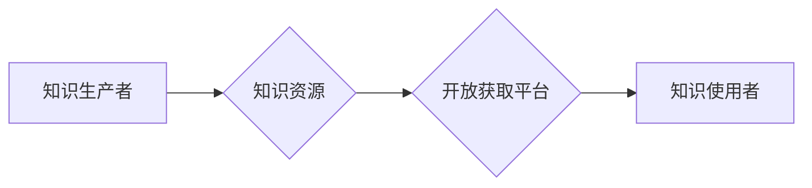

                 

## 知识的开放获取：消除信息鸿沟的努力

> 关键词：开放获取、知识共享、信息鸿沟、人工智能、数据驱动、可持续发展、数字平等

## 1. 背景介绍

在当今信息爆炸的时代，知识已成为人类社会发展最宝贵的资源。然而，知识的获取和传播却面临着诸多挑战。信息鸿沟，即不同社会群体对信息资源的获取和利用能力存在巨大差异，正在阻碍全球社会进步和可持续发展。

传统知识获取模式往往依赖于付费订阅、封闭的学术期刊和知识库，这导致知识获取成本高昂，且对资源有限的群体更加不利。同时，知识的碎片化和分散性也加剧了信息获取的难度。

近年来，随着互联网和人工智能技术的飞速发展，开放获取（Open Access）理念逐渐兴起，并取得了显著进展。开放获取倡导知识的免费获取、使用、复制和传播，旨在打破知识壁垒，促进知识共享和普惠。

## 2. 核心概念与联系

开放获取的核心概念是知识的自由流动和共享。它基于以下几个关键原则：

* **免费获取：** 知识资源应免费向公众开放，无需支付任何费用。
* **开放使用：** 知识资源可被任何人自由使用、复制、修改和传播。
* **知识共享：** 知识资源的创建者应鼓励他人基于其作品进行二次创作和分享。

**Mermaid 流程图**



开放获取与人工智能技术的结合，进一步推动了知识的开放获取和共享。人工智能可以帮助自动识别、分类和组织知识资源，提高知识的发现性和利用效率。同时，人工智能也可以帮助构建个性化知识推荐系统，根据用户的需求和兴趣提供更精准的知识服务。

## 3. 核心算法原理 & 具体操作步骤

### 3.1  算法原理概述

开放获取的核心算法原理主要包括：

* **知识图谱构建算法：** 用于构建知识图谱，将知识资源以结构化的形式表示，方便知识的检索和推理。
* **知识推荐算法：** 用于根据用户的兴趣和需求，推荐相关的知识资源。
* **知识发现算法：** 用于从海量知识资源中发现新的知识和模式。

### 3.2  算法步骤详解

**知识图谱构建算法**

1. **数据收集：** 从各种来源收集知识数据，例如文本、图像、音频等。
2. **数据预处理：** 对收集到的数据进行清洗、格式化和标准化处理。
3. **实体识别和关系抽取：** 使用自然语言处理技术识别知识图谱中的实体和关系。
4. **知识图谱构建：** 将识别出的实体和关系连接起来，构建知识图谱。

**知识推荐算法**

1. **用户建模：** 根据用户的历史行为、兴趣偏好等信息构建用户模型。
2. **物品建模：** 根据知识资源的属性、内容等信息构建物品模型。
3. **推荐策略：** 使用协同过滤、内容过滤、基于知识的推荐等策略，根据用户模型和物品模型生成推荐结果。

**知识发现算法**

1. **数据挖掘：** 使用数据挖掘技术从知识资源中发现隐藏的模式和规律。
2. **知识推理：** 使用逻辑推理和规则引擎，从已知的知识中推导出新的知识。
3. **知识表示：** 将发现的知识以可理解的形式表示出来，例如知识图谱、文本描述等。

### 3.3  算法优缺点

**知识图谱构建算法**

* **优点：** 可以将知识资源以结构化的形式表示，方便知识的检索和推理。
* **缺点：** 构建知识图谱需要大量的语料和人工标注，成本较高。

**知识推荐算法**

* **优点：** 可以根据用户的兴趣和需求推荐相关的知识资源，提高知识的发现性和利用效率。
* **缺点：** 推荐结果可能存在偏差，例如冷启动问题和过滤泡问题。

**知识发现算法**

* **优点：** 可以从海量知识资源中发现新的知识和模式，推动知识创新。
* **缺点：** 知识发现是一个复杂的任务，需要结合多种算法和技术手段。

### 3.4  算法应用领域

开放获取算法在各个领域都有广泛的应用，例如：

* **教育：** 提供个性化学习资源和知识推荐服务。
* **科研：** 促进科研成果的共享和传播，加速科学发现。
* **医疗：** 帮助医生诊断疾病、制定治疗方案，提高医疗服务质量。
* **文化遗产保护：** 数字化和开放获取文化遗产资源，促进文化传承和交流。

## 4. 数学模型和公式 & 详细讲解 & 举例说明

### 4.1  数学模型构建

开放获取算法的数学模型通常基于图论、概率论和机器学习等数学基础。

**知识图谱构建算法**

知识图谱可以表示为一个图结构，其中节点代表实体，边代表关系。

**图论模型：**

* **节点：** 实体
* **边：** 关系

**概率模型：**

* **节点概率分布：** 描述实体出现的概率。
* **边概率分布：** 描述关系出现的概率。

**机器学习模型：**

* **分类模型：** 用于识别实体和关系类型。
* **聚类模型：** 用于将实体和关系进行分组。

### 4.2  公式推导过程

**知识推荐算法**

协同过滤算法是一种常用的知识推荐算法，其核心思想是基于用户的相似度和物品的相似度进行推荐。

**相似度计算公式：**

$$
Sim(u,v) = \frac{\sum_{i \in I(u) \cap I(v)} r_{ui} \cdot r_{vi}}{\sqrt{\sum_{i \in I(u)} r_{ui}^2} \cdot \sqrt{\sum_{i \in I(v)} r_{vi}^2}}
$$

其中：

* $u$ 和 $v$ 表示两个用户。
* $I(u)$ 和 $I(v)$ 表示用户 $u$ 和 $v$ 评分过的物品集合。
* $r_{ui}$ 表示用户 $u$ 对物品 $i$ 的评分。

### 4.3  案例分析与讲解

**知识发现算法**

假设我们有一个关于疾病的知识库，其中包含了疾病的症状、病因、治疗方法等信息。我们可以使用关联规则挖掘算法，从知识库中发现疾病之间的关联关系。

例如，我们可以发现“咳嗽”和“感冒”之间存在关联关系，即如果一个人咳嗽，那么他很可能患有感冒。

## 5. 项目实践：代码实例和详细解释说明

### 5.1  开发环境搭建

* **操作系统：** Ubuntu 20.04 LTS
* **编程语言：** Python 3.8
* **开发工具：** Jupyter Notebook
* **库依赖：**

```
pip install networkx rdflib scikit-learn
```

### 5.2  源代码详细实现

```python
# 知识图谱构建示例代码

import networkx as nx

# 创建知识图谱
graph = nx.Graph()

# 添加实体和关系
graph.add_node("疾病A")
graph.add_node("症状B")
graph.add_node("病因C")
graph.add_edge("疾病A", "症状B")
graph.add_edge("疾病A", "病因C")

# 打印知识图谱
print(graph.nodes())
print(graph.edges())
```

### 5.3  代码解读与分析

* **网络X库：** 用于构建和操作图结构。
* **添加节点和边：** 使用 `add_node()` 和 `add_edge()` 方法添加实体和关系到知识图谱中。
* **打印知识图谱：** 使用 `nodes()` 和 `edges()` 方法打印知识图谱中的节点和边。

### 5.4  运行结果展示

```
['疾病A', '症状B', '病因C']
[('疾病A', '症状B'), ('疾病A', '病因C')]
```

## 6. 实际应用场景

开放获取技术已在各个领域取得了显著应用，例如：

* **教育：** 开放获取的教材、学习资源和在线课程，使教育更加平等和可负担。
* **科研：** 开放获取的科研数据和论文，促进科研成果的共享和复现，加速科学发现。
* **医疗：** 开放获取的医疗数据和知识，帮助医生诊断疾病、制定治疗方案，提高医疗服务质量。
* **文化遗产保护：** 开放获取的文化遗产资源，促进文化传承和交流，保护人类文明遗产。

### 6.4  未来应用展望

未来，开放获取技术将继续推动知识的自由流动和共享，并与人工智能、大数据等新兴技术深度融合，为人类社会带来更多福祉。

## 7. 工具和资源推荐

### 7.1  学习资源推荐

* **开放获取联盟 (OA2020)：** https://www.oalib.org/
* **知识共享 (Creative Commons)：** https://creativecommons.org/
* **开放科学框架 (OSF)：** https://osf.io/

### 7.2  开发工具推荐

* **网络X (NetworkX)：** https://networkx.org/
* **RDFlib：** https://rdflib.readthedocs.io/en/stable/
* **Scikit-learn：** https://scikit-learn.org/stable/

### 7.3  相关论文推荐

* **The Open Access Movement: A Review of the Literature**
* **Open Access to Research: Benefits, Challenges, and Opportunities**
* **The Impact of Open Access on Scientific Research**

## 8. 总结：未来发展趋势与挑战

### 8.1  研究成果总结

开放获取技术已取得了显著进展，为知识的自由流动和共享提供了重要的技术支撑。

### 8.2  未来发展趋势

* **人工智能与开放获取的融合：** 人工智能将进一步推动开放获取技术的发展，例如自动生成知识图谱、个性化知识推荐等。
* **跨学科知识共享：** 开放获取将跨越学科界限，促进不同领域知识的共享和融合。
* **数字平等与可持续发展：** 开放获取将助力实现数字平等，促进可持续发展。

### 8.3  面临的挑战

* **知识版权和知识产权保护：** 如何平衡开放获取和知识产权保护，是一个需要认真思考的问题。
* **数据质量和可信度：** 开放获取的数据质量和可信度需要得到保障，才能保证知识的有效利用。
* **技术标准和互操作性：** 需要建立统一的技术标准和互操作性机制，促进不同平台和系统的知识共享。

### 8.4  研究展望

未来，开放获取技术将继续发展和完善，为人类社会带来更多福祉。我们需要加强对开放获取技术的研发和应用，并积极推动开放获取理念的普及和推广。

## 9. 附录：常见问题与解答

* **什么是开放获取？**

开放获取是指知识资源的免费获取、使用、复制和传播。

* **开放获取有哪些优势？**

开放获取可以促进知识共享，提高知识的发现性和利用效率，推动科学进步和社会发展。

* **如何参与开放获取？**

您可以通过发布开放获取的知识资源、使用开放获取的平台和工具、支持开放获取的政策和倡议等方式参与开放获取。


作者：禅与计算机程序设计艺术 / Zen and the Art of Computer Programming<end_of_turn>

