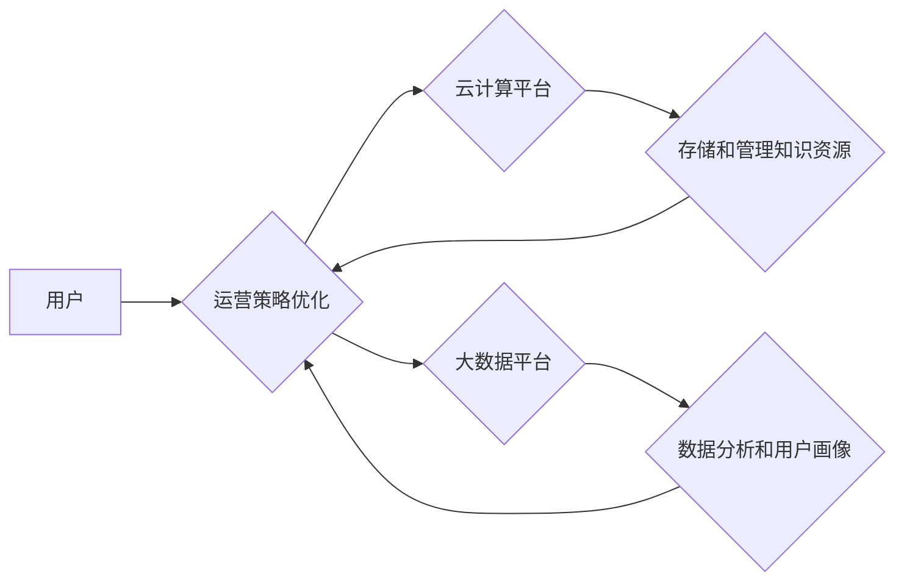

                 

## 知识经济下知识付费的云计算与大数据服务

> 关键词：知识付费、云计算、大数据、人工智能、机器学习、数据分析、知识服务平台

## 1. 背景介绍

随着互联网技术的飞速发展和数字经济的蓬勃兴起，知识已成为重要的生产要素，知识经济时代正式到来。在这个时代，知识的获取、传播和应用变得更加便捷和高效，知识付费也随之成为一种新的商业模式，并迅速发展壮大。

知识付费是指以知识为核心产品，通过线上线下等多种渠道，向用户提供付费获取知识服务的模式。它涵盖了各种形式的知识产品，例如在线课程、付费文章、知识问答、咨询服务等。

云计算和大数据技术作为数字经济的重要基础设施，为知识付费的发展提供了强大的技术支撑。云计算提供弹性、可扩展的计算资源和存储空间，大数据技术则能够帮助知识付费平台进行海量数据分析，挖掘用户需求，提供个性化服务。

## 2. 核心概念与联系

### 2.1 云计算

云计算是指通过互联网，按需提供计算资源、存储空间、网络带宽等服务的模式。它具有以下特点：

* **按需自服务:** 用户可以根据自身需求，随时随地获取所需的资源。
* **弹性伸缩:** 云计算资源可以根据用户需求动态调整，实现弹性伸缩。
* **资源池化:** 云计算资源被池化管理，可以根据用户需求进行分配。
* **快速部署:** 云计算平台可以快速部署应用程序和服务。
* **高可用性:** 云计算平台具有高可用性和容错能力，可以确保服务稳定运行。

### 2.2 大数据

大数据是指海量、高速度、高多样性的数据。它具有以下特点：

* **海量:** 大数据规模庞大，难以用传统方法进行处理。
* **高速度:** 大数据产生和更新速度非常快。
* **高多样性:** 大数据来自各种来源，类型多样。

### 2.3 知识付费与云计算与大数据的关系

知识付费平台可以利用云计算和大数据技术，实现以下功能：

* **存储和管理海量知识资源:** 云计算平台可以提供海量存储空间，用于存储各种形式的知识资源，例如视频课程、音频文件、电子书等。
* **个性化推荐:** 大数据分析可以帮助平台了解用户的学习兴趣和需求，并提供个性化的知识推荐。
* **实时互动:** 云计算平台可以提供实时互动功能，例如在线直播、问答论坛等，帮助用户更好地学习和交流。
* **数据分析和运营:** 大数据分析可以帮助平台了解用户的学习行为和付费意愿，并优化运营策略。

**Mermaid 流程图**



## 3. 核心算法原理 & 具体操作步骤

### 3.1 算法原理概述

知识付费平台的推荐算法通常基于用户的行为数据和知识资源的特征数据，通过机器学习模型学习用户偏好，并预测用户对特定知识资源的兴趣。常见的推荐算法包括：

* **协同过滤:** 基于用户的历史行为数据，预测用户对未接触过的知识资源的兴趣。
* **内容过滤:** 基于知识资源的特征数据，推荐与用户兴趣相符的知识资源。
* **混合推荐:** 结合协同过滤和内容过滤算法，提高推荐效果。

### 3.2 算法步骤详解

以协同过滤算法为例，其具体操作步骤如下：

1. **数据收集:** 收集用户的行为数据，例如用户浏览过的知识资源、购买过的知识资源、评分过的知识资源等。
2. **数据预处理:** 对收集到的数据进行清洗、转换和特征提取，例如将用户行为数据转换为用户-知识资源评分矩阵。
3. **模型训练:** 使用协同过滤算法训练模型，例如基于用户的协同过滤或基于物品的协同过滤。
4. **推荐生成:** 根据训练好的模型，预测用户对未接触过的知识资源的兴趣，并生成推荐列表。

### 3.3 算法优缺点

**协同过滤算法的优点:**

* 可以发现用户之间的隐性关联，推荐个性化内容。
* 不需要事先对知识资源进行分类或标注。

**协同过滤算法的缺点:**

* 数据稀疏性问题: 当用户行为数据稀疏时，算法效果会下降。
* 冷启动问题: 新用户或新知识资源难以获得推荐。

### 3.4 算法应用领域

协同过滤算法广泛应用于以下领域:

* 电子商务: 商品推荐
* 在线视频: 视频推荐
* 音乐平台: 音乐推荐
* 社交网络: 朋友推荐

## 4. 数学模型和公式 & 详细讲解 & 举例说明

### 4.1 数学模型构建

协同过滤算法的核心是用户-知识资源评分矩阵，该矩阵表示用户对不同知识资源的评分。假设有N个用户和M个知识资源，则用户-知识资源评分矩阵可以表示为一个N×M的矩阵R，其中R(i,j)表示用户i对知识资源j的评分。

### 4.2 公式推导过程

基于用户的协同过滤算法的目标是预测用户i对知识资源j的评分R(i,j)。可以使用以下公式进行预测:

$$R(i,j) = \bar{R}_i + \frac{\sum_{k \in N(i)} (R(i,k) - \bar{R}_i) (R(j,k) - \bar{R}_j)}{\sum_{k \in N(i)} (R(i,k) - \bar{R}_i)^2}$$

其中:

* $\bar{R}_i$ 是用户i的平均评分。
* $\bar{R}_j$ 是知识资源j的平均评分。
* $N(i)$ 是与用户i相似的用户集合。

### 4.3 案例分析与讲解

假设有三个用户和三个知识资源，用户-知识资源评分矩阵如下:

| 用户 | 资源1 | 资源2 | 资源3 |
|---|---|---|---|
| 用户1 | 5 | 3 | 4 |
| 用户2 | 4 | 5 | 2 |
| 用户3 | 3 | 4 | 5 |

我们可以使用上述公式预测用户1对资源3的评分。

首先计算用户1的平均评分: $\bar{R}_1 = (5+3+4)/3 = 4$

然后计算与用户1相似的用户集合，例如用户2。

最后，将上述信息代入公式进行计算，得到用户1对资源3的预测评分。

## 5. 项目实践：代码实例和详细解释说明

### 5.1 开发环境搭建

* Python 3.x
* scikit-learn
* pandas
* numpy

### 5.2 源代码详细实现

```python
import pandas as pd
from sklearn.metrics.pairwise import cosine_similarity

# 加载用户-知识资源评分矩阵
ratings_data = pd.read_csv('ratings.csv')

# 计算用户之间的余弦相似度
user_similarity = cosine_similarity(ratings_data)

# 预测用户对知识资源的评分
def predict_rating(user_id, item_id):
    # 获取用户相似用户集合
    similar_users = user_similarity[user_id].argsort()[:-10:-1]
    # 计算预测评分
    predicted_rating = 0
    for similar_user in similar_users:
        if ratings_data.loc[similar_user, item_id] is not None:
            predicted_rating += ratings_data.loc[similar_user, item_id]
    return predicted_rating / len(similar_users)

# 预测用户1对资源3的评分
predicted_rating = predict_rating(0, 2)
print(f'预测用户1对资源3的评分: {predicted_rating}')
```

### 5.3 代码解读与分析

* 代码首先加载用户-知识资源评分矩阵。
* 然后使用余弦相似度计算用户之间的相似度。
* 预测评分函数 `predict_rating` 接收用户ID和知识资源ID作为参数，并根据用户相似度计算预测评分。
* 最后，代码预测用户1对资源3的评分。

### 5.4 运行结果展示

运行上述代码，可以得到用户1对资源3的预测评分。

## 6. 实际应用场景

知识付费平台可以利用云计算和大数据技术，实现以下功能:

* **个性化推荐:** 根据用户的学习兴趣和需求，推荐个性化的知识资源。
* **实时互动:** 提供在线直播、问答论坛等功能，帮助用户更好地学习和交流。
* **数据分析和运营:** 分析用户的学习行为和付费意愿，优化运营策略。

## 7. 工具和资源推荐

### 7.1 学习资源推荐

* **书籍:**
    * 《推荐系统实践》
    * 《机器学习》
* **在线课程:**
    * Coursera: 机器学习
    * edX: 数据科学

### 7.2 开发工具推荐

* **Python:** 
    * scikit-learn
    * pandas
    * numpy
* **云计算平台:**
    * AWS
    * Azure
    * Google Cloud Platform

### 7.3 相关论文推荐

* **协同过滤算法:**
    * "Collaborative Filtering: A User-Based Approach"
    * "Memory-Based Collaborative Filtering"
* **推荐系统:**
    * "Recommender Systems: The Textbook"
    * "Survey on Recommender Systems"

## 8. 总结：未来发展趋势与挑战

### 8.1 研究成果总结

云计算和大数据技术为知识付费的发展提供了强大的技术支撑，知识付费平台可以利用这些技术实现个性化推荐、实时互动、数据分析等功能，提升用户体验和商业价值。

### 8.2 未来发展趋势

* **人工智能技术的应用:** 人工智能技术将进一步提升知识付费平台的推荐精度和个性化程度。
* **知识图谱的构建:** 知识图谱可以帮助平台更好地理解知识资源之间的关系，提供更精准的知识推荐。
* **沉浸式学习体验:** 虚拟现实和增强现实技术将为用户提供更沉浸式的学习体验。

### 8.3 面临的挑战

* **数据隐私和安全:** 知识付费平台需要妥善处理用户的个人数据，保障数据隐私和安全。
* **算法公平性:** 算法推荐结果需要公平公正，避免出现歧视或偏见。
* **知识产权保护:** 知识付费平台需要加强知识产权保护，防止知识资源被盗用或侵权。

### 8.4 研究展望

未来，知识付费平台将朝着更加智能化、个性化、沉浸式的方向发展，人工智能、知识图谱、虚拟现实等技术将发挥越来越重要的作用。同时，需要加强对数据隐私、算法公平性和知识产权等方面的研究，确保知识付费平台的健康发展。

## 9. 附录：常见问题与解答

* **Q: 如何提高推荐算法的精度？**

* **A:** 可以尝试使用更先进的推荐算法，例如深度学习算法。还可以收集更多用户数据，并进行更细致的用户画像分析。

* **Q: 如何解决数据稀疏性问题？**

* **A:** 可以使用矩阵分解等方法进行数据填充，或者使用混合推荐算法，结合协同过滤和内容过滤算法。

* **Q: 如何保障用户数据隐私和安全？**

* **A:** 可以采用加密技术对用户数据进行保护，并制定严格的数据安全政策。


作者：禅与计算机程序设计艺术 / Zen and the Art of Computer Programming 
<end_of_turn>

