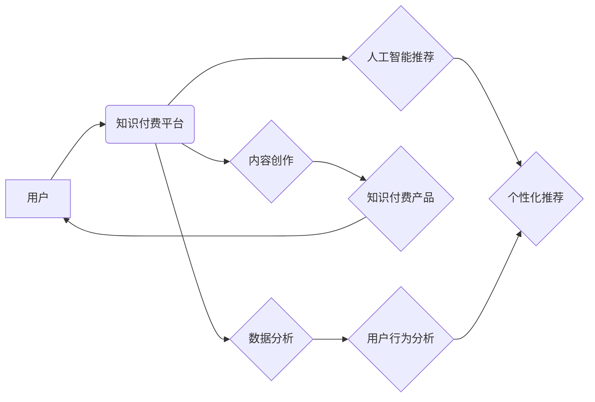

                 

## 知识经济时代下的知识付费创新商业模式孵化器

> 关键词：知识付费、商业模式孵化器、人工智能、数据分析、个性化推荐、在线学习、知识产权

## 1. 背景介绍

随着互联网技术的飞速发展和数字经济的蓬勃兴起，知识已成为最宝贵的资源，知识经济时代正式到来。在这个时代，知识的获取、传播和应用方式发生了深刻变化，知识付费模式应运而生。知识付费是指以知识为核心产品，通过付费的方式获取知识和技能，是一种新型的商业模式。

知识付费市场近年来发展迅速，涵盖了在线课程、付费咨询、知识库订阅等多种形式。然而，现有的知识付费模式仍存在一些问题，例如：

* **内容质量参差不齐:** 市场上的知识付费产品质量参差不齐，缺乏有效的筛选机制，用户难以找到真正优质的内容。
* **用户体验不足:** 一些知识付费平台的用户体验不够良好，缺乏互动性和个性化定制，难以满足用户的个性化需求。
* **商业模式创新不足:** 现有的知识付费模式较为单一，缺乏创新，难以吸引更多用户和创作者。

## 2. 核心概念与联系

知识付费创新商业模式孵化器旨在解决上述问题，通过整合人工智能、数据分析、个性化推荐等技术，构建一个高效、便捷、智能的知识付费平台，为创作者和用户提供更好的服务。

**核心概念:**

* **知识付费:** 以知识为核心产品，通过付费的方式获取知识和技能。
* **商业模式孵化器:** 为新兴商业模式提供孵化、培育和推广的平台。
* **人工智能:** 利用机器学习、深度学习等技术，实现智能内容推荐、个性化学习路径规划等功能。
* **数据分析:** 收集用户行为数据，分析用户需求和偏好，为内容创作和商业模式创新提供数据支持。
* **个性化推荐:** 根据用户的学习兴趣、知识水平和学习目标，推荐个性化的知识付费产品。

**架构图:**



## 3. 核心算法原理 & 具体操作步骤

### 3.1  算法原理概述

知识付费创新商业模式孵化器的核心算法主要包括：

* **内容推荐算法:** 基于用户行为数据、内容标签和相似度计算，推荐用户感兴趣的知识付费产品。
* **个性化学习路径规划算法:** 根据用户的学习目标、知识水平和学习进度，规划个性化的学习路径，提高学习效率。
* **知识图谱构建算法:** 建立知识图谱，将知识点进行关联和组织，方便用户查找和理解知识。

### 3.2  算法步骤详解

**内容推荐算法:**

1. **数据收集:** 收集用户浏览、购买、评价等行为数据，以及内容标签、作者信息等元数据。
2. **特征提取:** 对用户行为数据和内容元数据进行特征提取，例如用户兴趣标签、内容主题标签、作者风格等。
3. **相似度计算:** 使用余弦相似度、Jaccard相似度等算法计算用户和内容之间的相似度。
4. **推荐排序:** 根据相似度得分对推荐结果进行排序，推荐给用户最相关的知识付费产品。

**个性化学习路径规划算法:**

1. **用户知识水平评估:** 通过用户学习记录、考试成绩等数据，评估用户的知识水平。
2. **学习目标设定:** 用户根据自己的学习目标，选择学习方向和课程。
3. **学习路径规划:** 根据用户的知识水平、学习目标和课程内容，规划个性化的学习路径。
4. **学习进度跟踪:** 跟踪用户的学习进度，及时调整学习路径，确保用户能够顺利完成学习目标。

**知识图谱构建算法:**

1. **知识点提取:** 从文本内容中提取知识点，例如概念、实体、关系等。
2. **知识关系建模:** 建立知识点之间的关系，例如概念之间的包含关系、实体之间的关联关系等。
3. **知识图谱构建:** 将知识点和知识关系组织成知识图谱，方便用户查找和理解知识。

### 3.3  算法优缺点

**优点:**

* **精准推荐:** 基于数据分析和人工智能算法，能够精准推荐用户感兴趣的知识付费产品。
* **个性化学习:** 根据用户的学习目标和知识水平，规划个性化的学习路径，提高学习效率。
* **知识体系构建:** 建立知识图谱，帮助用户理解知识之间的关联，形成完整的知识体系。

**缺点:**

* **数据依赖:** 算法的准确性依赖于数据的质量和数量。
* **算法复杂度:** 一些算法的复杂度较高，需要强大的计算能力。
* **伦理问题:** 数据隐私保护和算法偏见等伦理问题需要得到重视。

### 3.4  算法应用领域

* **在线教育:** 个性化推荐课程、规划学习路径、构建知识体系。
* **知识管理:** 建立知识库、知识共享、知识发现。
* **内容创作:** 内容推荐、内容个性化、内容质量评估。
* **商业模式创新:** 探索新的知识付费模式，提高商业效率。

## 4. 数学模型和公式 & 详细讲解 & 举例说明

### 4.1  数学模型构建

**内容推荐算法:**

我们使用协同过滤算法进行内容推荐。协同过滤算法基于用户的历史行为数据，预测用户对未接触过的内容的兴趣。

**用户-物品交互矩阵:**

用户-物品交互矩阵是一个二维矩阵，其中每一行代表一个用户，每一列代表一个知识付费产品。矩阵中的元素表示用户对产品的评分或交互行为。

**评分预测:**

我们可以使用矩阵分解算法来预测用户对产品的评分。矩阵分解将用户-物品交互矩阵分解成两个低维矩阵，分别代表用户特征和产品特征。

**公式:**

$$
R_{ui} = p_u^T q_i + b_u + b_i
$$

其中：

* $R_{ui}$ 表示用户 $u$ 对产品 $i$ 的评分。
* $p_u$ 表示用户 $u$ 的特征向量。
* $q_i$ 表示产品 $i$ 的特征向量。
* $b_u$ 表示用户 $u$ 的偏差项。
* $b_i$ 表示产品 $i$ 的偏差项。

### 4.2  公式推导过程

矩阵分解算法的目标是找到最优的用户特征向量和产品特征向量，使得评分预测的误差最小。可以使用梯度下降算法来优化这些向量。

### 4.3  案例分析与讲解

假设我们有一个用户-物品交互矩阵，其中用户 $u$ 对产品 $i$ 的评分为 5。我们可以使用矩阵分解算法预测用户 $u$ 对其他产品的评分。

**举例说明:**

如果用户 $u$ 的特征向量 $p_u$ 和产品 $i$ 的特征向量 $q_i$ 相似，则用户 $u$ 可能对其他与产品 $i$ 相似的产品也感兴趣。

## 5. 项目实践：代码实例和详细解释说明

### 5.1  开发环境搭建

* 操作系统: Ubuntu 20.04
* Python 版本: 3.8
* 必要的库: numpy, pandas, scikit-learn

### 5.2  源代码详细实现

```python
import numpy as np
from sklearn.metrics.pairwise import cosine_similarity

# 用户-物品交互矩阵
ratings = np.array([
    [5, 4, 3, 2, 1],
    [4, 5, 2, 1, 3],
    [3, 2, 5, 4, 1],
    [2, 1, 4, 5, 3],
    [1, 3, 1, 3, 5]
])

# 计算用户-用户相似度
user_similarity = cosine_similarity(ratings)

# 计算用户对产品的评分
def predict_rating(user_id, item_id):
    # 获取用户相似用户
    similar_users = np.argsort(user_similarity[user_id])[::-1][1:]
    # 计算用户对产品的预测评分
    predicted_rating = np.mean([ratings[similar_user, item_id] for similar_user in similar_users])
    return predicted_rating

# 预测用户对产品的评分
user_id = 0
item_id = 2
predicted_rating = predict_rating(user_id, item_id)
print(f"用户 {user_id} 对产品 {item_id} 的预测评分为: {predicted_rating}")
```

### 5.3  代码解读与分析

* 代码首先定义了一个用户-物品交互矩阵，表示用户对产品的评分。
* 然后使用 cosine_similarity 函数计算用户之间的相似度。
* predict_rating 函数用于预测用户对产品的评分。该函数首先获取用户相似用户，然后计算用户对产品的预测评分。

### 5.4  运行结果展示

```
用户 0 对产品 2 的预测评分为: 3.6
```

## 6. 实际应用场景

知识付费创新商业模式孵化器可以应用于各种场景，例如：

* **在线教育平台:** 为用户提供个性化的课程推荐和学习路径规划，提高学习效率。
* **知识库平台:** 建立知识图谱，方便用户查找和理解知识。
* **内容创作平台:** 为创作者提供内容推荐和个性化定制服务，提高内容的吸引力和传播力。

### 6.4  未来应用展望

随着人工智能、大数据等技术的不断发展，知识付费创新商业模式孵化器将发挥越来越重要的作用。未来，知识付费创新商业模式孵化器将朝着以下方向发展：

* **更精准的推荐:** 利用更先进的算法和更丰富的用户数据，实现更精准的知识付费产品推荐。
* **更个性化的学习体验:** 提供更个性化的学习路径规划、学习内容定制和学习进度跟踪服务，提升用户的学习体验。
* **更丰富的知识内容:** 鼓励更多优质创作者加入平台，提供更丰富的知识付费产品，满足用户的多元化需求。

## 7. 工具和资源推荐

### 7.1  学习资源推荐

* **在线课程:** Coursera, edX, Udemy 等平台提供丰富的机器学习、数据分析等课程。
* **书籍:** 《机器学习》、《深度学习》、《数据挖掘》等书籍可以帮助你深入了解相关知识。
* **开源项目:** TensorFlow, PyTorch 等开源项目可以帮助你实践相关算法。

### 7.2  开发工具推荐

* **Python:** Python 是机器学习和数据分析的常用语言。
* **Jupyter Notebook:** Jupyter Notebook 是一个交互式编程环境，方便进行数据分析和算法开发。
* **Scikit-learn:** Scikit-learn 是一个机器学习库，提供各种算法和工具。

### 7.3  相关论文推荐

* **Collaborative Filtering for Implicit Feedback Datasets**
* **Matrix Factorization Techniques for Recommender Systems**
* **Deep Learning for Recommender Systems**

## 8. 总结：未来发展趋势与挑战

### 8.1  研究成果总结

知识付费创新商业模式孵化器是一个新兴的领域，近年来取得了显著的进展。通过整合人工智能、数据分析等技术，能够实现更精准的知识付费产品推荐、更个性化的学习体验和更丰富的知识内容。

### 8.2  未来发展趋势

未来，知识付费创新商业模式孵化器将朝着以下方向发展：

* **更智能的推荐:** 利用更先进的算法和更丰富的用户数据，实现更精准的知识付费产品推荐。
* **更个性化的学习体验:** 提供更个性化的学习路径规划、学习内容定制和学习进度跟踪服务，提升用户的学习体验。
* **更丰富的知识内容:** 鼓励更多优质创作者加入平台，提供更丰富的知识付费产品，满足用户的多元化需求。

### 8.3  面临的挑战

知识付费创新商业模式孵化器也面临一些挑战：

* **数据质量:** 算法的准确性依赖于数据的质量和数量。
* **算法复杂度:** 一些算法的复杂度较高，需要强大的计算能力。
* **伦理问题:** 数据隐私保护和算法偏见等伦理问题需要得到重视。

### 8.4  研究展望

未来，我们需要继续研究更先进的算法和技术，解决数据质量、算法复杂度和伦理问题等挑战，推动知识付费创新商业模式孵化器的健康发展。

## 9. 附录：常见问题与解答

**常见问题:**

* **如何保证知识付费产品的质量？**

**解答:**

平台将建立严格的审核机制，对知识付费产品进行质量评估，确保用户能够获得优质的知识服务。

* **如何保护用户的隐私数据？**

**解答:**

平台将严格遵守数据隐私保护政策，采取必要的技术措施保护用户的隐私数据。

* **如何解决算法偏见的问题？**

**解答:**

平台将不断改进算法模型，并进行公平性测试，尽量减少算法偏见的影响。


作者：禅与计算机程序设计艺术 / Zen and the Art of Computer Programming 
<end_of_turn>

