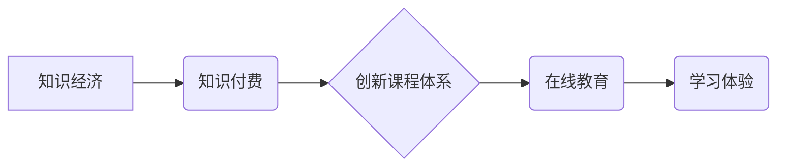

                 

## 知识经济时代下的知识付费创新课程体系构建

> 关键词：知识付费、课程体系、创新、人工智能、在线教育、学习体验、知识经济

### 1. 背景介绍

知识经济时代，知识已成为最宝贵的生产要素。随着互联网技术的飞速发展和教育模式的转型升级，知识付费产业蓬勃发展，成为新兴经济增长点。 

传统教育模式面临着诸多挑战：

* **教育资源分配不均:** 高质量的教育资源往往集中在发达地区，而偏远地区和低收入群体难以获得优质教育。
* **学习效率低下:** 传统课堂教学模式被动、缺乏互动性，难以满足个性化学习需求。
* **学习成本高昂:** 高昂的学费、住宿费等费用成为许多人接受教育的障碍。

知识付费模式以其灵活、便捷、个性化的特点，有效地解决了上述问题，为人们提供了更多学习机会和选择。

### 2. 核心概念与联系

**2.1 知识付费**

知识付费是指以知识、技能、经验等为核心内容，通过付费的方式获取知识和技能的商业模式。它涵盖了各种形式的知识产品，例如在线课程、电子书、付费咨询等。

**2.2 课程体系**

课程体系是指按照一定的逻辑和结构，将知识点串联起来，形成一个完整的学习路径。它通常由多个课程模块组成，每个模块包含特定的知识内容和学习目标。

**2.3 创新课程体系**

创新课程体系是指在传统课程体系的基础上，结合新技术、新理念和新模式，不断改进和完善的课程体系。它注重学习体验、个性化定制和知识应用，以满足用户多样化的学习需求。

**2.4 知识经济**

知识经济是指以知识、技术、信息为主要生产要素的经济形态。它强调知识的创造、传播和应用，以知识创新为核心动力，推动经济发展。

**2.5 关系图**



### 3. 核心算法原理 & 具体操作步骤

**3.1 算法原理概述**

知识付费创新课程体系的构建需要结合人工智能、大数据等技术，实现个性化推荐、智能评估、知识图谱构建等功能。

**3.2 算法步骤详解**

1. **用户画像构建:** 收集用户学习行为数据、兴趣偏好、学习目标等信息，构建用户画像。
2. **知识库构建:** 收集、整理、结构化各种知识资源，构建知识库。
3. **课程推荐:** 基于用户画像和知识库，利用推荐算法，推荐个性化课程。
4. **智能评估:** 利用人工智能技术，对用户的学习情况进行智能评估，提供个性化反馈和指导。
5. **知识图谱构建:** 将知识点进行关联分析，构建知识图谱，帮助用户理解知识之间的关系。

**3.3 算法优缺点**

* **优点:**

    * 个性化推荐，提高学习效率。
    * 智能评估，及时发现学习问题。
    * 知识图谱构建，加深知识理解。

* **缺点:**

    * 数据依赖性强，需要大量数据支持。
    * 算法复杂度高，需要强大的计算能力。
    * 伦理问题，例如数据隐私保护。

**3.4 算法应用领域**

* 在线教育平台
* 企业培训系统
* 个人知识管理工具

### 4. 数学模型和公式 & 详细讲解 & 举例说明

**4.1 数学模型构建**

知识推荐系统可以采用协同过滤算法，构建用户-课程评分矩阵。

**4.2 公式推导过程**

协同过滤算法的核心思想是：用户对相似物品的评分具有相关性。

假设用户 $u$ 对课程 $i$ 的评分为 $r_{ui}$，则用户 $u$ 和用户 $v$ 的相似度可以表示为：

$$
Sim(u,v) = \frac{\sum_{i \in I(u \cap v)} (r_{ui} - \bar{r}_u)(r_{vi} - \bar{r}_v)}{\sqrt{\sum_{i \in I(u)} (r_{ui} - \bar{r}_u)^2} \sqrt{\sum_{i \in I(v)} (r_{vi} - \bar{r}_v)^2}}
$$

其中：

* $I(u \cap v)$ 表示用户 $u$ 和用户 $v$ 都评分过的课程集合。
* $\bar{r}_u$ 和 $\bar{r}_v$ 分别表示用户 $u$ 和用户 $v$ 的平均评分。

**4.3 案例分析与讲解**

假设有两个用户 $u$ 和 $v$，他们都评分过课程 $A$ 和 $B$，评分如下：

* $r_{uA} = 5$， $r_{uB} = 3$
* $r_{vA} = 4$， $r_{vB} = 2$

根据公式，可以计算出用户 $u$ 和 $v$ 的相似度。

### 5. 项目实践：代码实例和详细解释说明

**5.1 开发环境搭建**

* Python 3.x
* TensorFlow 或 PyTorch
* Jupyter Notebook

**5.2 源代码详细实现**

```python
import numpy as np

# 用户-课程评分矩阵
ratings = np.array([
    [5, 3, 0],
    [4, 2, 0],
    [0, 0, 5]
])

# 计算用户相似度
def calculate_similarity(ratings):
    # ...

# 获取用户推荐课程
def get_recommendations(user_id, ratings, similarity_matrix):
    # ...

# 示例代码
user_id = 0
recommendations = get_recommendations(user_id, ratings, similarity_matrix)
print(f"推荐课程：{recommendations}")
```

**5.3 代码解读与分析**

* `calculate_similarity()` 函数计算用户之间的相似度。
* `get_recommendations()` 函数根据用户相似度和评分矩阵，推荐课程。

**5.4 运行结果展示**

运行代码后，将输出用户 $0$ 的推荐课程列表。

### 6. 实际应用场景

**6.1 在线教育平台**

知识付费创新课程体系可以应用于在线教育平台，为用户提供个性化学习路径和推荐课程。

**6.2 企业培训系统**

企业可以利用知识付费创新课程体系，构建内部培训系统，提升员工技能水平。

**6.3 个人知识管理工具**

个人用户可以使用知识付费创新课程体系，构建自己的知识库，管理和学习知识。

**6.4 未来应用展望**

未来，知识付费创新课程体系将更加智能化、个性化和交互化。

* **人工智能驱动:** 利用人工智能技术，实现更精准的课程推荐、个性化的学习路径和智能化的学习评估。
* **虚拟现实和增强现实:** 利用虚拟现实和增强现实技术，打造沉浸式的学习体验。
* **元宇宙:** 在元宇宙环境中构建虚拟课堂，实现更加丰富的学习场景和互动体验。

### 7. 工具和资源推荐

**7.1 学习资源推荐**

* **在线课程平台:** Coursera, edX, Udemy
* **知识付费平台:**  知识星球,  付费课程网
* **技术博客:**  Hacker News,  Medium

**7.2 开发工具推荐**

* **Python:**  Python 3.x
* **机器学习框架:** TensorFlow, PyTorch
* **数据可视化工具:**  Matplotlib, Seaborn

**7.3 相关论文推荐**

* **协同过滤算法:**  "Collaborative Filtering: A User-Based Approach" by Goldberg et al. (1992)
* **知识图谱:**  "A Survey of Knowledge Graph Embedding Techniques" by Wang et al. (2019)

### 8. 总结：未来发展趋势与挑战

**8.1 研究成果总结**

知识付费创新课程体系的构建，结合了人工智能、大数据、在线教育等多领域技术，为用户提供了更加个性化、高效的学习体验。

**8.2 未来发展趋势**

未来，知识付费创新课程体系将更加智能化、个性化和交互化，并与元宇宙等新技术深度融合。

**8.3 面临的挑战**

* **数据隐私保护:**  知识付费平台需要妥善处理用户数据，保障用户隐私安全。
* **算法公平性:**  算法推荐结果需要避免偏见和歧视，确保公平性。
* **知识更新:**  知识付费平台需要不断更新知识库，确保课程内容的时效性。

**8.4 研究展望**

未来研究方向包括：

* **更精准的个性化推荐算法:**  利用深度学习等技术，实现更精准的课程推荐。
* **更沉浸式的学习体验:**  利用虚拟现实和增强现实技术，打造更沉浸式的学习体验。
* **知识付费模式的创新:**  探索新的知识付费模式，例如订阅制、分期付款等。

### 9. 附录：常见问题与解答

**9.1 如何选择合适的知识付费课程？**

* 确定学习目标和需求。
* 阅读课程介绍和评价。
* 了解课程老师的背景和教学风格。
* 尝试免费课程或试听课。

**9.2 如何提高知识付费课程的学习效率？**

* 制定学习计划，并坚持执行。
* 积极参与课程互动，例如提问、讨论等。
* 将课程内容与实际应用结合起来。
* 定期回顾和复习课程内容。


作者：禅与计算机程序设计艺术 / Zen and the Art of Computer Programming 
<end_of_turn>

