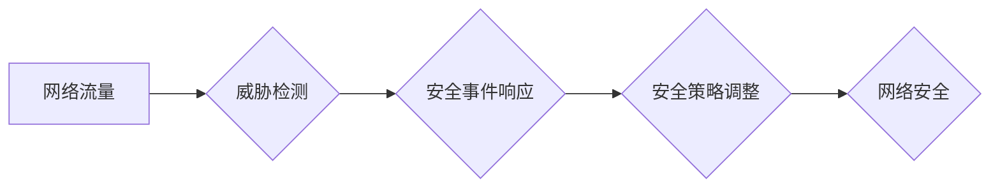

                 

## 硅谷网络安全面临的新挑战

> 关键词：人工智能、网络安全、机器学习、深度学习、云计算、物联网、数据隐私

### 1. 背景介绍

硅谷作为全球科技创新中心，孕育了无数颠覆性的技术，也面临着前所未有的网络安全挑战。随着人工智能、云计算、物联网等技术的蓬勃发展，网络攻击手段日益复杂，攻击者利用这些技术进行更精准、更隐蔽的攻击，给硅谷企业和个人带来了巨大的安全风险。

传统网络安全防御体系主要依赖于规则匹配和签名检测，难以应对新型攻击和零日漏洞。而人工智能技术的出现为网络安全领域带来了新的希望。人工智能可以学习和分析海量数据，识别攻击模式，并自动做出防御决策，从而提升网络安全防御能力。

### 2. 核心概念与联系

#### 2.1 网络安全威胁

网络安全威胁是指任何可能损害计算机系统、网络或数据安全的行为或事件。常见的网络安全威胁包括：

* **恶意软件:** 病毒、蠕虫、木马等恶意程序，旨在窃取数据、破坏系统或控制设备。
* **网络钓鱼:** 通过伪造邮件或网站，诱骗用户泄露敏感信息。
* **拒绝服务攻击:** 攻击者利用大量流量淹没目标服务器，使其无法正常工作。
* **数据泄露:** 攻击者窃取敏感数据，例如个人信息、财务数据等。

#### 2.2 人工智能在网络安全中的应用

人工智能可以应用于网络安全各个环节，例如：

* **威胁检测和预警:** 利用机器学习算法分析网络流量和系统日志，识别异常行为和潜在威胁。
* **恶意软件分析:** 利用深度学习算法分析恶意软件样本，识别其功能和攻击目标。
* **安全事件响应:** 利用人工智能系统自动响应安全事件，例如隔离受感染设备、修复漏洞等。
* **安全策略自动化:** 利用人工智能系统自动生成和调整安全策略，提高安全防御效率。

#### 2.3 网络安全架构

网络安全架构是指用于保护网络和数据安全的系统和策略的整体设计。常见的网络安全架构包括：

* **多层防御:** 将安全措施分层部署，形成多重防御体系。
* **零信任:** 不信任任何用户或设备，需要验证身份和权限才能访问资源。
* **DevSecOps:** 将安全集成到软件开发流程中，确保软件安全。

**Mermaid 流程图**



### 3. 核心算法原理 & 具体操作步骤

#### 3.1 算法原理概述

在网络安全领域，常用的人工智能算法包括：

* **机器学习:** 利用算法从数据中学习模式，识别威胁。
* **深度学习:** 利用多层神经网络，学习更复杂的模式，提高识别精度。
* **强化学习:** 利用奖励机制，训练模型做出最佳防御决策。

#### 3.2 算法步骤详解

以机器学习算法为例，其步骤如下：

1. **数据收集:** 收集网络流量、系统日志、恶意软件样本等数据。
2. **数据预处理:** 清洗、转换和格式化数据，使其适合算法训练。
3. **特征提取:** 从数据中提取特征，例如IP地址、端口号、协议类型等。
4. **模型训练:** 利用机器学习算法训练模型，学习特征与威胁之间的关系。
5. **模型评估:** 利用测试数据评估模型的性能，例如准确率、召回率等。
6. **模型部署:** 将训练好的模型部署到网络安全系统中，用于威胁检测和预警。

#### 3.3 算法优缺点

**优点:**

* **自动化:** 可以自动识别和响应威胁，减少人工干预。
* **精准度:** 可以学习和识别复杂的攻击模式，提高威胁检测精度。
* **可扩展性:** 可以处理海量数据，适应不断变化的网络环境。

**缺点:**

* **数据依赖:** 需要大量高质量的数据进行训练，否则模型性能会下降。
* **解释性:** 某些机器学习算法的决策过程难以解释，难以理解模型是如何做出判断的。
* **可攻击性:** 模型本身可能存在漏洞，被攻击者利用进行攻击。

#### 3.4 算法应用领域

* **入侵检测系统:** 检测网络流量中的恶意活动。
* **恶意软件分析:** 分析恶意软件样本，识别其功能和攻击目标。
* **安全事件响应:** 自动响应安全事件，例如隔离受感染设备、修复漏洞等。
* **数据泄露检测:** 检测数据泄露行为，保护敏感数据安全。

### 4. 数学模型和公式 & 详细讲解 & 举例说明

#### 4.1 数学模型构建

在网络安全领域，常用的数学模型包括：

* **贝叶斯网络:** 用于表示随机变量之间的依赖关系，可以用于威胁预测和风险评估。
* **Markov链:** 用于描述系统状态的转移概率，可以用于分析网络攻击的传播路径。
* **支持向量机:** 用于分类和识别威胁，可以用于恶意软件检测和网络入侵检测。

#### 4.2 公式推导过程

以支持向量机为例，其目标函数为：

$$
\min_{w,b} \frac{1}{2} ||w||^2 + C \sum_{i=1}^{n} \xi_i
$$

其中：

* $w$ 是权重向量。
* $b$ 是偏置项。
* $C$ 是惩罚参数。
* $\xi_i$ 是松弛变量，用于容忍分类错误。

#### 4.3 案例分析与讲解

假设我们有一个二分类问题，需要判断网络流量是否为恶意流量。我们可以使用支持向量机构建一个分类模型。

首先，我们需要收集网络流量数据，并将其标记为恶意流量或正常流量。然后，我们可以使用支持向量机算法训练模型，学习特征与流量类型之间的关系。

训练完成后，我们可以使用模型对新的网络流量进行分类。如果模型预测流量为恶意流量，则需要采取相应的安全措施，例如隔离设备或阻止流量。

### 5. 项目实践：代码实例和详细解释说明

#### 5.1 开发环境搭建

* 操作系统: Ubuntu 20.04
* Python 版本: 3.8
* 必要的库: scikit-learn, TensorFlow, PyTorch

#### 5.2 源代码详细实现

```python
# 使用 scikit-learn 训练一个支持向量机模型
from sklearn import svm
from sklearn.model_selection import train_test_split
from sklearn.metrics import accuracy_score

# 假设我们有以下数据
X = [[1, 2], [2, 3], [3, 4], [4, 5], [5, 6]]
y = [0, 0, 1, 1, 1]

# 将数据分成训练集和测试集
X_train, X_test, y_train, y_test = train_test_split(X, y, test_size=0.2)

# 创建一个支持向量机模型
clf = svm.SVC()

# 训练模型
clf.fit(X_train, y_train)

# 对测试集进行预测
y_pred = clf.predict(X_test)

# 计算模型准确率
accuracy = accuracy_score(y_test, y_pred)
print("模型准确率:", accuracy)
```

#### 5.3 代码解读与分析

这段代码演示了如何使用 scikit-learn 库训练一个支持向量机模型。

首先，我们定义了训练数据和标签。然后，我们将数据分成训练集和测试集。

接下来，我们创建了一个支持向量机模型，并使用训练数据对其进行训练。

最后，我们使用模型对测试数据进行预测，并计算模型的准确率。

#### 5.4 运行结果展示

运行这段代码后，会输出模型的准确率。

### 6. 实际应用场景

#### 6.1 网络入侵检测

人工智能可以用于检测网络入侵，识别恶意流量和攻击行为。例如，可以利用机器学习算法分析网络流量特征，识别常见的攻击模式，例如拒绝服务攻击、SQL注入攻击等。

#### 6.2 恶意软件分析

人工智能可以用于分析恶意软件样本，识别其功能和攻击目标。例如，可以利用深度学习算法分析恶意软件代码，识别其恶意行为，例如数据窃取、系统破坏等。

#### 6.3 数据泄露检测

人工智能可以用于检测数据泄露行为，保护敏感数据安全。例如，可以利用机器学习算法分析用户行为数据，识别异常行为，例如访问敏感数据、传输大量数据等。

#### 6.4 未来应用展望

随着人工智能技术的不断发展，其在网络安全领域的应用将更加广泛和深入。例如，可以利用强化学习算法训练网络安全代理，使其能够自动响应安全事件，提高安全防御效率。

### 7. 工具和资源推荐

#### 7.1 学习资源推荐

* **书籍:**
    * "Artificial Intelligence for Cybersecurity" by Michael J. C. Smith
    * "Deep Learning for Cybersecurity" by David Wagner
* **在线课程:**
    * Coursera: "Machine Learning for Cybersecurity"
    * Udacity: "AI for Cybersecurity"

#### 7.2 开发工具推荐

* **TensorFlow:** 开源深度学习框架
* **PyTorch:** 开源深度学习框架
* **scikit-learn:** 开源机器学习库

#### 7.3 相关论文推荐

* "Deep Learning for Intrusion Detection: A Survey"
* "Adversarial Machine Learning for Cybersecurity"
* "Towards AI-Powered Cybersecurity: A Survey"

### 8. 总结：未来发展趋势与挑战

#### 8.1 研究成果总结

人工智能在网络安全领域取得了显著成果，例如：

* **提高了威胁检测和预警的精度。**
* **自动化了安全事件响应。**
* **增强了数据泄露检测能力。**

#### 8.2 未来发展趋势

未来，人工智能在网络安全领域的应用将更加广泛和深入，例如：

* **利用强化学习训练网络安全代理，提高安全防御效率。**
* **开发更智能的网络安全工具，例如自动修复漏洞的工具。**
* **利用人工智能技术应对新的网络安全威胁，例如量子计算攻击。**

#### 8.3 面临的挑战

人工智能在网络安全领域也面临一些挑战，例如：

* **数据安全和隐私问题。**
* **算法可解释性和可信度问题。**
* **人工智能技术的攻击性问题。**

#### 8.4 研究展望

未来，需要进一步研究人工智能在网络安全领域的应用，解决上述挑战，并推动人工智能技术在网络安全领域的创新发展。

### 9. 附录：常见问题与解答

#### 9.1 如何选择合适的 AI 算法？

选择合适的 AI 算法取决于具体的网络安全任务和数据特点。例如，对于分类任务，可以考虑使用支持向量机、决策树或随机森林算法。对于预测任务，可以考虑使用回归算法或时间序列分析算法。

#### 9.2 如何解决 AI 模型的解释性问题？

为了提高 AI 模型的解释性，可以采用以下方法：

* 使用可解释的 AI 算法，例如决策树或规则模型。
* 使用特征重要性分析方法，识别影响模型决策的关键特征。
* 使用可视化技术，直观地展示模型的决策过程。

#### 9.3 如何应对 AI 模型的攻击性问题？

为了应对 AI 模型的攻击性问题，可以采用以下方法：

* 使用对抗训练方法，训练模型抵抗对抗攻击。
* 使用模型健壮性评估方法，评估模型对攻击的抵抗能力。
* 开发 AI 安全防御机制，例如检测和防御 AI 攻击。


作者：禅与计算机程序设计艺术 / Zen and the Art of Computer Programming 
<end_of_turn>

