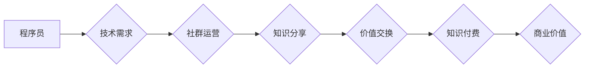

                 

## 社群运营：程序员的知识付费加速器

> 关键词：程序员、知识付费、社群运营、社区建设、内容营销、技术分享、品牌建设、商业模式

## 1. 背景介绍

在当今数字化时代，程序员群体已成为社会发展的重要力量。随着互联网技术的发展和应用的广泛，程序员的需求量持续增长，同时也催生了丰富的知识付费市场。然而，传统的知识付费模式，如线上课程、付费博客等，往往面临着用户获取信息成本高、学习体验单一、互动性差等问题。

社群运营作为一种新型的知识传播和商业模式，为程序员的知识付费提供了新的思路和可能性。通过构建线上线下结合的社群生态，程序员可以更有效地分享技术经验、建立人脉关系、获取学习资源，从而加速知识付费的进程。

## 2. 核心概念与联系

**2.1 社群运营**

社群运营是指围绕特定主题或目标，通过线上线下平台，构建和管理一个活跃、粘性的用户群体，并通过内容运营、活动策划、互动交流等方式，促进用户之间的互动和价值交换。

**2.2 知识付费**

知识付费是指通过提供有价值的知识和技能，向用户收取费用的一种商业模式。

**2.3 程序员社群**

程序员社群是指由程序员组成，围绕技术分享、学习交流、职业发展等主题的线上线下群体。

**2.4 社群运营与知识付费的联系**

程序员社群为知识付费提供了天然的土壤。社群成员之间拥有共同的兴趣和需求，更容易接受和付费获取相关知识。社群运营可以帮助程序员更好地构建和管理知识付费生态，实现知识传播和商业价值的双赢。

**Mermaid 流程图**



## 3. 核心算法原理 & 具体操作步骤

**3.1 算法原理概述**

程序员社群运营的核心算法原理在于构建一个高效的知识传播和价值交换机制。这需要结合用户画像、内容推荐、互动引导等技术手段，实现用户精准匹配、内容个性化、互动深度化。

**3.2 算法步骤详解**

1. **用户画像构建:** 通过用户行为数据、兴趣标签、技术技能等信息，构建用户画像，实现对用户群体的精准定位和分层。
2. **内容推荐算法:** 基于用户画像和内容标签，采用协同过滤、内容相似度等算法，推荐用户感兴趣的内容，提高用户参与度和学习效率。
3. **互动引导机制:** 通过话题讨论、问答互动、项目合作等方式，引导用户积极参与社群活动，促进用户之间的交流和学习。
4. **价值交换机制:** 通过积分制度、等级体系、知识付费等方式，建立用户贡献和价值获取的机制，激励用户持续参与社群运营。

**3.3 算法优缺点**

**优点:**

* 精准匹配用户需求，提高内容的有效性。
* 个性化推荐内容，提升用户学习体验。
* 促进用户互动，构建活跃的社群氛围。
* 建立价值交换机制，实现知识付费的商业化。

**缺点:**

* 需要大量的数据支持，算法模型的训练和优化需要时间和资源。
* 算法的准确性会受到数据质量的影响，需要不断完善和改进。
* 算法可能会导致信息茧房效应，需要采取措施保证内容的多样性和包容性。

**3.4 算法应用领域**

程序员社群运营算法广泛应用于技术论坛、在线学习平台、开发者社区等领域，帮助开发者更好地分享知识、学习技能、建立人脉关系。

## 4. 数学模型和公式 & 详细讲解 & 举例说明

**4.1 数学模型构建**

程序员社群运营的数学模型可以基于用户行为数据、内容特征、社群活跃度等指标构建。例如，可以构建一个用户参与度模型，用公式表示用户在社群中的活跃程度：

$$
U_i = \alpha \cdot C_i + \beta \cdot I_i + \gamma \cdot R_i
$$

其中：

* $U_i$ 表示用户 $i$ 的参与度
* $C_i$ 表示用户 $i$ 的内容贡献度
* $I_i$ 表示用户 $i$ 的互动频率
* $R_i$ 表示用户 $i$ 的推荐次数
* $\alpha$, $\beta$, $\gamma$ 为权重系数

**4.2 公式推导过程**

该模型的推导过程基于用户行为分析和相关研究成果。用户参与度可以看作是用户在社群中的贡献、互动和推荐行为的综合体现。

**4.3 案例分析与讲解**

假设一个程序员社群，其中用户 A 贡献了 5 篇高质量的技术文章，参与了 10 次讨论，被推荐了 3 次；用户 B 参与了 20 次讨论，但没有贡献任何内容，也没有被推荐。根据上述模型，我们可以计算出用户 A 和用户 B 的参与度：

* $U_A = \alpha \cdot 5 + \beta \cdot 10 + \gamma \cdot 3$
* $U_B = \alpha \cdot 0 + \beta \cdot 20 + \gamma \cdot 0$

根据用户的具体行为和社群运营策略，可以调整权重系数 $\alpha$, $\beta$, $\gamma$ 的值，以更准确地反映用户的参与度。

## 5. 项目实践：代码实例和详细解释说明

**5.1 开发环境搭建**

程序员社群运营项目可以基于多种技术栈搭建，例如：

* 前端：React、Vue、Angular
* 后端：Node.js、Python、Java
* 数据库：MongoDB、MySQL、PostgreSQL
* 云平台：AWS、Azure、GCP

**5.2 源代码详细实现**

由于篇幅限制，这里只提供一个简单的用户注册功能的代码示例：

```javascript
// 用户注册接口
app.post('/register', async (req, res) => {
  const { username, password } = req.body;
  // 校验用户名和密码
  // ...
  // 保存用户数据到数据库
  // ...
  res.json({ message: '注册成功' });
});
```

**5.3 代码解读与分析**

这段代码定义了一个 `/register` 路由，用于处理用户注册请求。

* `app.post('/register', async (req, res) => { ... });` 使用 Express.js 框架定义了一个 POST 请求路由。
* `const { username, password } = req.body;` 从请求体中提取用户名和密码。
* `// 校验用户名和密码` 需要进行必要的用户名和密码校验，例如长度限制、格式验证、是否存在重复用户名等。
* `// 保存用户数据到数据库` 将注册信息保存到数据库中，例如 MongoDB 或 MySQL。
* `res.json({ message: '注册成功' });` 返回注册成功的消息。

**5.4 运行结果展示**

当用户向 `/register` 路由发送 POST 请求，并提供有效的用户名和密码时，服务器会返回 "注册成功" 的消息，并完成用户的注册操作。

## 6. 实际应用场景

**6.1 技术论坛**

程序员社群运营可以应用于技术论坛，帮助开发者更好地分享技术经验、解决技术问题、建立人脉关系。例如，Stack Overflow、GitHub Discussions 等平台都采用了社群运营模式，构建了活跃的开发者社区。

**6.2 在线学习平台**

在线学习平台可以利用社群运营功能，为用户提供更丰富的学习体验。例如，可以创建学习小组、组织线上线下活动、提供一对一指导等，帮助用户更好地理解和掌握知识。

**6.3 开发者社区**

开发者社区可以围绕特定技术栈或项目构建，为开发者提供交流学习、合作开发、资源共享的平台。例如，微信小程序开发者社区、Flutter 开发者社区等。

**6.4 未来应用展望**

随着人工智能、虚拟现实等技术的不断发展，程序员社群运营将迎来更多新的应用场景和发展方向。例如，可以利用人工智能技术实现更精准的用户画像和内容推荐，利用虚拟现实技术构建沉浸式的社群体验。

## 7. 工具和资源推荐

**7.1 学习资源推荐**

* 社群运营书籍：《社群运营实战》、《社群运营的艺术》
* 社群运营博客：
* 社群运营课程：

**7.2 开发工具推荐**

* 前端框架：React、Vue、Angular
* 后端框架：Node.js、Python、Java
* 数据库：MongoDB、MySQL、PostgreSQL
* 云平台：AWS、Azure、GCP

**7.3 相关论文推荐**

* 社群运营的理论基础和实践研究
* 程序员社群运营的算法模型和应用
* 社群运营对知识付费的影响

## 8. 总结：未来发展趋势与挑战

**8.1 研究成果总结**

程序员社群运营作为一种新型的知识传播和商业模式，具有巨大的潜力和发展前景。通过构建高效的知识传播和价值交换机制，程序员社群运营可以帮助程序员更好地学习技能、建立人脉关系、获取商业机会。

**8.2 未来发展趋势**

未来，程序员社群运营将朝着以下几个方向发展：

* **更精准的用户画像和内容推荐:** 利用人工智能技术，实现更精准的用户画像和内容推荐，提高用户参与度和学习效率。
* **更丰富的社群体验:** 利用虚拟现实、增强现实等技术，构建更沉浸式的社群体验，增强用户粘性和互动性。
* **更完善的商业模式:** 开发更完善的商业模式，例如会员制度、付费课程、知识产权交易等，实现社群运营的可持续发展。

**8.3 面临的挑战**

程序员社群运营也面临着一些挑战：

* **数据安全和隐私保护:** 社群运营需要收集和处理大量用户数据，需要加强数据安全和隐私保护措施。
* **内容质量控制:** 社群运营需要保证内容的质量和权威性，需要建立有效的审核机制和内容管理体系。
* **社群活跃度维护:** 社群运营需要不断吸引和留住用户，需要开发更丰富的活动和功能，保持社群的活跃度。

**8.4 研究展望**

未来，我们需要继续深入研究程序员社群运营的理论基础和实践方法，探索更有效的知识传播和价值交换机制，推动程序员社群运营的健康发展。

## 9. 附录：常见问题与解答

**9.1 如何建立一个活跃的程序员社群？**

* 确定目标用户群体和社群主题
* 提供有价值的内容和服务
* 组织线下活动和线上互动
* 建立社群运营团队和管理机制

**9.2 如何进行程序员社群运营的商业化？**

* 开发会员制度和付费课程
* 推广知识产权交易平台
* 合作开发软件和工具

**9.3 如何保证程序员社群运营的安全性？**

* 加强数据安全和隐私保护措施
* 建立有效的审核机制和内容管理体系
* 规范用户行为和社区规则


作者：禅与计算机程序设计艺术 / Zen and the Art of Computer Programming 
<end_of_turn>

