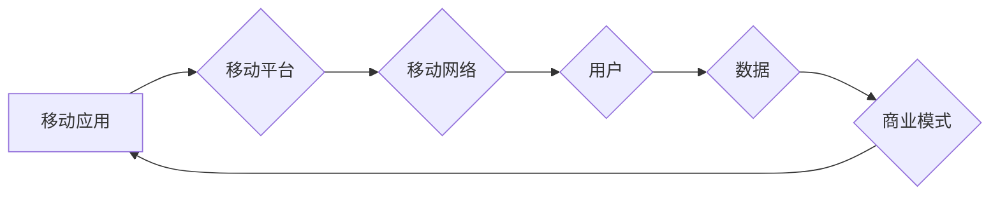

                 

## 移动互联网创业：口袋里的商业帝国

> 关键词：移动互联网、创业、商业模式、用户体验、数据分析、云计算、人工智能

### 1. 背景介绍

移动互联网的兴起，彻底改变了人们的生活方式和商业模式。智能手机的普及，以及移动网络技术的飞速发展，为创业者提供了前所未有的机遇。口袋里的商业帝国，不再是遥不可及的梦想，而是触手可及的现实。

移动互联网创业，是指利用移动互联网平台，开发和运营各种移动应用，以创造商业价值的创业活动。它涵盖了广泛的领域，包括电商、社交、游戏、教育、金融等。

移动互联网创业的特点：

* **用户触达性强:** 智能手机几乎随身携带，移动互联网可以随时随地触达用户。
* **交互性强:** 移动应用可以提供更丰富的交互体验，例如触控、语音、视频等。
* **数据化运营:** 移动互联网平台可以收集海量用户数据，为创业者提供精准的运营和营销手段。
* **成本低:** 相比传统线下模式，移动互联网创业成本相对较低。

### 2. 核心概念与联系

移动互联网创业的核心概念包括：

* **移动应用:**  指运行在移动设备上的软件程序，提供特定功能或服务。
* **移动平台:**  指提供移动应用开发和运行环境的软件基础设施，例如Android、iOS等。
* **移动网络:**  指连接移动设备和互联网的网络技术，例如3G、4G、5G等。
* **用户体验:**  指用户使用移动应用时的感受和体验，是移动互联网创业成功的关键因素之一。
* **商业模式:**  指移动应用如何创造价值并实现盈利的方式。

**Mermaid 流程图:**



### 3. 核心算法原理 & 具体操作步骤

移动互联网创业中，许多核心功能都依赖于特定的算法原理。以下是一些常见的算法及其操作步骤：

#### 3.1  算法原理概述

* **推荐算法:**  根据用户的历史行为、偏好等信息，推荐相关的商品、服务或内容。常见的推荐算法包括协同过滤、内容过滤、基于知识图谱的推荐等。
* **搜索算法:**  根据用户的搜索关键词，从海量数据中检索出相关结果。常见的搜索算法包括BM25、TF-IDF、PageRank等。
* **数据分析算法:**  对用户行为数据进行分析，挖掘用户画像、消费趋势等信息。常见的分析算法包括聚类分析、关联规则挖掘、时间序列分析等。

#### 3.2  算法步骤详解

以推荐算法为例，其基本步骤如下：

1. **数据收集:** 收集用户的行为数据，例如浏览历史、购买记录、评分等。
2. **数据预处理:** 对收集到的数据进行清洗、转换、特征提取等处理，使其适合算法模型的训练。
3. **模型训练:** 选择合适的推荐算法模型，并利用训练数据进行模型训练，学习用户偏好和商品特征之间的关系。
4. **模型评估:** 利用测试数据评估模型的性能，例如准确率、召回率、覆盖率等。
5. **模型部署:** 将训练好的模型部署到线上环境，为用户提供个性化的推荐服务。

#### 3.3  算法优缺点

不同的算法具有不同的优缺点，需要根据实际应用场景选择合适的算法。

* **协同过滤算法:** 优点是能够发现用户之间的隐性关联，推荐个性化内容。缺点是需要大量的用户数据才能训练出准确的模型，容易出现冷启动问题。
* **内容过滤算法:** 优点是能够根据用户兴趣和商品特征进行精准推荐，不受用户数据量的限制。缺点是容易陷入“同质化推荐”的困境，缺乏个性化。
* **基于知识图谱的推荐算法:** 优点是能够利用知识图谱中的语义信息，进行更智能的推荐。缺点是知识图谱的构建和维护成本较高。

#### 3.4  算法应用领域

推荐算法广泛应用于移动互联网创业领域，例如：

* **电商平台:**  推荐商品、优惠券、促销活动等。
* **社交平台:**  推荐好友、群组、话题等。
* **内容平台:**  推荐文章、视频、音频等。
* **游戏平台:**  推荐游戏、道具、活动等。

### 4. 数学模型和公式 & 详细讲解 & 举例说明

移动互联网创业中，许多算法模型都基于数学公式和模型。以下是一些常见的数学模型和公式：

#### 4.1  数学模型构建

* **用户画像模型:**  利用机器学习算法，构建用户画像模型，描述用户的特征和行为模式。

* **推荐模型:**  利用协同过滤、内容过滤等算法，构建推荐模型，预测用户对特定商品或内容的兴趣。

#### 4.2  公式推导过程

以协同过滤算法为例，其核心公式是用户相似度计算公式：

$$
Sim(u_i, u_j) = \frac{\sum_{k=1}^{n} r_{i,k} * r_{j,k}}{\sqrt{\sum_{k=1}^{n} r_{i,k}^2} * \sqrt{\sum_{k=1}^{n} r_{j,k}^2}}
$$

其中：

* $Sim(u_i, u_j)$ 表示用户 $u_i$ 和 $u_j$ 的相似度。
* $r_{i,k}$ 表示用户 $u_i$ 对商品 $k$ 的评分。
* $n$ 表示商品总数。

#### 4.3  案例分析与讲解

假设有两个用户 $u_1$ 和 $u_2$，他们对 5 个商品的评分如下：

| 商品 | $u_1$ | $u_2$ |
|---|---|---|
| A | 5 | 4 |
| B | 3 | 2 |
| C | 4 | 5 |
| D | 2 | 3 |
| E | 5 | 4 |

根据公式，我们可以计算出 $u_1$ 和 $u_2$ 的相似度：

$$
Sim(u_1, u_2) = \frac{(5*4)+(3*2)+(4*5)+(2*3)+(5*4)}{\sqrt{(5^2+3^2+4^2+2^2+5^2)} * \sqrt{(4^2+2^2+5^2+3^2+4^2)}}
$$

经过计算，得到 $Sim(u_1, u_2)$ 的值，表示 $u_1$ 和 $u_2$ 的相似程度。

### 5. 项目实践：代码实例和详细解释说明

以下是一个简单的移动应用开发实例，使用 Python 和 Flask 框架构建一个简单的博客应用。

#### 5.1  开发环境搭建

1. 安装 Python 3.x 及相关依赖包：pip install Flask

2. 创建项目文件夹并初始化虚拟环境：python3 -m venv env

3. 激活虚拟环境：source env/bin/activate

#### 5.2  源代码详细实现

```python
from flask import Flask, render_template

app = Flask(__name__)

@app.route('/')
def index():
    return render_template('index.html')

if __name__ == '__main__':
    app.run(debug=True)
```

#### 5.3  代码解读与分析

* `from flask import Flask, render_template`: 导入 Flask 框架和模板渲染功能。
* `app = Flask(__name__)`: 创建 Flask 应用实例。
* `@app.route('/')`: 定义路由规则，当访问根路径 '/' 时，执行 `index()` 函数。
* `def index()`: 定义 `index()` 函数，返回 `index.html` 模板文件。
* `if __name__ == '__main__':`: 确保代码只在直接运行脚本时执行。
* `app.run(debug=True)`: 启动 Flask 应用，开启调试模式。

#### 5.4  运行结果展示

运行代码后，访问 `http://127.0.0.1:5000/`，即可看到简单的博客首页。

### 6. 实际应用场景

移动互联网创业的应用场景非常广泛，以下是一些例子：

* **电商平台:**  利用移动应用，提供商品展示、购物车、支付等功能，方便用户在线购物。
* **社交平台:**  利用移动应用，提供即时通讯、朋友圈、直播等功能，连接用户，构建社交关系。
* **游戏平台:**  利用移动应用，提供各种类型的游戏，例如休闲游戏、策略游戏、角色扮演游戏等。
* **教育平台:**  利用移动应用，提供在线课程、学习资源、互动练习等功能，方便用户学习。
* **金融平台:**  利用移动应用，提供银行转账、理财投资、信用卡管理等功能，方便用户管理财务。

#### 6.4  未来应用展望

随着移动互联网技术的不断发展，未来移动互联网创业将呈现以下趋势：

* **人工智能化:**  人工智能技术将被广泛应用于移动应用开发，例如智能推荐、个性化定制、语音交互等。
* **云计算化:**  移动应用将更加依赖云计算平台，实现数据存储、计算处理、资源共享等功能。
* **物联网化:**  移动应用将与物联网设备进行连接，实现万物互联，提供更加丰富的服务。
* **区块链化:**  区块链技术将被应用于移动应用的安全、隐私、交易等领域，提高应用的安全性。

### 7. 工具和资源推荐

#### 7.1  学习资源推荐

* **书籍:**  《移动互联网创业》、《移动应用开发》、《移动数据分析》
* **在线课程:**  Coursera、edX、Udemy 等平台提供丰富的移动互联网创业课程。
* **博客:**  TechCrunch、VentureBeat、The Verge 等科技博客网站提供最新的移动互联网创业资讯。

#### 7.2  开发工具推荐

* **移动开发平台:**  Android Studio、Xcode、React Native、Flutter 等。
* **云计算平台:**  AWS、Azure、GCP 等。
* **数据分析工具:**  Google Analytics、Firebase Analytics 等。

#### 7.3  相关论文推荐

* **移动互联网创业模式研究**
* **移动应用推荐算法研究**
* **移动数据分析技术研究**

### 8. 总结：未来发展趋势与挑战

移动互联网创业是一个充满机遇和挑战的领域。未来，移动互联网创业将朝着人工智能化、云计算化、物联网化、区块链化等方向发展。

#### 8.1  研究成果总结

移动互联网创业已经取得了显著的成果，例如：

* **移动电商的蓬勃发展:**  移动电商平台已经成为人们购物的主要方式之一。
* **社交媒体的广泛应用:**  社交媒体平台已经成为人们获取信息、交流社交的重要平台。
* **移动支付的普及:**  移动支付已经成为人们日常生活中不可或缺的一部分。

#### 8.2  未来发展趋势

* **人工智能技术的应用:**  人工智能技术将被广泛应用于移动应用开发，例如智能推荐、个性化定制、语音交互等。
* **云计算平台的普及:**  移动应用将更加依赖云计算平台，实现数据存储、计算处理、资源共享等功能。
* **物联网技术的融合:**  移动应用将与物联网设备进行连接，实现万物互联，提供更加丰富的服务。
* **区块链技术的应用:**  区块链技术将被应用于移动应用的安全、隐私、交易等领域，提高应用的安全性。

#### 8.3  面临的挑战

* **用户隐私保护:**  移动应用收集大量用户数据，如何保护用户隐私是一个重要的挑战。
* **数据安全:**  移动应用的数据安全面临着来自黑客攻击、数据泄露等方面的威胁。
* **内容监管:**  移动应用平台上的内容监管是一个重要的挑战，需要防止虚假信息、不良内容的传播。
* **技术迭代:**  移动互联网技术发展迅速，需要不断学习新技术，才能保持竞争力。

#### 8.4  研究展望

未来，移动互联网创业将继续朝着更加智能化、个性化、安全化的方向发展。研究者需要不断探索新的技术、新的模式，为移动互联网创业提供更强大的支持。

### 9. 附录：常见问题与解答

* **如何选择合适的移动应用开发平台？**

选择移动应用开发平台需要考虑以下因素：

* 应用类型
* 开发团队的技术能力
* 目标用户群体
* 预算

* **如何进行移动应用的用户测试？**

移动应用的用户测试可以采用以下方法：

* **内部测试:**  由开发团队成员进行测试。
* **封闭测试:**  邀请少量用户进行测试。
* **公开测试:**  向公众开放测试。

* **如何进行移动应用的推广营销？**

移动应用的推广营销可以采用以下方法：

* **App Store/Google Play 上的优化:**  优化应用名称、描述、图标等，提高应用的搜索排名。
* **社交媒体推广:**  在社交媒体平台上发布应用信息，吸引用户关注。
* **付费广告:**  在移动应用平台上投放广告，吸引目标用户。
* **内容营销:**  创作优质的内容，吸引用户阅读和分享。


作者：禅与计算机程序设计艺术 / Zen and the Art of Computer Programming 
<end_of_turn>

