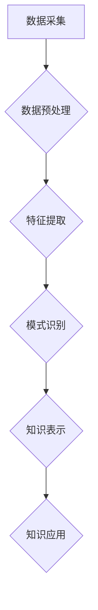

                 

## 程序员利用知识发现引擎提高工作效率

> 关键词：知识发现引擎、程序员效率、代码分析、软件开发、机器学习、数据挖掘、代码推荐、代码优化

## 1. 背景介绍

在当今软件开发领域，程序员面临着日益增长的工作压力和复杂度。代码库规模不断扩大，开发周期缩短，对程序员的效率和质量要求越来越高。传统的开发模式难以满足这些需求，因此探索新的技术手段来提高程序员工作效率成为当务之急。

知识发现引擎 (Knowledge Discovery Engine，KDE) 作为一种数据挖掘和机器学习技术，能够从海量数据中发现隐藏的知识和模式。近年来，KDE 在软件开发领域得到越来越多的关注，因为它能够帮助程序员进行代码分析、代码推荐、代码优化等工作，从而显著提高工作效率。

## 2. 核心概念与联系

### 2.1  知识发现引擎 (KDE)

知识发现引擎 (KDE) 是一种利用数据挖掘和机器学习技术从海量数据中发现隐藏的知识和模式的系统。它通常由以下几个主要模块组成：

* **数据预处理模块:** 对原始数据进行清洗、转换和格式化，使其适合后续的分析和挖掘。
* **特征提取模块:** 从数据中提取有价值的特征，这些特征可以是代码结构、语法特征、语义特征等。
* **模式识别模块:** 利用机器学习算法识别数据中的模式和规律，例如代码相似性、代码缺陷模式、代码风格等。
* **知识表示模块:** 将发现的知识和模式以可理解的形式表示出来，例如知识图谱、规则表达式等。

### 2.2  KDE在软件开发中的应用

KDE 在软件开发领域可以应用于多个方面，例如：

* **代码分析:** 分析代码结构、语法、语义等特征，识别代码缺陷、潜在风险和代码质量问题。
* **代码推荐:** 根据程序员的编程习惯和上下文信息，推荐相关的代码片段、函数和库，提高开发效率。
* **代码优化:** 分析代码性能和效率，提出代码优化建议，提高代码运行速度和资源利用率。
* **代码文档生成:** 自动生成代码文档，例如API文档、代码注释等，减少人工文档编写工作量。

### 2.3  KDE架构



## 3. 核心算法原理 & 具体操作步骤

### 3.1  算法原理概述

KDE 中常用的算法包括：

* **关联规则挖掘:** 发现数据中频繁出现的项集和关联关系，例如发现哪些代码片段经常一起出现。
* **分类算法:** 将代码分类到不同的类别，例如代码功能、代码风格、代码质量等。
* **聚类算法:** 将代码聚类到不同的组，例如根据代码相似性、代码结构等特征进行聚类。
* **序列模式挖掘:** 发现代码中出现的序列模式，例如代码执行流程、代码修改历史等。

### 3.2  算法步骤详解

以关联规则挖掘为例，其具体操作步骤如下：

1. **数据预处理:** 对代码数据进行清洗、转换和格式化，例如将代码转换为文本格式，去除注释和空格等。
2. **构建频繁项集:** 使用 Apriori 算法或 FP-Growth 算法等，找出代码数据中频繁出现的项集。
3. **生成关联规则:** 使用关联规则挖掘算法，例如基于支持度和置信度的规则生成，找出频繁项集之间的关联关系。
4. **过滤规则:** 根据一定的阈值，过滤掉不满足条件的关联规则，例如支持度和置信度低于阈值的规则。
5. **知识表示:** 将发现的关联规则以可理解的形式表示出来，例如规则列表、知识图谱等。

### 3.3  算法优缺点

**优点:**

* 能够发现隐藏的知识和模式。
* 可以自动化完成代码分析和推荐等工作。
* 可以提高代码质量和开发效率。

**缺点:**

* 需要大量的代码数据作为训练样本。
* 算法的复杂度较高，需要一定的计算资源。
* 发现的知识可能存在一定的局限性，需要人工进行验证和解释。

### 3.4  算法应用领域

* **代码缺陷检测:** 发现代码中的潜在缺陷和漏洞。
* **代码风格规范:** 识别代码风格不一致的地方，并提供改进建议。
* **代码重构:** 识别代码冗余和重复部分，并提供重构建议。
* **代码文档自动生成:** 根据代码结构和注释，自动生成代码文档。

## 4. 数学模型和公式 & 详细讲解 & 举例说明

### 4.1  数学模型构建

在关联规则挖掘中，常用的数学模型是支持度和置信度。

* **支持度:** 某个项集在整个数据集中的出现频率。

$$
Support(X) = \frac{Number of transactions containing X}{Total number of transactions}
$$

* **置信度:** 在包含某个项集 X 的交易中，另一个项集 Y 出现的概率。

$$
Confidence(X \rightarrow Y) = \frac{Number of transactions containing both X and Y}{Number of transactions containing X}
$$

### 4.2  公式推导过程

支持度和置信度的计算公式可以根据数据挖掘的原理推导出来。

* 支持度反映了某个项集在整个数据集中的频率，可以看作是该项集出现的概率。
* 置信度反映了在包含某个项集 X 的情况下，另一个项集 Y 出现的概率，可以看作是 X 和 Y 之间的关联强度。

### 4.3  案例分析与讲解

假设我们有一个包含以下交易的数据集：

* {苹果, 香蕉}
* {苹果, 橙子}
* {香蕉, 橙子}
* {苹果, 香蕉, 橙子}

我们想要挖掘 {苹果, 香蕉} 和 {橙子} 之间的关联规则。

* 支持度( {苹果, 香蕉} ) = 3/4 = 0.75
* 支持度( {橙子} ) = 3/4 = 0.75
* 置信度( {苹果, 香蕉} -> {橙子} ) = 2/3 = 0.67

从结果可以看出，{苹果, 香蕉} 和 {橙子} 之间存在一定的关联关系，因为在包含 {苹果, 香蕉} 的交易中，{橙子} 出现的概率为 0.67。

## 5. 项目实践：代码实例和详细解释说明

### 5.1  开发环境搭建

* **操作系统:** Ubuntu 20.04 LTS
* **编程语言:** Python 3.8
* **开发工具:** PyCharm
* **库依赖:** pandas, scikit-learn, matplotlib

### 5.2  源代码详细实现

```python
import pandas as pd
from sklearn.feature_extraction.text import TfidfVectorizer
from sklearn.metrics.pairwise import cosine_similarity

# 加载代码数据
code_data = pd.read_csv("code_data.csv")

# 预处理代码数据
code_data["code"] = code_data["code"].str.lower()
code_data["code"] = code_data["code"].str.replace("[^a-zA-Z0-9\s]", "")

# 使用 TF-IDF 向量化代码
vectorizer = TfidfVectorizer()
code_vectors = vectorizer.fit_transform(code_data["code"])

# 计算代码之间的余弦相似度
similarity_matrix = cosine_similarity(code_vectors)

# 寻找相似代码
def find_similar_code(target_code, top_n=5):
    target_vector = vectorizer.transform([target_code])
    similarities = cosine_similarity(target_vector, code_vectors)
    similar_indices = similarities.argsort()[0][::-1]
    similar_codes = code_data["code"].iloc[similar_indices[:top_n]]
    return similar_codes

# 示例：查找与代码片段 "for i in range(10):" 相似的代码
target_code = "for i in range(10):"
similar_codes = find_similar_code(target_code)
print(similar_codes)
```

### 5.3  代码解读与分析

* 代码首先加载代码数据，并对代码进行预处理，例如转换为小写，去除非字母数字字符等。
* 使用 TF-IDF 向量化技术将代码转换为向量表示，TF-IDF 可以反映代码中每个单词的权重，从而更好地捕捉代码的语义信息。
* 计算代码之间的余弦相似度，余弦相似度可以度量两个向量之间的角度，值越接近 1，表示两个向量越相似。
* 定义一个函数 `find_similar_code`，可以根据给定的代码片段查找相似代码。

### 5.4  运行结果展示

运行代码后，会输出与目标代码片段 "for i in range(10):" 相似的代码片段。

## 6. 实际应用场景

### 6.1  代码缺陷检测

KDE 可以分析代码结构和语法，识别代码中的潜在缺陷和漏洞，例如空指针异常、缓冲区溢出等。

### 6.2  代码风格规范

KDE 可以识别代码风格不一致的地方，并提供改进建议，例如代码缩进、命名规范等。

### 6.3  代码重构

KDE 可以识别代码冗余和重复部分，并提供重构建议，例如提取公共方法、合并重复代码等。

### 6.4  未来应用展望

随着人工智能技术的不断发展，KDE 在软件开发领域的应用前景更加广阔。未来，KDE 可能能够：

* 自动生成代码文档
* 自动完成代码测试
* 自动进行代码优化
* 提供更个性化的代码推荐

## 7. 工具和资源推荐

### 7.1  学习资源推荐

* **书籍:**
    * "Data Mining: Concepts and Techniques" by Jiawei Han, Micheline Kamber, and Jian Pei
    * "Introduction to Machine Learning" by Ethem Alpaydin
* **在线课程:**
    * Coursera: Machine Learning by Andrew Ng
    * edX: Data Mining by University of California, San Diego

### 7.2  开发工具推荐

* **Python:** 
    * Scikit-learn: 机器学习库
    * Pandas: 数据分析库
    * NLTK: 自然语言处理库
* **IDE:**
    * PyCharm: Python 开发环境
    * VS Code: 代码编辑器

### 7.3  相关论文推荐

* "A Survey of Knowledge Discovery in Software Engineering" by Y. Wang, et al.
* "Using Machine Learning for Code Completion" by A. Sharma, et al.

## 8. 总结：未来发展趋势与挑战

### 8.1  研究成果总结

KDE 在软件开发领域取得了显著的成果，能够提高代码质量、开发效率和安全性。

### 8.2  未来发展趋势

未来，KDE 将朝着以下方向发展：

* **更强大的机器学习算法:** 使用更先进的机器学习算法，例如深度学习，提高代码分析和推荐的准确性。
* **更丰富的知识表示:** 使用更灵活和丰富的知识表示形式，例如知识图谱，更好地表达代码知识。
* **更个性化的应用:** 根据程序员的编程习惯和需求，提供更个性化的代码分析和推荐服务。

### 8.3  面临的挑战

KDE 还面临着一些挑战：

* **数据质量:** KDE 的效果依赖于高质量的代码数据，而代码数据往往存在噪声和不一致性。
* **算法解释性:** 一些机器学习算法的决策过程难以解释，这使得程序员难以理解 KDE 的推荐结果。
* **可扩展性:** 随着代码库规模的不断扩大，KDE 的计算复杂度也会随之增加，需要开发更有效的算法和架构。

### 8.4  研究展望

未来，我们需要继续研究如何提高 KDE 的准确性、解释性和可扩展性，使其能够更好地服务于软件开发领域。


## 9. 附录：常见问题与解答

### 9.1  Q1: KDE 是否能够完全替代程序员？

**A1:** KDE 能够帮助程序员提高工作效率和代码质量，但它并不能完全替代程序员。程序员仍然需要进行代码设计、逻辑推理、问题解决等工作，而 KDE 只能作为程序员的辅助工具。

### 9.2  Q2: KDE 的应用场景有哪些？

**A2:** KDE 的应用场景非常广泛，例如代码缺陷检测、代码风格规范、代码重构、代码文档自动生成等。

### 9.3  Q3: 如何选择合适的 KDE 工具？

**A3:** 选择 KDE 工具时，需要考虑以下因素：

* **功能:** 工具是否支持所需的应用场景？
* **性能:** 工具的计算效率如何？
* **易用性:** 工具是否易于使用和学习？
* **成本:** 工具的费用是否合理？


作者：禅与计算机程序设计艺术 / Zen and the Art of Computer Programming 
<end_of_turn>

