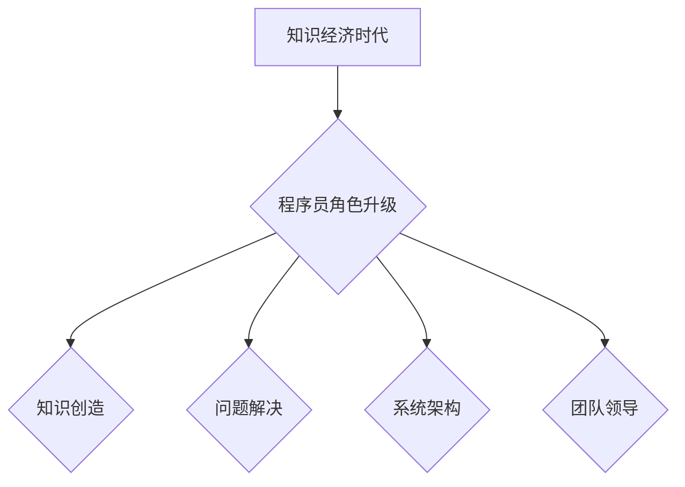

                 

## 程序员在知识经济时代的角色升级

> 关键词：知识经济、程序员、角色升级、人工智能、数据科学、软件架构、敏捷开发、持续学习

### 1. 背景介绍

知识经济时代，信息化浪潮席卷全球，数据成为新的生产要素，软件技术成为驱动经济增长的核心力量。在这个背景下，程序员作为软件开发的基石，面临着前所未有的机遇和挑战。传统的“码农”角色正在逐渐被赋予更深层的意义，程序员需要不断提升自身能力，适应新时代的需求，才能在知识经济中立于不败之地。

### 2. 核心概念与联系

**2.1 知识经济时代**

知识经济时代是指以知识、信息和技术为主要生产要素的经济形态。在这个时代，知识的创造、传播和应用成为经济增长的关键驱动力。

**2.2 程序员的角色升级**

在知识经济时代，程序员的角色不再仅仅局限于编写代码，而是需要具备更广泛的知识和技能，成为知识创造者、问题解决者、系统架构师和团队领导者。

**2.3 核心概念联系**

程序员在知识经济时代的角色升级，是知识经济发展趋势和软件技术进步的必然结果。



### 3. 核心算法原理 & 具体操作步骤

**3.1 算法原理概述**

算法是解决特定问题的步骤或规则，是程序员的核心技能之一。在知识经济时代，程序员需要掌握各种算法，例如排序算法、搜索算法、机器学习算法等，才能有效地处理海量数据、构建复杂系统和解决实际问题。

**3.2 算法步骤详解**

以排序算法为例，常见的排序算法包括冒泡排序、插入排序、快速排序等。每个算法都有其独特的步骤和逻辑，程序员需要理解这些步骤，才能正确地实现算法。

**3.3 算法优缺点**

不同的算法具有不同的优缺点，程序员需要根据实际情况选择合适的算法。例如，冒泡排序简单易懂，但效率较低；快速排序效率较高，但复杂度较高。

**3.4 算法应用领域**

算法广泛应用于各个领域，例如搜索引擎、推荐系统、图像识别、自然语言处理等。程序员需要了解算法在不同领域的应用，才能更好地解决实际问题。

### 4. 数学模型和公式 & 详细讲解 & 举例说明

**4.1 数学模型构建**

数学模型是抽象地描述客观现象的工具，程序员需要掌握数学模型的构建方法，才能更好地理解算法原理和构建复杂系统。例如，线性回归模型可以用来预测连续变量，决策树模型可以用来分类数据。

**4.2 公式推导过程**

程序员需要了解数学公式的推导过程，才能理解公式的含义和应用场景。例如，线性回归模型的损失函数公式可以用来衡量模型的预测精度，程序员可以通过优化损失函数来提高模型的性能。

**4.3 案例分析与讲解**

以线性回归模型为例，假设我们想要预测房价，可以构建一个线性回归模型，其中房型面积为自变量，房价为因变量。通过训练数据，我们可以得到模型的系数和截距，从而预测新的房价。

$$
y = mx + c
$$

其中，$y$ 为房价，$x$ 为房型面积，$m$ 为模型系数，$c$ 为截距。

### 5. 项目实践：代码实例和详细解释说明

**5.1 开发环境搭建**

程序员需要选择合适的开发环境，例如Python、Java、C++等编程语言，以及相应的开发工具，例如IDE、版本控制系统等。

**5.2 源代码详细实现**

程序员需要根据项目需求，编写源代码实现算法和功能。例如，实现一个简单的排序算法，可以使用Python语言编写如下代码：

```python
def bubble_sort(list_):
  n = len(list_)
  for i in range(n):
    for j in range(0, n-i-1):
      if list_[j] > list_[j+1]:
        list_[j], list_[j+1] = list_[j+1], list_[j]
  return list_

# 测试代码
numbers = [5, 2, 8, 1, 9]
sorted_numbers = bubble_sort(numbers)
print(sorted_numbers)
```

**5.3 代码解读与分析**

程序员需要能够解读和分析自己的代码，理解代码的逻辑和功能，并进行必要的优化和改进。

**5.4 运行结果展示**

程序员需要测试代码，并观察运行结果，确保代码能够正常运行并达到预期效果。

### 6. 实际应用场景

**6.1 搜索引擎优化**

程序员可以利用算法和数据分析技术，优化搜索引擎排名，提高网站流量。

**6.2 数据分析和挖掘**

程序员可以利用数据分析和挖掘技术，从海量数据中发现隐藏的规律和价值。

**6.3 机器学习和人工智能**

程序员可以利用机器学习和人工智能技术，开发智能应用，例如语音识别、图像识别、自然语言处理等。

**6.4 未来应用展望**

随着人工智能和物联网技术的快速发展，程序员将面临更多新的应用场景，例如自动驾驶、虚拟现实、增强现实等。

### 7. 工具和资源推荐

**7.1 学习资源推荐**

* 在线课程平台：Coursera、edX、Udemy等
* 书籍：
    * 《编程之美》
    * 《算法导论》
    * 《深度学习》
* 社区论坛：Stack Overflow、GitHub等

**7.2 开发工具推荐**

* 编程语言：Python、Java、C++等
* IDE：Visual Studio Code、IntelliJ IDEA等
* 版本控制系统：Git、GitHub等

**7.3 相关论文推荐**

* 《Attention Is All You Need》
* 《Deep Learning》
* 《A Survey of Transfer Learning》

### 8. 总结：未来发展趋势与挑战

**8.1 研究成果总结**

在知识经济时代，程序员的角色不断升级，需要具备更广泛的知识和技能，才能适应新时代的需求。

**8.2 未来发展趋势**

未来，程序员将更加注重跨学科知识的学习，例如数据科学、人工智能、云计算等。

**8.3 面临的挑战**

程序员需要不断学习新技术，才能跟上时代步伐。

**8.4 研究展望**

未来，程序员将更加注重代码的可读性、可维护性和安全性。

### 9. 附录：常见问题与解答

**9.1 如何学习编程？**

* 选择合适的编程语言和学习资源。
* 坚持练习，积累经验。
* 参加编程社区，与其他程序员交流学习。

**9.2 如何提升编程能力？**

* 阅读经典书籍和论文。
* 参加编程竞赛和开源项目。
* 关注行业动态，学习新技术。

**9.3 如何找到编程工作？**

* 完善简历和个人网站。
* 参加招聘会和面试。
* 利用网络平台寻找工作机会。


作者：禅与计算机程序设计艺术 / Zen and the Art of Computer Programming 
<end_of_turn>

