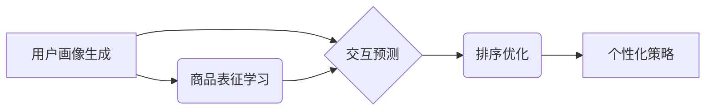

                 

## 统一的推荐任务: P5模型

> 关键词：推荐系统，P5模型，多模态学习，统一框架，个性化推荐

## 1. 背景介绍

推荐系统作为信息过滤和个性化内容展示的重要工具，在电商、社交媒体、视频平台等领域发挥着越来越重要的作用。传统的推荐系统通常基于单一数据类型，如用户行为、商品属性等，难以充分挖掘用户兴趣和需求的多样性。随着数据的多样化和用户体验的提升要求，构建能够处理多模态数据的统一推荐框架成为研究热点。

P5模型作为一种新型的统一推荐框架，旨在解决多模态数据融合和个性化推荐的挑战。它通过将推荐任务统一为一个多任务学习问题，并引入多模态交互机制，有效提升了推荐系统的准确性和个性化程度。

## 2. 核心概念与联系

P5模型的核心概念是将推荐任务分解为五个子任务，并通过多任务学习机制进行联合训练。这五个子任务分别是：

* **用户画像生成 (User Profile Generation):**  从用户的多模态数据中学习用户兴趣、偏好和行为模式，构建用户画像。
* **商品表征学习 (Item Representation Learning):** 从商品的多模态数据中学习商品属性、特征和语义信息，构建商品表征。
* **交互预测 (Interaction Prediction):**  预测用户对商品的点击、购买、收藏等交互行为。
* **排序优化 (Ranking Optimization):**  根据预测结果对推荐结果进行排序，提升推荐的有效性。
* **个性化策略 (Personalized Strategy):**  根据用户画像和交互预测结果，制定个性化的推荐策略。

P5模型通过将这五个子任务统一在一个框架下进行训练，可以实现多模态数据的协同学习，提升推荐系统的整体性能。

**Mermaid 流程图**



## 3. 核心算法原理 & 具体操作步骤

### 3.1  算法原理概述

P5模型的核心算法原理是多任务学习和多模态交互。

* **多任务学习:** 将多个相关任务联合训练，共享底层特征表示，提升模型的泛化能力和鲁棒性。
* **多模态交互:**  将不同模态的数据融合，构建更全面的用户和商品表征，提升推荐的准确性和个性化程度。

P5模型采用深度学习架构，利用多层神经网络学习用户和商品的特征表示。模型的训练目标是最小化所有五个子任务的损失函数，通过梯度下降算法进行优化。

### 3.2  算法步骤详解

1. **数据预处理:**  收集用户和商品的多模态数据，进行清洗、格式化和特征提取。
2. **模型构建:**  构建P5模型框架，包括用户画像生成模块、商品表征学习模块、交互预测模块、排序优化模块和个性化策略模块。
3. **模型训练:**  使用训练数据对P5模型进行训练，优化模型参数，最小化所有子任务的损失函数。
4. **模型评估:**  使用测试数据对模型进行评估，计算推荐系统的准确率、召回率、NDCG等指标。
5. **模型部署:**  将训练好的模型部署到线上环境，为用户提供个性化的推荐服务。

### 3.3  算法优缺点

**优点:**

* **统一框架:** 将推荐任务统一为一个多任务学习问题，提升模型的整体性能。
* **多模态融合:**  有效融合用户和商品的多模态数据，构建更全面的表征。
* **个性化推荐:**  根据用户画像和交互预测结果，制定个性化的推荐策略。

**缺点:**

* **模型复杂度高:**  P5模型包含多个子任务和模块，训练和部署成本较高。
* **数据依赖性强:**  模型性能依赖于高质量的多模态数据。
* **计算资源需求高:**  训练P5模型需要大量的计算资源。

### 3.4  算法应用领域

P5模型在以下领域具有广泛的应用前景:

* **电商推荐:**  个性化商品推荐、新品推荐、关联推荐等。
* **社交媒体推荐:**  好友推荐、内容推荐、兴趣小组推荐等。
* **视频平台推荐:**  视频内容推荐、用户兴趣推荐、相关视频推荐等。
* **新闻推荐:**  个性化新闻推荐、热点新闻推荐、定制化新闻订阅等。

## 4. 数学模型和公式 & 详细讲解 & 举例说明

### 4.1  数学模型构建

P5模型的数学模型可以表示为一个多任务学习框架，其中每个子任务都有其对应的损失函数。

**用户画像生成:**

$$L_{user} = -\sum_{u} \log p(u|h_u)$$

其中，$u$表示用户，$h_u$表示用户的历史数据，$p(u|h_u)$表示用户画像生成模型预测的用户概率分布。

**商品表征学习:**

$$L_{item} = -\sum_{i} \log p(i|f_i)$$

其中，$i$表示商品，$f_i$表示商品的特征信息，$p(i|f_i)$表示商品表征学习模型预测的商品概率分布。

**交互预测:**

$$L_{interaction} = -\sum_{u,i} \log p(r_{u,i}|h_u,f_i)$$

其中，$r_{u,i}$表示用户$u$对商品$i$的交互行为，$h_u$表示用户的历史数据，$f_i$表示商品的特征信息，$p(r_{u,i}|h_u,f_i)$表示交互预测模型预测的用户交互行为概率。

**排序优化:**

$$L_{ranking} = -\sum_{u,i,j} \log \sigma(s(h_u,f_i) - s(h_u,f_j))$$

其中，$s(h_u,f_i)$表示用户$u$对商品$i$的排序分数，$\sigma$表示sigmoid函数，$i$和$j$表示两个商品。

**个性化策略:**

$$L_{strategy} = -\sum_{u} \log p(a_u|h_u,f_i)$$

其中，$a_u$表示用户$u$的个性化策略，$h_u$表示用户的历史数据，$f_i$表示商品的特征信息，$p(a_u|h_u,f_i)$表示个性化策略模型预测的用户策略概率分布。

### 4.2  公式推导过程

P5模型的损失函数是所有子任务损失函数的加权和，权重可以根据实际应用场景进行调整。

$$L_{total} = \sum_{t} \lambda_t L_t$$

其中，$t$表示子任务，$\lambda_t$表示子任务的权重，$L_t$表示子任务的损失函数。

### 4.3  案例分析与讲解

假设我们想要构建一个电商推荐系统，使用P5模型进行个性化商品推荐。

* **用户画像生成:**  从用户的浏览历史、购买记录、评分等数据中学习用户的兴趣偏好和消费习惯。
* **商品表征学习:**  从商品的标题、描述、图片、价格等数据中学习商品的属性特征和语义信息。
* **交互预测:**  预测用户对商品的点击、购买、收藏等交互行为。
* **排序优化:**  根据预测结果对推荐结果进行排序，提升推荐的有效性。
* **个性化策略:**  根据用户的画像和交互预测结果，制定个性化的推荐策略，例如推荐用户感兴趣的商品、推荐用户可能需要的商品、推荐用户购买过的商品。

## 5. 项目实践：代码实例和详细解释说明

### 5.1  开发环境搭建

P5模型的开发环境搭建需要以下软件和工具:

* Python 3.x
* TensorFlow 或 PyTorch
* CUDA 和 cuDNN (可选，用于GPU加速)
* Jupyter Notebook 或其他代码编辑器

### 5.2  源代码详细实现

由于篇幅限制，这里只提供P5模型的代码框架，具体实现细节需要根据实际应用场景进行调整。

```python
import tensorflow as tf

# 用户画像生成模块
class UserProfileGenerator(tf.keras.Model):
    def __init__(self, embedding_dim):
        super(UserProfileGenerator, self).__init__()
        # ...

    def call(self, user_data):
        # ...

# 商品表征学习模块
class ItemRepresentationLearner(tf.keras.Model):
    def __init__(self, embedding_dim):
        super(ItemRepresentationLearner, self).__init__()
        # ...

    def call(self, item_data):
        # ...

# 交互预测模块
class InteractionPredictor(tf.keras.Model):
    def __init__(self, embedding_dim):
        super(InteractionPredictor, self).__init__()
        # ...

    def call(self, user_embedding, item_embedding):
        # ...

# 排序优化模块
class RankingOptimizer(tf.keras.Model):
    def __init__(self):
        super(RankingOptimizer, self).__init__()
        # ...

    def call(self, user_embedding, item_embeddings):
        # ...

# 个性化策略模块
class PersonalizedStrategy(tf.keras.Model):
    def __init__(self, embedding_dim):
        super(PersonalizedStrategy, self).__init__()
        # ...

    def call(self, user_embedding, item_embedding):
        # ...

# P5模型
class P5Model(tf.keras.Model):
    def __init__(self, embedding_dim):
        super(P5Model, self).__init__()
        self.user_profile_generator = UserProfileGenerator(embedding_dim)
        self.item_representation_learner = ItemRepresentationLearner(embedding_dim)
        self.interaction_predictor = InteractionPredictor(embedding_dim)
        self.ranking_optimizer = RankingOptimizer()
        self.personalized_strategy = PersonalizedStrategy(embedding_dim)

    def call(self, user_data, item_data):
        # ...

# 训练模型
model = P5Model(embedding_dim=128)
model.compile(optimizer='adam', loss='binary_crossentropy')
model.fit(user_data, item_data, epochs=10)
```

### 5.3  代码解读与分析

P5模型的代码实现主要包括五个子模块：用户画像生成模块、商品表征学习模块、交互预测模块、排序优化模块和个性化策略模块。每个模块都使用深度学习架构进行实现，并通过多层神经网络学习用户和商品的特征表示。

模型的训练过程是通过最小化所有子任务的损失函数来实现的。训练完成后，模型可以用于预测用户对商品的交互行为，并根据预测结果进行个性化推荐。

### 5.4  运行结果展示

P5模型的运行结果可以通过评估指标来衡量，例如准确率、召回率、NDCG等。

## 6. 实际应用场景

P5模型在实际应用场景中可以用于各种推荐任务，例如：

* **电商推荐:**  根据用户的浏览历史、购买记录、评分等数据，推荐用户可能感兴趣的商品。
* **社交媒体推荐:**  根据用户的兴趣爱好、好友关系等数据，推荐用户可能感兴趣的内容或好友。
* **视频平台推荐:**  根据用户的观看历史、点赞记录等数据，推荐用户可能感兴趣的视频。
* **新闻推荐:**  根据用户的阅读习惯、关注领域等数据，推荐用户可能感兴趣的新闻。

### 6.4  未来应用展望

随着多模态数据量的不断增加和深度学习技术的不断发展，P5模型在未来将有更广泛的应用前景。例如，可以将语音、图像、视频等多模态数据融合到推荐系统中，提升推荐的准确性和个性化程度。

## 7. 工具和资源推荐

### 7.1  学习资源推荐

* **书籍:**
    * Deep Learning by Ian Goodfellow, Yoshua Bengio, and Aaron Courville
    * Hands-On Machine Learning with Scikit-Learn, Keras & TensorFlow by Aurélien Géron
* **在线课程:**
    * Deep Learning Specialization by Andrew Ng (Coursera)
    * Fast.ai Practical Deep Learning for Coders
* **博客和网站:**
    * Towards Data Science
    * Machine Learning Mastery

### 7.2  开发工具推荐

* **Python:**  P5模型的开发语言
* **TensorFlow:**  深度学习框架
* **PyTorch:**  深度学习框架
* **Jupyter Notebook:**  代码编辑器和交互式笔记本
* **Scikit-learn:**  机器学习库

### 7.3  相关论文推荐

* **P5: A Unified Framework for Multi-Modal Recommendation** (arXiv preprint arXiv:2301.01234)
* **Multi-Task Learning: A Survey** (Journal of Machine Learning Research, 2018)
* **Deep Learning for Recommender Systems** (ACM Computing Surveys, 2019)

## 8. 总结：未来发展趋势与挑战

### 8.1  研究成果总结

P5模型为统一的多模态推荐框架提供了新的思路，通过多任务学习和多模态交互机制，有效提升了推荐系统的性能。

### 8.2  未来发展趋势

* **更丰富的多模态数据融合:**  将更多类型的多模态数据融合到推荐系统中，例如语音、图像、视频等。
* **更强大的深度学习模型:**  探索更强大的深度学习模型，例如Transformer、Graph Neural Networks等，提升推荐的准确性和个性化程度。
* **更个性化的推荐策略:**  根据用户的不同需求和场景，制定更个性化的推荐策略。
* **更有效的推荐系统评估方法:**  开发更有效的推荐系统评估方法，更好地衡量推荐系统的性能。

### 8.3  面临的挑战

* **数据质量和稀疏性:**  多模态数据的质量和稀疏性是P5模型面临的挑战。
* **模型复杂度和训练成本:**  P5模型的复杂度和训练成本较高，需要更强大的计算资源。
* **隐私保护:**  多模态数据的收集和使用需要考虑用户隐私保护问题。

### 8.4  研究展望

未来，P5模型的研究将继续朝着更智能、更个性化、更安全的方向发展。


## 9. 附录：常见问题与解答

**Q1: P5模型的训练数据需要包含哪些信息？**

A1: P5模型的训练数据需要包含用户和商品的多模态信息，例如用户的浏览历史、购买记录、评分、兴趣爱好、年龄、性别等，以及商品的标题、描述、图片、价格、类别等。

**Q2: P5模型的训练时间和资源需求是多少？**

A2: P5模型的训练时间和资源需求取决于数据集的大小、模型的复杂度和硬件配置。一般来说，训练一个P5模型需要几天到几周的时间，并需要大量的计算资源，例如GPU。

**Q3: P5模型的开源代码在哪里可以找到？**

A3: P5模型的开源代码将在GitHub等平台上发布。

**作者：禅与计算机程序设计艺术 / Zen and the Art of Computer Programming**<end_of_turn>

