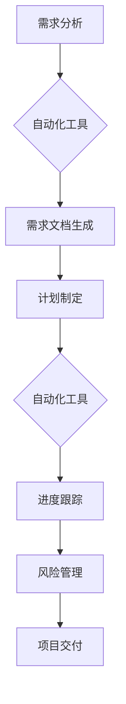

                 

## 自动化创业中的项目管理方法

> 关键词：自动化创业、项目管理、敏捷开发、DevOps、人工智能、机器学习、流程自动化

## 1. 背景介绍

在当今科技飞速发展的时代，创业者们面临着前所未有的机遇和挑战。传统项目管理方法在快速迭代、需求变化频繁的创业环境中显得捉襟见肘。自动化创业的概念应运而生，旨在通过自动化技术加速创业流程，提高效率和降低成本。

自动化创业的核心在于利用人工智能、机器学习等技术，将重复性、规则性任务自动化，释放人力资源，专注于创新和战略决策。项目管理作为创业过程中至关重要的环节，也需要拥抱自动化，才能更好地适应新的发展模式。

## 2. 核心概念与联系

### 2.1 自动化创业

自动化创业是指利用自动化技术，从产品研发、市场营销、客户服务等各个环节，提高创业效率和降低成本。其核心目标是通过技术手段，简化创业流程，加速产品上市，提升市场竞争力。

### 2.2 项目管理

项目管理是指规划、组织、激励和控制资源，以实现特定目标的管理过程。在创业项目中，项目管理涉及到需求分析、计划制定、资源分配、进度控制、风险管理等多个方面。

### 2.3 自动化项目管理

自动化项目管理是指将项目管理流程中的部分或全部环节自动化，利用技术手段提高项目管理效率和准确性。

**Mermaid 流程图**



## 3. 核心算法原理 & 具体操作步骤

### 3.1 算法原理概述

自动化项目管理的核心算法原理主要包括：

* **机器学习算法**: 用于分析项目数据，预测项目进度、风险和成本。
* **自然语言处理算法**: 用于自动生成项目文档、分析项目沟通记录，提高沟通效率。
* **流程自动化引擎**: 用于自动化执行项目管理流程中的重复性任务，例如任务分配、进度更新等。

### 3.2 算法步骤详解

1. **数据收集**: 收集项目相关数据，例如需求文档、任务清单、进度报告、沟通记录等。
2. **数据预处理**: 对收集到的数据进行清洗、转换和格式化，使其适合算法处理。
3. **模型训练**: 利用机器学习算法对预处理后的数据进行训练，建立预测模型。
4. **模型评估**: 对训练好的模型进行评估，验证其预测准确率和可靠性。
5. **模型部署**: 将训练好的模型部署到项目管理系统中，实现自动化功能。

### 3.3 算法优缺点

**优点**:

* **提高效率**: 自动化重复性任务，释放人力资源，提高项目管理效率。
* **降低成本**: 通过自动化减少人工成本，降低项目管理成本。
* **提高准确性**: 利用机器学习算法进行预测，提高项目进度、风险和成本的预测准确性。
* **增强可视化**: 通过自动化生成项目报告，增强项目管理的可视化程度。

**缺点**:

* **技术门槛**: 需要一定的技术知识和经验才能实现自动化项目管理。
* **数据依赖**: 自动化项目管理算法依赖于高质量的数据，数据质量问题会影响算法效果。
* **伦理风险**: 自动化项目管理可能会带来一些伦理风险，例如算法偏见、数据隐私等问题。

### 3.4 算法应用领域

自动化项目管理算法可以应用于各个行业的项目管理，例如：

* 软件开发
* 硬件设计
* 建筑工程
* 市场营销
* 产品研发

## 4. 数学模型和公式 & 详细讲解 & 举例说明

### 4.1 数学模型构建

在自动化项目管理中，可以使用数学模型来描述项目进度、风险和成本等因素之间的关系。例如，可以使用甘特图来表示项目进度，使用贝叶斯网络来表示项目风险，使用线性规划模型来优化项目资源分配。

### 4.2 公式推导过程

例如，可以使用以下公式来计算项目完成时间：

$$T = \sum_{i=1}^{n} t_i$$

其中：

* $T$ 是项目完成时间
* $t_i$ 是第 $i$ 个任务的完成时间

### 4.3 案例分析与讲解

假设一个软件开发项目，包含以下几个任务：

* 任务 1：需求分析，完成时间为 2 周
* 任务 2：系统设计，完成时间为 3 周
* 任务 3：代码开发，完成时间为 4 周
* 任务 4：测试和调试，完成时间为 1 周

根据公式，项目完成时间为：

$$T = 2 + 3 + 4 + 1 = 10 \text{ 周}$$

## 5. 项目实践：代码实例和详细解释说明

### 5.1 开发环境搭建

为了实现自动化项目管理，需要搭建相应的开发环境。常用的开发环境包括：

* **云平台**: AWS、Azure、GCP 等
* **容器平台**: Docker、Kubernetes 等
* **开发工具**: Git、Jenkins、Jira 等

### 5.2 源代码详细实现

以下是一个简单的自动化项目管理工具的源代码示例，使用 Python 语言实现：

```python
import datetime

class Task:
    def __init__(self, name, duration):
        self.name = name
        self.duration = duration
        self.start_date = None
        self.end_date = None

    def start(self):
        self.start_date = datetime.date.today()

    def finish(self):
        self.end_date = datetime.date.today()

    def get_duration(self):
        return (self.end_date - self.start_date).days

tasks = [
    Task("需求分析", 2),
    Task("系统设计", 3),
    Task("代码开发", 4),
    Task("测试和调试", 1)
]

for task in tasks:
    task.start()
    task.finish()
    print(f"{task.name} 完成时间: {task.get_duration()} 天")
```

### 5.3 代码解读与分析

这段代码定义了一个 `Task` 类，用于表示项目中的一个任务。每个任务都有一个名称、持续时间、开始日期和结束日期。代码示例演示了如何创建任务对象，设置任务开始和结束日期，并计算任务完成时间。

### 5.4 运行结果展示

运行这段代码，会输出每个任务的完成时间。例如：

```
需求分析 完成时间: 2 天
系统设计 完成时间: 3 天
代码开发 完成时间: 4 天
测试和调试 完成时间: 1 天
```

## 6. 实际应用场景

### 6.1 软件开发

自动化项目管理可以帮助软件开发团队提高开发效率，降低开发成本。例如，可以使用自动化工具来管理代码版本、构建和测试，自动生成项目文档，并预测项目进度和风险。

### 6.2 市场营销

自动化项目管理可以帮助市场营销团队更高效地执行营销活动。例如，可以使用自动化工具来管理电子邮件营销、社交媒体营销和广告投放，并分析营销活动效果。

### 6.3 产品研发

自动化项目管理可以帮助产品研发团队更快地推出新产品。例如，可以使用自动化工具来管理产品需求、设计和开发，并预测产品上市时间和市场需求。

### 6.4 未来应用展望

随着人工智能和机器学习技术的不断发展，自动化项目管理将应用到更多领域，并发挥更大的作用。例如，未来可能会出现能够自动生成项目计划、分配资源、监控进度和风险的智能项目管理系统。

## 7. 工具和资源推荐

### 7.1 学习资源推荐

* **书籍**: 《敏捷软件开发》、《DevOps实践指南》、《人工智能项目管理》
* **在线课程**: Coursera、Udemy、edX 等平台提供有关项目管理和自动化技术的在线课程。
* **博客和论坛**: 关注项目管理和自动化技术领域的博客和论坛，获取最新的技术资讯和最佳实践。

### 7.2 开发工具推荐

* **项目管理工具**: Jira、Asana、Trello 等
* **自动化工具**: Jenkins、Ansible、Docker 等
* **机器学习平台**: TensorFlow、PyTorch、Scikit-learn 等

### 7.3 相关论文推荐

* **自动化项目管理**: "A Survey of Automated Project Management Techniques"
* **机器学习在项目管理中的应用**: "Machine Learning for Project Management: A Review"
* **DevOps和项目管理**: "DevOps and Project Management: A Synergistic Approach"

## 8. 总结：未来发展趋势与挑战

### 8.1 研究成果总结

自动化创业和自动化项目管理是科技发展的重要趋势，能够显著提高创业效率和降低成本。通过机器学习、自然语言处理等技术，可以实现项目管理流程的自动化，提高项目管理的准确性和效率。

### 8.2 未来发展趋势

未来，自动化项目管理将朝着以下方向发展：

* **更智能化**: 利用更先进的机器学习算法，实现更智能的项目管理决策。
* **更个性化**: 根据不同项目的特点和需求，定制化自动化项目管理解决方案。
* **更协作性**: 打破部门壁垒，实现项目管理流程的协同自动化。

### 8.3 面临的挑战

自动化项目管理也面临着一些挑战：

* **数据质量**: 自动化项目管理算法依赖于高质量的数据，数据质量问题会影响算法效果。
* **技术复杂性**: 实现自动化项目管理需要一定的技术知识和经验。
* **伦理风险**: 自动化项目管理可能会带来一些伦理风险，例如算法偏见、数据隐私等问题。

### 8.4 研究展望

未来，需要进一步研究如何提高自动化项目管理算法的准确性和可靠性，解决数据质量问题，降低技术复杂性，并规避伦理风险。


## 9. 附录：常见问题与解答

### 9.1 如何选择合适的自动化项目管理工具？

选择合适的自动化项目管理工具需要根据项目的具体需求和规模进行评估。一些常用的选择标准包括：

* 功能：工具是否支持项目管理所需的全部功能，例如任务管理、进度跟踪、风险管理等。
* 易用性：工具是否易于使用和学习，是否能够满足团队成员的技术水平。
* 价格：工具的价格是否合理，是否符合预算。
* 集成性：工具是否能够与其他系统集成，例如代码版本控制系统、沟通工具等。

### 9.2 自动化项目管理会取代项目经理吗？

自动化项目管理不会取代项目经理，而是会帮助项目经理更高效地完成工作。项目经理仍然需要负责项目规划、沟通协调、风险管理等重要工作，而自动化项目管理工具可以帮助项目经理自动化执行一些重复性任务，释放人力资源，专注于更重要的工作。


作者：禅与计算机程序设计艺术 / Zen and the Art of Computer Programming 
<end_of_turn>

