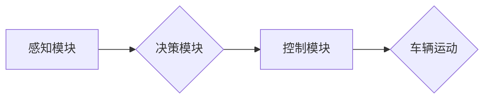

                 

## 自动驾驶系统：感知、决策与控制

> 关键词：自动驾驶、感知、决策、控制、机器学习、深度学习、传感器融合、路径规划、运动控制

## 1. 背景介绍

自动驾驶技术作为人工智能领域的重要分支，近年来发展迅速，并逐渐成为未来交通运输的重要趋势。自动驾驶系统旨在通过感知环境、决策行驶路线和控制车辆动作，实现车辆自主行驶的目标。其核心目标是提高交通安全、缓解交通拥堵、提升出行效率，并为人们带来更加便捷舒适的出行体验。

自动驾驶系统的研发面临着诸多挑战，包括感知环境的复杂性、决策过程的安全性、控制策略的鲁棒性等。然而，随着人工智能、传感器技术、计算能力等领域的不断进步，自动驾驶技术也取得了显著的进展。从早期简单的自动泊车功能到如今能够实现高速公路自动驾驶的车辆，自动驾驶技术已经走过了漫长的发展历程。

## 2. 核心概念与联系

自动驾驶系统主要由感知、决策和控制三个核心模块组成，它们相互协作，共同实现车辆的自主行驶。

**感知模块**负责收集车辆周围的环境信息，包括道路状况、车辆位置、行人信息、交通信号等。常用的感知传感器包括摄像头、雷达、激光雷达、超声波传感器等。

**决策模块**根据感知模块获取的环境信息，分析当前路况，规划行驶路线，并做出相应的驾驶决策，例如加速、减速、转向、停车等。决策模块通常采用机器学习、深度学习等算法进行决策推理。

**控制模块**根据决策模块的指令，控制车辆的各个动作，例如油门、刹车、转向等。控制模块需要精确地控制车辆的运动状态，确保车辆安全稳定行驶。

**Mermaid 流程图：**



## 3. 核心算法原理 & 具体操作步骤

### 3.1  算法原理概述

自动驾驶系统的决策模块通常采用基于机器学习的算法进行决策推理。其中，深度学习算法由于其强大的学习能力和对复杂环境的适应性，在自动驾驶领域得到了广泛应用。

常见的深度学习算法包括卷积神经网络（CNN）、循环神经网络（RNN）和强化学习算法等。CNN擅长处理图像数据，可以用于目标识别、场景理解等任务；RNN擅长处理序列数据，可以用于预测车辆未来运动轨迹等任务；强化学习算法可以训练智能体在环境中学习最优策略，例如在自动驾驶场景中，可以训练车辆在不同路况下做出最优的驾驶决策。

### 3.2  算法步骤详解

以CNN为例，其决策过程可以概括为以下步骤：

1. **数据采集和预处理:** 收集大量的驾驶场景图像数据，并进行预处理，例如图像裁剪、增强、归一化等。
2. **模型构建:** 设计CNN网络结构，包括卷积层、池化层、全连接层等。
3. **模型训练:** 使用训练数据训练CNN模型，通过反向传播算法调整模型参数，使模型能够准确识别道路场景中的目标，例如车辆、行人、交通信号等。
4. **模型评估:** 使用测试数据评估模型的性能，例如识别准确率、召回率等。
5. **模型部署:** 将训练好的模型部署到自动驾驶系统中，用于实时决策。

### 3.3  算法优缺点

**优点:**

* 强大的学习能力，能够从大量数据中学习复杂的驾驶规则。
* 对复杂环境的适应性强，能够处理各种突发情况。
* 性能不断提升，随着数据量的增加，模型性能会不断提高。

**缺点:**

* 训练数据量大，需要大量的标注数据。
* 训练时间长，需要大量的计算资源。
* 缺乏可解释性，难以理解模型的决策过程。

### 3.4  算法应用领域

深度学习算法在自动驾驶领域有着广泛的应用，例如：

* **目标识别:** 识别道路场景中的目标，例如车辆、行人、交通信号等。
* **场景理解:** 理解道路场景的整体结构和动态变化。
* **路径规划:** 根据路况规划最优行驶路线。
* **运动控制:** 控制车辆的加速、减速、转向等动作。

## 4. 数学模型和公式 & 详细讲解 & 举例说明

### 4.1  数学模型构建

自动驾驶系统的决策模块通常采用概率模型进行决策推理。例如，在路径规划任务中，可以使用贝叶斯网络构建一个概率模型，表示车辆在不同路况下的行驶概率。

**贝叶斯网络**是一种图模型，用于表示随机变量之间的依赖关系。每个节点代表一个随机变量，边表示变量之间的依赖关系。贝叶斯网络可以用于计算给定证据条件下，其他变量的概率分布。

### 4.2  公式推导过程

假设我们有一个贝叶斯网络，其中包含以下随机变量：

* **X:** 路况（晴天、雨天、雪天）
* **Y:** 车辆行驶速度
* **Z:** 安全距离

我们可以使用贝叶斯公式计算给定路况条件下，车辆行驶速度和安全距离的概率分布：

$$P(Y,Z|X) = \frac{P(X|Y,Z)P(Y,Z)}{P(X)}$$

其中：

* $P(Y,Z|X)$ 是给定路况 X 条件下，车辆行驶速度 Y 和安全距离 Z 的联合概率分布。
* $P(X|Y,Z)$ 是给定车辆行驶速度 Y 和安全距离 Z 条件下，路况 X 的条件概率分布。
* $P(Y,Z)$ 是车辆行驶速度 Y 和安全距离 Z 的联合概率分布。
* $P(X)$ 是路况 X 的边缘概率分布。

### 4.3  案例分析与讲解

例如，假设我们知道路况是晴天，那么我们可以使用贝叶斯公式计算给定晴天条件下，车辆行驶速度和安全距离的概率分布。

如果我们知道车辆行驶速度和安全距离之间的依赖关系，以及路况对车辆行驶速度和安全距离的影响，那么我们可以根据贝叶斯公式计算出相应的概率分布。

## 5. 项目实践：代码实例和详细解释说明

### 5.1  开发环境搭建

自动驾驶系统的开发环境通常包括以下软件：

* **操作系统:** Linux 或 Windows
* **编程语言:** Python 或 C++
* **深度学习框架:** TensorFlow 或 PyTorch
* **仿真平台:** Gazebo 或 CARLA

### 5.2  源代码详细实现

以下是一个使用 TensorFlow 实现简单路径规划的代码示例：

```python
import tensorflow as tf

# 定义模型输入
input_tensor = tf.keras.Input(shape=(10,))

# 定义模型层
dense_layer = tf.keras.layers.Dense(64, activation='relu')(input_tensor)
output_layer = tf.keras.layers.Dense(1, activation='sigmoid')(dense_layer)

# 定义模型
model = tf.keras.Model(inputs=input_tensor, outputs=output_layer)

# 编译模型
model.compile(optimizer='adam', loss='binary_crossentropy', metrics=['accuracy'])

# 训练模型
model.fit(x_train, y_train, epochs=10)

# 预测
predictions = model.predict(x_test)
```

### 5.3  代码解读与分析

这段代码定义了一个简单的深度学习模型，用于预测车辆是否需要转向。模型输入是一个10维的向量，代表车辆周围的环境信息，例如距离最近的车辆距离、道路弯曲度等。模型输出是一个0到1之间的值，表示车辆是否需要转向。

### 5.4  运行结果展示

训练完成后，我们可以使用测试数据评估模型的性能，例如计算模型的准确率。

## 6. 实际应用场景

自动驾驶技术已经开始在一些实际场景中应用，例如：

* **无人驾驶汽车:** 许多汽车制造商正在开发无人驾驶汽车，例如特斯拉、谷歌、百度等。
* **无人配送车:** 一些公司正在使用无人驾驶车进行商品配送，例如京东、美团等。
* **无人驾驶公交车:** 一些城市正在试点无人驾驶公交车，例如新加坡、美国等。

### 6.4  未来应用展望

未来，自动驾驶技术将应用于更广泛的场景，例如：

* **自动驾驶飞机:** 无人驾驶飞机将能够提高航空运输效率和安全性。
* **自动驾驶船舶:** 无人驾驶船舶将能够减少船舶运营成本和环境污染。
* **自动驾驶机器人:** 无人驾驶机器人将能够在工业、农业、医疗等领域发挥重要作用。

## 7. 工具和资源推荐

### 7.1  学习资源推荐

* **书籍:**
    * 《自动驾驶汽车：感知、决策与控制》
    * 《深度学习》
    * 《机器学习》
* **在线课程:**
    * Coursera: 自动驾驶汽车
    * Udacity: 自动驾驶工程师
    * edX: 深度学习

### 7.2  开发工具推荐

* **仿真平台:** Gazebo, CARLA
* **深度学习框架:** TensorFlow, PyTorch
* **编程语言:** Python, C++

### 7.3  相关论文推荐

* **论文:**
    * 《End to End Learning for Self-Driving Cars》
    * 《Deep Reinforcement Learning for Autonomous Driving》
    * 《A Survey on Deep Learning for Autonomous Driving》

## 8. 总结：未来发展趋势与挑战

### 8.1  研究成果总结

自动驾驶技术取得了显著的进展，从早期简单的功能到如今能够实现高速公路自动驾驶的车辆，自动驾驶技术已经走过了漫长的发展历程。深度学习算法在自动驾驶领域发挥着越来越重要的作用，其强大的学习能力和对复杂环境的适应性，为自动驾驶技术的实现提供了重要的技术支撑。

### 8.2  未来发展趋势

未来，自动驾驶技术将朝着以下方向发展：

* **更强的感知能力:** 开发更先进的传感器和感知算法，能够更准确地感知周围环境。
* **更智能的决策能力:** 开发更强大的机器学习算法，能够更智能地决策行驶路线和动作。
* **更安全的控制策略:** 开发更鲁棒的控制策略，能够应对各种突发情况。
* **更广泛的应用场景:** 自动驾驶技术将应用于更多场景，例如无人驾驶飞机、无人驾驶船舶等。

### 8.3  面临的挑战

自动驾驶技术仍然面临着诸多挑战，例如：

* **数据安全:** 自动驾驶系统需要收集大量的驾驶数据，如何保证数据的安全和隐私是一个重要问题。
* **伦理问题:** 自动驾驶系统在遇到紧急情况时，如何做出道德决策是一个需要认真思考的问题。
* **法律法规:** 自动驾驶技术的法律法规体系尚不完善，需要进一步完善。

### 8.4  研究展望

未来，自动驾驶技术的研究将更加注重以下方面：

* **场景理解和决策推理:** 开发更强大的场景理解和决策推理算法，能够更好地应对复杂环境。
* **安全性和可靠性:** 提高自动驾驶系统的安全性和可靠性，确保其能够安全可靠地行驶。
* **人机交互:** 研究更自然的、更友好的人机交互方式，使自动驾驶系统更加易于使用。

## 9. 附录：常见问题与解答

**常见问题:**

* 自动驾驶技术什么时候能够普及？
* 自动驾驶技术会取代人类驾驶员吗？
* 自动驾驶技术有哪些安全隐患？

**解答:**

* 自动驾驶技术的普及时间还无法确定，需要克服技术、法律、社会等方面的挑战。
* 自动驾驶技术不会完全取代人类驾驶员，而是会与人类驾驶员协同工作，例如在复杂路况下，人类驾驶员可以接管车辆控制。
* 自动驾驶技术仍然存在一些安全隐患，例如传感器故障、软件错误等，需要不断改进和完善。


作者：禅与计算机程序设计艺术 / Zen and the Art of Computer Programming 
<end_of_turn>

