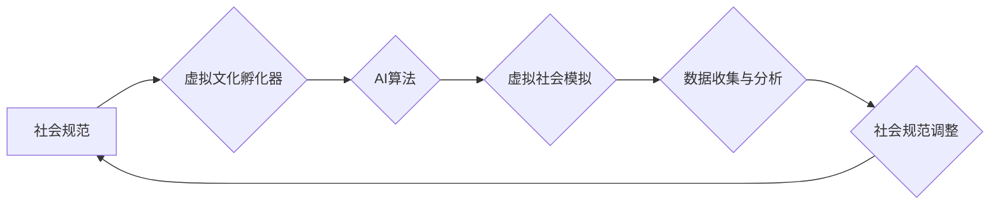

                 

## 虚拟文化孵化器：AI塑造的新型社会规范实验室

> 关键词：人工智能、虚拟文化、社会规范、伦理学、算法、仿真、模拟、未来社会

### 1. 背景介绍

人类社会的发展离不开文化规范的塑造和演变。从古老的宗教仪式到现代的法律法规，文化规范为我们的行为提供了框架，引导着我们如何与他人相处、如何理解世界。然而，随着人工智能技术的飞速发展，我们正站在一个新的十字路口。AI技术的强大能力不仅改变着生产方式和生活方式，也开始深刻地影响着我们社会文化的构建和演变。

虚拟现实（VR）和增强现实（AR）技术的兴起为构建虚拟文化提供了新的平台。这些技术能够创造沉浸式的虚拟环境，让人们在其中体验不同的文化场景、参与虚拟社会互动，并与虚拟智能体进行交流。在这个背景下，**虚拟文化孵化器**应运而生，它是一个利用AI技术模拟和演算社会规范的实验平台，旨在探索AI如何塑造新型社会规范，并为未来社会发展提供参考。

### 2. 核心概念与联系

**虚拟文化孵化器**的核心概念是将社会规范的形成和演变过程模拟成一个可控的实验环境。在这个环境中，AI算法扮演着重要的角色，它可以根据预设的规则和参数，模拟不同社会结构、文化背景和价值观的虚拟社会。

**核心架构：**



**核心概念的联系：**

* **社会规范：** 指的是社会成员之间行为准则、价值观和信仰体系的共同认同。
* **虚拟文化孵化器：** 利用AI技术构建一个模拟社会环境，用于研究和实验社会规范的形成和演变过程。
* **AI算法：** 负责模拟社会成员的行为、决策和互动，并根据预设的规则和参数调整虚拟社会的运行状态。
* **虚拟社会模拟：** 通过AI算法的驱动，构建一个虚拟社会环境，其中包含虚拟人口、虚拟机构和虚拟社会活动。
* **数据收集与分析：** 在虚拟社会模拟过程中收集数据，分析社会规范的演变趋势和影响因素。
* **社会规范调整：** 根据数据分析结果，调整AI算法的参数和规则，模拟不同社会规范的演变过程。

### 3. 核心算法原理 & 具体操作步骤

#### 3.1  算法原理概述

虚拟文化孵化器的核心算法基于**代理模型**和**强化学习**的原理。

* **代理模型：** 将虚拟社会中的每个成员抽象成一个代理，每个代理都有自己的属性、目标和行为策略。代理模型可以模拟人类的认知、决策和行为模式。
* **强化学习：** 通过奖励和惩罚机制，训练代理模型学习最优的行为策略。在虚拟社会中，代理模型可以通过与其他代理的互动、完成任务和遵守社会规范获得奖励，而违反社会规范或导致负面后果则会受到惩罚。

#### 3.2  算法步骤详解

1. **构建代理模型库：** 根据不同的社会角色和文化背景，构建不同类型的代理模型，例如：个体、家庭、组织、政府等。每个代理模型都拥有自己的属性、目标和行为策略。
2. **设定虚拟社会环境：** 创建一个虚拟社会环境，包括虚拟人口、虚拟机构、虚拟资源和虚拟社会规则。
3. **初始化代理模型：** 将代理模型随机分配到虚拟社会环境中，并赋予他们初始属性和行为策略。
4. **模拟社会互动：** 允许代理模型在虚拟社会环境中进行互动，例如：交流、合作、竞争、交易等。
5. **收集数据：** 在模拟过程中收集代理模型的行为数据、社会互动数据和社会规范数据。
6. **分析数据：** 分析收集到的数据，了解社会规范的演变趋势、影响因素和潜在问题。
7. **调整算法参数：** 根据数据分析结果，调整AI算法的参数和规则，模拟不同社会规范的演变过程。
8. **重复步骤4-7：** 重复模拟和分析过程，直到达到预设的目标或收集到足够的数据。

#### 3.3  算法优缺点

**优点：**

* **可控性强：** 可以通过调整算法参数和规则，模拟不同社会规范的演变过程。
* **数据驱动：** 基于数据分析，可以更准确地了解社会规范的演变趋势和影响因素。
* **成本低廉：** 相比于现实社会实验，虚拟文化孵化器可以以更低的成本进行模拟和研究。

**缺点：**

* **模型简化：** 虚拟文化孵化器只能模拟社会规范的某些方面，无法完全反映现实社会的复杂性。
* **数据偏差：** 虚拟社会环境的数据可能存在偏差，影响算法的准确性。
* **伦理问题：** 虚拟文化孵化器可能会引发伦理问题，例如：数据隐私、算法偏见等。

#### 3.4  算法应用领域

* **社会科学研究：** 研究社会规范的形成、演变和影响因素。
* **政策制定：** 为制定社会政策提供参考，例如：法律法规、教育制度、社会福利等。
* **文化传播：** 模拟不同文化背景的虚拟社会，促进跨文化交流和理解。
* **虚拟世界设计：** 为虚拟世界设计更合理的社会规则和文化规范。

### 4. 数学模型和公式 & 详细讲解 & 举例说明

#### 4.1  数学模型构建

虚拟文化孵化器的数学模型主要基于**博弈论**和**概率论**。

* **博弈论：** 用于描述代理模型之间的互动关系，例如：合作、竞争、博弈等。
* **概率论：** 用于描述代理模型的行为选择和社会规范的演变过程。

#### 4.2  公式推导过程

* **代理模型的效用函数：**

$$U_i(a_i, a_{-i}) = f(r_i, c_i, s_i)$$

其中：

* $U_i$ 是代理模型 $i$ 的效用函数。
* $a_i$ 是代理模型 $i$ 的行为策略。
* $a_{-i}$ 是其他代理模型的行为策略。
* $r_i$ 是代理模型 $i$ 获得的奖励。
* $c_i$ 是代理模型 $i$ 的成本。
* $s_i$ 是代理模型 $i$ 的社会地位。

* **社会规范的演变方程：**

$$\frac{dS}{dt} = \alpha \sum_{i=1}^{N} U_i(a_i, a_{-i}) - \beta S$$

其中：

* $S$ 是社会规范的强度。
* $t$ 是时间。
* $\alpha$ 是奖励系数。
* $\beta$ 是衰减系数。
* $N$ 是代理模型的数量。

#### 4.3  案例分析与讲解

假设我们模拟一个虚拟社会，其中代理模型需要遵守“诚实”的社会规范。

* **奖励机制：** 当代理模型诚实地进行交易时，会获得奖励；当代理模型欺骗他人时，会受到惩罚。
* **社会规范强度：** 诚实社会规范的强度越高，代理模型越倾向于诚实行为。

通过调整奖励系数和衰减系数，我们可以模拟不同社会环境下“诚实”社会规范的演变过程。例如：

* **高奖励系数，低衰减系数：** 诚实社会规范会快速形成并保持高强度。
* **低奖励系数，高衰减系数：** 诚实社会规范会缓慢形成并容易被打破。

### 5. 项目实践：代码实例和详细解释说明

#### 5.1  开发环境搭建

虚拟文化孵化器可以使用Python语言开发，并结合相关库进行实现。

* **Python：** 作为主流的编程语言，Python拥有丰富的库和工具，适合进行数据分析、机器学习和仿真模拟。
* **NumPy：** 用于进行数值计算和数组操作。
* **Pandas：** 用于数据分析和处理。
* **Scikit-learn：** 用于机器学习算法的实现。
* **Pygame：** 用于构建简单的图形界面。

#### 5.2  源代码详细实现

```python
# 代理模型类
class Agent:
    def __init__(self, id, initial_state):
        self.id = id
        self.state = initial_state
        self.policy = None

    def choose_action(self, state):
        # 根据策略选择行为
        return self.policy.choose_action(state)

# 社会规范类
class SocialNorm:
    def __init__(self, strength):
        self.strength = strength

    def update_strength(self, reward):
        # 根据奖励更新社会规范强度
        self.strength += reward

# 虚拟社会类
class VirtualSociety:
    def __init__(self, num_agents, social_norm):
        self.agents = [Agent(i, initial_state) for i in range(num_agents)]
        self.social_norm = social_norm

    def simulate(self, steps):
        # 模拟社会互动
        for step in range(steps):
            for agent in self.agents:
                # 代理模型选择行为
                action = agent.choose_action(agent.state)
                # 计算奖励
                reward = self.calculate_reward(agent, action)
                # 更新代理模型状态和社会规范强度
                agent.state = self.update_state(agent, action)
                self.social_norm.update_strength(reward)

# 计算奖励函数
def calculate_reward(agent, action):
    # 根据行为选择计算奖励
    pass

# 更新代理模型状态函数
def update_state(agent, action):
    # 根据行为选择更新代理模型状态
    pass
```

#### 5.3  代码解读与分析

* **代理模型类：** 定义了代理模型的基本属性和行为，包括ID、状态、策略等。
* **社会规范类：** 定义了社会规范的强度，并提供了更新社会规范强度的函数。
* **虚拟社会类：** 定义了虚拟社会环境，包括代理模型集合和社会规范。
* **模拟函数：** 模拟代理模型在虚拟社会环境中的互动，并更新代理模型状态和社会规范强度。
* **奖励函数和状态更新函数：** 需要根据具体的社会规范和虚拟社会环境进行定义。

#### 5.4  运行结果展示

通过运行代码，可以观察代理模型的行为模式、社会规范的演变趋势以及虚拟社会环境的动态变化。

### 6. 实际应用场景

虚拟文化孵化器在以下场景中具有潜在的应用价值：

* **社会实验研究：** 研究不同社会规范对人类行为的影响，例如：公平、合作、竞争等。
* **教育培训：** 模拟不同社会环境，帮助人们了解不同文化背景和价值观，提高跨文化理解能力。
* **虚拟世界设计：** 为虚拟世界设计更合理的社会规则和文化规范，创造更沉浸式的虚拟体验。
* **政策模拟：** 模拟不同政策对社会的影响，为政策制定提供参考。

#### 6.4  未来应用展望

随着人工智能技术的不断发展，虚拟文化孵化器的应用场景将会更加广泛。未来，虚拟文化孵化器可能被用于：

* **个性化教育：** 根据学生的个性特点和学习目标，定制个性化的虚拟社会环境，帮助学生更好地理解和掌握社会规范。
* **虚拟社区建设：** 创建虚拟社区，让用户可以自由地表达自己，并与他人进行互动，从而构建更加和谐的虚拟社会。
* **跨文化交流平台：** 建立跨文化交流平台，让来自不同文化背景的人们可以相互了解，促进文化融合。

### 7. 工具和资源推荐

#### 7.1  学习资源推荐

* **书籍：**
    * 《人工智能：一种现代方法》
    * 《机器学习》
    * 《博弈论导论》
* **在线课程：**
    * Coursera：人工智能、机器学习、博弈论
    * edX：人工智能、机器学习、数据科学

#### 7.2  开发工具推荐

* **Python：** 作为主流的编程语言，Python拥有丰富的库和工具，适合进行数据分析、机器学习和仿真模拟。
* **NumPy：** 用于进行数值计算和数组操作。
* **Pandas：** 用于数据分析和处理。
* **Scikit-learn：** 用于机器学习算法的实现。
* **Pygame：** 用于构建简单的图形界面。

#### 7.3  相关论文推荐

* **《虚拟社会模拟：方法、挑战和应用》**
* **《人工智能和社会规范：一个新的研究领域》**
* **《基于代理模型的虚拟文化孵化器设计》**

### 8. 总结：未来发展趋势与挑战

#### 8.1  研究成果总结

虚拟文化孵化器作为一种新型的社会规范研究平台，为我们理解和塑造未来社会提供了新的视角和方法。通过模拟和实验，我们可以更深入地了解社会规范的形成、演变和影响因素，并为制定更合理的社会政策提供参考。

#### 8.2  未来发展趋势

未来，虚拟文化孵化器将会朝着以下方向发展：

* **更加复杂的模型：** 将更加复杂的社会因素和行为模式融入到虚拟文化孵化器中，例如：情感、认知、社会网络等。
* **更加真实的仿真：** 利用虚拟现实和增强现实技术，构建更加真实的虚拟社会环境，提高用户沉浸感和体验度。
* **更加个性化的定制：** 根据用户的需求和目标，定制个性化的虚拟社会环境，提供更加精准的社会规范研究和教育培训。

#### 8.3  面临的挑战

虚拟文化孵化器的发展也面临着一些挑战：

* **模型复杂度：** 构建更加复杂的虚拟社会模型需要大量的计算资源和数据支持。
* **数据真实性：** 虚拟社会环境的数据需要尽可能真实可靠，否则会影响研究结果的准确性。
* **伦理问题：** 虚拟文化孵化器可能会引发伦理问题，例如：数据隐私、算法偏见等，需要谨慎对待。

#### 8.4  研究展望

虚拟文化孵化器作为一种新兴的社会科学研究工具，具有巨大的潜力。未来，我们将继续探索虚拟文化孵化器的应用场景，并致力于解决其面临的挑战，为构建更加美好的未来社会贡献力量。

### 9. 附录：常见问题与解答

**Q1：虚拟文化孵化器与现实社会有什么区别？**

**A1：** 虚拟文化孵化器是一个模拟的社会环境，无法完全反映现实社会的复杂性。它可以帮助我们理解社会规范的某些方面，但不能作为现实社会问题的唯一解决方案。

**Q2：虚拟文化孵化器会引发哪些伦理问题？**

**A2：** 虚拟文化孵化器可能会引发数据隐私、算法偏见、虚拟现实依赖等伦理问题。我们需要谨慎对待这些问题，并制定相应的伦理规范和监管机制。

**Q3：虚拟文化孵化器有哪些未来的发展方向？**

**A3：** 未来，虚拟文化孵化器将会朝着更加复杂的模型、更加真实的仿真、更加个性化的定制方向发展。


作者：禅与计算机程序设计艺术 / Zen and the Art of Computer Programming 
<end_of_turn>

