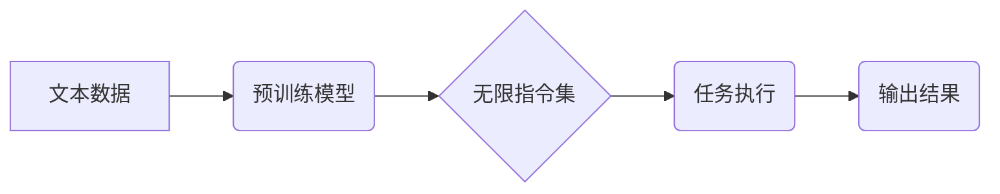

                 

## 解析LLM的无限指令集：超越CPU的能力边界

> 关键词：LLM, 自然语言处理, 指令集, 算力, 迁移学习, 泛化能力, 知识蒸馏, 算法优化,  深度学习

### 1. 背景介绍

近年来，大型语言模型（LLM）的蓬勃发展，标志着人工智能领域迈入了一个新的里程碑。这些模型，例如GPT-3、LaMDA和BERT，展现出惊人的能力，能够理解和生成人类语言，完成各种复杂的任务，从文本摘要和翻译到代码生成和创意写作。 

然而，LLM的强大能力背后，隐藏着深刻的技术挑战。传统CPU架构在处理LLM的庞大参数和复杂计算时，面临着效率和性能瓶颈。如何超越CPU的能力边界，更高效地训练和部署LLM，成为当前人工智能研究的热点问题。

### 2. 核心概念与联系

LLM的核心在于其无限指令集。与传统程序依赖于预定义指令不同，LLM能够通过学习海量文本数据，理解和执行各种形式的指令，甚至可以生成从未见过的指令。这种“无限指令集”的特性，赋予了LLM强大的泛化能力和适应性。

**Mermaid 流程图：LLM无限指令集架构**

LLM的训练过程主要分为两个阶段：预训练和微调。预训练阶段，模型通过学习大量的文本数据，学习语言的语法、语义和上下文关系，形成一个通用的语言理解和生成能力。微调阶段，模型针对特定任务进行训练，例如文本分类、机器翻译或对话系统，进一步提升其在特定领域的性能。

### 3. 核心算法原理 & 具体操作步骤

#### 3.1  算法原理概述

LLM的核心算法是基于Transformer网络的深度学习模型。Transformer网络通过自注意力机制，能够捕捉文本序列中长距离依赖关系，有效解决传统RNN模型在处理长文本时遇到的梯度消失问题。

#### 3.2  算法步骤详解

1. **词嵌入:** 将输入文本中的每个词转换为向量表示，捕捉词语的语义信息。
2. **多头自注意力:** 利用多个注意力头，从输入序列中学习不同层面的语义信息，并捕捉词语之间的关系。
3. **前馈神经网络:** 对每个词的注意力输出进行进一步处理，提取更深层次的语义特征。
4. **位置编码:** 由于Transformer网络没有循环结构，无法捕捉词语在序列中的位置信息，因此需要添加位置编码，将位置信息融入到词向量中。
5. **解码器:** 基于编码器的输出，生成目标文本序列。解码器通常使用自回归的方式，逐个预测目标文本中的词语。

#### 3.3  算法优缺点

**优点:**

* 能够捕捉长距离依赖关系，处理长文本时效果更佳。
* 并行计算能力强，训练速度更快。
* 泛化能力强，能够应用于多种自然语言处理任务。

**缺点:**

* 参数量巨大，训练成本高。
* 对训练数据质量要求高，容易受到噪声数据的影响。
* 缺乏对真实世界知识的理解，难以处理需要逻辑推理的任务。

#### 3.4  算法应用领域

LLM的应用领域非常广泛，包括：

* **文本生成:** 写作、诗歌创作、代码生成等。
* **文本理解:** 文本摘要、问答系统、情感分析等。
* **机器翻译:** 将一种语言翻译成另一种语言。
* **对话系统:** 与人类进行自然语言对话。

### 4. 数学模型和公式 & 详细讲解 & 举例说明

#### 4.1  数学模型构建

LLM的核心数学模型是Transformer网络，其主要由编码器和解码器组成。编码器负责将输入文本序列编码成一个固定长度的向量表示，解码器则根据编码器的输出生成目标文本序列。

#### 4.2  公式推导过程

Transformer网络的核心是自注意力机制。自注意力机制的计算公式如下：

$$
Attention(Q, K, V) = softmax(\frac{QK^T}{\sqrt{d_k}})V
$$

其中：

* $Q$：查询矩阵
* $K$：键矩阵
* $V$：值矩阵
* $d_k$：键向量的维度
* $softmax$：softmax函数

#### 4.3  案例分析与讲解

假设我们有一个句子“我爱学习编程”，将其编码成词向量表示，每个词的向量维度为128。

* $Q$、$K$、$V$矩阵分别对应每个词的查询向量、键向量和值向量。
* 通过计算$QK^T$，得到每个词与所有其他词之间的相似度得分。
* 使用softmax函数将得分归一化，得到每个词对其他词的注意力权重。
* 将注意力权重与值矩阵相乘，得到每个词的加权平均值，作为该词的最终表示。

### 5. 项目实践：代码实例和详细解释说明

#### 5.1  开发环境搭建

LLM的开发环境通常需要强大的计算资源，例如GPU。可以使用云平台，例如AWS、Google Cloud或Azure，搭建开发环境。

#### 5.2  源代码详细实现

LLM的源代码通常开源，例如HuggingFace Transformers库。可以使用该库加载预训练模型，并进行微调。

#### 5.3  代码解读与分析

LLM的代码实现主要包括以下几个部分：

* 数据加载和预处理
* 模型定义和参数初始化
* 训练过程
* 模型评估和保存

#### 5.4  运行结果展示

LLM的训练结果可以评估其在特定任务上的性能，例如准确率、召回率和F1-score。

### 6. 实际应用场景

LLM已经应用于许多实际场景，例如：

* **聊天机器人:** 提供更自然、更智能的对话体验。
* **文本摘要:** 自动生成文章的摘要，提高阅读效率。
* **机器翻译:** 实现更准确、更流畅的语言翻译。
* **代码生成:** 自动生成代码，提高开发效率。

#### 6.4  未来应用展望

LLM的未来应用前景广阔，例如：

* **个性化教育:** 提供个性化的学习方案和辅导。
* **医疗诊断:** 辅助医生进行疾病诊断和治疗方案制定。
* **科学研究:** 加速科学发现和技术创新。

### 7. 工具和资源推荐

#### 7.1  学习资源推荐

* **书籍:** 《深度学习》、《自然语言处理》
* **在线课程:** Coursera、edX、Udacity
* **博客和论坛:** HuggingFace社区、AI Stack Exchange

#### 7.2  开发工具推荐

* **Python:** 广泛用于深度学习开发
* **TensorFlow:** 开源深度学习框架
* **PyTorch:** 开源深度学习框架
* **HuggingFace Transformers:** 提供预训练LLM模型和工具

#### 7.3  相关论文推荐

* **Attention Is All You Need:** https://arxiv.org/abs/1706.03762
* **BERT: Pre-training of Deep Bidirectional Transformers for Language Understanding:** https://arxiv.org/abs/1810.04805
* **GPT-3: Language Models are Few-Shot Learners:** https://arxiv.org/abs/2005.14165

### 8. 总结：未来发展趋势与挑战

#### 8.1  研究成果总结

LLM的快速发展，为人工智能领域带来了巨大的进步，展现出强大的应用潜力。

#### 8.2  未来发展趋势

* **模型规模和能力的提升:** 随着计算资源的不断发展，LLM的规模和能力将继续提升，能够处理更复杂的任务。
* **高效训练和部署方法的探索:** 如何更高效地训练和部署大型模型，降低成本和时间消耗，是未来研究的重要方向。
* **多模态LLM的开发:** 将文本、图像、音频等多种模态信息融合到LLM中，实现更全面的理解和生成能力。

#### 8.3  面临的挑战

* **数据安全和隐私问题:** LLM的训练需要大量数据，如何保证数据安全和隐私，是需要认真考虑的问题。
* **模型可解释性和信任问题:** LLM的决策过程复杂，难以解释，如何提高模型的可解释性和信任度，是需要解决的关键问题。
* **伦理和社会影响问题:** LLM的强大能力可能带来伦理和社会问题，例如信息操纵、偏见放大等，需要谨慎应对。

#### 8.4  研究展望

LLM的研究充满挑战和机遇，未来将继续朝着更强大、更安全、更可解释的方向发展，为人类社会带来更多福祉。

### 9. 附录：常见问题与解答

* **什么是LLM？**

LLM是指大型语言模型，是一种能够理解和生成人类语言的深度学习模型。

* **LLM的训练数据是什么？**

LLM的训练数据通常是海量文本数据，例如书籍、文章、网站内容等。

* **LLM的应用场景有哪些？**

LLM的应用场景非常广泛，例如聊天机器人、文本摘要、机器翻译、代码生成等。

* **如何训练一个LLM？**

训练一个LLM需要强大的计算资源和大量数据，通常需要使用深度学习框架，例如TensorFlow或PyTorch。

* **LLM的未来发展趋势是什么？**

LLM的未来发展趋势是模型规模和能力的提升、高效训练和部署方法的探索、多模态LLM的开发等。

作者：禅与计算机程序设计艺术 / Zen and the Art of Computer Programming 
<end_of_turn>

