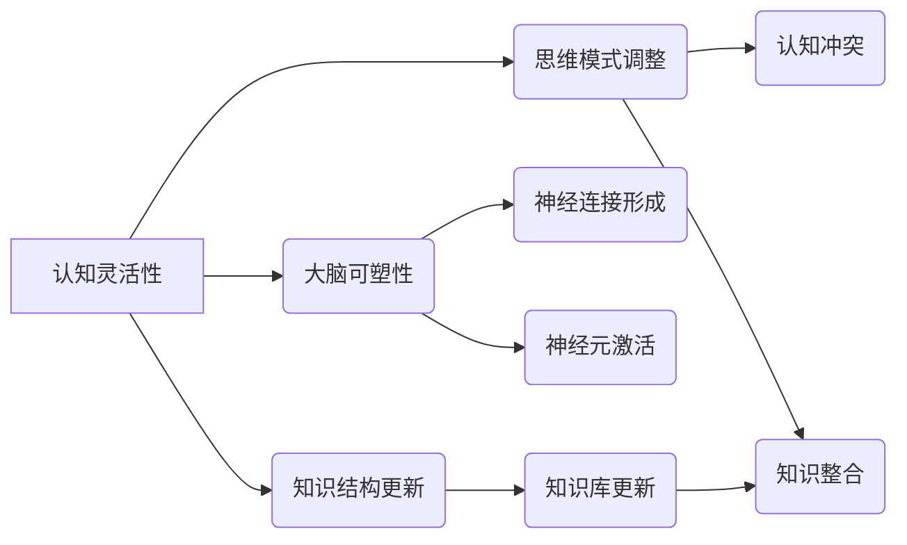

                 

## 认知灵活性：适应新知识的大脑机制

> 关键词：认知灵活性、神经网络、知识更新、学习算法、适应性、大脑机制、机器学习

## 1. 背景介绍

在瞬息万变的现代社会，获取和处理信息的速度日益加快。人类需要不断学习新知识，并根据新的信息调整自己的认知框架，才能适应不断变化的环境。这种适应新知识的能力被称为“认知灵活性”。

认知灵活性是人类智能的核心要素之一，它不仅影响着个体的学习能力和解决问题的能力，也决定着社会整体的进步和发展。然而，认知灵活性是如何实现的？大脑的哪些机制在其中起着关键作用？这些问题一直是神经科学和认知科学领域的研究热点。

## 2. 核心概念与联系

认知灵活性是一个复杂的概念，它涉及到多个领域，包括神经科学、认知心理学、人工智能等。

**2.1 神经科学视角**

从神经科学的角度来看，认知灵活性与大脑的**可塑性**密切相关。大脑的可塑性是指大脑结构和功能在经历新的刺激或学习后能够发生改变的能力。当我们学习新知识时，大脑会形成新的神经连接，或者强化已经存在的连接，从而改变自身的结构和功能。

**2.2 认知心理学视角**

认知心理学则强调认知灵活性与**思维模式**和**知识结构**的调整有关。当我们遇到新的信息时，我们需要根据已有知识进行理解和解释。如果我们的思维模式过于僵化，难以适应新的信息，就会导致认知冲突，从而阻碍学习和理解。

**2.3 人工智能视角**

人工智能领域的研究者们也对认知灵活性非常感兴趣。他们试图通过构建能够学习和适应新知识的人工智能系统来理解和模拟人类的认知机制。

**2.4 核心概念关系图**



## 3. 核心算法原理 & 具体操作步骤

### 3.1 算法原理概述

认知灵活性算法的核心原理是模拟大脑的学习和适应机制。这些算法通常基于神经网络模型，并利用**反向传播**算法进行训练。

反向传播算法是一种迭代优化算法，它通过不断调整神经网络的权重来最小化预测误差。在训练过程中，算法会将输入数据与期望输出进行比较，并根据误差反向传播，调整神经网络的权重。

### 3.2 算法步骤详解

1. **数据预处理:** 将原始数据转换为算法可以理解的格式。
2. **网络结构设计:** 根据任务需求设计神经网络的结构，包括神经元数量、层数、激活函数等。
3. **权重初始化:** 为神经网络的权重赋予初始值。
4. **前向传播:** 将输入数据通过神经网络进行处理，得到输出结果。
5. **误差计算:** 将输出结果与期望输出进行比较，计算误差。
6. **反向传播:** 将误差反向传播到神经网络的各个层，并根据误差调整权重。
7. **迭代训练:** 重复步骤4-6，直到误差达到预设阈值。

### 3.3 算法优缺点

**优点:**

* 能够学习复杂的数据模式。
* 具有较强的泛化能力，能够应用于不同的任务。
* 能够不断学习和改进。

**缺点:**

* 训练时间长，需要大量的计算资源。
* 训练过程难以解释，黑盒效应严重。
* 对数据质量要求高，容易受到噪声数据的影响。

### 3.4 算法应用领域

认知灵活性算法在许多领域都有广泛的应用，例如：

* **自然语言处理:** 机器翻译、文本摘要、情感分析等。
* **计算机视觉:** 图像识别、物体检测、图像分割等。
* **语音识别:** 语音转文本、语音合成等。
* **推荐系统:** 商品推荐、内容推荐等。

## 4. 数学模型和公式 & 详细讲解 & 举例说明

### 4.1 数学模型构建

认知灵活性算法通常基于神经网络模型，其中神经元之间通过**权重**连接。每个神经元接收来自其他神经元的输入信号，并根据激活函数进行处理，输出信号到下一个神经元。

**4.1.1 神经网络模型**

一个简单的感知器模型可以表示为：

$$
y = f(w_1x_1 + w_2x_2 + ... + w_nx_n + b)
$$

其中：

* $y$ 是神经元的输出
* $x_1, x_2, ..., x_n$ 是输入信号
* $w_1, w_2, ..., w_n$ 是权重
* $b$ 是偏置
* $f$ 是激活函数

**4.1.2 激活函数**

激活函数决定了神经元的输出特性。常用的激活函数包括 sigmoid 函数、ReLU 函数等。

**4.1.3 反向传播算法**

反向传播算法通过计算误差梯度来更新权重。误差梯度表示权重变化对误差的影响。

### 4.2 公式推导过程

反向传播算法的具体推导过程比较复杂，涉及到微积分和线性代数的知识。这里只简要介绍一下核心思想：

1. 计算输出误差：将输出结果与期望输出进行比较，计算误差。
2. 计算误差梯度：根据误差和神经网络的结构，计算每个权重的误差梯度。
3. 更新权重：根据误差梯度和学习率，更新每个权重。

### 4.3 案例分析与讲解

例如，在训练一个图像分类模型时，我们可以使用反向传播算法来更新模型的权重。

当模型预测的类别与实际类别不一致时，误差就会产生。反向传播算法会计算出每个权重对误差的影响，并根据这些影响更新权重。通过不断迭代训练，模型的预测精度会逐渐提高。

## 5. 项目实践：代码实例和详细解释说明

### 5.1 开发环境搭建

为了实现认知灵活性算法，我们需要搭建一个合适的开发环境。常用的开发环境包括：

* **Python:** Python 是一个流行的编程语言，拥有丰富的机器学习库，例如 TensorFlow、PyTorch 等。
* **深度学习框架:** TensorFlow 和 PyTorch 是两个流行的深度学习框架，它们提供了许多方便的工具和函数，可以帮助我们构建和训练神经网络模型。
* **硬件资源:** 训练深度学习模型需要大量的计算资源，因此我们需要配备足够的 CPU 或 GPU。

### 5.2 源代码详细实现

以下是一个使用 TensorFlow 实现简单感知器的代码示例：

```python
import tensorflow as tf

# 定义模型
model = tf.keras.models.Sequential([
  tf.keras.layers.Dense(units=1, input_shape=[1])
])

# 编译模型
model.compile(optimizer='sgd', loss='mean_squared_error')

# 训练模型
model.fit(x=[1, 2, 3, 4], y=[2, 4, 6, 8], epochs=100)

# 预测结果
predictions = model.predict([5])
print(predictions)
```

### 5.3 代码解读与分析

这段代码定义了一个简单的感知器模型，包含一个全连接层。模型的输入是一个单一的数字，输出是一个数字。

代码使用随机梯度下降 (SGD) 作为优化器，并使用均方误差 (MSE) 作为损失函数。模型训练了 100 个 epochs，即使用训练数据训练了 100 次。

最后，代码使用训练好的模型预测输入值为 5 的结果。

### 5.4 运行结果展示

运行这段代码后，会输出模型预测的结果。由于模型是一个简单的感知器，因此预测结果可能并不精确。

## 6. 实际应用场景

认知灵活性算法在许多实际应用场景中发挥着重要作用，例如：

### 6.1 个性化推荐系统

个性化推荐系统可以根据用户的历史行为和偏好，推荐个性化的商品、内容或服务。认知灵活性算法可以帮助推荐系统学习用户的兴趣和需求，并根据用户的反馈不断调整推荐策略。

### 6.2 自动驾驶系统

自动驾驶系统需要能够识别道路上的各种物体，并做出相应的决策。认知灵活性算法可以帮助自动驾驶系统学习不同的驾驶场景，并适应不同的路况和交通状况。

### 6.3 机器翻译

机器翻译系统需要能够将一种语言翻译成另一种语言。认知灵活性算法可以帮助机器翻译系统学习不同的语言结构和语义，并提高翻译的准确性和流畅度。

### 6.4 未来应用展望

随着人工智能技术的不断发展，认知灵活性算法的应用场景将会更加广泛。未来，我们可能会看到更多基于认知灵活性算法的创新应用，例如：

* **智能教育:** 个性化学习方案、智能辅导系统
* **医疗诊断:** 基于患者病史和症状的智能诊断
* **金融风险管理:** 基于市场数据和用户行为的风险预测

## 7. 工具和资源推荐

### 7.1 学习资源推荐

* **书籍:**
    * 《深度学习》
    * 《神经网络与深度学习》
* **在线课程:**
    * Coursera: 深度学习
    * Udacity: 机器学习工程师
* **博客和网站:**
    * TensorFlow 官方博客
    * PyTorch 官方博客
    * Machine Learning Mastery

### 7.2 开发工具推荐

* **Python:** Python 是深度学习开发的常用语言。
* **TensorFlow:** TensorFlow 是一个开源的深度学习框架。
* **PyTorch:** PyTorch 是另一个开源的深度学习框架。
* **Jupyter Notebook:** Jupyter Notebook 是一个交互式编程环境，方便深度学习开发和调试。

### 7.3 相关论文推荐

* **《AlexNet: Image Classification with Deep Convolutional Neural Networks》**
* **《ImageNet Classification with Deep Convolutional Neural Networks》**
* **《Recurrent Neural Networks for Sequence Learning》**

## 8. 总结：未来发展趋势与挑战

### 8.1 研究成果总结

认知灵活性算法取得了显著的进展，在许多领域取得了成功应用。这些算法能够学习复杂的数据模式，并适应新的信息和环境。

### 8.2 未来发展趋势

未来，认知灵活性算法的研究将朝着以下几个方向发展：

* **更强大的模型:** 研究更强大的神经网络模型，例如 Transformer 模型，以提高算法的性能和泛化能力。
* **更有效的训练方法:** 研究更有效的训练方法，例如自监督学习和迁移学习，以降低训练成本和时间。
* **更可解释的模型:** 研究更可解释的模型，以便更好地理解算法的决策过程。

### 8.3 面临的挑战

认知灵活性算法仍然面临着一些挑战，例如：

* **数据依赖性:** 这些算法对数据质量要求很高，容易受到噪声数据的影响。
* **计算成本:** 训练大型神经网络模型需要大量的计算资源。
* **可解释性:** 这些算法的决策过程难以解释，缺乏透明度。

### 8.4 研究展望

尽管面临挑战，但认知灵活性算法仍然是一个充满希望的研究领域。随着技术的不断发展，我们相信认知灵活性算法将在未来发挥更大的作用，帮助我们更好地理解和应对复杂的世界。

## 9. 附录：常见问题与解答

**Q1: 认知灵活性算法和机器学习有什么区别？**

**A1:** 认知灵活性算法是一种机器学习算法，它旨在模拟大脑的学习和适应机制。机器学习是一个更广泛的概念，涵盖了许多不同的算法，包括监督学习、无监督学习和强化学习。

**Q2: 认知灵活性算法的训练过程是如何进行的？**

**A2:** 认知灵活性算法的训练过程通常基于反向传播算法，它通过不断调整神经网络的权重来最小化预测误差。

**Q3: 认知灵活性算法有哪些应用场景？**

**A3:** 认知灵活性算法在许多领域都有应用，例如个性化推荐系统、自动驾驶系统、机器翻译等。

**Q4: 认知灵活性算法的未来发展趋势是什么？**

**A4:** 未来，认知灵活性算法的研究将朝着更强大的模型、更有效的训练方法和更可解释的模型的方向发展。


作者：禅与计算机程序设计艺术 / Zen and the Art of Computer Programming 
<end_of_turn>

