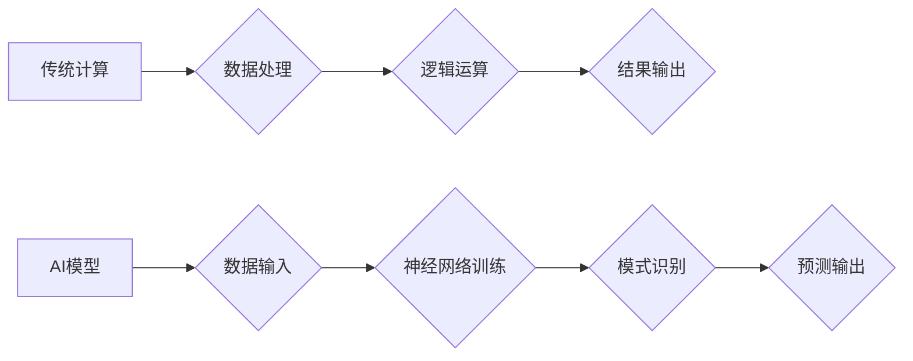

                 

## 超越 AI：未来的计算

> 关键词：人工智能、量子计算、神经网络、机器学习、计算模型、算法优化、未来技术、计算架构

## 1. 背景介绍

人工智能（AI）近年来取得了令人瞩目的进展，从语音识别到图像生成，AI已经渗透到我们生活的方方面面。然而，传统的基于深度学习的AI模型仍然存在一些局限性，例如数据依赖性强、可解释性差、计算资源消耗大等。 

随着科技的不断发展，新的计算范式正在孕育，例如量子计算、神经形态计算等，这些新兴技术有望突破AI的瓶颈，开启计算的新纪元。

## 2. 核心概念与联系

### 2.1  传统计算与AI

传统计算基于经典物理学，使用二进制位（0和1）来表示信息。AI模型，特别是深度学习模型，依赖于大量的训练数据和复杂的计算网络来学习和识别模式。

### 2.2  量子计算与AI

量子计算利用量子力学原理，使用量子比特（qubit）来存储和处理信息。量子比特可以同时处于0和1的叠加态，从而拥有比经典比特更高的计算能力。

量子计算有望解决传统计算难以处理的复杂问题，例如药物发现、材料科学、金融建模等。

### 2.3  神经形态计算与AI

神经形态计算模仿人脑的神经网络结构和工作机制，使用模拟神经元的硬件来进行计算。

神经形态计算具有低功耗、高效率、并行处理能力等优势，有望实现更接近人类智能的AI系统。

## 3. 核心算法原理 & 具体操作步骤

### 3.1  算法原理概述

本文将重点介绍量子计算中的**量子叠加**和**量子纠缠**两个核心概念，以及它们在AI算法中的应用。

* **量子叠加:** 量子比特可以同时处于0和1的叠加态，这意味着它可以同时代表多个可能性。

* **量子纠缠:** 两个或多个量子比特可以相互纠缠，即使它们相隔很远，它们的状态也相互关联。

### 3.2  算法步骤详解

1. **量子态初始化:** 将量子比特初始化到特定的状态，例如|0⟩或|1⟩。
2. **量子门操作:** 使用量子门对量子比特进行操作，例如旋转、相移、纠缠等。
3. **量子测量:** 对量子比特进行测量，得到0或1的结果。
4. **结果分析:** 分析测量结果，从中提取出所需的信息。

### 3.3  算法优缺点

**优点:**

* 计算能力强，可以解决传统计算难以处理的复杂问题。
* 具有并行计算能力，可以加速算法执行速度。

**缺点:**

* 量子硬件技术尚不成熟，成本高昂。
* 量子算法的开发难度较高，需要专业的量子计算知识。

### 3.4  算法应用领域

* **药物发现:** 利用量子模拟来研究分子结构和相互作用，加速药物研发。
* **材料科学:** 设计新型材料，例如超导材料、轻质材料等。
* **金融建模:** 建立更精确的金融模型，进行风险管理和投资决策。

## 4. 数学模型和公式 & 详细讲解 & 举例说明

### 4.1  数学模型构建

量子叠加可以用数学公式来表示：

$$|\psi\rangle = \alpha |0\rangle + \beta |1\rangle$$

其中， $|\psi\rangle$ 表示量子态， $|0\rangle$ 和 $|1\rangle$ 表示基态， $\alpha$ 和 $\beta$ 是复数系数，满足 $|\alpha|^2 + |\beta|^2 = 1$。

### 4.2  公式推导过程

量子纠缠可以用数学公式来描述：

$$|\phi\rangle = \frac{1}{\sqrt{2}}(|00\rangle + |11\rangle)$$

其中， $|\phi\rangle$ 表示纠缠态， $|00\rangle$ 和 $|11\rangle$ 表示两个量子比特都处于基态的态。

### 4.3  案例分析与讲解

假设有两个纠缠的量子比特，其中一个量子比特测量到状态|0⟩，那么另一个量子比特的态将自动坍缩到|0⟩。

## 5. 项目实践：代码实例和详细解释说明

### 5.1  开发环境搭建

使用量子计算平台，例如IBM Quantum Experience、Google Quantum AI等。

### 5.2  源代码详细实现

使用量子编程语言，例如Qiskit、Cirq等，编写量子算法代码。

### 5.3  代码解读与分析

解释代码中的量子门操作、量子测量等步骤。

### 5.4  运行结果展示

展示量子算法的运行结果，例如计算结果、概率分布等。

## 6. 实际应用场景

### 6.1  药物发现

利用量子模拟来研究药物分子与蛋白质相互作用，加速药物研发。

### 6.2  材料科学

设计新型材料，例如超导材料、轻质材料等。

### 6.3  金融建模

建立更精确的金融模型，进行风险管理和投资决策。

### 6.4  未来应用展望

量子计算有望在更多领域得到应用，例如密码学、人工智能、宇宙学等。

## 7. 工具和资源推荐

### 7.1  学习资源推荐

* **书籍:**

    * "Quantum Computing for Everyone" by Chris Bernhardt
    * "Quantum Computation and Quantum Information" by Michael Nielsen

* **在线课程:**

    * IBM Quantum Experience
    * Google Quantum AI

### 7.2  开发工具推荐

* **Qiskit:** Python 量子编程框架
* **Cirq:** Google 开发的量子编程框架
* **PennyLane:** 用于量子机器学习的 Python 库

### 7.3  相关论文推荐

* "Quantum Supremacy Using a Programmable Superconducting Processor" by Google AI
* "Quantum Advantage in Machine Learning" by IBM Research

## 8. 总结：未来发展趋势与挑战

### 8.1  研究成果总结

量子计算技术取得了显著进展，但仍然面临着许多挑战。

### 8.2  未来发展趋势

* 量子硬件技术将继续发展，量子比特数量和稳定性将得到提升。
* 量子算法研究将更加深入，开发出更多高效的量子算法。
* 量子计算与人工智能的结合将更加紧密，推动人工智能的快速发展。

### 8.3  面临的挑战

* 量子硬件成本高昂，难以普及。
* 量子算法开发难度高，需要专业的量子计算知识。
* 量子计算的安全性问题需要得到解决。

### 8.4  研究展望

未来，量子计算将成为计算领域的颠覆性技术，为人类社会带来巨大的变革。

## 9. 附录：常见问题与解答

* **什么是量子计算？**

量子计算是一种利用量子力学原理进行计算的新型计算范式。

* **量子计算与传统计算有什么区别？**

量子计算利用量子比特来存储和处理信息，而传统计算使用经典比特。量子比特可以同时处于多个状态，从而拥有更高的计算能力。

* **量子计算有哪些应用场景？**

量子计算有望应用于药物发现、材料科学、金融建模、密码学等领域。

作者：禅与计算机程序设计艺术 / Zen and the Art of Computer Programming

<end_of_turn>

