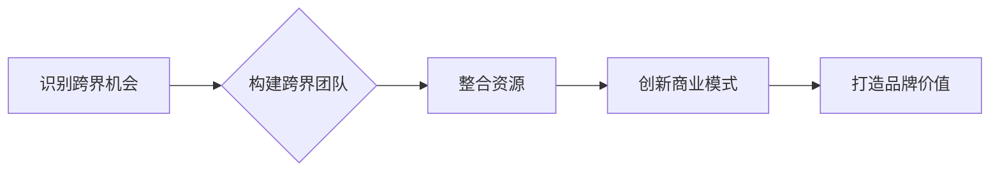

                 

## 跨界创业：打破行业界限的创新

> 关键词：跨界创新、行业融合、人工智能、数据驱动、商业模式、技术应用、创业实践

### 1. 背景介绍

当今世界，科技发展日新月异，行业界限日益模糊。传统的行业模式正在被打破，新的商业模式和服务不断涌现。跨界创业，即将不同行业、不同领域的知识、技术和资源进行融合，创造出全新的价值，成为了一种重要的创新模式。

跨界创业的兴起，得益于以下几个因素：

* **科技进步**:  人工智能、大数据、云计算等技术的快速发展，打破了传统行业之间的壁垒，促进了跨界融合。
* **市场需求**:  消费者对个性化、定制化、体验化的需求不断增长，跨界创业能够满足这些需求，创造出更具竞争力的产品和服务。
* **创业环境**:  创业生态系统日益完善，融资渠道更加多元化，为跨界创业提供了良好的土壤。

### 2. 核心概念与联系

跨界创业的核心在于打破行业壁垒，将不同领域的知识、技术和资源进行整合，创造出新的价值。

**跨界创业的流程可以概括为以下几个步骤:**

1. **识别跨界机会**: 通过分析市场趋势、技术发展和行业现状，识别出跨界融合的潜在机会。
2. **构建跨界团队**: 汇集来自不同领域的专家和人才，形成具有跨界能力的团队。
3. **整合资源**:  整合来自不同行业的资源，包括技术、资金、人才、市场等。
4. **创新商业模式**:  设计全新的商业模式，以满足跨界融合带来的新的市场需求。
5. **打造品牌价值**:  建立独特的品牌形象和价值主张，赢得市场认可。

**跨界创业的流程图:**



### 3. 核心算法原理 & 具体操作步骤

跨界创业的核心算法原理在于数据驱动和智能化。通过收集和分析来自不同行业的的数据，利用人工智能技术进行智能化处理，挖掘出隐藏的价值，并将其转化为新的产品和服务。

**3.1 算法原理概述**

跨界创业的核心算法原理可以概括为以下几个方面:

* **数据融合**: 从不同行业收集和整合数据，构建全面的数据模型。
* **特征提取**: 利用机器学习算法从数据中提取关键特征，识别出潜在的关联和模式。
* **模型构建**: 基于提取的特征，构建预测模型或推荐模型，实现跨界融合的智能化决策。
* **价值创造**: 将模型预测结果转化为新的产品、服务或商业模式，创造出新的价值。

**3.2 算法步骤详解**

跨界创业的具体操作步骤可以分为以下几个阶段:

1. **数据收集**: 从不同行业收集相关数据，包括文本数据、图像数据、音频数据等。
2. **数据预处理**: 对收集到的数据进行清洗、转换、格式化等预处理，使其能够被算法模型处理。
3. **特征提取**: 利用机器学习算法，从数据中提取关键特征，例如文本中的关键词、图像中的物体识别结果、音频中的情感分析结果等。
4. **模型构建**: 根据提取的特征，选择合适的机器学习算法构建预测模型或推荐模型。
5. **模型训练**: 利用训练数据对模型进行训练，使其能够准确地预测或推荐。
6. **模型评估**: 利用测试数据对模型进行评估，评估模型的准确率、召回率、F1-score等指标。
7. **模型部署**: 将训练好的模型部署到生产环境中，用于实际应用。

**3.3 算法优缺点**

**优点:**

* **数据驱动**: 基于数据分析和预测，能够更加精准地识别跨界机会和制定策略。
* **智能化**: 利用人工智能技术，能够自动完成数据处理、特征提取、模型构建等环节，提高效率和准确性。
* **创新性**: 能够打破行业壁垒，创造出全新的产品、服务和商业模式。

**缺点:**

* **数据依赖**: 算法的准确性依赖于数据的质量和数量，数据不足或数据质量低会影响算法效果。
* **技术门槛**: 需要具备一定的机器学习和数据分析技术，才能有效地应用算法。
* **伦理风险**: 数据收集和使用需要考虑伦理问题，避免侵犯个人隐私和造成社会不公平。

**3.4 算法应用领域**

跨界创业的算法应用领域非常广泛，例如:

* **金融科技**: 将金融数据和人工智能技术结合，开发个性化金融产品和服务。
* **医疗健康**: 利用医疗数据和人工智能技术，进行疾病诊断、治疗方案推荐和健康管理。
* **教育科技**: 基于教育数据和人工智能技术，提供个性化学习方案和智能化教学辅助工具。
* **零售电商**: 利用消费数据和人工智能技术，进行精准营销、个性化推荐和智能化物流配送。

### 4. 数学模型和公式 & 详细讲解 & 举例说明

跨界创业的算法模型通常基于统计学、概率论和机器学习等数学基础。

**4.1 数学模型构建**

一个常见的跨界创业算法模型是基于**协同过滤**的推荐系统。协同过滤算法通过分析用户对不同产品的评分或购买行为，预测用户对其他产品的偏好。

**4.2 公式推导过程**

协同过滤算法的核心公式是**相似度计算公式**:

$$
Sim(u,v) = \frac{\sum_{i \in I(u) \cap I(v)} r_{ui} * r_{vi}}{\sqrt{\sum_{i \in I(u)} r_{ui}^2} * \sqrt{\sum_{i \in I(v)} r_{vi}^2}}
$$

其中:

* $Sim(u,v)$ 表示用户 $u$ 和用户 $v$ 的相似度。
* $I(u)$ 和 $I(v)$ 分别表示用户 $u$ 和用户 $v$ 评分过的物品集合。
* $r_{ui}$ 表示用户 $u$ 对物品 $i$ 的评分。

**4.3 案例分析与讲解**

假设我们有一个电商平台，用户对商品进行评分。我们可以利用协同过滤算法，计算用户之间的相似度，并推荐用户可能感兴趣的商品。

例如，用户 A 和用户 B 都对电影类型的商品评分较高，并且对某些特定电影类型的评分也比较接近。那么，我们可以认为用户 A 和用户 B 的兴趣相似，可以推荐用户 A 喜欢的电影类型，给用户 B 作为推荐商品。

### 5. 项目实践：代码实例和详细解释说明

**5.1 开发环境搭建**

跨界创业项目开发环境通常需要包含以下软件：

* **编程语言**: Python 是跨界创业项目开发中常用的编程语言，因为它拥有丰富的机器学习库和数据分析工具。
* **机器学习库**: Scikit-learn、TensorFlow、PyTorch 等机器学习库提供了各种算法模型和工具，可以用于数据分析、特征提取和模型构建。
* **数据处理工具**: Pandas、NumPy 等数据处理工具可以用于数据清洗、转换和分析。
* **云计算平台**: AWS、Azure、GCP 等云计算平台可以提供强大的计算资源和存储空间，支持大规模数据处理和模型训练。

**5.2 源代码详细实现**

以下是一个简单的协同过滤推荐系统代码示例，使用 Python 和 Scikit-learn 库实现:

```python
from sklearn.metrics.pairwise import cosine_similarity

# 假设用户评分数据存储在ratings矩阵中
ratings = [[5, 4, 3, 2, 1],
           [4, 5, 2, 1, 3],
           [3, 2, 5, 4, 1],
           [2, 1, 4, 5, 3],
           [1, 3, 1, 3, 5]]

# 计算用户之间的相似度
similarity_matrix = cosine_similarity(ratings)

# 获取用户 A 的相似用户
user_A_index = 0
similar_users = similarity_matrix[user_A_index].argsort()[:-6:-1]

# 推荐给用户 A 的商品
recommended_items = []
for user_index in similar_users:
    for item_index in range(len(ratings[user_index])):
        if ratings[user_A_index][item_index] == 0 and ratings[user_index][item_index] > 0:
            recommended_items.append(item_index)

print(f"推荐给用户 A 的商品: {recommended_items}")
```

**5.3 代码解读与分析**

这段代码首先定义了用户评分数据，然后使用 cosine_similarity 函数计算用户之间的相似度。接着，根据用户 A 的相似用户，推荐用户 A 可能感兴趣的商品。

**5.4 运行结果展示**

运行这段代码后，会输出一个包含推荐商品索引的列表。例如，如果用户 A 对电影类型的商品评分较高，那么推荐列表中可能会包含一些电影类型的商品索引。

### 6. 实际应用场景

跨界创业的应用场景非常广泛，以下是一些具体的例子:

* **金融科技**:  将金融数据和人工智能技术结合，开发个性化金融产品和服务。例如，利用用户消费数据和信用评分，为用户提供定制化的贷款方案。
* **医疗健康**: 利用医疗数据和人工智能技术，进行疾病诊断、治疗方案推荐和健康管理。例如，利用患者的病历数据和基因信息，预测患者患病风险，并提供个性化的健康建议。
* **教育科技**: 基于教育数据和人工智能技术，提供个性化学习方案和智能化教学辅助工具。例如，利用学生的学习数据和行为模式，推荐个性化的学习资源和教学方法。
* **零售电商**: 利用消费数据和人工智能技术，进行精准营销、个性化推荐和智能化物流配送。例如，根据用户的购买历史和浏览记录，推荐用户可能感兴趣的商品，并优化物流配送路线。

**6.4 未来应用展望**

随着人工智能、大数据和云计算技术的不断发展，跨界创业将迎来更加广阔的发展空间。未来，跨界创业将更加注重以下几个方面:

* **数据隐私保护**:  在跨界融合过程中，需要更加重视数据隐私保护，确保数据的安全和合法使用。
* **算法透明度**:  需要提高算法的透明度和可解释性，让用户能够理解算法是如何工作的，并建立信任。
* **伦理规范**:  需要制定更加完善的伦理规范，引导跨界创业朝着更加可持续和负责任的方向发展。

### 7. 工具和资源推荐

**7.1 学习资源推荐**

* **书籍**: 《跨界创新》、《数据驱动》、《人工智能》
* **在线课程**: Coursera、edX、Udacity 等平台提供各种跨界创业和人工智能相关的在线课程。
* **博客和论坛**:  关注一些跨界创业和人工智能领域的博客和论坛，可以获取最新的资讯和技术分享。

**7.2 开发工具推荐**

* **编程语言**: Python
* **机器学习库**: Scikit-learn、TensorFlow、PyTorch
* **数据处理工具**: Pandas、NumPy
* **云计算平台**: AWS、Azure、GCP

**7.3 相关论文推荐**

* 《Collaborative Filtering for Recommender Systems》
* 《Deep Learning》
* 《Reinforcement Learning: An Introduction》

### 8. 总结：未来发展趋势与挑战

**8.1 研究成果总结**

跨界创业已经取得了显著的成果，在各个行业都涌现出许多成功的案例。人工智能技术的发展为跨界创业提供了强大的工具和支持，推动了跨界融合的进程。

**8.2 未来发展趋势**

未来，跨界创业将更加注重以下几个方面:

* **深度融合**:  将不同行业的知识、技术和资源进行更加深入的融合，创造出更加创新的产品和服务。
* **个性化定制**:  利用人工智能技术，为用户提供更加个性化的产品和服务，满足用户的个性化需求。
* **智能化运营**:  利用人工智能技术，实现跨界创业的智能化运营，提高效率和降低成本。

**8.3 面临的挑战**

跨界创业也面临着一些挑战，例如:

* **数据孤岛**:  不同行业的企业数据往往分散在不同的系统中，难以进行整合和共享。
* **技术壁垒**:  跨界融合需要跨越不同的技术领域，需要具备相应的技术能力和经验。
* **商业模式创新**:  跨界创业需要探索新的商业模式，才能实现可持续发展。

**8.4 研究展望**

未来，需要进一步研究跨界创业的理论和方法，探索更加有效的跨界融合模式，并解决跨界创业面临的挑战，推动跨界创业的健康发展。

### 9. 附录：常见问题与解答

**常见问题**:

* **跨界创业需要哪些技能?**

跨界创业需要具备多种技能，包括技术技能、商业技能、沟通能力和团队合作能力。

* **跨界创业有哪些风险?**

跨界创业存在一定的风险，例如市场风险、技术风险和运营风险。

* **如何评估跨界创业的机会?**

评估跨界创业的机会需要考虑市场需求、技术可行性和商业模式的可持续性等因素。

**解答**:

* 跨界创业需要具备多种技能，包括技术技能、商业技能、沟通能力和团队合作能力。

* 跨界创业存在一定的风险，例如市场风险、技术风险和运营风险。

* 如何评估跨界创业的机会? 评估跨界创业的机会需要考虑市场需求、技术可行性和商业模式的可持续性等因素。


作者：禅与计算机程序设计艺术 / Zen and the Art of Computer Programming 
<end_of_turn>

