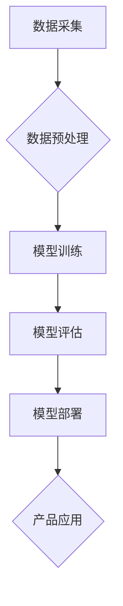

                 

## AI 大模型在创业产品开发中的趋势：利用大模型增强

> 关键词：AI大模型、创业产品、开发趋势、增强应用、技术创新

> 摘要：本文探讨了AI大模型在创业产品开发中的应用趋势，分析了其核心概念、算法原理、数学模型以及实际应用场景。通过代码实例和案例分析，阐述了大模型如何增强创业产品的功能和效率。最后，展望了大模型在未来创业领域的应用前景和面临的挑战。

## 1. 背景介绍

近年来，人工智能（AI）技术取得了飞速发展，其中大模型（Large Language Model，LLM）作为AI领域的重要突破，展现出强大的学习和推理能力。大模型通过训练海量数据，能够理解和生成人类语言，并完成各种复杂的任务，例如文本生成、翻译、问答、代码生成等。

对于创业公司来说，大模型的出现为产品开发带来了新的机遇。其强大的能力可以帮助创业公司快速迭代产品，提升用户体验，并开拓新的业务模式。

## 2. 核心概念与联系

### 2.1  大模型概述

大模型是指参数量巨大、训练数据海量的人工智能模型。其核心特点是：

* **规模庞大:** 大模型通常拥有数十亿甚至数千亿个参数，远超传统机器学习模型。
* **数据驱动:** 大模型的训练依赖于海量文本数据，通过学习数据中的模式和规律，获得强大的语言理解和生成能力。
* **泛化能力强:** 由于训练数据丰富，大模型能够应用于多种任务，并表现出较强的泛化能力。

### 2.2  大模型与创业产品

大模型可以与创业产品相结合，增强产品的功能和效率。例如：

* **内容生成:** 大模型可以帮助创业公司自动生成产品描述、营销文案、社交媒体内容等，节省人力成本，提高内容质量。
* **用户交互:** 大模型可以构建智能客服系统，提供24小时在线服务，提升用户体验。
* **数据分析:** 大模型可以分析用户行为数据，洞察用户需求，帮助创业公司优化产品和服务。

### 2.3  大模型架构



## 3. 核心算法原理 & 具体操作步骤

### 3.1  算法原理概述

大模型通常基于Transformer架构，其核心思想是利用注意力机制，捕捉文本序列中不同词语之间的关系，从而实现更精准的理解和生成。

### 3.2  算法步骤详解

1. **数据预处理:** 收集并清洗文本数据，将其转换为模型可理解的格式。
2. **模型训练:** 使用训练数据训练Transformer模型，调整模型参数，使其能够准确地理解和生成文本。
3. **模型评估:** 使用测试数据评估模型的性能，例如准确率、流畅度等。
4. **模型部署:** 将训练好的模型部署到服务器或云平台，使其能够接入实际应用场景。

### 3.3  算法优缺点

**优点:**

* 强大的语言理解和生成能力
* 泛化能力强，可应用于多种任务
* 自动学习和迭代能力

**缺点:**

* 训练成本高，需要海量数据和计算资源
* 模型参数量大，部署和推理效率较低
* 存在潜在的偏差和安全风险

### 3.4  算法应用领域

* 自然语言处理（NLP）：文本分类、情感分析、机器翻译、问答系统等
* 代码生成：自动生成代码、代码补全、代码修复等
* 内容创作：自动生成文章、故事、诗歌等
* 人机交互：构建智能聊天机器人、虚拟助手等

## 4. 数学模型和公式 & 详细讲解 & 举例说明

### 4.1  数学模型构建

大模型的数学模型通常基于深度神经网络，其核心是Transformer架构。Transformer架构由编码器和解码器组成，编码器负责将输入文本序列编码为隐藏状态，解码器则根据隐藏状态生成输出文本序列。

### 4.2  公式推导过程

Transformer架构的核心是注意力机制，其公式如下：

$$
Attention(Q, K, V) = \frac{exp(Q \cdot K^T / \sqrt{d_k})}{exp(Q \cdot K^T / \sqrt{d_k})} \cdot V
$$

其中：

* $Q$：查询矩阵
* $K$：键矩阵
* $V$：值矩阵
* $d_k$：键向量的维度

注意力机制通过计算查询向量与键向量的相似度，来确定每个词语对其他词语的影响程度。

### 4.3  案例分析与讲解

例如，在机器翻译任务中，编码器会将源语言文本编码为隐藏状态，解码器则根据隐藏状态生成目标语言文本。注意力机制可以帮助解码器关注源语言文本中与目标语言词语相关的部分，从而提高翻译的准确性和流畅度。

## 5. 项目实践：代码实例和详细解释说明

### 5.1  开发环境搭建

* Python 3.7+
* TensorFlow 或 PyTorch 深度学习框架
* CUDA 和 cuDNN (可选，用于GPU加速)

### 5.2  源代码详细实现

```python
import tensorflow as tf

# 定义Transformer模型
class Transformer(tf.keras.Model):
    def __init__(self, vocab_size, embedding_dim, num_heads, num_layers):
        super(Transformer, self).__init__()
        self.embedding = tf.keras.layers.Embedding(vocab_size, embedding_dim)
        self.transformer_layers = tf.keras.layers.StackedRNNCells([
            tf.keras.layers.Attention(num_heads=num_heads)
            for _ in range(num_layers)
        ])

    def call(self, inputs):
        embedded = self.embedding(inputs)
        output = self.transformer_layers(embedded)
        return output

# 实例化模型
model = Transformer(vocab_size=10000, embedding_dim=128, num_heads=8, num_layers=6)

# 训练模型
model.compile(optimizer='adam', loss='mse')
model.fit(x_train, y_train, epochs=10)
```

### 5.3  代码解读与分析

* 模型定义：定义了一个Transformer模型，包含嵌入层、多层Transformer层。
* 嵌入层：将输入词语转换为向量表示。
* Transformer层：包含注意力机制和多头自注意力机制，用于捕捉文本序列中的关系。
* 训练模型：使用Adam优化器和均方误差损失函数训练模型。

### 5.4  运行结果展示

训练完成后，可以使用模型对新的文本进行预测，例如生成文本、翻译文本等。

## 6. 实际应用场景

### 6.1  智能客服

大模型可以构建智能客服系统，自动回答用户常见问题，提供24小时在线服务，提升用户体验。

### 6.2  内容创作

大模型可以帮助创业公司自动生成产品描述、营销文案、社交媒体内容等，节省人力成本，提高内容质量。

### 6.3  数据分析

大模型可以分析用户行为数据，洞察用户需求，帮助创业公司优化产品和服务。

### 6.4  未来应用展望

* **个性化推荐:** 根据用户的兴趣和行为，提供个性化的产品推荐。
* **自动代码生成:** 自动生成代码，提高开发效率。
* **虚拟助手:** 构建更智能的虚拟助手，帮助用户完成各种任务。

## 7. 工具和资源推荐

### 7.1  学习资源推荐

* **书籍:**
    * 《深度学习》
    * 《自然语言处理》
* **在线课程:**
    * Coursera
    * edX
* **开源项目:**
    * TensorFlow
    * PyTorch

### 7.2  开发工具推荐

* **Jupyter Notebook:** 用于代码编写和实验。
* **Google Colab:** 基于云端的开发环境，提供免费GPU资源。
* **Hugging Face:** 提供预训练大模型和开发工具。

### 7.3  相关论文推荐

* 《Attention Is All You Need》
* 《BERT: Pre-training of Deep Bidirectional Transformers for Language Understanding》
* 《GPT-3: Language Models are Few-Shot Learners》

## 8. 总结：未来发展趋势与挑战

### 8.1  研究成果总结

大模型在自然语言处理、代码生成、内容创作等领域取得了显著成果，为创业产品开发带来了新的机遇。

### 8.2  未来发展趋势

* **模型规模进一步扩大:** 随着计算资源的提升，大模型的规模将继续扩大，性能将进一步提升。
* **多模态大模型:** 将文本、图像、音频等多种模态数据融合到一起，构建更强大的多模态大模型。
* **可解释性增强:** 研究大模型的决策机制，提高模型的可解释性和透明度。

### 8.3  面临的挑战

* **训练成本高:** 训练大模型需要海量数据和计算资源，成本较高。
* **模型部署效率低:** 大模型的参数量大，部署和推理效率较低。
* **数据安全和隐私问题:** 大模型的训练依赖于大量数据，需要解决数据安全和隐私问题。

### 8.4  研究展望

未来，大模型技术将继续发展，并应用于更多领域。创业公司可以通过利用大模型技术，开发更智能、更具竞争力的产品，推动科技创新和经济发展。

## 9. 附录：常见问题与解答

* **Q: 如何选择合适的预训练大模型？**
* **A:** 选择预训练大模型时，需要考虑模型的规模、任务类型、数据域等因素。

* **Q: 如何部署大模型到生产环境？**
* **A:** 可以使用云平台提供的服务，例如AWS SageMaker、Google Cloud AI Platform等，进行大模型的部署和推理。


作者：禅与计算机程序设计艺术 / Zen and the Art of Computer Programming 
<end_of_turn>

