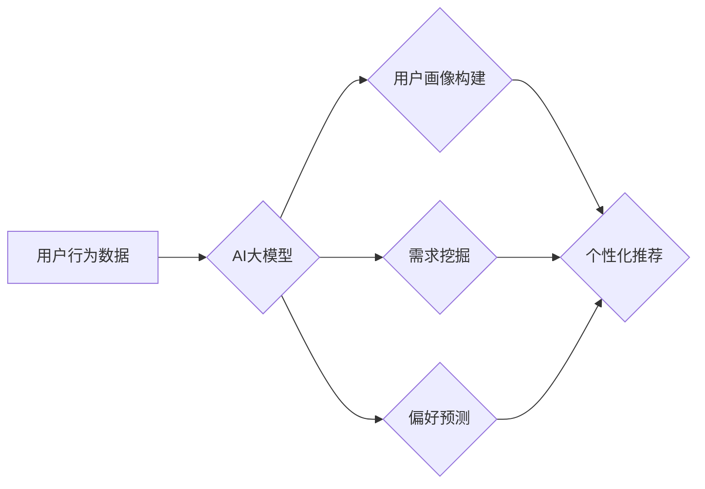

                 

## AI 大模型在电商搜索推荐中的用户行为分析：理解用户需求与购买偏好

> 关键词：AI大模型，电商搜索推荐，用户行为分析，需求理解，购买偏好，推荐算法

> 摘要：随着电商平台的蓬勃发展，搜索推荐系统已成为用户获取商品信息和完成购买的重要途径。本文深入探讨了AI大模型在电商搜索推荐中的应用，重点分析了如何利用大模型技术理解用户需求和购买偏好，进而提升推荐系统的精准度和用户体验。文章首先介绍了电商搜索推荐的背景和核心概念，然后详细阐述了AI大模型在用户行为分析中的作用，包括用户画像构建、需求挖掘和偏好预测等。此外，还介绍了常用的推荐算法原理和具体操作步骤，并结合实际案例分析了数学模型和公式的应用。最后，文章探讨了AI大模型在电商搜索推荐领域的未来发展趋势和挑战。

## 1. 背景介绍

1.1 电商平台发展现状

电子商务平台的快速发展为人们提供了便捷的购物体验，同时也带来了巨大的数据量。用户在电商平台上浏览商品、添加购物车、进行购买等行为都产生了大量的行为数据，这些数据蕴含着丰富的用户需求和购买偏好信息。

1.2 搜索推荐系统的核心功能

搜索推荐系统是电商平台的核心功能之一，它通过分析用户搜索历史、浏览记录、购买行为等数据，为用户推荐相关商品，帮助用户快速找到所需商品，提升用户购物体验。

1.3 传统搜索推荐系统的局限性

传统的搜索推荐系统主要依赖于基于规则的算法和协同过滤算法，这些算法难以充分挖掘用户行为数据中的隐含信息，推荐结果往往不够精准，难以满足用户个性化需求。

## 2. 核心概念与联系

2.1 AI大模型

AI大模型是指在海量数据上训练的深度学习模型，具有强大的学习和推理能力，能够从复杂的数据中提取特征、发现模式和进行预测。

2.2 用户行为分析

用户行为分析是指通过收集、分析用户在电商平台上的行为数据，以了解用户需求、偏好和购物习惯，为个性化推荐提供数据支持。

2.3 推荐算法

推荐算法是指用于根据用户行为数据预测用户潜在兴趣的算法，常用的推荐算法包括协同过滤算法、基于内容的推荐算法、基于知识的推荐算法等。

**Mermaid 流程图**



## 3. 核心算法原理 & 具体操作步骤

3.1 算法原理概述

在电商搜索推荐中，AI大模型可以应用于多种推荐算法，例如：

* **Transformer模型**: Transformer模型是一种强大的序列建模模型，能够捕捉用户行为数据中的长距离依赖关系，用于构建用户画像和预测用户偏好。
* **图神经网络**: 图神经网络可以将用户和商品之间的关系建模为图结构，通过学习图结构中的特征，进行商品推荐。
* **强化学习**: 强化学习可以训练一个代理智能体，通过与环境交互学习最优的推荐策略，不断优化推荐结果。

3.2 算法步骤详解

以Transformer模型为例，其在电商搜索推荐中的具体操作步骤如下：

1. **数据预处理**: 收集用户行为数据，包括搜索历史、浏览记录、购买记录等，并进行清洗、转换和编码。
2. **模型训练**: 使用预处理后的数据训练Transformer模型，训练目标是预测用户对商品的点击、购买等行为。
3. **模型评估**: 使用测试数据评估模型的性能，常用的指标包括准确率、召回率、AUC等。
4. **模型部署**: 将训练好的模型部署到线上环境，用于实时推荐商品。

3.3 算法优缺点

**优点**:

* 能够捕捉用户行为数据中的复杂模式和关系。
* 推荐结果更加精准和个性化。
* 能够不断学习和优化推荐策略。

**缺点**:

* 训练数据量大，需要强大的计算资源。
* 模型训练时间长，需要专业的技术人员进行操作。
* 模型解释性较差，难以理解模型的推荐决策过程。

3.4 算法应用领域

AI大模型在电商搜索推荐领域的应用非常广泛，例如：

* **商品推荐**: 根据用户的历史行为数据，推荐用户可能感兴趣的商品。
* **搜索结果排序**: 根据用户的搜索关键词和行为数据，对搜索结果进行排序，提升用户搜索体验。
* **个性化广告**: 根据用户的兴趣爱好和购买偏好，推送个性化的广告。

## 4. 数学模型和公式 & 详细讲解 & 举例说明

4.1 数学模型构建

在电商搜索推荐中，常用的数学模型包括：

* **协同过滤模型**: 基于用户的历史行为数据，预测用户对商品的评分或购买概率。
* **内容推荐模型**: 基于商品的特征信息，预测用户对商品的兴趣。
* **混合推荐模型**: 将协同过滤模型和内容推荐模型相结合，提升推荐效果。

4.2 公式推导过程

以协同过滤模型为例，其核心公式为：

$$
\hat{r}_{u,i} = \bar{r}_u + \frac{\sum_{j \in N(u)} (r_{u,j} - \bar{r}_u) \cdot (r_{j,i} - \bar{r}_j)}{\sum_{j \in N(u)} (r_{u,j} - \bar{r}_u)^2}
$$

其中：

* $\hat{r}_{u,i}$: 用户 $u$ 对商品 $i$ 的预测评分。
* $\bar{r}_u$: 用户 $u$ 的平均评分。
* $r_{u,j}$: 用户 $u$ 对商品 $j$ 的实际评分。
* $N(u)$: 用户 $u$ 评分过的商品集合。

4.3 案例分析与讲解

假设用户 $A$ 评分了商品 $B$ 和 $C$，商品 $B$ 和 $C$ 都与商品 $D$ 相关，则可以使用协同过滤模型预测用户 $A$ 对商品 $D$ 的评分。

## 5. 项目实践：代码实例和详细解释说明

5.1 开发环境搭建

* Python 3.x
* TensorFlow/PyTorch
* Jupyter Notebook

5.2 源代码详细实现

```python
# 导入必要的库
import tensorflow as tf

# 定义模型结构
model = tf.keras.Sequential([
    tf.keras.layers.Embedding(input_dim=vocab_size, output_dim=embedding_dim),
    tf.keras.layers.LSTM(units=128),
    tf.keras.layers.Dense(units=1, activation='sigmoid')
])

# 编译模型
model.compile(optimizer='adam', loss='binary_crossentropy', metrics=['accuracy'])

# 训练模型
model.fit(X_train, y_train, epochs=10, batch_size=32)

# 评估模型
loss, accuracy = model.evaluate(X_test, y_test)
print('Loss:', loss)
print('Accuracy:', accuracy)
```

5.3 代码解读与分析

* 首先，导入必要的库，包括 TensorFlow 和 PyTorch。
* 然后，定义模型结构，使用 Embedding 层将用户和商品的 ID 转换为向量表示，使用 LSTM 层捕捉用户行为数据中的序列信息，最后使用 Dense 层进行预测。
* 接着，编译模型，选择 Adam 优化器、二元交叉熵损失函数和准确率作为评估指标。
* 然后，训练模型，使用训练数据进行模型训练，设置训练轮数和批处理大小。
* 最后，评估模型，使用测试数据评估模型的性能，打印损失和准确率。

5.4 运行结果展示

训练完成后，可以将模型部署到线上环境，用于实时推荐商品。

## 6. 实际应用场景

6.1 个性化商品推荐

根据用户的浏览历史、购买记录等数据，为用户推荐个性化的商品，提升用户购物体验。

6.2 搜索结果优化

根据用户的搜索关键词和行为数据，对搜索结果进行排序，提升用户搜索效率。

6.3 跨界商品推荐

根据用户的购买偏好，推荐与用户购买商品相关的跨界商品，拓展用户消费场景。

6.4 未来应用展望

* **多模态推荐**: 将文本、图像、视频等多模态数据融合到推荐系统中，提升推荐效果。
* **实时个性化推荐**: 基于用户的实时行为数据，进行动态调整推荐策略，提供更精准的推荐结果。
* **解释性推荐**: 提升推荐模型的解释性，让用户了解推荐结果背后的逻辑，增强用户信任度。

## 7. 工具和资源推荐

7.1 学习资源推荐

* **书籍**:
    * 《深度学习》
    * 《自然语言处理》
    * 《推荐系统》
* **在线课程**:
    * Coursera
    * edX
    * Udacity

7.2 开发工具推荐

* **TensorFlow**: 开源深度学习框架
* **PyTorch**: 开源深度学习框架
* **Scikit-learn**: 机器学习库

7.3 相关论文推荐

* **Attention Is All You Need**: https://arxiv.org/abs/1706.03762
* **BERT**: https://arxiv.org/abs/1810.04805
* **Recurrent Neural Networks for Sequence Learning**: https://arxiv.org/abs/1409.2329

## 8. 总结：未来发展趋势与挑战

8.1 研究成果总结

AI大模型在电商搜索推荐领域取得了显著的成果，能够提升推荐精准度和用户体验。

8.2 未来发展趋势

* **模型规模和能力的提升**: 训练更大规模的AI大模型，提升模型的学习能力和泛化能力。
* **多模态融合**: 将文本、图像、视频等多模态数据融合到推荐系统中，提供更丰富的用户体验。
* **解释性推荐**: 提升推荐模型的解释性，让用户了解推荐结果背后的逻辑。

8.3 面临的挑战

* **数据隐私和安全**: 

AI大模型需要海量数据进行训练，如何保护用户数据隐私和安全是一个重要的挑战。
* **模型可解释性**: 

AI大模型的决策过程往往是复杂的，如何提升模型的可解释性，让用户理解推荐结果背后的逻辑是一个重要的研究方向。
* **计算资源**: 训练大型AI大模型需要大量的计算资源，如何降低训练成本是一个重要的挑战。

8.4 研究展望

未来，AI大模型在电商搜索推荐领域将继续发挥重要作用，并不断朝着更智能、更个性化、更可解释的方向发展。

## 9. 附录：常见问题与解答

9.1 如何选择合适的AI大模型？

选择合适的AI大模型需要根据具体应用场景和数据特点进行选择。

9.2 如何评估AI大模型的性能？

常用的评估指标包括准确率、召回率、AUC等。

9.3 如何解决数据隐私和安全问题？

可以使用数据脱敏、联邦学习等技术来保护用户数据隐私和安全。


作者：禅与计算机程序设计艺术 / Zen and the Art of Computer Programming 
<end_of_turn>

