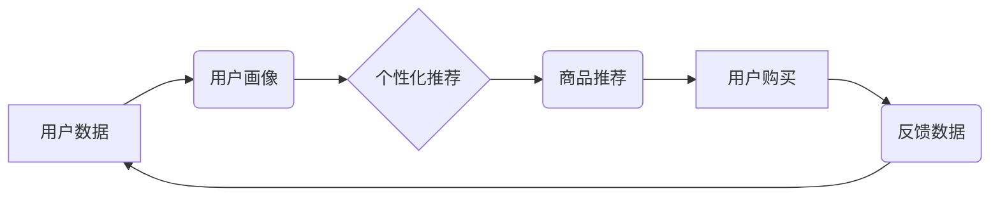

                 

## AI+电商：个性化购物体验和关键绩效指标优化

> 关键词：人工智能，电商，个性化推荐，机器学习，深度学习，用户画像，关键绩效指标（KPI）

> 摘要：本文探讨了人工智能在电商领域的应用，重点关注个性化购物体验的提升和关键绩效指标的优化。首先，介绍了AI在电商中的核心概念和联系，并深入分析了常用的个性化推荐算法原理、步骤、优缺点以及应用领域。其次，通过数学模型和公式，阐述了算法的推导过程和案例分析，并结合实际项目实践，展示了代码实例和详细解释说明。最后，探讨了AI在电商领域的实际应用场景、未来发展趋势以及面临的挑战，并推荐了相关学习资源、开发工具和论文。

## 1. 背景介绍

电子商务的蓬勃发展为消费者提供了便捷的购物体验，但也带来了信息过载和选择困难等问题。随着人工智能技术的快速发展，AI开始在电商领域扮演越来越重要的角色，为消费者提供更个性化、更智能的购物体验。

AI在电商领域的应用涵盖多个方面，包括：

* **个性化推荐:** 根据用户的历史购买记录、浏览行为、兴趣偏好等信息，推荐个性化的商品和服务。
* **智能客服:** 利用自然语言处理技术，提供24小时在线客服，解答用户疑问，处理售后问题。
* **商品搜索优化:** 理解用户搜索意图，提供更精准的搜索结果，提高用户购物效率。
* **价格优化:** 分析市场价格趋势和用户行为，动态调整商品价格，最大化利润。
* **库存管理:** 利用预测模型，预测商品需求，优化库存水平，降低库存成本。

## 2. 核心概念与联系

**2.1 AI在电商的核心概念**

* **用户画像:** 通过收集和分析用户的各种数据，构建用户画像，了解用户的兴趣、需求、行为等特征。
* **个性化推荐:** 根据用户的画像和行为数据，推荐个性化的商品和服务，提升用户购物体验。
* **机器学习:** 利用算法从数据中学习，不断优化推荐模型的准确性。
* **深度学习:** 利用多层神经网络，对复杂的数据进行分析和学习，提升推荐模型的性能。

**2.2 AI与电商的架构关系**



## 3. 核心算法原理 & 具体操作步骤

### 3.1  算法原理概述

个性化推荐算法的核心是根据用户的历史行为和特征，预测用户对商品的兴趣和购买意愿。常用的算法包括：

* **基于内容的推荐:** 根据商品的属性和描述，推荐与用户过去购买或浏览过的商品相似的商品。
* **基于协同过滤的推荐:** 根据其他用户对商品的评分或购买行为，推荐与用户兴趣相似的用户购买过的商品。
* **基于深度学习的推荐:** 利用深度学习模型，从用户的行为数据中学习用户兴趣和偏好，进行更精准的推荐。

### 3.2  算法步骤详解

以基于协同过滤的推荐算法为例，其步骤如下：

1. **数据收集:** 收集用户的历史购买记录、浏览记录、评分等数据。
2. **用户-商品矩阵构建:** 将用户和商品作为矩阵的行和列，用户对商品的评分或购买行为作为矩阵的元素。
3. **相似度计算:** 计算用户之间的相似度，例如使用余弦相似度或皮尔逊相关系数。
4. **推荐生成:** 对于某个用户，找到与该用户相似度最高的N个用户，并推荐这些用户购买过的商品。

### 3.3  算法优缺点

**基于内容的推荐:**

* **优点:** 可以推荐与用户兴趣相符的商品，不受用户历史行为的影响。
* **缺点:** 需要对商品进行准确的分类和描述，难以推荐新商品或用户未接触过的商品。

**基于协同过滤的推荐:**

* **优点:** 可以推荐用户可能感兴趣但未接触过的商品，能够发现用户潜在的兴趣。
* **缺点:** 需要大量的用户数据才能训练出准确的推荐模型，容易出现冷启动问题（对于新用户或新商品难以进行推荐）。

**基于深度学习的推荐:**

* **优点:** 可以处理复杂的数据，学习用户更深层的兴趣和偏好，推荐效果更精准。
* **缺点:** 需要大量的计算资源和数据才能训练出有效的模型，模型解释性较差。

### 3.4  算法应用领域

个性化推荐算法广泛应用于电商平台、社交媒体、音乐流媒体、视频平台等领域，帮助用户发现感兴趣的内容和商品，提升用户体验。

## 4. 数学模型和公式 & 详细讲解 & 举例说明

### 4.1  数学模型构建

基于协同过滤的推荐算法可以构建如下数学模型：

* **用户相似度计算:** 使用余弦相似度计算用户之间的相似度：

$$
sim(u_i, u_j) = \frac{u_i \cdot u_j}{||u_i|| ||u_j||}
$$

其中：

* $u_i$ 和 $u_j$ 表示两个用户的向量表示，向量元素为用户对商品的评分或购买行为。
* $u_i \cdot u_j$ 表示两个用户向量的点积。
* $||u_i||$ 和 $||u_j||$ 表示两个用户向量的模长。

* **推荐评分预测:** 使用用户相似度加权平均法预测用户对商品的评分：

$$
\hat{r}_{u_i, m} = \frac{\sum_{u_j \in N(u_i)} sim(u_i, u_j) \cdot r_{u_j, m}}{\sum_{u_j \in N(u_i)} sim(u_i, u_j)}
$$

其中：

* $\hat{r}_{u_i, m}$ 表示用户 $u_i$ 对商品 $m$ 的预测评分。
* $r_{u_j, m}$ 表示用户 $u_j$ 对商品 $m$ 的真实评分。
* $N(u_i)$ 表示与用户 $u_i$ 相似度最高的N个用户。

### 4.2  公式推导过程

余弦相似度的推导过程如下：

1. 两个向量的夹角越小，表示两个向量越相似。
2. 余弦函数可以用来计算两个向量的夹角。
3. 因此，余弦相似度可以用来衡量两个向量的相似度。

### 4.3  案例分析与讲解

假设有两个用户A和B，用户A对商品1评分为5，商品2评分为3，商品3评分为4；用户B对商品1评分为4，商品2评分为5，商品3评分为2。

我们可以计算用户A和B之间的余弦相似度：

$$
sim(A, B) = \frac{(5 \cdot 4 + 3 \cdot 5 + 4 \cdot 2)}{(\sqrt{5^2 + 3^2 + 4^2})(\sqrt{4^2 + 5^2 + 2^2})} = 0.75
$$

该结果表明用户A和B之间的相似度为0.75，说明他们对商品的偏好有一定的相似性。

## 5. 项目实践：代码实例和详细解释说明

### 5.1  开发环境搭建

* Python 3.x
* scikit-learn 库
* Pandas 库
* NumPy 库

### 5.2  源代码详细实现

```python
import pandas as pd
from sklearn.metrics.pairwise import cosine_similarity

# 加载用户-商品评分数据
data = pd.read_csv('user_item_rating.csv')

# 构建用户-商品矩阵
user_item_matrix = data.pivot_table(index='user_id', columns='item_id', values='rating')

# 计算用户之间的余弦相似度
user_similarity = cosine_similarity(user_item_matrix)

# 预测用户对商品的评分
def predict_rating(user_id, item_id):
    # 获取与用户相似度最高的N个用户
    similar_users = user_similarity[user_id].argsort()[-5:][::-1]
    # 计算加权平均评分
    weighted_sum = 0
    for similar_user in similar_users:
        if user_item_matrix.loc[similar_user, item_id] is not None:
            weighted_sum += user_item_matrix.loc[similar_user, item_id] * user_similarity[user_id][similar_user]
    return weighted_sum / sum(user_similarity[user_id][similar_users])

# 预测用户对商品的评分
predicted_rating = predict_rating(1, 3)
print(f'用户1对商品3的预测评分为: {predicted_rating}')
```

### 5.3  代码解读与分析

* 该代码首先加载用户-商品评分数据，并构建用户-商品矩阵。
* 然后使用余弦相似度计算用户之间的相似度，并存储在`user_similarity`矩阵中。
* `predict_rating`函数用于预测用户对商品的评分，它首先获取与用户相似度最高的N个用户，然后计算加权平均评分，并返回预测评分。
* 最后，代码演示了如何使用`predict_rating`函数预测用户1对商品3的评分。

### 5.4  运行结果展示

运行代码后，会输出用户1对商品3的预测评分。

## 6. 实际应用场景

### 6.1  电商平台个性化推荐

电商平台可以利用AI算法，根据用户的浏览历史、购买记录、收藏夹等数据，推荐个性化的商品和服务，提升用户购物体验和转化率。

### 6.2  内容平台个性化推荐

内容平台，例如视频网站、音乐平台、新闻网站等，可以利用AI算法，根据用户的观看历史、点赞记录、评论等数据，推荐个性化的内容，提升用户粘性和活跃度。

### 6.3  社交媒体个性化推荐

社交媒体平台，例如微博、微信、Facebook等，可以利用AI算法，根据用户的关注关系、互动行为、兴趣爱好等数据，推荐个性化的内容和用户，提升用户社交体验和互动率。

### 6.4  未来应用展望

随着人工智能技术的不断发展，AI在电商领域的应用将更加广泛和深入，例如：

* **更精准的个性化推荐:** 利用更先进的深度学习算法，从用户的行为数据中学习更深层的兴趣和偏好，提供更精准的推荐。
* **智能客服的升级:** 利用自然语言处理和机器学习技术，开发更智能的客服机器人，能够更准确地理解用户的需求，并提供更有效的帮助。
* **虚拟试衣间:** 利用计算机视觉和虚拟现实技术，实现虚拟试衣间，让用户在家就能体验到试穿衣服的感觉。
* **个性化营销:** 利用用户画像和行为数据，进行个性化的营销推广，提高营销效果。

## 7. 工具和资源推荐

### 7.1  学习资源推荐

* **书籍:**
    * 《深度学习》
    * 《机器学习实战》
    * 《Python机器学习》
* **在线课程:**
    * Coursera: 深度学习
    * Udacity: 机器学习工程师
    * edX: 数据科学

### 7.2  开发工具推荐

* **Python:** 
    * scikit-learn: 机器学习库
    * TensorFlow: 深度学习库
    * PyTorch: 深度学习库
* **数据处理工具:**
    * Pandas: 数据分析和处理库
    * NumPy: 数值计算库
* **可视化工具:**
    * Matplotlib: 数据可视化库
    * Seaborn: 数据可视化库

### 7.3  相关论文推荐

* **基于协同过滤的推荐系统:**
    * "Collaborative Filtering for Recommender Systems" by Su-Yin Lee and Wei-Min Chen
* **基于深度学习的推荐系统:**
    * "Deep Learning for Recommender Systems" by Xiangnan He et al.
* **个性化推荐的最新进展:**
    * "Personalized Recommendation: A Survey" by Y. Wang et al.

## 8. 总结：未来发展趋势与挑战

### 8.1  研究成果总结

AI在电商领域的应用取得了显著的成果，例如：

* 个性化推荐的准确率和用户体验得到了提升。
* 智能客服能够更有效地处理用户问题。
* 预测模型能够更准确地预测用户需求和行为。

### 8.2  未来发展趋势

* **更精准的个性化推荐:** 利用更先进的深度学习算法，从用户的行为数据中学习更深层的兴趣和偏好，提供更精准的推荐。
* **更智能的交互体验:** 利用自然语言处理和机器学习技术，开发更智能的交互体验，例如虚拟试衣间、个性化购物助手等。
* **更安全的购物环境:** 利用AI技术，识别和预防欺诈行为，保障用户的购物安全。

### 8.3  面临的挑战

* **数据隐私保护:** AI算法需要大量用户数据进行训练，如何保护用户隐私是一个重要的挑战。
* **算法解释性:** 深度学习算法的决策过程难以解释，如何提高算法的透明度和可解释性是一个重要的研究方向。
* **算法公平性:** AI算法可能会存在偏见，导致推荐结果不公平，如何确保算法的公平性是一个重要的挑战。

### 8.4  研究展望

未来，AI在电商领域的应用将更加广泛和深入，需要不断探索新的算法、技术和应用场景，以更好地服务于用户和商家。


## 9. 附录：常见问题与解答

**Q1: 如何评估个性化推荐算法的性能？**

**A1:** 常用的评估指标包括准确率、召回率、F1-score、NDCG等。

**Q2: 如何解决冷启动问题？**

**A2:** 可以利用用户画像、商品属性、协同过滤等方法，对新用户和新商品进行推荐。

**Q3: 如何保证算法的公平性？**

**A3:** 可以采用公平性约束、数据预处理、算法调优等方法，减少算法的偏见。


作者：禅与计算机程序设计艺术 / Zen and the Art of Computer Programming<end_of_turn>

