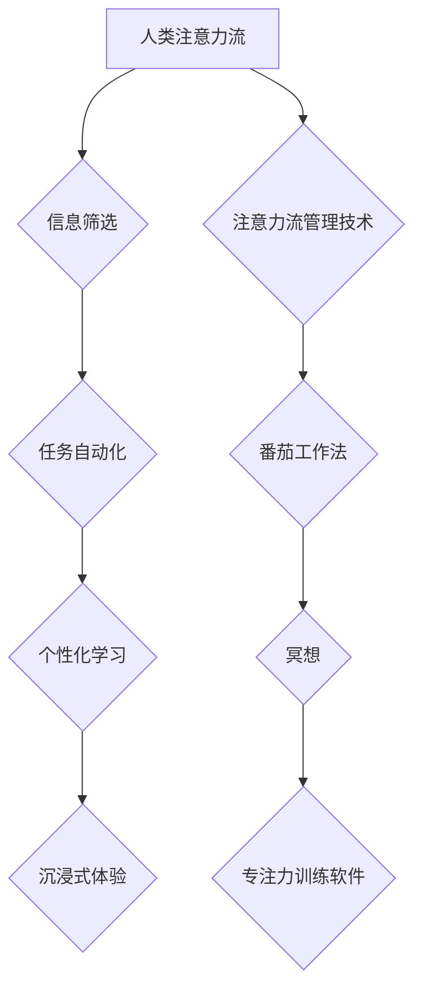

                 

##  AI与人类注意力流：未来的工作、技能与注意力流管理技术的应用

> 关键词：人工智能、注意力流、认知科学、工作模式、技能发展、注意力管理技术

### 1. 背景介绍

在信息爆炸的时代，人类面临着前所未有的注意力挑战。来自社交媒体、电子邮件、新闻推送等各种渠道的信息轰炸，使得我们难以集中精力完成任务，效率不断下降。与此同时，人工智能（AI）技术飞速发展，正在深刻地改变着我们的生活和工作方式。AI能够自动完成许多重复性任务，解放了人类的生产力，但也带来了新的问题：如何有效地利用AI带来的便利，同时避免被信息过载所困扰？

注意力流，即人们对信息的感知和处理能力，是人类认知的核心能力。它决定了我们学习、工作、生活的能力。随着AI技术的进步，我们必须重新思考注意力流在未来工作和生活中的作用，并探索如何更好地管理和提升注意力流。

### 2. 核心概念与联系

#### 2.1 人类注意力流

人类注意力流是一个复杂的心理过程，涉及到多个脑区和神经递质的协同作用。它可以被分为以下几个关键要素：

* **选择性注意:**  从大量信息中选择关注特定信息的能力。
* **集中注意:**  将注意力集中在一个特定目标上，排除干扰的能力。
* **切换注意:**  在不同任务或信息之间灵活切换注意力的能力。
* **维持注意:**  长时间保持对目标的关注能力。

#### 2.2 AI与注意力流的交互

AI技术与人类注意力流的交互方式多种多样：

* **信息筛选:** AI可以根据用户的兴趣和需求，从海量信息中筛选出最相关的内容，帮助用户节省时间和精力。
* **任务自动化:** AI可以自动完成许多重复性任务，例如回复邮件、安排日程等，释放出人类的注意力，使其能够专注于更重要的工作。
* **个性化学习:** AI可以根据用户的学习风格和进度，提供个性化的学习内容和建议，提高学习效率。
* **沉浸式体验:** AI可以创造出沉浸式的虚拟现实和增强现实体验，吸引用户的注意力，并提供更生动的学习和工作环境。

#### 2.3  注意力流管理技术

注意力流管理技术旨在帮助用户更好地控制和管理自己的注意力，提高工作效率和生活质量。常见的注意力流管理技术包括：

* **番茄工作法:** 将工作时间划分为25分钟的间隔，并在每个间隔之间进行5分钟的休息，帮助用户集中注意力，避免疲劳。
* **冥想:** 通过冥想练习，可以训练大脑的专注力，提高抗干扰能力。
* **专注力训练软件:** 一些软件可以帮助用户跟踪和分析自己的注意力使用情况，并提供个性化的训练建议。

**Mermaid 流程图**



### 3. 核心算法原理 & 具体操作步骤

#### 3.1 算法原理概述

注意力流管理技术的核心算法通常基于以下几个原理：

* **行为模式识别:** 通过分析用户的行为数据，例如鼠标点击、键盘输入、网页浏览记录等，识别用户的注意力模式和习惯。
* **预测模型:** 建立预测模型，预测用户在未来一段时间内可能出现的注意力波动，并根据预测结果提供相应的干预措施。
* **个性化定制:** 根据用户的注意力模式和需求，定制个性化的注意力管理策略，例如提醒用户休息、屏蔽干扰信息等。

#### 3.2 算法步骤详解

一个典型的注意力流管理算法的步骤如下：

1. **数据收集:** 收集用户的行为数据，例如网页浏览记录、应用程序使用时间、键盘输入等。
2. **数据预处理:** 对收集到的数据进行清洗、转换和特征提取，以便于算法训练和使用。
3. **模型训练:** 使用机器学习算法，例如支持向量机、决策树、神经网络等，训练注意力预测模型。
4. **模型评估:** 使用测试数据评估模型的准确性和有效性。
5. **策略定制:** 根据模型的预测结果，定制个性化的注意力管理策略，例如提醒用户休息、屏蔽干扰信息等。
6. **策略执行:** 将定制的策略应用于用户的设备和应用程序，帮助用户更好地管理注意力。

#### 3.3 算法优缺点

**优点:**

* **个性化:** 可以根据用户的注意力模式和需求，定制个性化的注意力管理策略。
* **自动化:** 可以自动识别和预测用户的注意力波动，并提供相应的干预措施。
* **有效性:** 有些研究表明，注意力流管理技术可以有效地提高工作效率和学习效果。

**缺点:**

* **数据依赖:** 需要大量的用户行为数据才能训练出准确的模型。
* **隐私问题:** 收集和使用用户的行为数据可能会引发隐私问题。
* **技术复杂性:** 开发和部署注意力流管理技术需要一定的技术门槛。

#### 3.4 算法应用领域

注意力流管理技术可以应用于以下领域:

* **教育:** 帮助学生集中注意力，提高学习效率。
* **工作:** 帮助员工提高工作效率，减少疲劳和错误。
* **医疗:** 帮助患者集中注意力，进行康复训练。
* **游戏:** 增强游戏体验，提高玩家的沉浸感。

### 4. 数学模型和公式 & 详细讲解 & 举例说明

#### 4.1 数学模型构建

注意力流可以被建模为一个动态系统，其中注意力是系统状态的一个变量。我们可以使用微分方程来描述注意力随时间的变化：

$$
\frac{dA}{dt} = f(A, I, T)
$$

其中：

* $A$ 代表注意力水平
* $t$ 代表时间
* $I$ 代表输入信息强度
* $T$ 代表任务难度

函数 $f$ 描述了注意力水平随时间变化的规律，它取决于注意力水平本身、输入信息强度和任务难度。

#### 4.2 公式推导过程

为了更深入地理解注意力流的动态过程，我们可以进一步推导 $f$ 函数的具体形式。假设注意力水平受输入信息强度和任务难度的影响呈指数关系，则可以得到以下公式：

$$
f(A, I, T) = k_1 * A * I - k_2 * A * T
$$

其中：

* $k_1$ 和 $k_2$ 是经验参数，分别代表输入信息强度和任务难度对注意力水平的影响程度。

#### 4.3 案例分析与讲解

例如，当用户面对一个简单任务（$T$ 小）且输入信息强度较高（$I$ 大）时，$f(A, I, T)$ 将为正值，表示注意力水平会随着时间推移而增加。反之，当用户面对一个复杂任务（$T$ 大）且输入信息强度较低（$I$ 小）时，$f(A, I, T)$ 将为负值，表示注意力水平会随着时间推移而降低。

### 5. 项目实践：代码实例和详细解释说明

#### 5.1 开发环境搭建

为了演示注意力流管理技术的应用，我们可以使用 Python 语言和 TensorFlow 库开发一个简单的注意力预测模型。

开发环境搭建步骤如下：

1. 安装 Python 语言和相关库，例如 TensorFlow、NumPy、Pandas 等。
2. 下载并安装 Jupyter Notebook，用于编写和运行代码。

#### 5.2 源代码详细实现

```python
import tensorflow as tf
from tensorflow.keras.models import Sequential
from tensorflow.keras.layers import Dense

# 构建模型
model = Sequential()
model.add(Dense(64, activation='relu', input_shape=(10,)))
model.add(Dense(32, activation='relu'))
model.add(Dense(1))

# 编译模型
model.compile(optimizer='adam', loss='mse')

# 训练模型
# ...

# 预测注意力水平
# ...
```

#### 5.3 代码解读与分析

这段代码展示了一个简单的多层感知机模型，用于预测用户的注意力水平。模型的输入是一个包含用户行为特征的向量，输出是注意力水平的预测值。

#### 5.4 运行结果展示

训练完成后，我们可以使用测试数据对模型进行评估，并观察模型预测的注意力水平与实际注意力水平之间的差异。

### 6. 实际应用场景

#### 6.1 教育领域

注意力流管理技术可以应用于教育领域，帮助学生集中注意力，提高学习效率。例如，可以开发一款学习软件，根据学生的注意力模式，自动调整学习内容的难度和节奏，并提供个性化的学习建议。

#### 6.2 工作领域

在工作领域，注意力流管理技术可以帮助员工提高工作效率，减少疲劳和错误。例如，可以开发一款办公软件，根据员工的工作状态，自动屏蔽无关信息，并提醒员工进行休息。

#### 6.3 医疗领域

注意力流管理技术也可以应用于医疗领域，帮助患者集中注意力，进行康复训练。例如，可以开发一款康复训练软件，根据患者的注意力水平，调整训练内容和难度，并提供个性化的训练建议。

#### 6.4 未来应用展望

随着人工智能技术的不断发展，注意力流管理技术将有更广泛的应用场景。例如，可以开发出更加智能的虚拟助手，帮助用户更好地管理时间和注意力，也可以开发出更加沉浸式的虚拟现实和增强现实体验，帮助用户更好地学习和工作。

### 7. 工具和资源推荐

#### 7.1 学习资源推荐

* **书籍:**

    * 《深度学习》 - Ian Goodfellow, Yoshua Bengio, Aaron Courville
    * 《机器学习》 - Tom Mitchell

* **在线课程:**

    * Coursera: 深度学习 Specialization
    * edX: Artificial Intelligence

#### 7.2 开发工具推荐

* **Python:** 

    * TensorFlow
    * PyTorch
    * Keras

* **Jupyter Notebook:** 

    * https://jupyter.org/

#### 7.3 相关论文推荐

* **Attention Is All You Need** - Vaswani et al. (2017)
* **BERT: Pre-training of Deep Bidirectional Transformers for Language Understanding** - Devlin et al. (2018)

### 8. 总结：未来发展趋势与挑战

#### 8.1 研究成果总结

近年来，注意力流管理技术取得了显著的进展，并展现出巨大的应用潜力。

#### 8.2 未来发展趋势

未来，注意力流管理技术将朝着以下几个方向发展：

* **更加个性化:** 

    利用更丰富的用户数据，开发更加个性化的注意力管理策略。
* **更加智能:** 

    利用更先进的机器学习算法，开发更加智能的注意力预测模型。
* **更加融合:** 

    与其他技术，例如虚拟现实、增强现实等融合，创造更加沉浸式的注意力管理体验。

#### 8.3 面临的挑战

注意力流管理技术也面临着一些挑战：

* **数据隐私:** 

    如何保护用户的隐私数据，是需要认真考虑的问题。
* **算法解释性:** 

    许多注意力预测模型是黑盒模型，难以解释其预测结果，这可能会影响用户的信任度。
* **伦理问题:** 

    注意力流管理技术可能会被滥用，例如用于控制用户的行为，因此需要认真考虑其伦理问题。

#### 8.4 研究展望

未来，我们需要继续深入研究注意力流的机制，开发更加安全、有效、可解释的注意力管理技术，并将其应用于更多领域，帮助人们更好地管理注意力，提高生活和工作质量。

### 9. 附录：常见问题与解答

#### 9.1 如何提高注意力？

* **番茄工作法:** 将工作时间划分为25分钟的间隔，并在每个间隔之间进行5分钟的休息。
* **冥想:** 通过冥想练习，可以训练大脑的专注力。
* **专注力训练软件:** 一些软件可以帮助用户跟踪和分析自己的注意力使用情况，并提供个性化的训练建议。

#### 9.2 注意力流管理技术会取代人类吗？

不会。注意力流管理技术是帮助人类更好地管理注意力，提高效率的工具，而不是取代人类的工具。

#### 9.3 注意力流管理技术有哪些伦理问题？

注意力流管理技术可能会被滥用，例如用于控制用户的行为，因此需要认真考虑其伦理问题。

作者：禅与计算机程序设计艺术 / Zen and the Art of Computer Programming


<end_of_turn>

