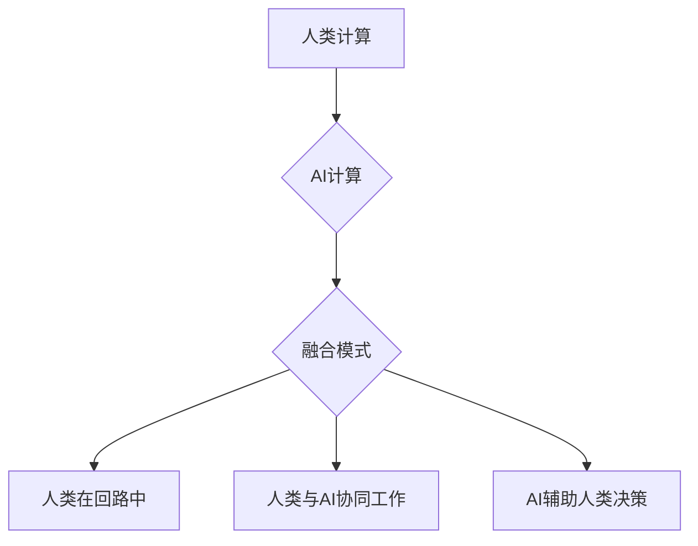

                 

## AI与人类计算：未来的道德考虑

> 关键词：人工智能、人类计算、伦理、道德、算法偏见、透明度、可解释性、责任

## 1. 背景介绍

人工智能（AI）正以惊人的速度发展，其应用领域不断扩展，从医疗保健和金融到交通和娱乐，AI正在深刻地改变着我们的生活。然而，随着AI技术的进步，也引发了关于其伦理和道德影响的广泛讨论。

人类计算是指人类参与到计算过程中的行为，它可以是通过直接操作计算机、使用计算工具，或者通过与AI系统交互来完成计算任务。在过去，人类计算是计算的主要方式，但随着计算机技术的进步，机器计算逐渐取代了人类计算。然而，随着AI技术的出现，人类计算和机器计算开始相互融合，形成了一种新的计算模式。

AI与人类计算的融合带来了许多机遇，但也带来了新的挑战。一方面，AI可以帮助人类提高计算效率，解放人类从重复性、繁琐的计算任务中解放出来，专注于更具创造性和战略性的工作。另一方面，AI的决策过程往往是复杂的，难以理解，这可能导致算法偏见、透明度不足等问题，引发伦理和道德争议。

## 2. 核心概念与联系

**2.1 人类计算与AI计算**

人类计算和AI计算各有特点：

* **人类计算:** 
    * 优势：灵活、适应性强、具备创造力和批判性思维。
    * 劣势：效率低、容易出错、受情绪影响。
* **AI计算:** 
    * 优势：效率高、准确性高、可重复性强。
    * 劣势：缺乏灵活性、难以理解决策过程、容易受到算法偏见的影响。

**2.2 AI与人类计算的融合**

AI与人类计算的融合可以实现优势互补，形成一种更强大的计算模式。例如，AI可以帮助人类快速处理大量数据，识别模式和趋势，而人类可以利用其批判性思维和创造力来解释AI的结果，并做出最终决策。

**2.3 融合模式**

* **人类在回路中:** 人类参与到AI系统的训练和调优过程中，提供反馈和修正，以提高AI系统的准确性和可靠性。
* **人类与AI协同工作:** 人类和AI系统共同完成任务，人类负责制定策略和目标，AI负责执行任务和提供数据支持。
* **AI辅助人类决策:** AI系统提供数据分析和预测结果，帮助人类做出更明智的决策。

**Mermaid 流程图**



## 3. 核心算法原理 & 具体操作步骤

**3.1 算法原理概述**

在AI与人类计算的融合中，许多算法被用于实现人类和AI系统的交互和协作。其中，一些重要的算法包括：

* **强化学习:** AI系统通过与环境交互，学习最佳策略以获得最大奖励。
* **迁移学习:** AI系统将已学习到的知识应用于新的任务或领域。
* **生成对抗网络 (GAN):** 两个神经网络相互对抗，生成逼真的数据。
* **自然语言处理 (NLP):** AI系统理解和生成人类语言。

**3.2 算法步骤详解**

以强化学习为例，其基本步骤如下：

1. **环境建模:** 建立一个模拟真实世界的环境模型。
2. **代理设计:** 设计一个AI代理，能够与环境交互。
3. **奖励函数定义:** 定义一个奖励函数，用于评估代理的行为。
4. **策略学习:** 使用强化学习算法，例如Q学习或深度强化学习，让代理学习最佳策略以获得最大奖励。
5. **策略评估:** 在真实环境中评估代理的策略效果。

**3.3 算法优缺点**

* **优点:** 能够学习复杂的任务，适应动态环境。
* **缺点:** 训练时间长，数据需求大，容易陷入局部最优。

**3.4 算法应用领域**

* **机器人控制:** 训练机器人完成复杂的任务，例如导航、抓取、组装。
* **游戏 AI:** 开发智能游戏对手，提高游戏体验。
* **个性化推荐:** 根据用户的行为数据，推荐个性化的商品或服务。

## 4. 数学模型和公式 & 详细讲解 & 举例说明

**4.1 数学模型构建**

强化学习的数学模型通常基于马尔可夫决策过程 (MDP)。MDP由以下几个要素组成：

* **状态空间 (S):** 环境可能处于的所有状态。
* **动作空间 (A):** 代理可以采取的所有动作。
* **转移概率 (P):** 从一个状态执行一个动作后，转移到另一个状态的概率。
* **奖励函数 (R):** 代理在某个状态执行某个动作后获得的奖励。

**4.2 公式推导过程**

强化学习的目标是找到一个策略 $\pi$，使得代理在与环境交互的过程中获得最大的总奖励。策略 $\pi$ 是一个映射关系，将状态映射到动作。

Bellman 方程是强化学习的核心公式，用于计算状态价值函数 $V(s)$：

$$V(s) = \max_{\pi} \sum_{t=0}^{\infty} \gamma^t R(s_t, a_t)$$

其中：

* $\gamma$ 是折扣因子，控制未来奖励的权重。
* $R(s_t, a_t)$ 是在状态 $s_t$ 执行动作 $a_t$ 后获得的奖励。

**4.3 案例分析与讲解**

例如，训练一个机器人完成导航任务，我们可以将环境建模为一个地图，机器人可以采取前进、后退、左转、右转等动作。奖励函数可以设计为，到达目标位置获得高奖励，撞墙或迷路则获得低奖励。通过使用Bellman方程和强化学习算法，机器人可以学习最优的导航策略。

## 5. 项目实践：代码实例和详细解释说明

**5.1 开发环境搭建**

* Python 3.x
* TensorFlow 或 PyTorch

**5.2 源代码详细实现**

```python
import tensorflow as tf

# 定义神经网络模型
model = tf.keras.models.Sequential([
    tf.keras.layers.Dense(128, activation='relu', input_shape=(input_dim,)),
    tf.keras.layers.Dense(64, activation='relu'),
    tf.keras.layers.Dense(num_actions)
])

# 定义损失函数和优化器
loss_fn = tf.keras.losses.CategoricalCrossentropy()
optimizer = tf.keras.optimizers.Adam()

# 训练模型
for epoch in range(num_epochs):
    for state, action, reward, next_state, done in dataset:
        with tf.GradientTape() as tape:
            predictions = model(state)
            loss = loss_fn(action, predictions)
        gradients = tape.gradient(loss, model.trainable_variables)
        optimizer.apply_gradients(zip(gradients, model.trainable_variables))

# 评估模型
# ...
```

**5.3 代码解读与分析**

这段代码实现了基于深度学习的强化学习算法。

* 神经网络模型用于学习状态到动作的映射关系。
* 损失函数用于衡量模型预测与实际动作之间的差异。
* 优化器用于更新模型参数，使其能够最小化损失函数。

**5.4 运行结果展示**

训练完成后，可以将模型应用于真实环境中，观察其执行任务的效果。例如，可以将训练好的导航机器人部署在实际地图中，观察其是否能够成功到达目标位置。

## 6. 实际应用场景

**6.1 医疗保健**

* AI辅助诊断：AI系统可以分析医学影像，辅助医生诊断疾病。
* 个性化治疗方案：AI系统可以根据患者的基因信息和病史，制定个性化的治疗方案。
* 药物研发：AI系统可以加速药物研发过程，预测药物的有效性和安全性。

**6.2 金融**

* 风险管理：AI系统可以分析市场数据，识别潜在的金融风险。
* 欺诈检测：AI系统可以识别异常交易行为，防止金融欺诈。
* 投资决策：AI系统可以分析市场趋势，提供投资建议。

**6.3 交通**

* 自动驾驶：AI系统可以控制车辆，实现自动驾驶。
* 交通流量优化：AI系统可以分析交通数据，优化交通流量，减少拥堵。
* 智能交通信号灯：AI系统可以根据实时交通情况，调整信号灯的亮绿时间，提高交通效率。

**6.4 未来应用展望**

* 人机交互：AI系统将更加智能，能够更好地理解和响应人类的需求。
* 个性化教育：AI系统将提供个性化的学习方案，帮助学生提高学习效率。
* 科学研究：AI系统将加速科学研究，帮助人类解决更复杂的问题。

## 7. 工具和资源推荐

**7.1 学习资源推荐**

* **书籍:**
    * 《深度学习》
    * 《强化学习：原理、算法和应用》
* **在线课程:**
    * Coursera: 深度学习
    * Udacity: 强化学习
* **开源库:**
    * TensorFlow
    * PyTorch

**7.2 开发工具推荐**

* **编程语言:** Python
* **深度学习框架:** TensorFlow, PyTorch
* **云计算平台:** AWS, Azure, GCP

**7.3 相关论文推荐**

* 《Deep Reinforcement Learning: An Overview》
* 《Generative Adversarial Networks》
* 《Attention Is All You Need》

## 8. 总结：未来发展趋势与挑战

**8.1 研究成果总结**

近年来，AI技术取得了长足的进步，在许多领域取得了成功应用。

* **算法发展:** 强化学习、迁移学习、生成对抗网络等算法取得了突破性进展。
* **应用拓展:** AI应用领域不断扩展，涵盖医疗保健、金融、交通、教育等多个领域。
* **计算能力提升:** 计算能力的提升推动了AI模型规模的扩大，提高了模型性能。

**8.2 未来发展趋势**

* **更智能的AI:** AI系统将更加智能，能够更好地理解和响应人类需求。
* **更广泛的应用:** AI将应用于更多领域，改变我们的生活方式。
* **更安全的AI:** 研究人员将更加关注AI的安全性、可靠性和可解释性。

**8.3 面临的挑战**

* **算法偏见:** AI算法可能受到训练数据的影响，导致算法偏见，引发伦理争议。
* **透明度不足:** 许多AI算法的决策过程难以理解，这可能导致缺乏信任和责任追究。
* **数据安全:** AI训练需要大量数据，数据安全问题需要得到重视。

**8.4 研究展望**

* **开发更公平、更透明的AI算法:** 研究人员将致力于开发能够识别和缓解算法偏见的算法，并提高AI算法的透明度。
* **加强AI伦理规范:** 制定更完善的AI伦理规范，引导AI技术的发展方向。
* **促进AI与人类的协同发展:** AI技术应该服务于人类，帮助人类解决问题，提高生活质量。

## 9. 附录：常见问题与解答

**9.1 如何避免AI算法的偏见？**

* 使用更加多样化的训练数据。
* 开发能够识别和缓解算法偏见的算法。
* 定期评估算法的公平性，并进行调整。

**9.2 如何提高AI算法的透明度？**

* 使用可解释性AI算法。
* 提供AI决策过程的解释性报告。
* 建立AI决策的审计机制。

**9.3 如何确保AI技术的安全使用？**

* 开发安全的AI算法，防止恶意攻击。
* 建立AI技术监管机制，防止滥用。
* 加强AI技术人才培养，提高社会对AI技术的认知和理解。


作者：禅与计算机程序设计艺术 / Zen and the Art of Computer Programming 
<end_of_turn>

