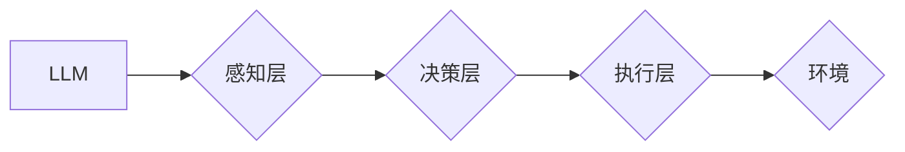

                 

## AI原生时代：LLM内置Agents的重要性

> 关键词：LLM, Agent, AI原生时代, 嵌入式代理, 智能应用, 决策推理, 协同工作

### 1. 背景介绍

近年来，大型语言模型（LLM）在自然语言处理领域取得了令人瞩目的成就，展现出强大的文本生成、理解和翻译能力。然而，现有的LLM主要局限于文本处理，缺乏与外部世界交互的能力，无法执行实际操作或完成复杂任务。

随着人工智能技术的不断发展，我们正进入一个全新的时代——AI原生时代。在这个时代，人工智能将不再局限于文本处理，而是能够与物理世界深度融合，并通过与环境交互实现更智能、更自主的行动。

为了实现这一目标，将智能代理嵌入到LLM中显得尤为重要。智能代理能够感知环境、制定决策并执行行动，赋予LLM执行能力和自主性，使其能够真正成为一个“智能体”。

### 2. 核心概念与联系

#### 2.1 LLM与Agent

* **LLM（大型语言模型）**：一种基于深度学习的强大人工智能模型，能够理解和生成人类语言。其核心是通过训练海量文本数据，学习语言的语法、语义和上下文关系。

* **Agent（智能代理）**：一个能够感知环境、做出决策并执行行动的智能体。它通常具有以下特征：

    * **感知能力**: 能够获取环境信息，例如传感器数据、文本信息等。
    * **决策能力**: 能够根据环境信息和目标，制定行动计划。
    * **执行能力**: 能够执行行动，并与环境交互。

#### 2.2 LLM内置Agent架构

将智能代理嵌入到LLM中，可以构建一个更强大的AI系统，其架构如下：



* **感知层**: 负责收集环境信息，并将其转化为LLM能够理解的格式。
* **决策层**: 基于LLM的语言理解能力和代理的决策算法，制定行动计划。
* **执行层**: 将决策转化为实际行动，并与环境交互。

### 3. 核心算法原理 & 具体操作步骤

#### 3.1 算法原理概述

LLM内置Agent的核心算法原理是将LLM的文本生成能力与代理的决策推理能力相结合。

* **LLM文本生成**: LLM可以根据输入的文本提示，生成符合语法和语义的文本。
* **代理决策推理**: 代理可以根据环境信息和目标，使用决策算法（例如强化学习）制定行动计划。

通过将这两个能力结合起来，LLM内置Agent可以实现以下功能：

* **理解自然语言指令**: LLM可以理解用户的自然语言指令，并将其转化为代理可以执行的行动。
* **制定行动计划**: 代理可以根据LLM生成的文本信息和环境信息，制定最优的行动计划。
* **执行行动并反馈结果**: 代理执行行动，并反馈结果给LLM，LLM可以根据反馈信息调整策略，不断优化行动计划。

#### 3.2 算法步骤详解

1. **环境感知**: 代理感知环境信息，例如文本数据、图像数据、传感器数据等。
2. **文本理解**: LLM对环境信息进行理解，并生成文本表示。
3. **决策推理**: 代理使用决策算法（例如强化学习）对LLM生成的文本表示和环境信息进行分析，制定行动计划。
4. **行动执行**: 代理执行行动，并与环境交互。
5. **结果反馈**: 代理将行动结果反馈给LLM。
6. **策略调整**: LLM根据反馈信息调整策略，优化行动计划。

#### 3.3 算法优缺点

**优点**:

* **强大的文本理解能力**: LLM能够理解复杂的自然语言指令，并生成高质量的文本输出。
* **灵活的行动能力**: 代理能够执行各种类型的行动，并与不同的环境交互。
* **持续学习和优化**: 通过反馈机制，LLM内置Agent能够不断学习和优化行动策略。

**缺点**:

* **计算资源需求高**: LLM和代理算法都需要大量的计算资源。
* **安全性和可靠性问题**: LLM内置Agent的决策可能会受到恶意攻击或数据偏差的影响。
* **解释性和透明度问题**: LLM的决策过程较为复杂，难以解释和理解。

#### 3.4 算法应用领域

LLM内置Agent具有广泛的应用前景，例如：

* **智能客服**: 能够理解用户的自然语言问题，并提供准确的解答。
* **个性化教育**: 根据学生的学习情况，定制个性化的学习计划和内容。
* **自动写作**: 能够根据用户的需求，自动生成各种类型的文本，例如文章、故事、代码等。
* **游戏开发**: 能够创建更智能、更具挑战性的游戏角色。

### 4. 数学模型和公式 & 详细讲解 & 举例说明

#### 4.1 数学模型构建

LLM内置Agent的数学模型通常基于强化学习框架，其中：

* **状态空间**: 环境的当前状态，可以由文本信息、图像信息、传感器数据等表示。
* **动作空间**: 代理可以执行的行动集合。
* **奖励函数**: 评估代理行动的优劣，引导代理学习最优策略。

#### 4.2 公式推导过程

强化学习的目标是找到一个策略，使得代理在长期内获得最大的总奖励。常用的强化学习算法包括Q学习和深度Q网络（DQN）。

* **Q学习**: 通过迭代更新Q值表，学习每个状态下执行每个动作的期望奖励。

$$
Q(s, a) = Q(s, a) + \alpha [r + \gamma \max_{a'} Q(s', a') - Q(s, a)]
$$

其中：

* $Q(s, a)$: 状态$s$下执行动作$a$的期望奖励。
* $\alpha$: 学习率。
* $r$: 当前状态下的奖励。
* $\gamma$: 折扣因子。
* $s'$: 下一个状态。
* $a'$: 下一个状态下执行的动作。

* **DQN**: 使用深度神经网络来逼近Q值函数，能够处理高维状态空间和连续动作空间。

#### 4.3 案例分析与讲解

例如，训练一个LLM内置Agent来玩游戏“贪吃蛇”。

* **状态空间**: 游戏画面，包括蛇的位置、食物的位置、游戏边界等。
* **动作空间**: 上、下、左、右四个方向。
* **奖励函数**: 吃到食物获得奖励，撞到边界或自身减去奖励。

通过训练DQN模型，代理可以学习到在不同游戏状态下执行不同动作的策略，从而获得更高的分数。

### 5. 项目实践：代码实例和详细解释说明

#### 5.1 开发环境搭建

* Python 3.7+
* TensorFlow/PyTorch
* OpenAI API

#### 5.2 源代码详细实现

```python
# 导入必要的库
import tensorflow as tf
from openai import OpenAI

# 初始化OpenAI API
openai = OpenAI(api_key="YOUR_API_KEY")

# 定义代理类
class Agent:
    def __init__(self, model_path):
        self.model = tf.keras.models.load_model(model_path)

    def act(self, state):
        # 将状态转化为模型输入格式
        input_data = preprocess_state(state)
        # 使用模型预测动作
        action_probs = self.model.predict(input_data)
        # 根据动作概率选择动作
        action = sample_action(action_probs)
        return action

# 定义环境类
class Environment:
    def __init__(self):
        # 初始化游戏环境

    def reset(self):
        # 重置游戏环境

    def step(self, action):
        # 执行动作，并返回下一个状态、奖励和是否结束游戏

# 主程序
if __name__ == "__main__":
    # 加载代理模型
    agent = Agent("agent_model.h5")
    # 创建游戏环境
    env = Environment()
    # 开始游戏循环
    while True:
        # 获取当前状态
        state = env.reset()
        # 执行游戏循环
        while True:
            # 代理选择动作
            action = agent.act(state)
            # 执行动作，并获取下一个状态、奖励和是否结束游戏
            next_state, reward, done = env.step(action)
            # 更新状态
            state = next_state
            # 如果游戏结束，则退出循环
            if done:
                break
```

#### 5.3 代码解读与分析

* **代理类**: 负责执行动作，并根据环境反馈信息更新策略。
* **环境类**: 负责模拟游戏环境，并提供状态、奖励和动作执行等接口。
* **主程序**: 初始化代理和环境，并开始游戏循环。

#### 5.4 运行结果展示

运行代码后，代理将开始与游戏环境交互，并尝试获得更高的分数。

### 6. 实际应用场景

#### 6.1 智能客服

LLM内置Agent可以理解用户的自然语言问题，并提供准确的解答。例如，可以用于在线聊天机器人、语音助手等场景。

#### 6.2 个性化教育

LLM内置Agent可以根据学生的学习情况，定制个性化的学习计划和内容。例如，可以用于在线教育平台、智能辅导系统等场景。

#### 6.3 自动写作

LLM内置Agent可以根据用户的需求，自动生成各种类型的文本，例如文章、故事、代码等。例如，可以用于内容创作平台、代码生成工具等场景。

#### 6.4 未来应用展望

随着人工智能技术的不断发展，LLM内置Agent的应用场景将更加广泛，例如：

* **医疗诊断**: 帮助医生诊断疾病，并提供个性化的治疗方案。
* **金融分析**: 分析市场数据，并提供投资建议。
* **科学研究**: 自动化实验过程，并加速科学发现。

### 7. 工具和资源推荐

#### 7.1 学习资源推荐

* **书籍**:
    * 《深度强化学习》
    * 《动手学深度学习》
* **在线课程**:
    * Coursera: 强化学习
    * Udacity: 深度学习工程师

#### 7.2 开发工具推荐

* **TensorFlow**: 开源深度学习框架
* **PyTorch**: 开源深度学习框架
* **OpenAI API**: 提供LLM和代理算法的API

#### 7.3 相关论文推荐

* **《Attention Is All You Need》**: 提出了Transformer模型，为LLM的发展奠定了基础。
* **《Deep Reinforcement Learning with Double Q-learning》**: 提出了DQN算法，为强化学习的应用提供了新的思路。

### 8. 总结：未来发展趋势与挑战

#### 8.1 研究成果总结

LLM内置Agent技术取得了显著进展，为构建更智能、更自主的AI系统提供了新的思路。

#### 8.2 未来发展趋势

* **更强大的LLM**: 随着模型规模和训练数据的不断增加，LLM的文本理解和生成能力将进一步提升。
* **更复杂的代理算法**: 为了应对更复杂的环境和任务，代理算法将更加复杂，例如多智能体强化学习、迁移学习等。
* **更广泛的应用场景**: LLM内置Agent将应用于更多领域，例如医疗、金融、科学研究等。

#### 8.3 面临的挑战

* **安全性和可靠性**: LLM内置Agent的决策可能会受到恶意攻击或数据偏差的影响，需要加强安全性和可靠性方面的研究。
* **解释性和透明度**: LLM的决策过程较为复杂，难以解释和理解，需要开发更有效的解释和可视化方法。
* **伦理问题**: LLM内置Agent的应用可能会引发伦理问题，例如算法偏见、隐私泄露等，需要加强伦理规范和监管。

#### 8.4 研究展望

未来，LLM内置Agent技术将继续发展，并为我们带来更多惊喜。我们需要加强基础理论研究，开发更安全、更可靠、更透明的AI系统，并积极应对AI技术带来的伦理挑战。

### 9. 附录：常见问题与解答

#### 9.1 如何选择合适的LLM模型？

选择合适的LLM模型取决于具体的应用场景和需求。例如，对于需要生成高质量文本的应用，可以选择GPT-3等大型语言模型；对于需要理解复杂文本的应用，可以选择BERT等预训练语言模型。

#### 9.2 如何训练LLM内置Agent？

训练LLM内置Agent需要使用强化学习算法，例如DQN。需要准备一个模拟环境，并定义奖励函数。然后，使用强化学习算法训练代理模型，使其能够在环境中获得更高的奖励。

#### 9.3 如何评估LLM内置Agent的性能？

评估LLM内置Agent的性能可以使用各种指标，例如准确率、召回率、F1-score等。也可以通过实际应用场景的测试来评估其性能。


作者：禅与计算机程序设计艺术 / Zen and the Art of Computer Programming 
<end_of_turn>

