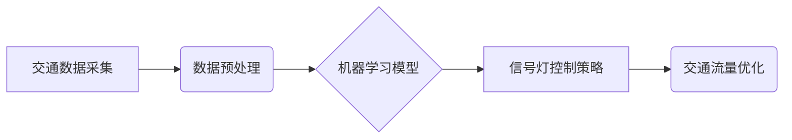

                 

## AI在智能交通信号优化中的应用：提高通行效率

> 关键词：人工智能、智能交通、信号优化、机器学习、深度学习、交通流量、通行效率

## 1. 背景介绍

随着全球人口增长和城市化进程加速，交通拥堵已成为许多城市面临的严峻挑战。交通拥堵不仅导致出行时间延长，还浪费了大量的燃料和资源，并加剧了环境污染。传统交通信号灯的控制方式通常是基于固定时间计划，无法有效适应实时交通流量变化，导致信号灯周期过长或过短，从而影响通行效率。

近年来，人工智能（AI）技术在交通领域得到了广泛应用，为解决交通拥堵问题提供了新的思路。AI算法能够学习和分析海量交通数据，并根据实时路况进行动态调整信号灯的控制策略，从而提高通行效率、减少交通拥堵和环境污染。

## 2. 核心概念与联系

**2.1 核心概念**

* **智能交通（ITS）：** 利用信息技术和通信技术，提高交通系统效率、安全性、舒适性和可持续性的综合系统。
* **交通信号优化：** 通过调整信号灯的控制策略，优化交通流量，提高道路通行效率。
* **人工智能（AI）：** 能够模拟人类智能行为的计算机系统，包括机器学习、深度学习等技术。

**2.2 架构关系**



**2.3 联系分析**

智能交通信号优化系统利用人工智能技术，通过采集和分析交通数据，训练机器学习模型，并根据模型预测结果，动态调整信号灯的控制策略，最终实现交通流量优化，提高通行效率。

## 3. 核心算法原理 & 具体操作步骤

**3.1 算法原理概述**

常用的智能交通信号优化算法包括：

* **机器学习算法：** 

例如，支持向量机（SVM）、决策树、随机森林等算法，能够根据历史交通数据学习交通流量模式，并预测未来交通流量变化趋势。

* **深度学习算法：** 

例如，卷积神经网络（CNN）、循环神经网络（RNN）等算法，能够处理更复杂、更丰富的交通数据，并进行更精准的流量预测。

**3.2 算法步骤详解**

1. **数据采集：** 收集交通数据，包括车辆流量、速度、通行时间、信号灯状态等。
2. **数据预处理：** 对采集到的数据进行清洗、转换、归一化等处理，使其适合机器学习模型训练。
3. **模型训练：** 选择合适的机器学习算法，并利用预处理后的数据进行模型训练，学习交通流量模式。
4. **模型评估：** 利用测试数据评估模型的预测精度，并根据评估结果进行模型调优。
5. **信号灯控制策略：** 根据模型预测结果，动态调整信号灯的控制策略，例如调整信号灯的绿灯时间、红灯时间等。
6. **系统运行与监控：** 将训练好的模型部署到实际系统中，并实时监控系统运行情况，及时进行模型更新和调整。

**3.3 算法优缺点**

* **优点：**

能够根据实时路况动态调整信号灯控制策略，提高通行效率、减少交通拥堵和环境污染。

* **缺点：**

需要大量的交通数据进行模型训练，模型训练过程复杂，需要专业的技术人员进行操作。

**3.4 算法应用领域**

智能交通信号优化算法广泛应用于交通信号灯控制、交通流量预测、道路规划设计等领域。

## 4. 数学模型和公式 & 详细讲解 & 举例说明

**4.1 数学模型构建**

交通流量预测模型通常采用时间序列模型，例如ARIMA模型、SARIMA模型等。这些模型将交通流量视为一个时间序列，并利用历史数据预测未来流量变化趋势。

**4.2 公式推导过程**

ARIMA模型的公式如下：

$$
y_t = c + \sum_{i=1}^{p} \phi_i y_{t-i} + \sum_{j=1}^{q} \theta_j \epsilon_{t-j} + \epsilon_t
$$

其中：

* $y_t$ 表示时间t的交通流量
* $c$ 表示截距项
* $\phi_i$ 表示自回归系数
* $p$ 表示自回归阶数
* $\theta_j$ 表示滑动平均系数
* $q$ 表示滑动平均阶数
* $\epsilon_t$ 表示时间t的随机误差项

**4.3 案例分析与讲解**

假设我们想要预测某条道路的交通流量，并收集了该道路过去一周的交通流量数据。我们可以使用ARIMA模型对这些数据进行建模，并预测未来一周的交通流量。

通过对模型参数的估计，我们可以得到该道路交通流量的预测趋势。例如，如果模型预测未来一周的交通流量将增加，那么我们可以调整信号灯的控制策略，延长绿灯时间，以缓解交通拥堵。

## 5. 项目实践：代码实例和详细解释说明

**5.1 开发环境搭建**

* 操作系统：Ubuntu 20.04
* Python 版本：3.8
* 必要的库：NumPy、Pandas、Scikit-learn、TensorFlow等

**5.2 源代码详细实现**

```python
# 导入必要的库
import numpy as np
from sklearn.linear_model import LinearRegression

# 加载交通数据
data = pd.read_csv('traffic_data.csv')

# 数据预处理
X = data[['hour', 'weekday']]
y = data['traffic_volume']

# 训练线性回归模型
model = LinearRegression()
model.fit(X, y)

# 预测未来交通流量
future_data = pd.DataFrame({'hour': [10, 11, 12], 'weekday': [1, 1, 1]})
predicted_traffic = model.predict(future_data)

# 打印预测结果
print(predicted_traffic)
```

**5.3 代码解读与分析**

* 该代码示例使用线性回归模型预测交通流量。
* 首先，导入必要的库，并加载交通数据。
* 然后，对数据进行预处理，将时间和星期作为特征，交通流量作为目标变量。
* 接着，训练线性回归模型，并使用训练好的模型预测未来交通流量。
* 最后，打印预测结果。

**5.4 运行结果展示**

运行该代码后，将输出未来三个小时的交通流量预测值。

## 6. 实际应用场景

智能交通信号优化系统已在许多城市得到应用，例如：

* **交通拥堵缓解：** 通过动态调整信号灯控制策略，优化交通流量，缓解交通拥堵。
* **出行时间缩短：** 提高通行效率，缩短出行时间。
* **燃油消耗减少：** 减少车辆等待时间，降低燃油消耗。
* **环境污染减轻：** 减少尾气排放，减轻环境污染。

**6.4 未来应用展望**

未来，智能交通信号优化系统将更加智能化、个性化和协同化。例如：

* **融合多源数据：** 将交通数据与天气预报、道路状况、公共交通信息等多源数据融合，进行更精准的流量预测。
* **个性化控制：** 根据不同车辆类型、驾驶习惯等信息，进行个性化的信号灯控制策略。
* **协同控制：** 将多个信号灯进行协同控制，实现更有效的交通流量管理。

## 7. 工具和资源推荐

**7.1 学习资源推荐**

* **书籍：**
    * 《深度学习》
    * 《机器学习实战》
* **在线课程：**
    * Coursera 上的机器学习课程
    * edX 上的深度学习课程

**7.2 开发工具推荐**

* **Python：** 广泛应用于人工智能开发，拥有丰富的库和工具。
* **TensorFlow：** 开源深度学习框架，提供强大的机器学习模型开发工具。
* **PyTorch：** 另一个流行的深度学习框架，以其灵活性和易用性而闻名。

**7.3 相关论文推荐**

* **Traffic Flow Prediction Using Deep Learning**
* **Adaptive Traffic Signal Control Using Machine Learning**

## 8. 总结：未来发展趋势与挑战

**8.1 研究成果总结**

智能交通信号优化系统已取得了显著成果，能够有效缓解交通拥堵、提高通行效率、减少环境污染。

**8.2 未来发展趋势**

未来，智能交通信号优化系统将更加智能化、个性化和协同化，并与其他智能交通系统进行深度融合。

**8.3 面临的挑战**

* **数据获取和隐私保护：** 需要大量高质量的交通数据进行模型训练，同时需要解决数据隐私保护问题。
* **模型鲁棒性和安全性：** 模型需要能够应对各种复杂的路况变化，并保证其安全性。
* **系统部署和维护：** 需要解决系统部署和维护的成本和复杂性问题。

**8.4 研究展望**

未来研究将重点关注以下几个方面：

* **开发更精准、更鲁棒的交通流量预测模型。**
* **研究更有效的信号灯控制策略，实现个性化和协同控制。**
* **解决数据获取和隐私保护问题，确保系统安全可靠。**
* **探索智能交通信号优化系统与其他智能交通系统的融合应用。**

## 9. 附录：常见问题与解答

* **Q1：智能交通信号优化系统需要多少数据才能进行训练？**

* **A1：** 训练模型所需的交通数据量取决于模型的复杂度和预测精度要求。一般来说，需要收集至少几周或几月的交通数据才能获得较好的预测效果。

* **Q2：智能交通信号优化系统会影响驾驶员的驾驶习惯吗？**

* **A2：** 智能交通信号优化系统旨在提高交通效率，并不会刻意影响驾驶员的驾驶习惯。但是，由于信号灯控制策略的改变，驾驶员可能会感受到一些变化，例如等待时间缩短、绿灯时间延长等。

* **Q3：智能交通信号优化系统会增加城市基础设施的成本吗？**

* **A3：** 智能交通信号优化系统需要安装一些传感器和通信设备，这可能会增加城市基础设施的成本。但是，由于其能够提高交通效率、减少交通拥堵和环境污染，其长期效益可能会超过其成本。


作者：禅与计算机程序设计艺术 / Zen and the Art of Computer Programming 
<end_of_turn>

